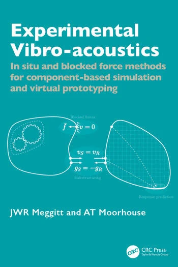

**JWR Meggitt & AT Moorhouse**

*Available for pre-order on July 21, 2025.* 

[Experimental Vibro-acoustics](https://www.routledge.com/Experimental-Vibro-acoustics-In-situ-and-blocked-force-methods-for-component-based-simulation-and-virtual-prototyping/Moorhouse-Meggitt/p/book/9781032479712?srsltid=AfmBOop-ixWKj24UElgcSDdbrGPx3VjbS1NO-UKAv378UKmDzw99cUrN) is the first comprehensive practical engineering guide for the effective use of measured vibro-acoustic data in a component-based approach to the analysis, simulation, virtual prototyping and ‘digital twinning’ of machines and mechanical systems.

::: {style="float: right; margin: 10px;"}
{width=200 #fig-cover}
:::

The book provides practical techniques which cover measurement, data processing and uncertainties and includes many ‘tricks of the trade.’ It also includes a range of case studies and a detailed walk-through example in a tutorial style. Further, it focuses on the in situ blocked force method, now a full international standard, through which many of the developments in the component-based approach have been based.

This book is essential for design engineers in vibration, acoustics and structural dynamics diagnosing and troubleshooting vibro-acoustic problems in machines and mechanical systems, as well as simulation of existing and virtual assemblies. It extends beyond the core of the automotive industries, to new applications in air, rail and marine transport, as well as for domestic and industrial equipment and buildings and is relevant to both researchers and industrial engineers.

**If you would like an idea of the content/style of the book, a series of '*Introduction to*' pages can be found [**here**](../introductions/VAVPs/summary/summary.qmd). These introductions are largely reproduced/adapted from the content of the book, albeit with considerably less detail.**