The single DoF (mass-spring) oscillator is one of the simplest dynamic systems of genuine interest. Reason being is that ... Called *single degree of freedom (DoF)* system. DoF: number of independent coordinates required to completely describe configuration.

::: {#fig-VPexample}

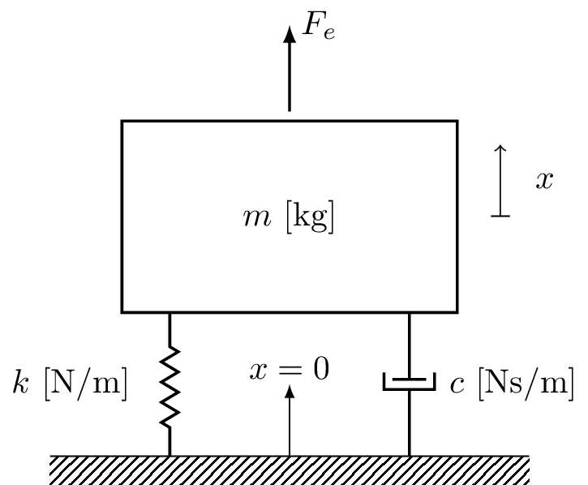{width=400}

The Mass-spring-damper system is a single DoF mechanical oscillator.  
:::

# Equations of motion of mass-spring system

Newton's second law states that the sum of all forces acting on the mass is equal to its acceleration time its mass,
        $$
            F=ma \quad\quad 	\sum_i F_i = m\ddot{x}
        $$
What forces are acting on our mass - *free body diagram*.
        $$
            \begin{align}
                m\ddot{x}  & = \sum_i F_i         \\
                m \ddot{x} & = +F_e + F_k + F_c 
            \end{align}
        $$
where $F_e$ is an external force, defined in the direction of positive travel, and $F_k$ and $F_c$ are forces that oppose motion. 

::: {#fig-VPexample}

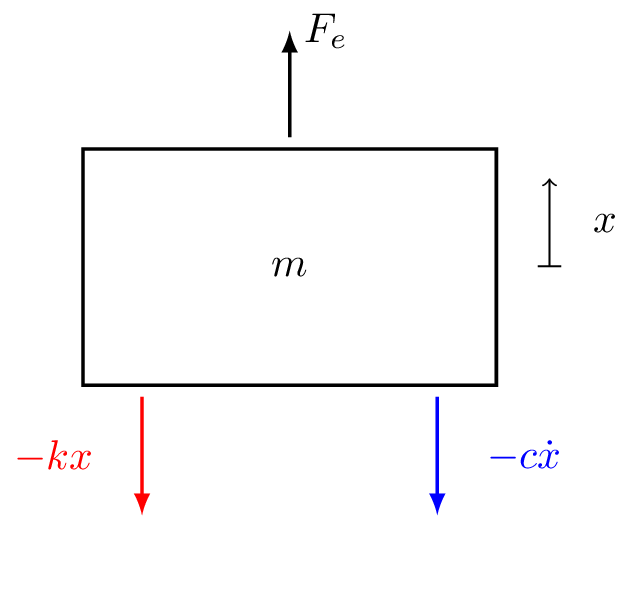{width=300}

Free body diagram.
:::

## Ideal springs

An ideal spring has no mass and generates a force proportion to its elongation $\Delta x$. The force generated is always in opposite direction to displacement and linearly related to the elongation of the spring.

For a single-sided spring we have,
    $$
        F_k = -kx_1
    $$
where $k$ is called the *spring stiffness* with units (N/m). For a two-sided spring,
    $$
        F_k = k\overbrace{(x_2-x_1)}^{\Delta x}
    $$
where the force at each end is equal and opposite in direction.

The spring force always opposes displacement:

* If $\Delta x<0$ then  $F_k>0$
* If $\Delta x>0$ then  $F_k<0$

Ideal springs are linear - the spring force and elongation remain linearly related indefinitely. Simply put, doubling the extention doubles the force generated,
	$$
        F_k = -kx_1 \quad \quad 2F_k = -k\, 2x_1 
	$$

Note that real springs are non-linear when subject to large deformations.

::: {#fig-idealSprings layout-ncol=2 layout-valign="bottom"}

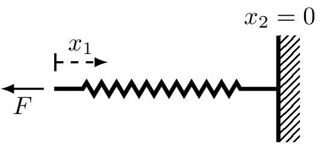{width=300 #fig-singleSpring}

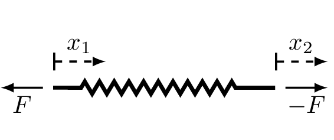{width=300 #fig-twoSpring}

Diagram fo single and two sided spring. Force generate at each end is equal and opposite.
:::

### Parallel and series springs

When two springs are in parallel, they will always have the same displacement at either end. The total force generated divides itself into $F_{k1}$ and $F_{k2}$,
    $$
        \begin{align}
            F_{k1} & = k_1(x_2-x_1)  \\
            F_{k2} & = k_2(x_2-x_1)
        \end{align}
    $$
The total force is given by the sum of the forces generated by the two springs,
	$$
        \begin{align}
            F_k & = F_{k1}+F_{k2}                        \\
                & =\underbrace{(k_1+k_2)}_{k_t}(x_2-x_1)
        \end{align}
    $${#eq-parSpringStiff}

From @eq-parSpringStiff we see that the total stiffness of the parallel springs is just the sum of individual spring stiffnesses. We can generalise this result to an arbitary number of springs as, 
	$$
    	\begin{equation}
				k_t = \sum_i^N k_i
		\end{equation}
    $$

::: {#fig-parSerSprings layout-ncol=2 layout-valign="bottom"}

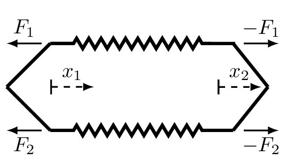{width=250}

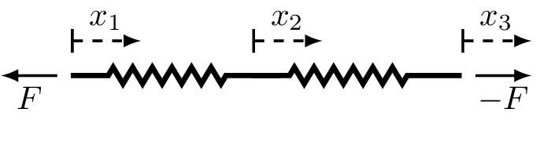{width=300}

Ideal springs arranged in parallel and series.  
:::

When two springs are arranged in series they by definition must have the same force through their lengths.
	$$			      
        F_{k} = k_1(x_2-x_1)
    $${#eq-stiffness1}
    $$
        F_{k} = k_2(x_3-x_2)
    $${#eq-stiffness2}
From @eq-stiffness1 we get,
	$$			      
        \begin{equation}
            x_2 = \frac{F_k}{k_1} + x_1
        \end{equation}
    $$
Substituting this into @eq-stiffness2,
	$$
        F_k = k_2(x_3 -x_1 -\frac{F_k}{k_1})
	$$
A little bit of algebra leads to,
	$$
        F_k =\underbrace{ \left(\frac{1}{k_1}+\frac{1}{k_2}\right)^{-1} }_{k}(x_3-x_1)
	$${#eq-seriesSprings}
Note that for a series configuration, the total stiffness is always less than individual stiffnesses. We can generalise @eq-seriesSprings to an arbitary number of springs by,
    $$
		k = \left(\sum_i^N \frac{1}{k_i}\right)^{-1}
	$$

## Ideal viscous damper
A viscous damper  has no mass and generates a force proportion to the relative velocity $\Delta \dot{x}$. The force generated is always in opposite direction and linearly related to the relative velocity of the dashpot. 

For a single-sided dashpot we have,
    $$
		F_c = -c\dot{x}_1
	$$
where $c$ is the *viscous damping coefficient* with units (Ns/m).

For a two-sided dashpot,
	$$
		F_c = c\overbrace{(\dot{x}_2-\dot{x}_1)}^{\Delta \dot{x}}
	$$

Note that the same equations apply for series and parallel dashpot arrangements as for springs.

::: {#fig-idealDash layout-ncol=2}

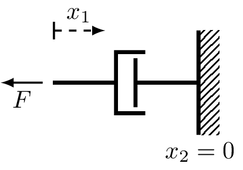{width=250 #fig-singleDash}

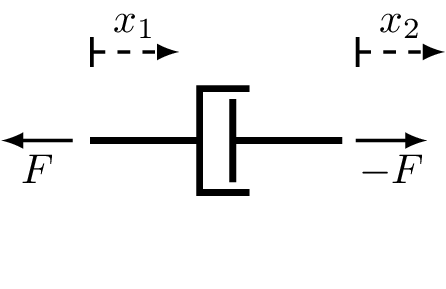{width=250 #fig-twoDash}

Diagram fo single and two sided dashpot. Force generate at each end is equal and opposite.
:::

## Equation of motion (cont.)

Substituting in the spring and dashpot forces, Newton's second law states that,
    $$
        \begin{align}
            m \ddot{x} & = F_e + F_k + F_c    \\
                        & =  F_e -kx -c\dot{x}
        \end{align}
    $$
To obtain the equation of motion we isolate external force,
	$$
		F_e = m\ddot{x} + kx + c\dot{x}
	$${#eq-EoM}
This is a *second order linear differential equation with constant coefficients*. 

# Unforced solution

We begin by considering the homogenous, i.e unforced ($F_e=0$), solution to @eq-EoM. In doing so, we are interested in the dispalcement response $x(t)$ of the system given some set of initial conditons, specifically an initial displacement $x_0$ and velocity $\dot{x}_0$.

## Undamped
We start with the undamped case, where $c = 0$. Our EoM takes the form,
	$$	
		0 = m\ddot{x} + kx \quad \quad (F_e = c= 0)
	$$
Dividing both sides by $m$ we get,
	$$
		0 = \ddot{x} + \frac{k}{m}x =  \ddot{x} + \omega_n^2 x 
	$$
Next, we consider a solution of the form $x(t) = Ae^{st}$,
	$$
		0 = s^2 Ae^{st} + \omega_n^2 Ae^{st}
	$$
Dividing through by $Ae^{st}$ we obtain the so-called *characteristic equation*,
	$$
		0 = s^2 + \omega_n^2  \quad\quad s^2 = -\omega_n^2
	$$
Taking the square root of both sides, recalling that $i = \sqrt{-1}$, we find $s$ to be,
	$$
		s = \pm \sqrt{-\omega_n^2} = \pm i \omega _n
	$$
Note that there are two roots; the solution is the sum of each,
    $$
		x(t) = A_1 e^{-i\omega_n t} + A_2 e^{i\omega_n t}
	$${#eq-undampedSol}
where $A_1$ and $A_2$ are constants that depend on initial conditions, $x_0$ and $\dot{x}_0$.

Clearly, imaginary roots lead to complex exponentials, i.e. *harmonic motion at frequency $\omega_n$.* We call $\omega_n$ the natural frequency of vibration, or the characteristic frequency. From the above we see that a force free undamped mass-spring system will *always* oscillate at $\omega_n$, regardless of IC.

### Initial conditions
We have obtained the general form of the solution in @eq-undampedSol. Next, we need to determine the constants $A_1$ and $A_2$ in terms of initial displacement $x_0$ and velocity$\dot{x}_0$.

We begin by evaluating @eq-undampedSol at $t=0$, which yeilds,
	$$
		x(0) = x_0 = A_1 + A_2
    $$
Next, we take the derrivative of @eq-undampedSol to obtain an equation for the velocity, before evaluating it also at $t=0$. This yields, 
    $$
        \dot{x}(0) = \dot{x}_0 = -i\omega_n A_1 +i\omega_n A_2 \quad\rightarrow\quad  \frac{\dot{x}_0}{i\omega_n} = -A_1+A_2
	$$
From the above, after some simple algebra, we obtain,
    $$
        A_1 = \frac{1}{2}\left(x_0 -\frac{\dot{x}_0}{i\omega}\right) \quad \quad A_2 = \frac{1}{2}\left(x_0 +\frac{\dot{x}_0}{i \omega}\right)
	$$
Notice that $A_1$ and $A_2$ are complex conjugates... So we only have two independent constants since $A_1 = a+ib$ and $A_2=a-ib$. This is expected as system is second order.

If we substitute the constants into solution and use Euler's formula,
    $$
        \begin{align}
            x(t) & = \frac{1}{2}\left(x_0 -\frac{\dot{x}}{i\omega}\right) e^{-i\omega_n t} + \frac{1}{2}\left(x_0 +\frac{\dot{x}}{i\omega}\right) e^{i\omega_n t}                                                                                   \\
                & =  \frac{1}{2}x_0\underbrace{ \left(e^{i\omega_n t}  + e^{-i\omega_n t} \right) }_{2\cos\omega_n t}+\frac{1}{2}\frac{\dot{x}}{\omega}  \underbrace{\frac{1}{i}\left(e^{i\omega_n t}- e^{-i\omega_n t} \right)}_{2\sin\omega_n t}
        \end{align}
    $$
From the above, the *real* solution is given by,
	$$
		x(t) = x_0 \cos\omega_n t + \frac{\dot{x}_0}{\omega_n} \sin\omega_n t
	$$
Finally, using the trigonometric identity $a\cos\theta + b\sin\theta = \sqrt{a^2+b^2}\cos(\theta - \phi)$ where $\phi = \tan^{-1}(b/a)$, we can write the solution in a simple $\cos$ form as,
	$$
		x(t) = |A| \cos(\omega_nt-\phi) \quad \mbox{with}\quad |A| = \sqrt{x_0^2 +\frac{\dot{x}_0^2}{\omega^2}} \quad \mbox{and} \quad \phi = \tan^{-1}\left(\frac{1}{\omega_n}\frac{\dot{x}_0}{x_0}\right)
	$$

::: {#fig-geoUndamped}

<iframe scrolling="no" title="Undamped mass-spring response" src="https://www.geogebra.org/material/iframe/id/anjtxspe/width/900/height/500/border/888888/sfsb/true/smb/false/stb/false/stbh/false/ai/false/asb/false/sri/false/rc/false/ld/false/sdz/true/ctl/false" width="900px" height="500px" style="border:0px;"> </iframe>

Response of undamped mass-spring system due to initial conditions. 

:::

## Damped

Let us now consider the damped system. Reintroducing $c$, our homogenous EoM becomes,
	$$
		0 = m\ddot{x} + c\dot{x} + kx \quad \quad (F_e =0)
	$$
As for the undamped, we divide through by $m$ to get,
	$$
		0 = \ddot{x} +2\zeta\omega_n \dot{x} + \omega_n^2 x 
	$$
where we introduce the *viscous damping factor*, defined as,
	$$
		\zeta = \frac{c}{2m\omega_n}
	$$
Note that the reason for introducing $\zeta$ is largely for mathematical convenience, as we will see shortly. As before, we assume a solution of form $x(t) = Ae^{st}$ and make the necessary substiutiions,
	$$
        0 = s^2 Ae^{st}  +2\zeta\omega_n s Ae^{st} + \omega_n^2 Ae^{st}
	$$
Finally, dividing through by $Ae^{st}$ we obtain the system's  characteristic equation,
	$$
		0 = s^2  +2\zeta\omega_n s  + \omega_n^2 
	$${#eq-dampedCharac}
Note that @eq-dampedCharac is simply a quadratic equation in $s$. We can solve this easily using the quadratic formula as, 
	$$
        \begin{array}{c}
            s_1 \\
            s_2\end{array} = \left(-\zeta \pm \sqrt{\zeta^2-1}\right)\omega_n
	$$ {#eq-dampedCharacRoots}
Perhaps it is clear now why we introduced $\zeta$; it leads to @eq-dampedCharacRoots takeing a particularly simple form.

Plugging our roots $s_{1,2}$ back into our assumed solution $x(t) = Ae^{st}$,
	$$
        x(t) = A_1e^{ \left(-\zeta - \sqrt{\zeta^2-1}\right)\omega_n t} + A_2 e^{\left(-\zeta + \sqrt{\zeta^2-1}\right)\omega_n t}
	$${#eq-dampedSolution0}
or by factoring out constant part of exponential $e^{-\zeta \omega_n t}$,
	$$
        x(t) = \left(A_1e^{ -\sqrt{\zeta^2-1}\omega_n t} + A_2 e^{\sqrt{\zeta^2-1}\omega_n t}\right)e^{-\zeta\omega_n t}
	$${#eq-dampedSolution1}
@eq-dampedSolution0 and @eq-dampedSolution1 represent the general solution of our damped mass-spring system. As before, the constants $A_1$ and $A_2$ depend on the inital condition, and will be dealt with shortly. For now, it is more important to notice that the nature of this solution depends heavily on the value of $\zeta$!

- If $\zeta=0$ then $s_{1,2}$ are purely imaginary and the solution is that of undamped case we have already seen.
- If $0<\zeta<1$ then $s_{1,2}$ are complex (because of negative in square root) and the solution will become a decaying sinusoid.
- If $\zeta=1$ then $s_{1,2}$ are purely real and the solution decays exponentially at the fastest possible rate.
- If $\zeta>1$ then $s_{1,2}$ are purely real and the solution decays exponentially at an increasing slow rate.

These different scenarios are shown in @fig-solutionTypes, and described in more detail below. 

::: {#fig-solutionTypes layout-nrow=2}
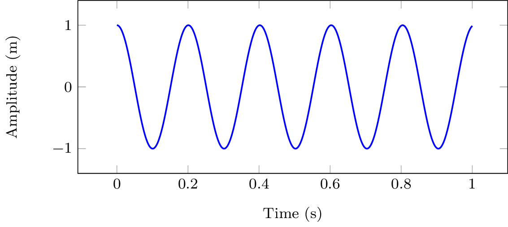

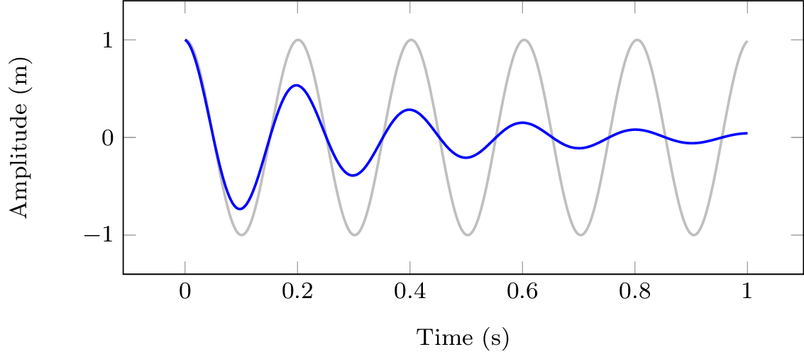

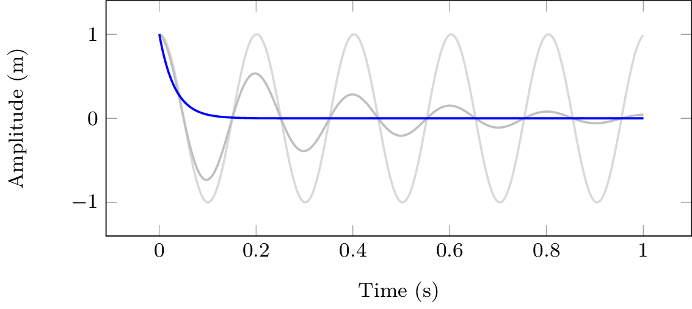

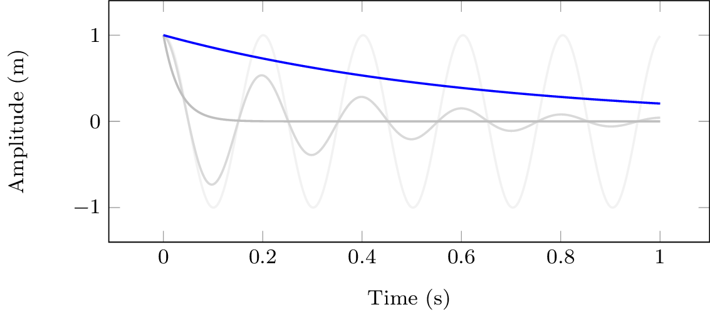

Different types of solution given by @eq-dampedSolution0 depending on the level of damping ($\zeta$) for IC $x_0=1$ and $\dot{x}_0=0$. 
:::

### Undamped 

When $\zeta=0$, @eq-dampedSolution1 reduces to (noting that $\sqrt{-1}=i$),
	$$
        x(t) = \left(A_1e^{ -i\omega_n t} + A_2 e^{i\omega_n t}\right)
	$$
which, as expected, is exactly what we obtained for the undamped case.

### Underdamped

For the under-damped case that $0<\zeta<1$, it is useful to write $\sqrt{\zeta^2-1}$ instead as $i\sqrt{1-\zeta^2}$ such that @eq-dampedSolution1 becomes,
    $$
        x(t) = \left(A_1e^{ -i\sqrt{1-\zeta^2}\omega_n t} + A_2 e^{i\sqrt{1-\zeta^2}\omega_n t}\right)e^{-\zeta\omega_n t}
	$$
Taking the same form as the undamped case, the bracketed term represents a periodic oscillation at a frequency of $\omega_d = \sqrt{1-\zeta^2}\omega_n$. This is termed the *frequency of damped natural vibration*. It is always slightly lower than the undamped natural frequency ($\omega_d<\omega_n$) on account of $0<\sqrt{1-\zeta^2}<1$ always being less than one. Using $\omega_d$, @eq-dampedSolution1 takes the form,
    $$
        x(t) = \left(A_1e^{ -i\omega_d t} + A_2 e^{i\omega_d t}\right)e^{-\zeta\omega_n t}
	$$
The exponential sitting outside of the bracket has a real power, and so represents an exponential decay term. Note that this decay is proportional to the *undamped* natural frequency $\omega_n$; higher frequencies decay more rapidly. The rate of decay is also proportional to $\zeta$; larger values of $\zeta$ leads to a quicker decay.

Following the same steps as for the undamped case, our *damped* solution can also be expressed in a simpler $\cos$ form as,
	$$
		x(t) = |A|\cos(\omega_d t - \phi) e^{-\zeta\omega_n t}
	$$
with the initial conditions, 
	$$
        A = x_0 + \frac{\dot{x}_0 {\color{orange} +\zeta\omega_n x_0}}{i \omega_d} \quad |A| = \sqrt{\Re(A)^2 + \Im(A)^2} \quad \phi = \tan^{-1}\left(\frac{\Im(A)}{\Re(A)}\right)
	$$
It is this under-damped solution that we are most interested in, and will revist later when considering multi-DoF systems. 

:::{#fig-underDampedPlot}

<iframe scrolling="no" title="Undamped mass-spring response" src="https://www.geogebra.org/material/iframe/id/n33vayvw/width/900/height/500/border/888888/sfsb/true/smb/false/stb/false/stbh/false/ai/false/asb/false/sri/false/rc/false/ld/false/sdz/true/ctl/false" width="900px" height="500px" style="border:0px;"> </iframe>

Response of under-damped mass-spring-damper system due to initial conditions. 

:::

### Critically damped

When $\zeta=1$ we reach the transition point between *under* and *over-damped* scenarios. We term this case *critical damping*. In reality, one never acheives critical damping exactly; $\zeta$ is always slightly larger or smaller than 1 in practice. Nevertheless, in theory it can be shown that the critically damped solution has the form,
	$$
		x(t) = (A_1+tA_2)e^{-\omega_n t}
	$${#eq-critDamp}
which occurs when,
    $$
	    \zeta = 1 = \frac{c}{2m\omega_n} \rightarrow c_{cr} = 2m\omega_n = 2\sqrt{km}
	$$
Admittedly, it is not immediately obvious how @eq-dampedSolution1 reduces to @eq-critDamp when $\zeta=1$. Substituting $\zeta=1$ directly into @eq-dampedSolution1 yields, 
	$$
        x(t) = \left(A_1 + A_2 \right)e^{-\omega_n t} = A_1e^{-\omega_n t}
	$${#eq-critDampSolution}
which is indeed a valid solution, but it is not the only one. It implies that given an initial displacement $x_0$, the initial velocity *must* be $\dot{x}_0 = -A_1/\omega_n$. Physically however, there is nothing stopping us from setting the initial displacement and then applying whatever initial velocity we want! So, @eq-critDampSolution is clearly missing something...

The issue is that as $\zeta\rightarrow 1$ the two roots $s_{1,2}$ merge into $s$, meaning we no longer have two independent solutions and so cannot guarantee all solutions. To find the missing solution we define $\alpha=\sqrt{\zeta^2-1}\omega_n$ such that our general solution takes the form,
    $$
         x(t) = \left(A_1e^{ -\alpha t} + A_2 e^{\alpha t}\right)e^{-\zeta\omega_n t}
	$$
We then take $A_2 = -A_1$ and consider the limit as we approach critical damping $\alpha \rightarrow 0$ and $\zeta\rightarrow 1$. For small $\alpha$ we can take $e^{\pm\alpha t}=1\pm\alpha t$, which leads to our missing solution,
    $$
         x(t) = \left(A_1(1-\alpha t) - A_1 (1+\alpha t)\right)e^{-\zeta\omega_n t} = -2\alpha t e^{-\omega_n t} 
	$$
Recalling that we can multiply a solution by a constant and it remains a solution, we can rewrite our new solution as,
    $$
         x(t) = A_2 t e^{-\omega_n t} 
	$$
Finally, the general solution is the sum of our individual solution, as in @eq-critDamp.

### Over-damped 

Lastly, in the *over-damped* case where $\zeta>1$, we see that our solution is just the sum of two exponential decays,
	$$
        x(t) = A_1e^{ -\left(\zeta + \sqrt{\zeta^2-1}\right)\omega_n t} + A_2 e^{-\left(\zeta - \sqrt{\zeta^2-1}\right)\omega_n t}
	$${#eq-overDampedSolution0}
Note that $\left(\zeta \pm \sqrt{\zeta^2-1}\right) > 1$, and so @eq-overDampedSolution0 will *always* decay slower than @eq-critDampSolution. This means that the critically damped response corresponds to the fastest possible decay, without oscillation. Any further redution in the damping $\zeta$ will lead to complex roots $s_{1,2}$ and some oscillaton.

# Forced solution  

Now that we have dealt with the unforced, homogenous, solution we turn our attention to the *force solution*. As such, our EoM now takes the form, 
    $$
		F_e = m\ddot{x} + kx + c\dot{x}
	$$
where $F_e$ has been reintroduced. We will consider three different scenarios with regards to the external forcing; harmonic forcing at a single frequency, forcing by a periodic function, and forcing by an arbitary waveform. 

## Harmonic forcing
Harmonic forcing at frequency $\omega$ can be expressed in complex exponential form as,
    $$
		F_e(t) = F_0 e^{i\omega t}
	$$
where $F_0$ is a complex ampltiude. We will assume that this force as been acting for all time, and so any transient behavior due to its initial application have decayed to 0. 

As a consequence of our mass-spring-damper system being linear, its response must also be harmonic at the same frequency,
    $$
		x(t) = X_0 e^{i\omega t}
	$${#eq-harmonicResp0}
where $X_0$ is similarly a complex amplitude. Note that the magnitude and phase of $X_0$ will differ from $F_0$ on account of the system's dynamics. 

Substituting the harmonic terms above and performing the necessary derivatives we arrive at, 
    $$
        F_e =  kx + c\dot{x} +  m\ddot{x} \quad \quad F_0 e^{i\omega t} = k X_0 e^{i\omega t} + ci\omega X_0 e^{i\omega t} - m\omega^2 X_0 e^{i\omega t}
    $$
Now dividing through by $e^{i\omega t}$ leaves us with,
    $$
		 F_0 = \overbrace{(k + i\omega c - \omega^2 m)}^{D(\omega)}X_0 \quad \rightarrow \quad X_0 = R(\omega) F_o
	$${#eq-harmonicResp}
where $D(\omega)$ is a complex function termed the *dynamic stiffness* that depends on frequency and describes the system's dynamics; $R(\omega)$ is the inverse of $D(\omega)$ and is termed the *receptance*. More generally, $D(\omega)$ and $R(\omega)$ are termed *frequency response functions* or FRFs, a concept we will return to shortly. 

@eq-harmonicResp provides a means of calculating the complex amplitude of the harmonic response given the forcing amplitude. Once $X_0$ is obtained, the time series response can be obtained using @eq-harmonicResp0. Alternativly, the magnitude and phase of $R(\omega)$ can be examined and the response obtained using the standard $|A| \cos(\omega t - \phi)$ form. 

To examine $R(\omega)$ further we seperate the real and imaginary parts of the denominator, 
    $$
	    R(\omega) = \frac{1}{k + i\omega c - \omega^2 m} =  \frac{1}{\underbrace{(k - \omega^2 m)}_{\mbox{Real}}+ \underbrace{i\omega c}_{\mbox{Imag}} } 
    $$
The magnitude is now obtained simply as, 
    $$
		|R(\omega)| =  \frac{1}{|k - \omega^2 m+ i\omega c |} =  \frac{1}{\sqrt{(k - \omega^2 m)^2+ (\omega c)^2}} 
	$$
Recalling from our treatment of hte homogenous case $\omega_n = \sqrt{k/m}$ and $c = \zeta 2 k/ \omega_n$, the receptance magnitude becomes, 
	$$
	    |R(\omega)| =  \frac{1}{\sqrt{k^2\left(1 - \omega^2 \frac{m}{k}\right)^2+ (\omega c)^2}} = \frac{1}{\sqrt{k^2\left(1 - \frac{\omega^2}{\omega_n^2}\right)^2+ \left( \zeta 2 k \frac{\omega}{\omega_n}\right)^2}} = \frac{1}{k \sqrt{\left(1 - \frac{\omega^2}{\omega_n^2}\right)^2+ \left( \zeta 2 \frac{\omega}{\omega_n}\right)^2}}
    $${#eq-receptMag}
We see that the magnitude increases as $\left(1 - \frac{\omega^2}{\omega_n^2}\right)$ goes to zero, and its maximum is limited by $\zeta 2 k \frac{\omega}{\omega_n}$.

Shown in @fig-receptanceLin are the receptance frequency response curves obtained for different levels of damping. The peak value of the magnitude is marked and takes a value $\omega_{peak} = \omega_n\sqrt{1-2\zeta^2}$. Note that this peak value is always less than the undamped natural frequency $\omega_n$. It is obtained by taking the derivative of @eq-receptMag, setting this to zero, and solving for $\omega$.

::: {.callout-tip title="Want to see where $\omega_{peak} = \omega_n\sqrt{1-2\zeta^2}$ came from?" collapse=true}
Factoring our constants and using the reciporcal rule $[1/u(x)]' = - u(x)'/u(x)^2$,
    $$
		\frac{\partial |R|^2}{\partial \omega} = - \frac{1}{k^2}
		\frac{ \frac{\partial}{\partial \omega} \left(\left(1 - \frac{\omega^2}{\omega_n^2}\right)^2+ \left( \zeta 2 \frac{\omega}{\omega_n}\right)^2\right)}{ \left(\left(1 - \frac{\omega^2}{\omega_n^2}\right)^2+ \left( \zeta 2 \frac{\omega}{\omega_n}\right)^2\right)^2} 
    $$
Using the summation rule $(a\cdot u(x) + b\cdot v(x))' = a\cdot u(x)' + b\cdot v(x)'$
    $$
		\frac{\partial |R|^2}{\partial \omega} = - \frac{1}{k^2}
		\frac{ \frac{\partial}{\partial \omega} \left(1 - \frac{\omega^2}{\omega_n^2}\right)^2+  \left(\frac{\zeta 2}{\omega_n}\right)^2 \frac{\partial}{\partial \omega}\left(\omega\right)^2}{ \left(\left(1 - \frac{\omega^2}{\omega_n^2}\right)^2+ \left( \zeta 2 \frac{\omega}{\omega_n}\right)^2\right)^2} 
    $$
Using the chain rule $u(v(x))' = u(v)'u(x)'$ and the power rule $[u(x)^n]' = nu^{n-1}$,
	$$
		\frac{\partial |R|^2}{\partial \omega} = - \frac{1}{k^2}
		\frac{  2\left(1 - \frac{\omega^2}{\omega_n^2}\right) \frac{\partial}{\partial \omega} \left(1 - \frac{\omega^2}{\omega_n^2}\right)+  \left(\frac{\zeta 2}{\omega_n}\right)^2 2\omega}{ \left(\left(1 - \frac{\omega^2}{\omega_n^2}\right)^2+ \left( \zeta 2 \frac{\omega}{\omega_n}\right)^2\right)^2} 
    $$
Using $(1)' = 0$ and reapplying the power rule,
	$$
		\frac{\partial |R|^2}{\partial \omega} = - \frac{1}{k^2}
		\frac{  - 2\left(1 - \frac{\omega^2}{\omega_n^2}\right) \left( \frac{2 \omega}{\omega_n^2}\right)+  \left(\frac{\zeta 2}{\omega_n}\right)^2 2\omega}{ \left(\left(1 - \frac{\omega^2}{\omega_n^2}\right)^2+ \left( \zeta 2 \frac{\omega}{\omega_n}\right)^2\right)^2}
    $$
We now set the derivative to zero, and multily both sides by the denominator,
	$$
		0 = - 
		 2\left(1 - \frac{\omega^2}{\omega_n^2}\right) \left( \frac{2 \omega}{\omega_n^2}\right)+  \left(\frac{\zeta 2}{\omega_n}\right)^2 2\omega 
    $$
Do a little algebra,
	$$
		\left(\frac{2 \omega}{\omega_n^2} - \frac{2 \omega^3}{\omega_n^4}\right) =  \left(\frac{\zeta 2}{\omega_n}\right)^2 \omega 
    $$
...a little more algerba...
	$$
		 \frac{2}{\omega_n^2} - \frac{2 \omega^2}{\omega_n^4} =  \left(\frac{\zeta 2}{\omega_n}\right)^2
    $$
	...nearly there...
	$$
		  \frac{2 \omega^2}{\omega_n^4} =  -\left(\frac{\zeta 2}{\omega_n}\right)^2+\frac{2}{\omega_n^2}
    $$
	$$
		  \omega^2 =  -2\left(\frac{\zeta \omega_n^2}{\omega_n}\right)^2+\frac{\omega_n^4}{\omega_n^2} = -2\zeta^2 \omega_n^2+\omega_n^2 = \omega_n^2(1 - 2\zeta^2)
    $$
	And finally, taking the square-root of both sides,
	$$
		  \omega_{peak} =  \omega_n\sqrt{1 - 2\zeta^2}
    $$
Et voila! Now, was that worth it? Probably not!
:::

Note that if $\zeta>1/\sqrt{2}$ the response has no peak, and that if $\zeta=0$, it has a discontinuity at $\omega/\omega_n = 1$.

:::{#fig-receptanceLin layout-ncol=2 layout-valign="bottom"}

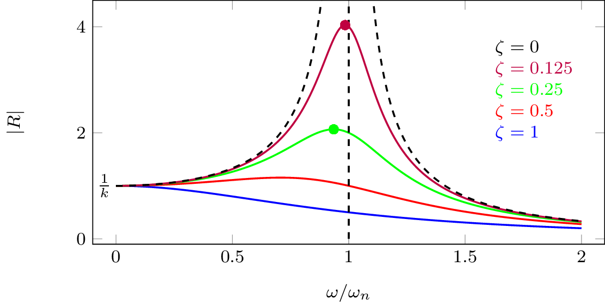{width=400}

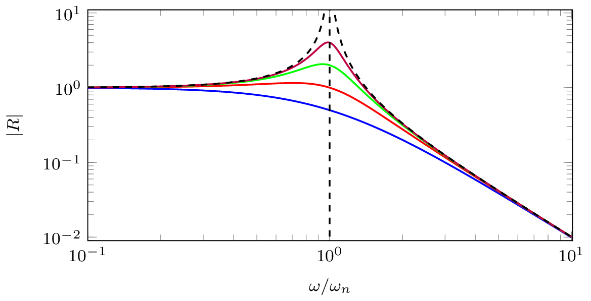{width=410}

Frequency response of the receptance FRF for different levels of damping.  

:::

To get the phase response we need to separate real and imaginary parts of the receptance. We do this by multiplying numerator and denominator by the complex conjugate of the denominator,
    $$
		\begin{align}
			R(\omega)&=  \frac{1}{k\left(1 - \frac{\omega^2}{\omega_n^2}\right) + i \zeta 2 k \frac{\omega}{\omega_n} } {\color{black!50!green}\times \frac{k\left(1 - \frac{\omega^2}{\omega_n^2}\right) - i \zeta 2 k \frac{\omega}{\omega_n} }{k(1 - \frac{\omega^2}{\omega_n^2}) - i \zeta 2 k \frac{\omega}{\omega_n} }}\\
			&=\underbrace{\frac{k\left(1 - \frac{\omega^2}{\omega_n^2}\right)}{k^2\left(1 - \frac{\omega^2}{\omega_n^2}\right)^2 + \left(\zeta 2 k \frac{\omega}{\omega_n}\right)^2 } }_{\mbox{real part}}- i\underbrace{\frac{ \zeta 2 k \frac{\omega}{\omega_n} }{k^2\left(1 - \frac{\omega^2}{\omega_n^2}\right)^2 + \left(\zeta 2 k \frac{\omega}{\omega_n}\right)^2 }}_{\mbox{imag part}}
		\end{align}
    $$
From the above we obtain the phase response as,
	$$
		\angle R(\omega) = \tan^{-1}\left( \frac{\mbox{imag}}{\mbox{real}} \right) =\tan^{-1}\left( \frac{-\zeta 2 k \frac{\omega}{\omega_n} }{k\left(1 - \frac{\omega^2}{\omega_n^2}\right)} \right)= \tan^{-1}\left( \frac{-c \omega }{k - \omega^2 m} \right) 
	$$
Shown in @fig-receptancePhase are the phase response curves for different levels fo damping alongside the harmonic response above and below the natural frequency of vibration.  We see that the motion of the mass becomes progressively delayed, relative to the excitation force. In the limit at $\omega\rightarrow \infty$ they are $180^\circ$ out of phase. For all levels of damping, we have phase of $-\pi/2$ at undamped resonance $\omega_n$.

:::{#fig-receptancePhase layout-ncol=2 layout-valign="bottom"}

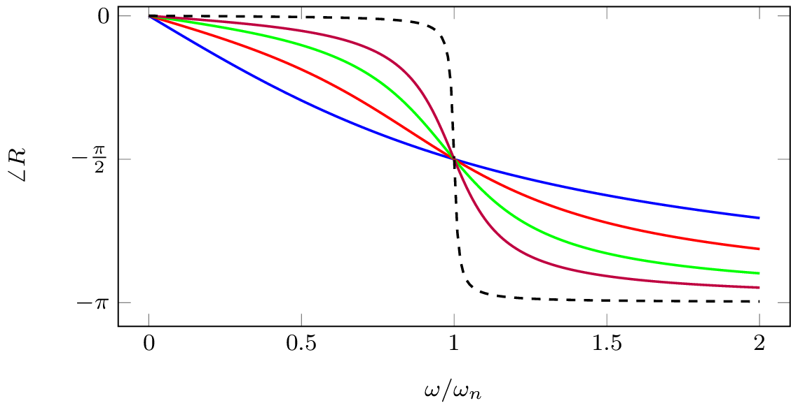{width=500}

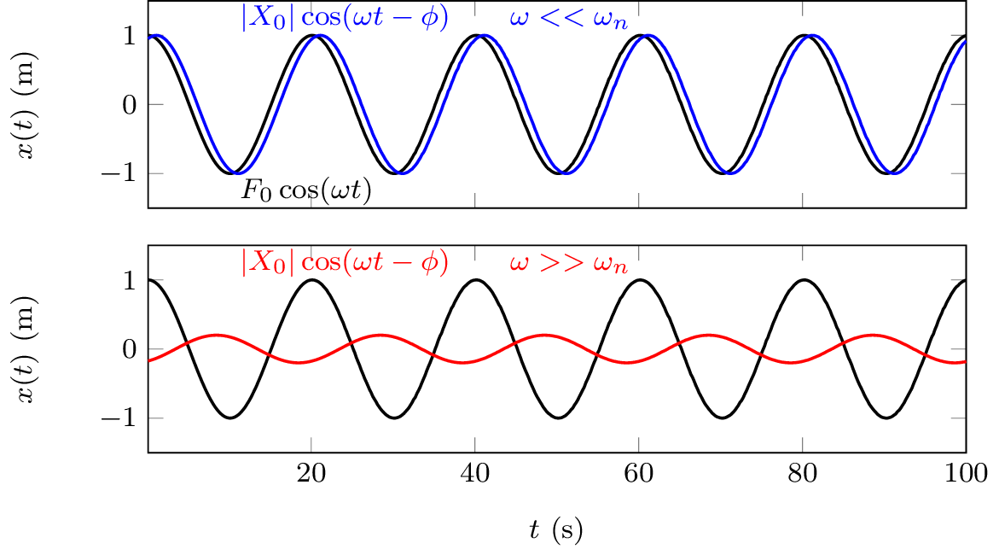{width=450}

Phase response of a damped mass-spring system.
:::

::: {.callout-tip collapse=true}
## What happens at $\omega_n$ if there is no damping...?
In the case of no damping we have discontinuity at resonance - in reality this never happens, there is *always* some damping to limit response. 
Nevertheless, lets look at what would happen anyway... Our EoM without damping,
    $$
        m\ddot{x} +k x = F_0 \cos(\omega_n t)		\quad \rightarrow \quad  \ddot{x} +\omega_n^2 x = \frac{F_0}{m} \cos(\omega_n t)	= \frac{\omega_n^2 F_0}{k} \cos(\omega_n t)	
    $$
How do we solve this? We assume solution of $x(t) =  \frac{\omega_n F_0 t}{2k} \sin(\omega_n t)$ and then prove it...

Our proof begins by getting the velocity and acceleration by differentiation (using product rule),
    $$
        \begin{align}
            \dot{x}(t) &=  \frac{\omega_n F_0}{2k} \sin(\omega_n t) +  \frac{\omega_n^2 F_0 t}{2k} \cos(\omega_n t)\\
            \ddot{x}(t) & = \frac{\omega_n^2 F_0}{2k} \cos(\omega_n t) +  \frac{\omega_n^2 F_0}{2k} \cos(\omega_n t) -  \frac{\omega_n^3 F_0 t}{2k} \sin(\omega_n t)
        \end{align}
    $$
Next, we plug everything into our EoM and check LHS and RHS are equal...
    $$
        \ddot{x} +\omega_n^2 x =  \frac{\omega_n^2 F_0}{k} \cos(\omega_n t)	
    $$
    $$
        \begin{align}
        \overbrace{ \frac{\omega_n^2 F_0}{2k} \cos(\omega_n t) +  \frac{\omega_n^2 F_0}{2k} \cos(\omega_n t) -  \frac{\omega_n^3 F_0 t}{2k} \sin(\omega_n t)}^{	\ddot{x}} +\omega_n^2 \overbrace{ \frac{\omega_n F_0 t}{2k} \sin(\omega_n t)}^{x} \\=  \frac{\omega_n^2 F_0}{k} \cos(\omega_n t)	
        \end{align}
    $$
As we can see, it all checks out! $x(t) =  \frac{\omega_n F_0 t}{2k} \sin(\omega_n t)$  is a solution at $\omega=\omega_n$. What this is saying is that the amplitude grows linearly with time (as in @fig-discoResp) and tends to infinity! In the presence of damping, we obtain a similar response, except that it will plataue at some amplitude on account of the damping removing energy from the system. 

:::{#fig-discoResp }

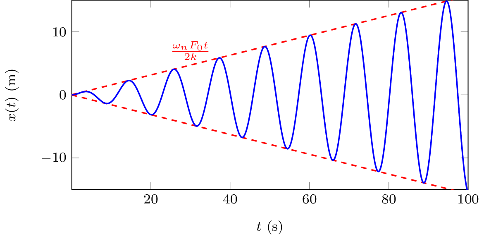{width=500}

Response of undamped system when excited at natural frequency.
:::

It should be obvious that uncontrolled resonances that occur when damping is very very low, have the potential cause structural damage/failure due to the large displacements that result and should be avoided! 

:::

### Frequency Response Functions (FRFs)

The Frequency Response Function (FRF) is a very general and useful concept. In short, it provides a means of describing or characterising the dynamics of a system in the *frequency domain*. What's particularly useful about FRFs is that they can be obtained from models by analytical means, or experimentally from measurement. This makes FRFs a very useful tool for analysing all sorts of dynamic systems. 

:::{#fig-FRFbox }

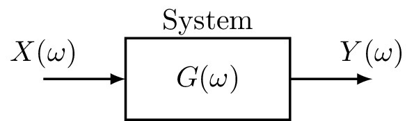{width=300}

Representation of FRF as an input-output relation.
:::

In general, an FRF $G(\omega)$ describes the complex (i.e. magnitude and phase) relation between a harmonic input signal and the corresponding output signal on a given system.
    $$
		G(\omega) = \frac{Y(\omega)}{X(\omega)}	\quad \quad Y(\omega) = G(\omega)X(\omega)
    $$
We can think of the FRF as a  *black box* representation of the system dynamics. Like any complex number, it can be represented in polar form, 
    $$
        G(\omega) = |G(\omega)| e^{-i\angle G(\omega)}
    $$
The magnitude $|G(\omega)|$ describes the change in ampltiude between the input and output of a system. The phase $\angle G(\omega)$ describes the time lag between the input and output.  

We have already derived the force-displacement FRFs for our mass-spring system in @eq-harmonicResp, i.e. the dynamic stiffness $D(\omega)$ and recpetance $R(\omega)$. Similar FRFs also exist for velocity and acceleration-based responses.

Recall that for a harmonic response, displacement, velocity and acceleration are related by,
    $$
        \ddot{X}_0 = i\omega \dot{X}_0 = -\omega^2 X_0
    $$
We can therefore derive the velocity-based FRFs from those of the displacement using $\dot{X}_0 = i\omega X_0$. We thus have the *impedance* $Z(\omega)$ and *mobility* $Y(\omega)$,
    $$
        Z(\omega) = \frac{F_0(\omega)}{\dot{X}_0(\omega)}= \frac{F_0(\omega)}{ i\omega X_0(\omega)}= \frac{1}{i\omega}D(\omega)\quad \quad \quad 	Y(\omega) = \frac{\dot{X}_0(\omega)}{F_0(\omega)} = \frac{i\omega X_0(\omega)}{F_0(\omega)} =i\omega R(\omega)
    $$
Simialrly, acceleration-based FRFs can be derived from those of displacement or velocity using $\ddot{X}_0 = i\omega \dot{X}_0 = -\omega^2 X_0$. This leads us to the *effective mass* $M(\omega)$ and *accelerance* $A(\omega)$,
    $$
        M(\omega) = \frac{F_0(\omega)}{\ddot{X}_0(\omega)}= \frac{F_0(\omega)}{ i\omega \dot{X}_0(\omega)}= \frac{1}{i\omega}Z(\omega)\quad \quad \quad 	A(\omega) = \frac{\ddot{X}_0(\omega)}{F_0(\omega)} = \frac{i\omega \dot{X}_0(\omega)}{F_0(\omega)} =i\omega Y(\omega)
    $$
Shown in @fig-dispVelAccFRF are the receptance, mobility and accelerance FRFs for our single DoF mass-spring system with different levels of damping. Which of these FRFs is most useful very much depends on the problem at hand. 

:::{#fig-dispVelAccFRF }

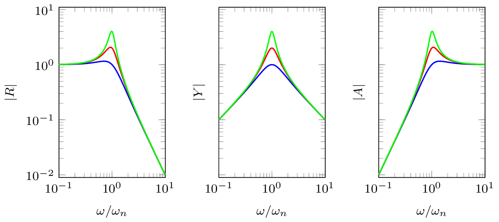{width=700}

Representation of FRF as an input-output relation.
:::

With knowledge of a systems FRF, say the receptance $R(\omega)$, its response due to a harmonic excitation at frequency $\omega$ is given by,
$$
    x(t) = |R(\omega)| F_0 \cos(\omega t - \angle R(\omega)) \quad \mbox{or} \quad x(t) = \mbox{Real}\left(R(\omega) F_0 e^{-i \omega t}\right)
$$

## Periodic forcing
Having dealt with the case of simple harmonic excitation (periodic over time interval $T=2\pi/\omega$), we are now ready to consider excitation by more general *periodic* functions, an example of which is shown in @fig-periodicSignal.

:::{#fig-periodicSignal }

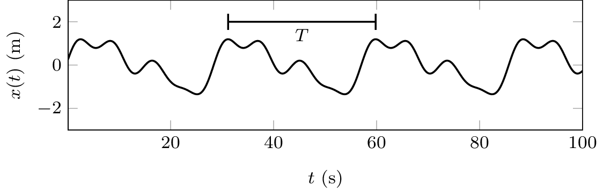{width=600}

Example of a periodic signal with interval $T$. 

:::

To deal with periodic excitation signals we simply note that any periodic function can be represented by a convergent series of harmonic functions whose frequencies are integer multiples of a fundamental $\omega_0 = 2\pi/T$. This is the so-called *Fourier series*,
	$$
			F(t) = \frac{1}{2}F_0 + \mbox{Real}\left[ \sum_{n=1}^\infty F_n e^{-in\omega_0 t}\right]
	$$
where $F_n$ is a complex coefficient that describes amplitude and phase of the $n$th harmonic, with $F_0$ representing the DC offset of the signal. Since our EoM is linear, we can treat each harmonic individually and recombine their individual solutions afterwards. 
	$$
		x(t) =  \frac{1}{2}F_0  R(0) + \mbox{Real}\left[\sum_{n=1}^\infty R(n\omega_0)   F_n e^{-in\omega_0 t} \right]
	$$
Importantly, each forcing harmonic is multiplied by the complex FRF at the corresponding frequency, $n\omega_0$. 

## Arbitary forcing
To consider an arbitrary, non-harmonic, forcing we can no longer assume that the system is operating at steady state. Rather, we must treat the entire response as transient. To deal with this problem, we will need to introduce the system's *until impulse response function* (IRF).

### Impulse response function 
The unit impulse response of a system is the response obtained by considering the external forcing $F(t)$ to be that of a *Dirac delta* function, defined mathematically as
    $$
        \begin{align}
            \delta(t-a) &= 0 \quad \quad \mbox{for } t\neq a\\
            \int_{-\infty}^\infty \delta(t-a){\rm d}t &=1
        \end{align}
    $$
Using $F_e = \delta(t)$, the system impulse response is denoted $g(t)$.

Inserting $F_e=\delta(t)$ and $x(t) = g(t)$, the EoM becomes, 
	$$
		\delta(t) =  kg(t) + c\dot{g}(t) +  m\ddot{g}(t) 
	$$
Taking $g(0)=\dot{g}(0) = 0$ by definition, we integrate our EoM over the time interval $\Delta t=\epsilon$ and take the limit as this goes to $0$,
	$$
	    \underbrace{	\lim_{\epsilon\rightarrow 0} \int_0^\epsilon \delta(t)  dt }_{=1}=  	\lim_{\epsilon\rightarrow 0} \int_0^\epsilon \left(kg(t) + c\dot{g}(t) +  m\ddot{g}(t) \right)dt
	$$
Note that integration of the displacement is just a constant, which goes to zero on evaluation of the limits. Integration of the velocity term yields a displacement, however since it takes some time for a displacement to develop this term also tends to zero in the limit. All we are left with is the acceleration term which evaluates to,
	$$
		\lim_{\epsilon\rightarrow 0} \int_0^\epsilon m\ddot{g}(t)dt = \lim_{\epsilon\rightarrow 0} m\dot{g}(t)\Big|_0^\epsilon = m \lim_{\epsilon\rightarrow 0} [\dot{g}(\epsilon) - \dot{g}(0)] = m\dot{g}(0+)
	$$
where the term $\dot{g}(0+)$ denotes a change in velocity at the end of the increment $\epsilon$.

From the above we conclude that, 
	$$
		\dot{g}(0+) = \frac{1}{m}
	$${#eq-impRespInitVel}
Physically, @eq-impRespInitVel is telling us that the unit impulse response produces an instantaneous change in velocity; an impulse applied at $t=0$ is equivalent to the effect of initial velocity $\dot{x}_0=1/m$. Recalling our solution to the unforced EoM (see ), the system impulse response is given by,
    $$
        \begin{align}
            g(t) &= \frac{1}{\omega_d m} \sin(\omega_d t) e^{-\zeta\omega_n t}  \quad  &t>0 \\
            &=0 &t<0
        \end{align}
    $$
If excitation happens at $t=\tau$, $F_e = \delta(t-\tau)$, then impulse response $g(t)$ is simply delayed by $\tau$, $g(t-\tau)$.

::: {.callout-tip}
## Impulse response without the integrals..?
Consider a constant external force $F_e$ applied over the infinitesimal time $0<t<\epsilon$. During this time, the velocity of the mass increases from 0 to $\dot{x}(\epsilon)$, after which its motion is governed by the system dynamics. From Newton's second law $F=m\ddot{x}$, and simple kinematics $\dot{x}(t) = t\ddot{x}$, we have that the velocity at $t=\epsilon$ is,
    $$
        \dot{x}(\epsilon) = \epsilon\ddot{x} = \frac{\epsilon F}{m}
    $$
The product $\epsilon F$ is known as the *impulse*; it describes the change in momentum. We see that a *unit impulse* ($\epsilon F = 1$) is equivalent to an initial velocity that is inversely proportional to the system mass, $\dot{x}_0 = 1/m$.

:::

### Convolution integral

Consider an arbitary forcing function $F(t)$, for example as in @fig-arbitaryF. During a small time instant $\Delta \tau$, we can regard $F(t)$ as an impulse $F(\tau)\Delta \tau$,
	$$
		\Delta F(\tau) = F(\tau) \Delta \tau \delta(t-\tau)
	$$
Based on the impulse representation above, the complete forcing function can be approximated as, 
	$$
		F(t)\approx \sum F(\tau) \Delta \tau \delta(t-\tau)
	$$
which becomes exact at $\Delta \tau \rightarrow 0$. Because our mass-spring system is linear, we can use the impulse response function $g(t)$ to predict response due to each individual excitation impulse, $\Delta F(t,\tau)$, and then recombine them to realise the final response.

:::{#fig-arbitaryF}

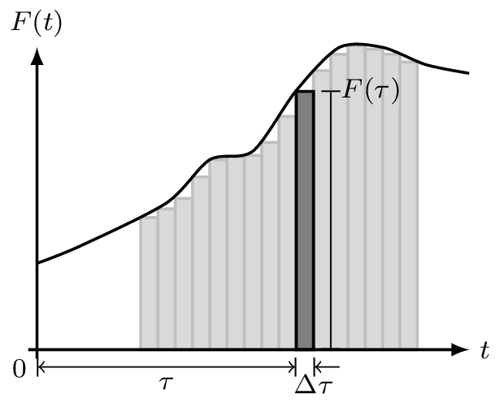{width=300}

Example of force signal being approximated by series of impulses.

:::

Response at time $t$ due to impulse $\Delta F(\tau)$ is given by,
	$$
		\Delta x(t) =F(\tau) \Delta \tau g(t-\tau)
	$$
This is just the impulse response $g(t)$ wieghted by the forcing value $F(\tau)$ and delayed by $\tau$, as illustrated in @fig-convResp. The response due to the full $F(t)$ is the sum of all individual impulses,
	$$
		x(t) \approx \sum F(\tau) \Delta \tau g(t-\tau)
	$${#eq-approxConv}

:::{#fig-convResp layout-ncol=2 layout-valign="bottom"}

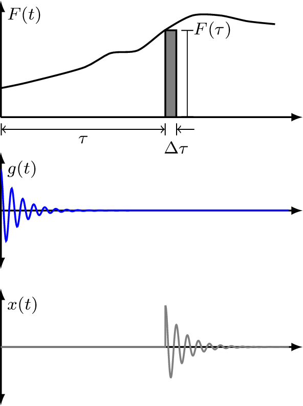{width=300}

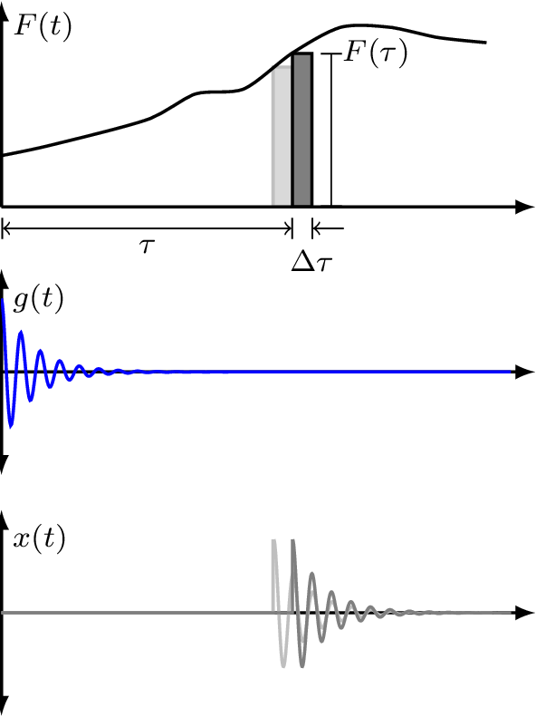{width=300}

Response as the summation of impulse response functions weighted by forcing function.

:::

Equation @eq-approxConv becomes exact at $\Delta \tau \rightarrow 0$,
	$$
		x(t) = \int_0^t F(\tau)  g(t-\tau) d\tau
	$${#eq-convResp}
This is called the *convolution integral*. It simply states that the response can be expressed as a superposition of the impulse response weighted by the arbitrary forcing function. In vibration analysis, this is also known as Duhamel's integral.

It is worthwhile noting that convolution in the time domain is simply a multiplication in the frequency domain. Taking the Fourier transform of @eq-convResp yields our harmonic forcing equation from before,
	$$
		X_0(\omega)=R(\omega) F_0(\omega)
	$$
From the above, we see that the FRF $R(\omega)$ is related to the IRF $g(t)$ by Fourier transform,
    $$
        R(\omega) = \mathcal{F}(g(t))
    $$

# Damping
Damping is of such crucial importance in structural vibration that it warants a little more discussion...

## Structural damping
In reality, damping is very very complicated... We almost always rely on simplified models. So far we have been assuming a viscous damping model, i.e. the damping force is proportional to velocity. In this case our EoM and dispacement FRF take the form,
	$$
		F_e =  kx + c\dot{x} +  m\ddot{x} \quad \quad  R(\omega) =  \frac{1}{k + i\omega c - \omega^2 m} 
	$$
The viscous damping model, though valid for viscous damping devices, is not always an appropriate representation for the intrinsic damping in structures, as will be discussed below. 

Because of damping, our mass-spring system is *non-conservative*, meaning that energy is not conserved, but dissipated with time. The energy dissipated is equal to work done by the external force. For a single cycle over period $T$ (noting ${\rm d}x = \dot{x}{\rm d}t$) the energy dissipated is given by,
	$$
		\Delta E = \int_0^{T} F_e {\rm d}x = \int_0^{2\pi/\omega} F_e\dot{x} {\rm d}t
	$$
Since the dissipated energy must be real valued, we consider the real parts of $F_e=F_0 e^{-i \omega t}$ and $\dot{x} = i\omega|R|F_0 e^{-i(\omega t-\phi)}$,
    $$
		\begin{align}
				\mbox{Real}(\dot{x}) &= |R| F_0 \omega \sin(\omega t - \phi)\\
				\mbox{Real}(F_e) &= F_0 \cos\omega t
			\end{align}
	$$
The energy dissipated then becomes,
    $$
			\begin{align}
					\Delta E = \int_0^{2\pi/\omega} F_e\dot{x} {\rm d}t &=  \int_0^{2\pi/\omega}  F_0 \cos(\omega t)|R| F_0\omega \sin(\omega t -\phi) {\rm d}t\\
					&=  F_0^2 \omega |R| \underbrace{\int_0^{2\pi/\omega}   \cos(\omega t) \sin(\omega t - \phi) {\rm d}t}_{\frac{\pi}{\omega} \sin \phi}\\
						&= F_0^2  |R| \pi \sin \phi
				\end{align}
    $$
Next, we need to determine $\sin\phi$... We know the phase angle is given by,
    $$
	    \phi = \tan^{-1}\left( \frac{\mbox{imag}}{\mbox{real}} \right) = \tan^{-1}\left( \frac{-\zeta 2 k \frac{\omega}{\omega_n} }{k\left(1 - \frac{\omega^2}{\omega_n^2}\right)} \right) =\tan^{-1}\left( \frac{-c \omega }{k - \omega^2 m} \right) 
	$$
So by using the trig identity $\sin(\tan^{-1}(x)) = x/\sqrt{1+x^2}$, after a little algebra, we obtain,
	$$
		\sin\phi = \frac{-\omega c}{\sqrt{(k-\omega^2m)^2 + (\omega c)^2}} = -\omega c |R|
	$$
The energy dissipated per cycle now becomes, 
	$$
		\Delta E = F_0^2  |R| \pi \sin \phi = \underbrace{|R|^2  F_0^2}_{|X_0|^2} \pi \omega c 
	$${#eq-energyDiss}

We see from @eq-energyDiss that for a viscous damper, the energy dissipated per cycle is propertional to: damping coefficient $c$, frequency $\omega$ and amplitude squared $|X_0|^2$

In real systems, *even without designated damping devices*, energy is dissipated over time. For example, in real springs (i.e. coil springs)  energy is dissipated as a result of internal friction within the material. This phenomenon occurs in all real structures. Experiments on wide variety of materials indicate that the energy loss per cycle due to internal friction is roughly proportional to amplitude squared, 
	$$
			\Delta E = \alpha |X_0|^2
	$$
where $\alpha$ is a constant *independent of frequency*. We call the above *structural damping*. It can be attributed to hysteresis phenomenon associated with cyclic stresses in elastic materials.

A system with structural damping can be treated as having viscous damping with an equivalent, *frequency dependent*, damping coefficient,
    $$
		\begin{align}
			c_{eq} = \frac{\alpha}{\pi\omega} \quad \rightarrow\quad  \Delta E &= c_{eq}\pi\omega |X_0|^2 \\
			&=\alpha|X_0|^2
		\end{align}
    $$
Using this new equivalent damping factor our EoM becomes, 
    $$
        \begin{align}
            F_e =  kx +  \frac{\alpha}{\pi\omega}  \dot{x} +  m\ddot{x} \quad \rightarrow \quad F_0 &=  kX_0 +  \frac{i\omega \alpha}{\pi\omega} X_0 +m\ddot{X}_0\\
            &=  {\left(k +  \frac{i\omega \alpha}{\pi\omega} \right)} X_0 +m\ddot{X}_0
        \end{align}
    $$
From the above it is convenient to define a *complex stiffness* $k(1+i\gamma)$, where $\gamma = \alpha/\pi k$ is termed the *structural loss factor*.

In the presence of structural damping, the system's harmonic response becomes, 
	$$
		x(t) = \mbox{Real}\left(X_0 e^{i\omega t} \right) = |X_0| \cos(\omega t-\angle X_0)  \quad \quad X_0 = \overbrace{\frac{1}{k(1+i\gamma)-\omega^2m}}^{R(\omega)}F_0
	$$

Shown in @fig-structuralDampMag are some system responses for different levels of viscous and structural damping. We see that with structural damping the peak amplitude doesn't shift with increasing levels of damping and the response is no longer stiffness controlled at low frequency. 

Here are some loss factors for typical materials:

- Glass $\sim 1\times10^{-4}$
- Steel $\sim 1\times10^{-3}$
- Perspex $\sim 0.1$
- Rubber $\sim >0.1$

:::{#fig-structuralDampMag}

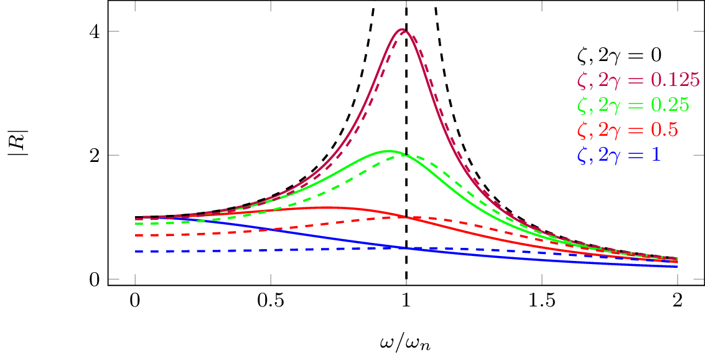{width=600}

Response of mass-spring system with different values of viscous and structural damping.

:::

**Important:** *structural damping is only valid for harmonic excitation* - we assumed $F_0e^{i\omega t}$ in the foregoing analysis. It can't use this for transient analysis! It turns out that structural damping can give a *non-causal* transient responses... 

## Estimating damping

The amount of damping in a system is often unknown, though it can be estimated from measurements in a number of ways. Below we discus two simple approaches based on unforced and forced system responses. 

### Log-decrement method
Assuming a viscous damping force, we know that the system response decays exponentially according to,
	$$
		x(t) = A\cos(\omega_d t - \phi) e^{-\zeta\omega_n t}
	$$
Let us consider the amplitude ratio after a period $T$,
	$$
		\frac{x_1}{x_2} = \frac{A\cos(\omega_d t_1 - \phi) e^{-\zeta\omega_n t_1} }{A\cos(\omega_d t_2 - \phi) e^{-\zeta\omega_n t_2} }
	$$
Noting that the $\cos(\quad)$ term does not change after period $T$, the amplitude ratio reduces to,
	$$
		\frac{x_1}{x_2} = \frac{e^{-\zeta\omega_n t_1} }{e^{-\zeta\omega_n (t_1+T)} } = e^{\zeta\omega_n T}
	$$
Taking the natural log $\ln$ of both sides yields, 
    $$
        \ln\left(\frac{x_1}{x_2}\right) = \zeta\omega_n T
    $$
where we define the so-called *log-decrement* as $\delta = \ln(x_1/x_2)$. This is something that we can easily obtain from a measurement of the system's decay response. 

:::{#fig-logdecrement}

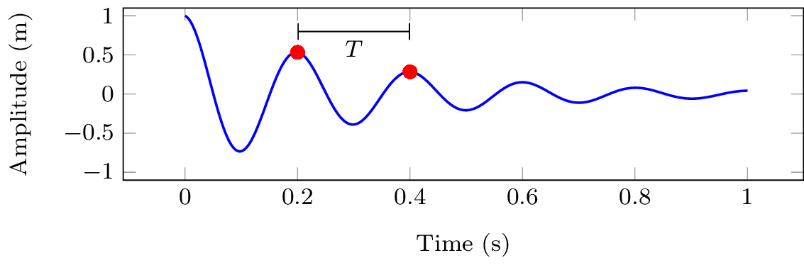{width=600}

Transient response of a viscously damped mass-spring system. 

:::

Substiuting for the decay period $T=2\pi/\omega_d$ and also the natural frequencies $\omega_n$ and $\omega_d$, the log-decrement becomes,
	$$
		\delta = \ln\left(\frac{x_1}{x_2}\right) = \zeta\omega_n T = \zeta\omega_n \frac{2\pi }{\omega_d} = \frac{\zeta 2\pi}{\sqrt{1-\zeta^2}}
	$${#eq-logdecrement0}
@eq-logdecrement0 can be rearranged and used to solve for damping factor $\zeta$,
	$$
		\zeta = \frac{\delta}{\sqrt{(2\pi)^2 + \delta^2}}
	$$
This estimate of $\zeta$ makes use of two sequential peaks in the decay response. This is fine, but can be quite sensitive to expeimrental uncertainty. A better estimate can be made by utilising multiple peaks as described below. 

Note that the displacement ratio for the $1$st and $n$th peaks can be written as,
    $$
        \begin{align}
            \frac{x_1}{x_n} = \frac{x_1}{x_2}\, \frac{x_2}{x_3}  \, \frac{x_3}{x_4} \cdots \frac{x_{n-1}}{x_n} = (e^{\zeta\omega_nT})^n= e^{n\zeta\omega_nT}
        \end{align}
    $$
An improved (or at least more robust) estimate of the log-decrement (and so also $\zeta$) can then be obtained using,
	$$
		\delta_n = \frac{1}{n-1} \ln\left(\frac{x_1}{x_n}\right)
	$$

### Resonance bandwidth

Considering now the forced response of a viscous damped mass-spring system as in @fig-receptanceLin. We note that for light damping, the maximum of the FRF magnitude occurs in the vicinity of t $\omega/\omega_n = 1$. 

