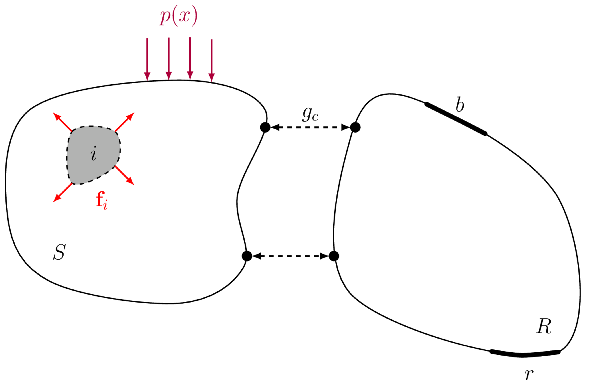
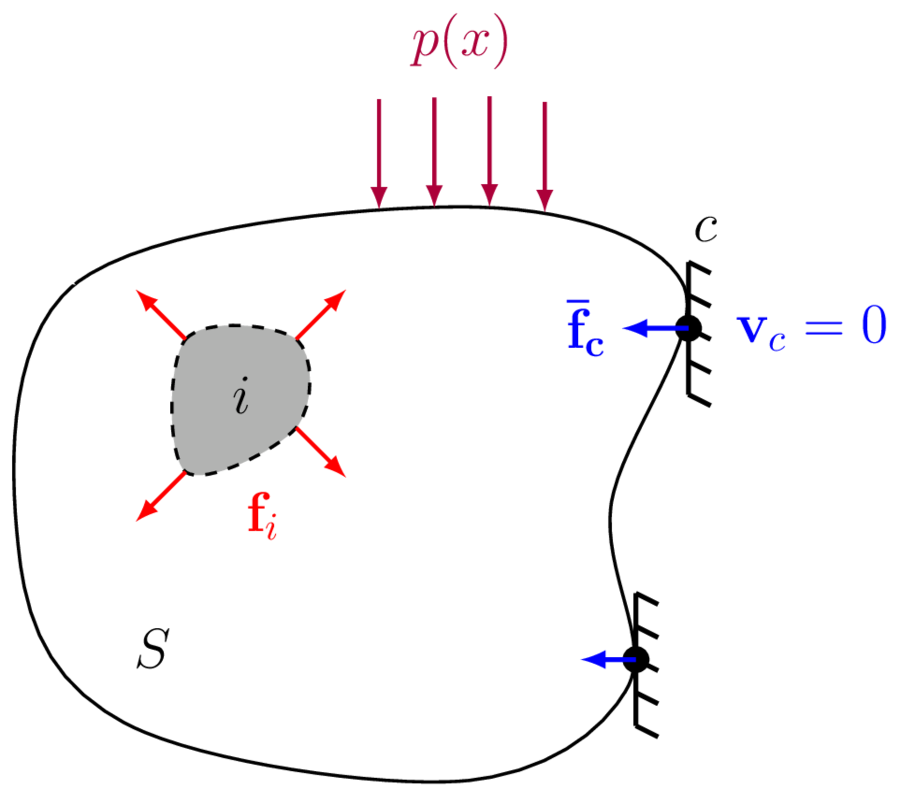
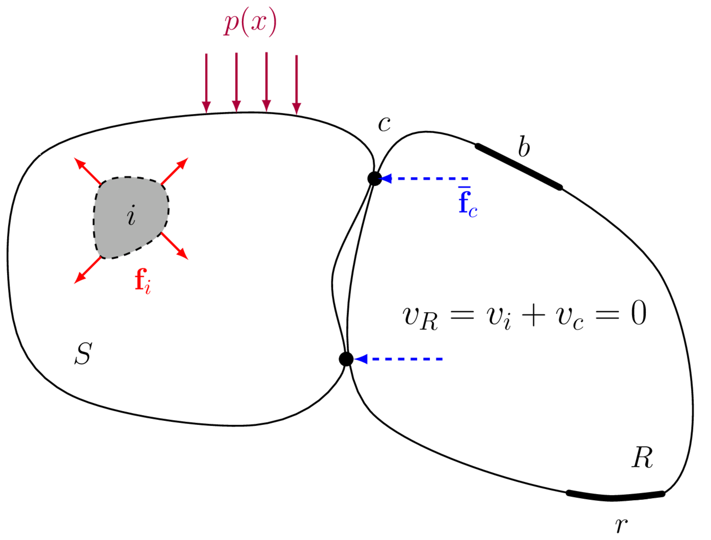
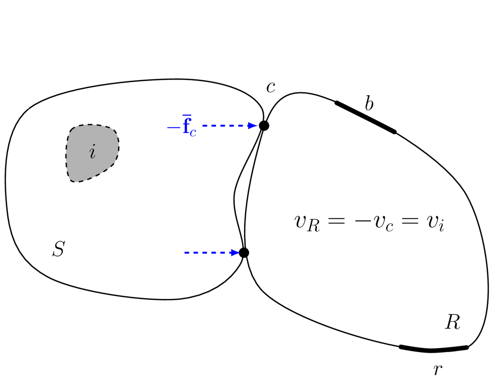

On this page we introduce the *blocked force*; the most widely accepted means of characterisng the activity of vibration sources for use within a VAVP.

## Problem description
A complex structure (say a vehcile, building, ship or air-craft) whose wave propagation characteristics are described by the function $G(\quad)$ is excited by a set of discrete forces $\mathbf{f}_i$ and distributed pressures $p(x)$ which arise due to internal operating mechanisms and external loading (e.g. turbulence), respectively. These forces induce a vibration which propagates through the structure; where upon reaching the position $b$ is observed as a structural velocity, say in the $x$, $y$ and $z$ directions, $\mathbf{v}_r = \left[\begin{array}{ccc} v_{r,x} & v_{r,y} & v_{r,z}\end{array}\right]^{\mathrm T}$, or perhaps an acoustic response $p_r$.

{width=500 #fig-intForce}

In equation form we have that,
$$
	\mathbf{v}_r = G(\mathbf{f}_i, p(x)).
$$

If we assume linearity and time invariance, this problem can be expressed conveniently in the frequency domain in terms of the assembly's frequency response functions (FRFs),
$$
	 \mathbf{v}_r(\omega) = \overbrace{\mathbf{Y}_{Cri}(\omega)\mathbf{f}_i(\omega)}^{\mbox{Discrete forcing}} + \overbrace{\int_{\Omega S} Y_C(r|x_0) p(x_0) {\mathrm d} S}^{\mbox{ Continuous forcing}}
$$
where $\mathbf{Y}_{Cri}$ is a matrix of mobilities relating the *discrete* forces $\mathbf{f}_i$ to the responses in $\mathbf{v}_r$, $Y_C(r|x_0)$ is a continuous mobility function relating the force at position $x_0$ to the response $\mathbf{v}_r$ at position $r$, $\omega$ is the radian frequency (omitted hereafter for brevity). The capitalised sub-script $C$ is used to denote that the mobility belongs to the \textit{coupled} assembly (i.e. with the vibration source attached to the receiver). 

Whilst the above representation of the problem is perfectly admissible, it has some practical issues if the aim is to predict the response $\mathbf{v}_r$. First, the internal forces and pressures $\mathbf{f}_i$ and $p(x)$ are generally unknown, or at least very difficult to determine. Second, the location of said internal forces might not be obvious, and so the corresponding FRFs are also challenging to define. A solution to this problem is to find an alternative description of the source activity that:

1. is able to physically represent the acting forces and pressures (i.e. induce the same vibration in the receiver structure),
2. whose positions are known and,
3. whose magnitudes can be determined practically.

By combining an appropriate description of source activity with the passive transfer characteristics of the structure, the prediction of structure-borne sound, due to arbitrarily complex mechanisms, is made possible. 

To tackle the above, and remain inkeeping with our VAVP framework, it is natural to consider the source of vibration as a *component*, as opposed to the set of internal forces $\mathbf{f}_i$ and external pressures $p(x)$. 
We can therefore represent the problem generally as in @fig-intForce, where the vibration source component $S$ is attached to a receiver structure $R$ at the interface connection points labeled $c$. These connections points are described by a number of *degrees of freedom* (DoFs), which represent the dynamics/motions in different directions. For *point-like* connections these DoFs are the translations in $x$, $y$ and $z$ and the rotation about each of these axis, $\alpha$, $\beta$ and $\gamma$.

Assuming the source and receiver components are coupled at a series of (approx.) discrete (point-like) connections, it is possible to simplify the problem by considering the forces that are occurring at the interface $c$. Being both discrete and accessible, these interface forces provide an alternative means of representing the complex internal forces within the source. In a sense, the discrete interface between the source and receiver acts as a `\textit{bottle neck}'. Whilst the source-side excitation may be incredibly complex and applied over an extended area, as the induced receiver vibration is transmitted through the interface, only a reduced set of motions are possible. Assuming that each connection behaves in a point-like manner (i.e. is locally rigid), only 6 DoFs (three translations and three rotations) are permitted. Hence, for $N$ connection points, the response within the receiver can be represented entirely by $6N$ interface forces.

### Source characterisation
When characterising a vibration source, particularly for the purpose of building a VAVP, it is essential that we obtain an *independent*' characterisation. That is, a characterisation of the source that does not depend on the dynamics of the receiver. Doing so would allow for the same source characterisation to be used to predict the response of different receiver structures. There are two fundamental source descriptions that satisfy the required independence: the free velocity, and the blocked force. Whilst both the free velocity and the blocked force provide an independent characterisation, the free velocity is rarely used in practice. Indeed, it is the blocked force that has gained popularity in the last few years, so much so that an international standard has been devised for its (in direct) measurement.

## Contact force

Whilst it is the blocked force that we are principally interested in (being an independent and transferable quantity), we will briefly introduce the so-called *contact force* as it is the more physically interpretable force and it will help provide some context to why the blocked is so important. 

The contact force $\mathbf{g}_c$ describes the *physical forces* occurring at the interface between two connected components, e.g. a vibration source and receiver, when one or both are excited, as illustrated in @fig-contForce.

{width=500 #fig-contForce}

Being a *physical force*, the contact force can be measured directly, e.g. by inserting force transducers between the source and receiver components. It is not, however, an independent property of the source. That is, if the receiver component were modified or replaced, the contact force would change accordingly. If the contact force depends on the assembly in which the source is installed, it can not be transferred from a test bench to a simulation model. It is therefore of limited use in the context of Vibro-Acoustic Virtual Prototyping.

## Blocked force
The blocked force is used almost universly when building VAVPs. It is an independent source quantity that can be obtained practically through an in direct method (detailed below). 

### Definition
The blocked force of a vibration source is the force required to rigidly constrain its interface degrees of freedom (DoFs) such that their velocity (also displacement and acceleration) is zero. Said another way, the blocked force is the reaction force presented by an infinitely rigid receiver structure when a connected vibration source operates. This notion is illustrated in @fig-blkF.

{width=400 #fig-blkF}

Mathematically, we can define the blocked force as,
$$
	\mathbf{\bar{f}}_{c} = \mathbf{{g}}_{c}\Big|_{\mathbf{v}_{c}=\mathbf{0}}
$$
where $\mathbf{g}_{c}$ is the contact force at the interface $c$ and $\mathbf{v}_{c}=\mathbf{0}$ is the rigid constraint. 
It is clear that by blocking the interface DoFs, the blocked force provides an independent source description. The influence of any receiver structure has been removed by constraining the interface DoFs. It is worth noting that the blocked force is a somewhat hypothetical force, it is defined by means of an *infinitely* rigid constraint which in practice can not be achieved.

### In situ measurement of blocked force

To characterise the blocked force of a vibration source *directly* it is necessary to attach the source to an (approx.) infinitely rigid test bench, for example a large blocking mass, with force transducers placed between the source contacts and the test bench. Clearly, this `infinitely rigid' requirement can only be satisfied approximately over a particular frequency range; even the most rigid test bench will eventually enter a modal/flexible regime. Achieving a sufficiently rigid condition can be further complicated by the mounting requirements of the source. Another notable challenge involves the determination of rotational and in-plane blocked forces. Hence, the direct measurement of the blocked force is fraught with difficulties and generally not practical. Fortunately, an in direct measurement approach is available. 

The direct method described above is focused on measuring force directly, by means of installed force transducers. The indirect approach involves the measurement of the assemblies operational response (e.g. velocity), from which we infer the unknown blocked force. 

The key equation on which the indirect approach is based is given by,
$$	
\mathbf{v}_{b} = (-)\mathbf{Y}_{Cbc}\mathbf{\bar{f}}_{c}
$${#eq-EqBlkF}
where $\mathbf{v}_{b}\in\mathbb{C}^{N_b}$ is the operational velocity (to be measured) of the structure at a set of 'indicator' positions $b$, $\mathbf{Y}_{Cbc}\in\mathbb{C}^{N_b\times N_c}$ is the transfer mobility of the assembled structure (also to be measured), and $\mathbf{\bar{f}}_{c}\in\mathbb{C}^{N_c}$ is the unknown blocked force. @eq-EqBlkF provides a relation between the blocked force of a vibration source and the velocity of the assembly in which it is installed. Theoretically, @eq-EqBlkF includes a negative sign, for reasons that will be explained shortly. However, this negative sign has no bearing on the in situ method itself as its simply a $180^\circ$ phase shift. For this reason, the negative sign is often let out of the equation, as we done hereafter.

Note that the indicator DoFs $b$ can be located at the interface $c$, in which case @eq-EqBlkF becomes, 
$$
	\mathbf{v}_{c} = \mathbf{Y}_{Ccc}\mathbf{\bar{f}}_{c}
$${#eq-EqBlkF1}
where $\mathbf{v}_{c}\in\mathbb{C}^{N_b}$ and $\mathbf{Y}_{Ccc}\in\mathbb{C}^{N_c\times N_c}$ are the operational velocity and point FRF matrix of the interface $c$. 

To determine the blocked force we have to solve the 'inverse problem'. Pre-multiplication of both sides of @eq-EqBlkF and @eq-EqBlkF1 by the inverse mobility matrix yields,
$$
	\mathbf{\bar{f}}_{c} = \mathbf{Y}_{Cbc}^{-1}\mathbf{v}_{b} \quad \quad  \mbox{and} \quad \quad 	\mathbf{\bar{f}}_{c} = \mathbf{Y}_{Ccc}^{-1}\mathbf{v}_{c}
$${#eq-EqBlkF2}
the latter of which is generally preferred as measurements made away from the interface $c$ are more easily corrupted, e.g. by external disturbances, etc. Alternatively, @eq-EqBlkF2 can be combined and written in a more general form, 
$$
    \mathbf{\bar{f}}_{c} = \left[\begin{array}{c}
        \mathbf{Y}_{Ccc}\\
        \mathbf{Y}_{Cbc}
    \end{array}\right]^+
     \left(\begin{array}{c}
        \mathbf{v}_{c}\\
        \mathbf{v}_{b}
    \end{array}\right) = \mathbf{Y}_C^+\mathbf{v}
$${#eq-EqBlkF4}
where $\square^+$ denotes the matrix pseduo-inverse. 

::: {.callout-note}
In the above set of equations, we have implicitly assumed that the interface DoFs $c$ have been transformed from the 'measurement coordinates' to those of the 'interface model', as described in [Interfaces](../interfaces/interfaces.qmd). In practice this can be done one of two ways. Taking the combined ($c$ and $b$) indicator equation as our starting point,
$$
	\left(\begin{array}{c}
        \mathbf{v}_{c}\\
        \mathbf{v}_{b}
    \end{array}\right) = \left[\begin{array}{c}
        \mathbf{Y}_{Ccc}\\
        \mathbf{Y}_{Cbc}
    \end{array}\right]\mathbf{\bar{f}}_{c} 
$$
we note that both the FRF and operational responses have been projected onto the interface model. This is achieved by the following, 
$$
	\left(\begin{array}{c}
        \mathbf{v}_{c}\\
        \mathbf{v}_{b}
    \end{array}\right) = \left(\left[\begin{array}{c}
        \mathbf{T}_v &\mathbf{0}\\
       \mathbf{0} &\mathbf{I}
    \end{array}\right]  \left[\begin{array}{c}
        \mathbf{\hat{Y}}_{Ccc}\\
        \mathbf{\hat{Y}}_{Cbc}
    \end{array}\right] \mathbf{T}_f^{\rm T}\right)\mathbf{\bar{f}}_{c} 
    % \qquad \qquad \longrightarrow \qquad \qquad \mathbf{\bar{f}}_{c} =  \left(\left[\begin{array}{c}
    %     \mathbf{T}_v &\mathbf{0}\\
    %    \mathbf{0} &\mathbf{I}
    % \end{array}\right]  \left[\begin{array}{c}
    %     \mathbf{\hat{Y}}_{Ccc}\\
    %     \mathbf{\hat{Y}}_{Cbc}
    % \end{array}\right] \mathbf{T}_f^{\rm T}\right)^+ \left(\begin{array}{c}
    %     \mathbf{v}_{c}\\
    %     \mathbf{v}_{b}
    % \end{array}\right)
$${#eq-interfaceTrans1}
where the $\hat{\square}$ accent is used to denote a measured quantity that has yet to be transformed (i.e. it remains in the 'measurement' space). The pre- and post-multiplication by $\mathbf{T}_v$ and $\mathbf{T}_f^{\rm T}$ project the measured responses and applied forces of the interface FRF onto the interface model. Note that in @eq-interfaceTrans1 the operational responses remain those of the interface model. Writing them in terms of the 'measurement' responses we have, 
$$
	\left[\begin{array}{c}
        \mathbf{T}_v &\mathbf{0}\\
       \mathbf{0} &\mathbf{I}
    \end{array}\right] \left(\begin{array}{c}
        \mathbf{\hat{v}}_{c}\\
        \mathbf{\hat{v}}_{b}
    \end{array}\right) = \left(\left[\begin{array}{c}
        \mathbf{T}_v &\mathbf{0}\\
       \mathbf{0} &\mathbf{I}
    \end{array}\right]  \left[\begin{array}{c}
        \mathbf{\hat{Y}}_{Ccc}\\
        \mathbf{\hat{Y}}_{Cbc}
    \end{array}\right] \mathbf{T}_f^{\rm T}\right)\mathbf{\bar{f}}_{c}
$${#eq-interfaceTrans2}
where pre-multioplication again projects the measured responses onto the interface model. In general, when solving for the blocked force, if the FRF responses are transformed onto the interface model (i.e. pre-multiplied by $\mathbf{T}_v$), then so to must the operational responses. Solving @eq-interfaceTrans2, we have, 
$$
	\mathbf{\bar{f}}_{c}= \left(\left[\begin{array}{c}
        \mathbf{T}_v &\mathbf{0}\\
       \mathbf{0} &\mathbf{I}
    \end{array}\right]  \left[\begin{array}{c}
        \mathbf{\hat{Y}}_{Ccc}\\
        \mathbf{\hat{Y}}_{Cbc}
    \end{array}\right] \mathbf{T}_f^{\rm T}\right)^+ \left[\begin{array}{c}
        \mathbf{T}_v &\mathbf{0}\\
       \mathbf{0} &\mathbf{I}
    \end{array}\right] \left(\begin{array}{c}
        \mathbf{\hat{v}}_{c}\\
        \mathbf{\hat{v}}_{b}
    \end{array}\right) 
$${#eq-interfaceTrans3}
Now, @eq-interfaceTrans3 is a perfectly admissible equation for the blocked force. It uses transformed interface responses, and returns a set of transformed blocked forces (i.e. projected onto the interface model). Notice however, the response transformation appears twice, once within the matrix pseudo inverse, and once outside. In a sense, this dual appearance has the effect of filtering out any flexible interface behavior from the interface responses before they are used to infer the blocked force, i.e. the blocked force is determined from the interface's 'rigid' dynamics only. 

An alternative approach is to allow the use of 'flexible' interface dynamics when obtaining the blocked force (note that the blocked forces themselves do not include these flexible dynamics, as the transformation matrix $\mathbf{T}_f^{\rm T}$ describes a point-like (rigid) interface model). This is achieved by simply omitting the response transformation all together, 
$$
	\mathbf{\bar{f}}_{c} = \left(\left[\begin{array}{c}
        \mathbf{\hat{Y}}_{Ccc}\\
        \mathbf{\hat{Y}}_{Cbc}
    \end{array}\right] \mathbf{T}_f^{\rm T}\right)^+ \left(\begin{array}{c}
        \mathbf{\hat{v}}_{c}\\
        \mathbf{\hat{v}}_{b}
    \end{array}\right) 
$${#eq-interfaceTrans4}
In this form, we use the directly measured responses (as opposed to the transformed responses) which will implicitly contain flexible interface dynamics provided $7+$ DoFs are used. 

In practice, @eq-interfaceTrans4 is much easier to implement as it requires only a single transformation matirx; there is no need to record sensor locations and orientations. It also tends to perform better in terms of validation accuracy. This is because it effectively makes use of all of the 'information' available at the interface.

As a final comment, in the above we assumed that a point-like interface representation was being used. Higher order 'flexible' interface representations can also be used with a similar interpretation to the above.
:::

To solve @eq-EqBlkF4, it is necessary that number of measured velocities ($M$) is equal to, or greater than, the number of blocked forces that are being determined. That is, to determine $N$ blocked forces, $M\geq N$ velocities should be recorded. The dimensions of the mobility matrix $\mathbf{Y}_{C}$ should be consistent with those of the blocked force and velocity vectors, it should be $M\times N$. The number of recorded velocities relative to the number of blocked forces will be discussed further in a later section.

{width=500 #fig-SRblockedForce}

Importantly, @eq-EqBlkF4 provides a means of determining the blocked force *without requiring an infinitely rigid test bench*. In fact, no restrictions are placed on the assembly $C$ in which the source is installed. As such, @eq-EqBlkF4 enables an *in situ* characterisation of the blocked force; the source need not be removed from its intended installation. It thus provides a practical source characterisation method. 

The experimental implementation of the in situ approach follows a two part measurement procedure:

1. The source is turned off and the mobility matrix $\mathbf{Y}_{Cbc}$ is measured between the interface and indicator DoFs. This is typically done by applying a known force to each interface DoF (using an instrumented force hammer or a roving shaker) whilst simultaneously measuring the response at all indicator DoFs (typically using accelerometers). Note that if the interface DoFs are not accessible for excitation the principle of reciprocity can be used to interchange the excitation and response positions, $\mathbf{Y}_{Cbc} = \mathbf{Y}_{Ccb}^{\rm T}$.
2. The source is turned on and the operational velocity $\mathbf{v}_{b}$ is measured at the indicator DoFs. This is typically done using the same set of response sensors as used in part 1. 
 

Before conducting part two of the above procedure, it is generally good practice to perform a number of data checks to a) inspect the quality of the measured mobility matrix, and b) ensure sufficient number of DoFs have been accounted for (i.e. the interface is complete).

### A nice simple proof
Here we present a simple 'equation free' proof of the in situ blocked force relation in @eq-EqBlkF1 by considering the principle of linear superposition as illustrated in @fig-blkFproof. More mathematical proofs are available in the literature.

::: {#fig-blkFproof layout-ncol=2}

{width=80% #fig-blkFproof_1}

{width=80% #fig-blkFproof_2}

In situ blocked force proof based on principle of superposition.
:::

Consider the vibration source to be active. The internal and boundary forces ($\mathbf{f}_i$ and $p(x)$) generate a response field  $v_i$ within the reciever domain $R$. An external (blocking) force is then applied across the interface DoFs $c$ that rigidly constrains its motion. With the interface DoFs now fixed, no vibration can be transmitted into the recevier, and so its response is 0 at all positions. An alterntive interpretation is that the external blocking force generates a secondary wave field $v_c$ in the receiver that is equal in magnitude, but opposite in phase to the original wave field such that their sum is zero ($v_R = v_i + v_c = 0$).

If these forces are applied at the interface so as to nullify the interface response, and the machine is then switched off, as in @fig-blkFproof_2, we are left with a response field that must be simply the reverse of the original field $v_c = -v_i$. Simply reversing the sign we conclude that *the response field within the receiver can be reproduced identically by applying the negative blocking forces to the interface*, or in equation form,
$$	
\mathbf{v}_{r} = (-)\mathbf{Y}_{Crc}\mathbf{\bar{f}}_{c}
$$
for any DoFs $r$ within the receiver. 

### Validation
Before the blocked force can be used within a VAVP, it is essential that some sort of validation is performed to give us confidence that a *correct* identification has been acheived. This can be done in various ways, though the most common is by what is termed an *on-board validation*.

#### On-board validation
This validation is pretty simple. During the characterisation of the blocked force, one or more of the remote $b$ DoFs are ommitted from the inverse calculation (i.e. @eq-EqBlkF4). After the blocked force has been obtained, a forward response prediction is made for the as yet unused $b$ DoFs, denoted $\tilde{b}$ here,
$$	
\mathbf{v}_{\tilde{b}} = \mathbf{Y}_{C\tilde{b}c}\mathbf{\bar{f}}_{c}
$${#eq-EqBlkF_obVal}
where it should be made clear that both $\mathbf{v}_{\tilde{b}}$ and $\mathbf{Y}_{C\tilde{b}c}$ are measured during the initial measurement campaign (i.e. simultaneous to those used in the characterisation). An on-board validation then amounts to a comparision of the predicted and directly measured responses $\mathbf{v}_{\tilde{b}}$. This comparision can be done in anyway the user prefers, e.g. by a mean squares error or a correlation-based metric (e.g. MAC), though is most commonly done simply by visual inspection, i.e. plotting measured and predicted responses together.

#### Modified reciever validation
The on-board validation procedure described above, though convenient and an important step in critiquing the blocked force, is not the most robust form of validation. Indeed, one could obtain an excellent on-board validation, but get terrible agreement once the blocked force is transfered to a VAVP. In other words, since the charactrisation and validation assemblies share the same dynamics, some potential errors might not come to light. For this reason, a more robust validation is to predict into a *different* assembly.

The most convenient way of doing this is to introduce a structural modification onto the recevier structure used for the initial characterisation, thus altering its dynamics and forming a *new assembly*, $C\rightarrow \tilde{C}$. A validation is then obtained by 1) running the source on this modified recevier, 2) remeasuring its coupled FRF $\mathbf{Y}_{\tilde{C}bc}$ (note that all $b$ DoFs can now be used since we are effectivly using a new assembly), 3) recording the operational response $v_b$, 4) and using the blocked force from assembly $C$ to predict the response in $\tilde{C}$,
$$	
\mathbf{v}_{b} = \mathbf{Y}_{\tilde{C}bc}\mathbf{\bar{f}}_{c}
$$
Again, comparison of predicted and measured responses gives an idea of the predictive accuracy of the aquired blocked forces. Of course, additional validation steps are recommended when building a full VAVP (including transferability and substructuring vsalidations), though these are not addressed here. 

## What next?
We now have everything we need to build a VAVP: methods for characterising the passive properties of vibration sources, receiver structures and coupling elements; a means of coupling these components together to build an assembly; and a method of characterising the active properties of vibration sources by their blocked forces, thus allowing us to 'turn on' our VAVP. All thats left to do is put it all together, as detailed in the [Summary](../conclusions/summary.qmd).

Though not an essential step when building a VAVP, it is good practice whenever building any type of model to develop some understanding of the errors involved. It should be obvious that a VAVP prediction with an accompanying confidence bound is far more valuable than one without... Thus, the final topic we will discuss is that of [Uncertainties](../uncertainty/uncertainty.qmd).