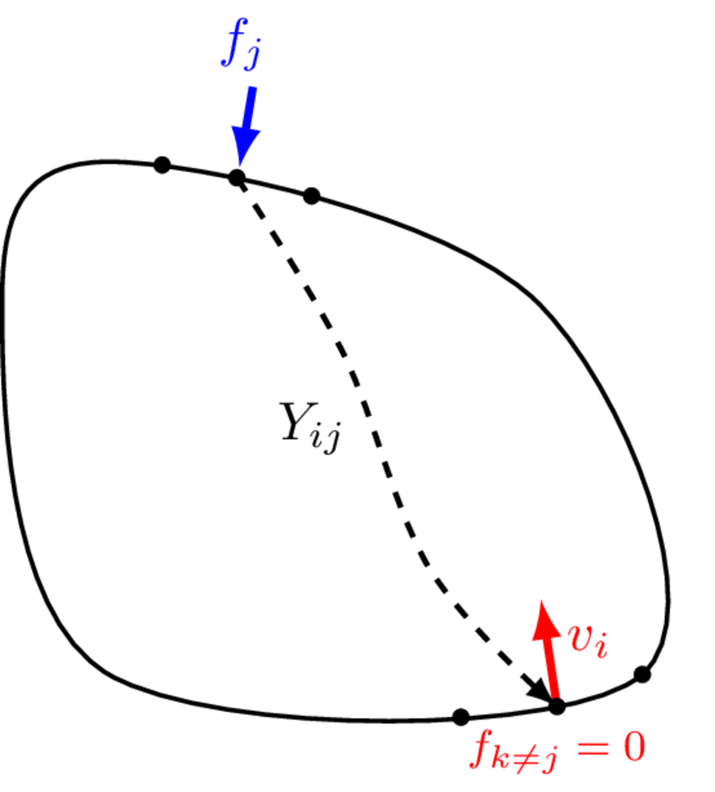
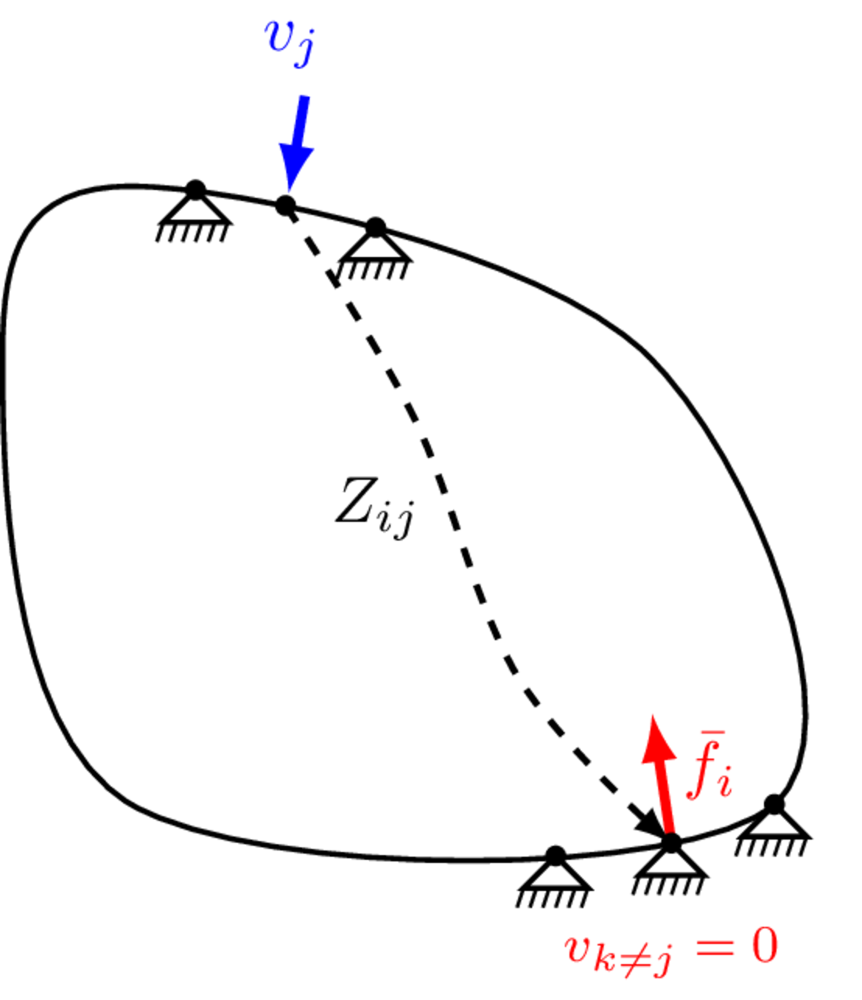
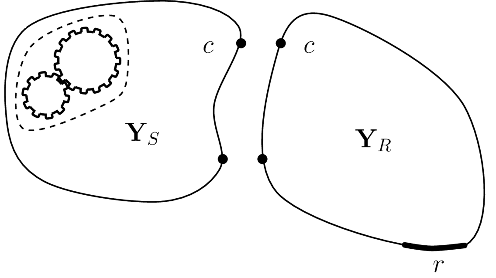
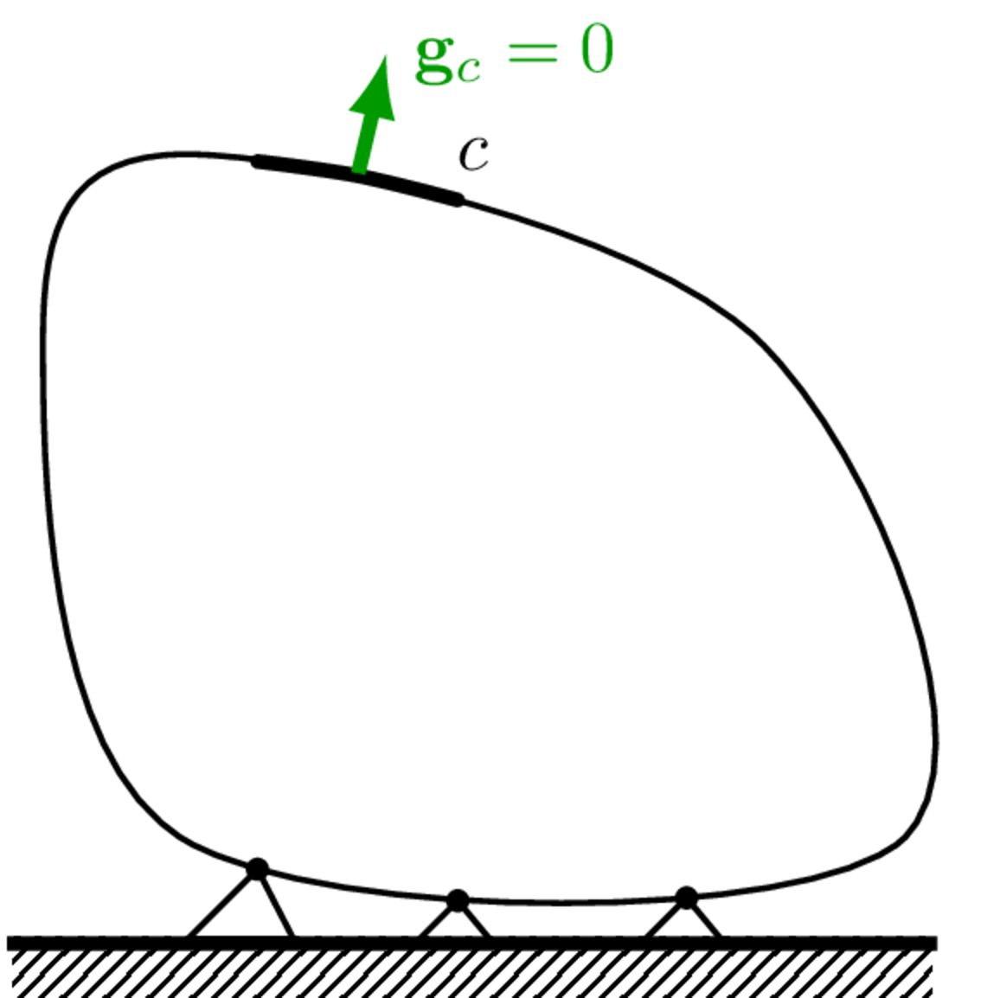
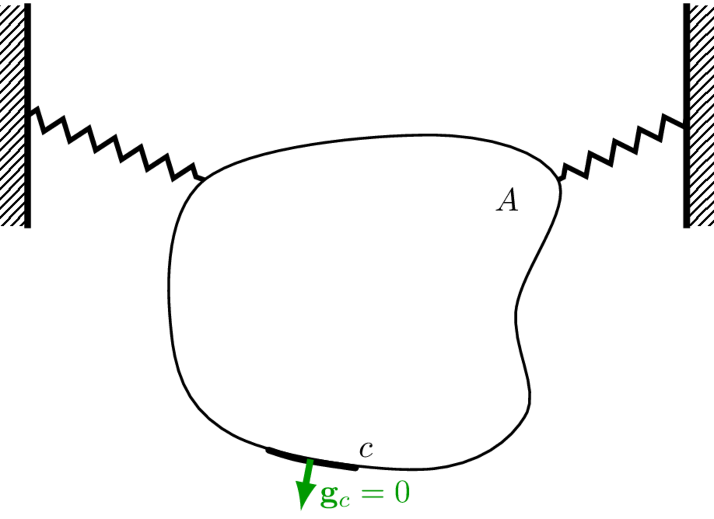

On this page we describe in greater detail the passive characterisation of components, specifically source and recevier-like components. The passive characterisation of *coupling elements*, such as vibration isolators, is detailed later in [Vibration isolators.](../isolators/isolators.qmd)

## Component representations
As discussed on the previous page, centra to the development of a VAVP is the *independent* characteristion of a component's passive properties. Independence is the key word here, it is what enables components to be assembled, and interchanged within the VAVP framework. 

The independent properties of a passive component can be described in various 'domains', each providing a different perspective on essentially the same dynamic behaviour. The Physical, State-space, Modal, Time, and Frequency domains are the most commonly encountered in vibro-acoustics and will be briefly reviewed below before we adopt the Frequency domain as the default for our VAVP. 

In the *physical domain*, a component's inertial and elastic properties are discretised ($N$ DoFs, for example by the Finite Element Method) and represented by the mass and stiffness matrices, $\mathbf{M}\in \mathbb{R}^{N\times N}$ and $\mathbf{K}\in \mathbb{R}^{N\times N}$, respectively. Together with an appropriate matrix representation of its damping, $\mathbf{C}\in \mathbb{R}^{N\times N}$, these matrices characterise the passive properties of a component. They can be used to formulate a second order equation of motion that relates the external force $\mathbf{f}(t)$ applied to the component, to its resulting kinematics,
$$
		\mathbf{M}\mathbf{\ddot{x}}(t)+\mathbf{C}\mathbf{\dot{x}}(t)+\mathbf{K}\mathbf{x}(t) = \mathbf{f}(t)
$${#eq-physicalDomain}
where $\mathbf{x}(t)$, $\mathbf{\dot{x}}(t)$ and $\mathbf{\ddot{x}}(t)$ are vectors of displacement, velocity and acceleration, respectively at a each of the $n$ discretised degrees of freedom.

 In the *state-space domain*, a component is represented by a set of first order differential equations that relate the state vector $\mathbf{y}(t) = [\mathbf{x}^{\rm T}(t) \quad \mathbf{\dot{x}}^{\rm T}(t)]^{\rm T}$ to its temporal derivative, $\mathbf{\dot{y}}(t) = [\mathbf{\dot{x}}^{\rm T}(t) \quad \mathbf{\ddot{x}}^{\rm T}(t)]^{\rm T}$. With reference to @eq-physicalDomain, we have,
$$
     \mathbf{\dot{y}}(t) = \left[\begin{array}{c}\mathbf{\dot{x}}(t) \\ \mathbf{\ddot{x}}(t)\end{array}\right] = \left[\begin{array}{cc} \mathbf{0} & \mathbf{I} \\ -\mathbf{M}^{-1}\mathbf{K} & -\mathbf{M}^{-1}\mathbf{C}
     \end{array} \right] \left[\begin{array}{c}\mathbf{{x}}(t) \\ \mathbf{\dot{x}}(t)\end{array}\right] + \left[\begin{array}{c} \mathbf{0} \\ \mathbf{M}^{-1} \end{array} \right]\mathbf{f}(t)
$$
 or equivalently,
**
	\mathbf{\dot{y}}(t) = \mathbf{A}\mathbf{y}(t)+\mathbf{B}\mathbf{f}(t)
**
where $\mathbf{A}$ is the so-called state matrix, and $\mathbf{B}$ is the input matrix. Together, $\mathbf{A}$ and $\mathbf{B}$ characterise the passive properties of a component in state-space. 

In the *modal domain* a component is represented by a set of mode shapes $\boldsymbol{\Phi} = [\mathbf{\phi}_1 \quad \mathbf{\phi}_2 \quad \cdots \quad \mathbf{\phi}_N]$ and natural frequencies $\boldsymbol{\Lambda}=\mbox{diag}[\omega^2_1 \quad \omega^2_2 \quad \cdots \quad \omega^2_N]$ which individually satisfy the homogenous undamped equation of motion,
**
	\mathbf{K}\mathbf{x}-\omega^2\mathbf{M}\mathbf{{x}} = \mathbf{0}\quad \rightarrow \quad 
	\left[\mathbf{K}-\omega^2_i\mathbf{M}\right]\mathbf{\phi}_i = 0.
**
Together $\boldsymbol{\Phi}$ and $\boldsymbol{\Lambda}$, with an appropriate representation of damping (e.g. modal loss factor), characterise the passive properties of the component. 

In the *time domain* a component's kinematic response $\mathbf{x}(t)$, $\mathbf{\dot{x}}(t)$ or $\mathbf{\ddot{x}}(t)$ to a time varying force $\mathbf{f}(t)$ satisfies the convolution integral (shown only for displacement),
	**
		\mathbf{x}(t) = \int_0^{\rm T} \mathbf{G}(t-\tau)\mathbf{f}(\tau) d\tau
	**
where $\mathbf{G}(t)$ is a matrix of displacement impulse response functions (IRFs) that describe the component response to a unit (dirac) force impulse. The IRF matrix $\mathbf{G}(t)$ characterises the passive properties of a component.

 In the *FRF domain* a component is characterised by its frequency response function (FRF) matrix, which can take several forms. Assuming time harmonic motion, @eq-physicalDomain can be Fourier transformed into the frequency domain, 
**
	\left(i\omega\mathbf{M}+\mathbf{C}+\frac{1}{i\omega}\mathbf{K}\right)\dot{\mathbf{x}}(\omega) = \mathbf{Z}(\omega)\mathbf{v}(\omega) = \mathbf{f}(\omega) 
**
where $\mathbf{Z}(\omega)$ is the component impedance FRF matrix. Equivalently we can write, 
$$
    \mathbf{v}(\omega) = \mathbf{Y}(\omega)\mathbf{f}(\omega)
$${#eq-FRF}
where $\mathbf{Y}(\omega)=\mathbf{Z}^{-1}(\omega)$ is the component mobility FRF matrix. Both $\mathbf{Y}(\omega)$ and $\mathbf{Z}(\omega)$ characterise the passive properties of a component. Similar FRF definitions exist for displacement and acceleration, as discussed below.

The choice of domain depends, amongst other things, on whether a physical structure is available for test. If no experimental characterisation is possible, the conventional starting point is a finite element model, i.e. in the physical domain. In this case, reliable estimates of the mass, stiffness and damping properties of the structure are required (not always easily found) for input to @eq-physicalDomain. From here, state-space, modal, IRF, or FRF representations can be determined. If a physical component \textit{is} available for testing, then representation by measured FRFs is often preferred. These do not require estimates of the component's physical properties because the FRF is directly obtained from measured forces and velocities (@eq-FRF). From measured FRFs, IRF and modal representations can be determined with relative ease. However, physical and state-space domains are typically limited to numerical models; identifying system matrices (e.g. mass, stiffness, state, etc) from experimental data is a difficult problem requiring advanced system identification methods. Being able to represent both experimentally and numerically sourced components, the frequency domain is the obvious choice for VAVPs.

## Frequency response functions
Frequency response functions (FRFs) are a clearly central concept in the development of VAVPs, and so it is only fair that we devote sometime to their definition and interpretation. 

### Types of FRF
Having chosen the FRF as our preferred representation, it still remains to choose the dynamic quantities involved: generally speaking, FRFs describe input-output relations and it is to be decided whether the inputs and outputs are forces, kinematic or acoustic quantities. If a kinematic quantity, is this in the form of acceleration, velocity or displacement? In addition, are rotational quantities such as moments or angular velocities involved?

Our first choice will be to consider excitation in terms of applied force and response in terms of resultant velocity giving a force-velocity type of FRF known as 'mobility', typically denoted by $Y(\omega)\in \mathbb{C}$. For a single input-output system, it is a complex frequency dependent scalar quantity that describes the velocity response to a unit force excitation at a point, defined mathematically as,
$$
    v(\omega) = Y(\omega)f(\omega), \quad \quad Y(\omega) = \frac{v(\omega)}{f(\omega)}
$${#eq-mobDef1}
where $v(\omega)$ and $f(\omega)$ are the complex frequency domain spectra of the velocity and force, respectively. 

Being complex, the mobility has a real and imaginary part. Physically, the real part is typically associated with damping mechanisms and losses, whilst the imaginary part is related to energy storage. When visualising or plotting a mobility FRF is it rare that we look directly at its real or imaginary parts. Rather, we consider its polar representation in terms of magnitude $|Y|$ and phase $\angle Y$,
    \begin{align}
        v_0(\omega,t )e^{i(\omega t + \angle Y)} &= \left[\mbox{Re}(Y(\omega)) + i\mbox{Im}(Y(\omega))\right]f_0(\omega)e^{i \omega t} \\
			&=|Y(\omega)|e^{i\angle Y}f_0(\omega)e^{i \omega t}
    \end{align}
where the magnitude of the mobility (or any FRF)
describes the change in amplitude between a harmonic input (in the case of mobility, force) and output signal (velocity), whilst the phase describes the time difference between the input and output introduced by the system at a particular frequency. 

FRFs in terms of displacement and acceleration, rather than velocity, are frequently found in the literature. It is straightforward to convert between the various kinematic quanties. By integration and differentiation with respect to time (assuming harmonic motion $v=v_0e^{i\omega t}$), @eq-mobDef1 can be transformed into a pair of force-displacement and force-acceleration relations, respectively,
$$
 v = \frac{dx}{dt} = i\omega x = Yf, \quad \quad v = \int a dt = \frac{a}{i\omega} = Y f
$$
where for simplicity we have omitted explicit frequency dependence $(\omega)$.
From the above we have the FRF relations, 
$$
    x = \frac{Y}{i\omega} f = R f,\quad \quad a = i\omega Y f = Af
$$
where $R\in \mathbb{C}$ is called the (dynamic) compliance and $A\in \mathbb{C}$ the accelerance. Thus in the frequency domain, multiplication or division by $i\omega$ is all that is required to convert one from one form to another. 

Accompanying each of the FRFs above is an *inverse* FRF in which the excitation is an imposed motion and the response a reaction force,
$$
    f = D x,\quad \quad f = Z v, \quad \quad f = \hat{M} a.
$$
where,
$$
    D = \frac{1}{R},\quad \quad Z = \frac{1}{Y}, \quad \quad \hat{M} = \frac{1}{A}.
$$
The FRFs $D\in \mathbb{C}$, $Z\in \mathbb{C}$ and $\hat{M}\in \mathbb{C}$ are called, respectively, the dynamic stiffness, impedance, and apparent mass.

::: {.callout-note}
These days, most of the literature related to VAVP and TPA use acceleration, rather than velocity, as their base kineamtic quantity. This is because acceleraion is super easy to measure (thank you accelerometers!). That said, in the vast majority of cases the choice of kinematic variable is completely arbitrary; the same underlying equations can be applied to displacement, velocity and acceleration-based FRFs. In fact, we will rarely refer to a specific type of FRF (i.e. compliance, mobility, accelerance), adopting instead the agnostic term *FRF*. Similarly, when taking about the kinematic quantity directly (i.e. displacement, velocity, acceleration) we will use the term generic term *response*. Note, when reffering to the inverse FRF (i.e. dynamic stiffness, impedance and apparent mass) we will use *impedance* as a general term without specific reference to velocity. 

An important exption to the above is when dealing with *power*-based methods, since power is defined specifically in terms of velocity and force. If using displacement or acceleration-based FRFs, approaiate frequency scaling must be included to yield correct power estimates. 
:::

Importantly, the above definitions concern single-input single-output systems in which all FRFs are (complex) \textit{scalar} quantities. When dealing with multi-input multi-output systems, as is necessary for virtual prototyping, a more general FRF definition is required that allows for simultaneous excitation and response at multiple points. 

### Multi-DoF FRFs
Very rarely are structural components excited at, or connected through, a single point. In almost all scenarios, the FRFs needed for component-level simulation are *multi-point*. In the following we will specifically consider multi-point FRF and impedance FRFs, though the definitions apply equally to other types of FRF. As is common practice, we will also omit specific reference to frequency dependence from now on. All formulations throughout the remainder of this book are assumed to be in the frequency domain unless stated otherwise. 

For a component with $N$ inputs and outputs, its FRF is defined by the vector-matrix equation,
$$
\mathbf{v} = \mathbf{Y}\mathbf{f}
$${#eq-MobilityMatrixDef}
where $\mathbf{v} \in \mathbb{C}^N$ is an $N$ dimensional vector of responses, $\mathbf{f} \in \mathbb{C}^N$ is an $N$ dimensional vector of applied forces, and $\mathbf{Y} \in \mathbb{C}^{N\times N}$ is the $N\times N$ dimensional FRF matrix that relates the two. Written out in full @eq-MobilityMatrixDef reads,
$$
    \left(\begin{array}{c} v_1 \\ v_2 \\ \vdots \\ v_N
    \end{array}\right) = \left[\begin{array}{cccc}
        Y_{11} & Y_{12} & \cdots & Y_{1N} \\
        Y_{21} & Y_{22} & \cdots & Y_{2N} \\
        \vdots & \vdots & \cdots & \ddots \\
        Y_{N1} & Y_{N2} & \cdots & Y_{NN} \\
    \end{array}\right]\left(\begin{array}{c} f_1 \\ f_2 \\ \vdots \\ f_N
    \end{array}\right)
$${#eq-MobilityMatrixDefFull}
where the first sub-scripted index $i$ denotes the response position (the rows of $\mathbf{Y}$), and the second index $j$ the force excitation position (the columns of $\mathbf{Y}$). 

With reference to @eq-MobilityMatrixDefFull, we can distinguish two *types* of FRF; point and transfer. Point FRFs describe the response at a point when the force excitation is at the same position, i.e. co-located, $v_i = Y_{ii}f_i$. Transfer FRFs describe the velocity at a point when the excitation force is located elsewhere, $v_i=Y_{ij}f_j, j\neq i$.

When excitations and responses are considered across the same set of positions, $\mathbf{Y}\in \mathbb{C}^{N\times N}$$ is a square *symmetric* matrix ($Y_{ij} = Y_{ji}$ or $\mathbf{Y} = \mathbf{Y}^{\rm T}$). Its diagonal elements contain the point FRFs at each position, whilst the off-diagonal elements contain the transfer FRFs between each pair of positions. The symmetry of $\mathbf{Y}$ arises due to an important feature of FRFs; they are *reciprocal*, meaning that when the input and output positions are interchanged the FRF remains the same, i.e. $Y_{ij} = Y_{ji}$. The same is true for all FRFs described above.

@eq-MobilityMatrixDefFull provides a component-level definition of a multi-DoF FRF. To obtain an element wise definition for $Y_{ij}$, we must isolate a single element of the FRF matrix. We do this by considering the response at an arbitrary position $i$, due to *a single applied force* at position $j$; that is, we set all forces other than that at $j$ to zero, $f_{k\neq j}=0$. @eq-MobilityMatrixDefFull then reduces to the element wise FRF definition,
$$
Y_{ij} = {v_i \over f_j}  \Big|_{f_{k \neq j} = 0}.
$${#eq-mobDef2}

Based on @eq-mobDef2, the measurement of an FRF matrix should be done in such a way that:

1. forces are applied one at a time to each point of interest; 
2. external forces at all other points are zero (the structure is allowed to respond freely); 
3. the individual elements of the matrix are then measured as the complex ratio of the response at $i$ to the single excitation force at $j$, as per @eq-mobDef2.

::: {#fig-VAVP layout-ncol=2}

{width=60%}

{width=60%}

Illustration of the element-wise constraints on the definition of mobility and impedance FRFs.
:::

Considering the same component with $N$ co-located inputs and outputs, its *impedance* is defined by the vector-matrix equation,
$$
\mathbf{f} = \mathbf{Z}\mathbf{v}
$$
where $\mathbf{f} \in \mathbb{C}^N$ is an $N$ dimensional vector of resultant forces, $\mathbf{v}\in \mathbb{C}^N$ is an $N$ dimensional vector of applied velocities and $\mathbf{Z} \in \mathbb{C}^{N\times N}$ is the $N \times N$ dimensional impedance matrix that relates the two.  Written out in full, 
$$
    \left(\begin{array}{c} f_1 \\ f_2 \\ \vdots \\ f_N
    \end{array}\right) = \left[\begin{array}{cccc}
        Z_{11} & Z_{12} & \cdots & Z_{1N} \\
        Z_{21} & Z_{22} & \cdots & Z_{2N} \\
        \vdots & \vdots & \cdots & \ddots \\
        Z_{N1} & Z_{N2} & \cdots & Z_{NN} \\
    \end{array}\right]\left(\begin{array}{c} v_1 \\ v_2 \\ \vdots \\ v_N
    \end{array}\right).
$$
As above for the FRF, the first sub-scripted index denotes the response position (now a resultant force), and the second index the excitation position (now an applied motion). 

Like the FRF matrix, when excitations and responses are considered across the same set of $N$ positions, $\mathbf{Z}\in\mathbb{C}^{N\times N}$ is a square *symmetric* (i.e. reciprocal) matrix ($Z_{ij} = Z_{ji}$ or $\mathbf{Z} = \mathbf{Z}^{\rm T}$), with the so-called point impedances along the diagonal, and transfer impedances elsewhere.

To obtain an element-wise definition of the impedance $Z_{ij}$, we must isolate a single element of the matrix $\mathbf{Z}$. Following the same procedure as before, we consider an arbitrary force location $i$ and set all motions, bar that applied to position $j$, to zero, $v_{k\neq j} = 0$. We are then left with the element-wise definition,
$$ 
Z_{ij} = {\bar{f}_i \over v_j} \Big|_{v_{k \neq j} = 0}
$${#eq-impDef2}
where it is noted that in order to satisfy the constraint $v_{k \neq j} = 0$, an external *blocking force* $\bar{f}$ is required at all positions ${k \neq j}$. 

Based on @eq-impDef2, an impedance matrix would be measured in such a way that:

1. prescribed motions are applied one at a time to each point of interest; 
2. the motion of all other points is constrained to zero (the structure is *not* allowed to move);
3. the individual elements of the matrix are then measured as the complex ratio of the force response to the prescirbed motion, as per @eq-impDef2. 

In contrast to FRF, the measurement of impedance required all points other than the excited point to be completely constrained, in other words they must be *fixed*. These different constraints for FRF and impedance have major practical implications for measurement. In short; impedance cannot be directly measured (at least not in a practical or reliable way), whilst mobility can (and with no great difficulty, usually...).

::: {.callout-note}
An important consequence of the element wise constraint in @eq-impDef2 is that the elements of the impedance matrix depend on the *position and number* of DoFs being considered. If a DoF is moved, so is the constaint that accompanies it. Clearly, this will lead to a different 'boundary condition' on the component, and so all elements of the impedance matrix will be modified. Similarly, if a new DoF is added, a new constraint is introduced and again, all elements of the impedance matrix will be modified. The same is not true, however, for the mobility FRF; moving or adding a DoF only alters the external force constraint, which has no effect on the component's boundary conditions. Hence, the elements of the FRF matrix are unchanged. 
:::

## Degrees of freedom
Having introduced the general concept of a multi-DoF FRF matrix, the building block of a VAVP, we are now ready to discus *what FRFs are required* to characterise completely the passive properties of a component. There are two main talking points here: the first conearns the nature of the FRF's excitation and response; the second concearns where on a component should FRFs be measured.

In the preceeding discussion we made no specific mention of the type of forces or responses (their direction or whether they are translational or rotational) in our defintion of the FRF. These are important considerations when representing a component by an FRF matrix. Failure to caputure a correct set of FRFs will lead to a poorly characterised component, and put the entire VAVP at risk. 

{width=500 #fig-sourceRecDoFs}

The FRFs required to characterise a component depend firstly on the type of component, whether it is a vibration source, a coupling element, or a recevier-like structure. Following the black-box approach described earlier, a component can be characterised entirely by a set of input-output (FRF) relations at and between its structural connections (interfaces), in addition to any extra remote positions that are of interest. For a vibration source, there is typically no interest in the remote response away from the interface; the source FRFs include only the interface DoFs $c$. Coupling elements are designed to *couple* two (or more) components, and so they have least two distinct interfaces, e.g. above and below a vibration isolator. There is generally no interest in the element's response inbetween these interfaces and so, like the vibration source, the coupling element FRFs include only the interface DoFs $c_1, \, c_2$. Recevier-like components differ from the above. In addition to the interface $c$, there are typically a series of additional *target* locations $r$ that are of interest; these are the usually the locations at which we would like to make a response prediction using the VAVP. They might be structural or acoustic.

### Source components

Lets begin by considering the source FRF matrix in the case of $N$ discrete connections points. The motion of any `point' on a structural component is in general described by 6 DoFs - 3 translations in the $x$, $y$ and $z$ coordinates, and a rotation about each of these axes, respectively, $\alpha$, $\beta$ and $\gamma$. We term these DoFs 'rigid body' or 'point-like' DoFs. Of course, the notion of a *point* is an idealisation describing an infinesimally small area, which a structural connection point is clearly not. Nevertheless, if the structural wavelength (which depends on frequnecy) is large compared to the size of the connection, then locally the dynamics behave point-like and can be described entirely by the rigid body DoFs. It is imperitive when building a VAVP that all point-like DoFs are considered (at least initially); very rarely does structual forcing or coupling occur in a single translational direction with no rotations. 

::: {.callout-note}
Note that as frequency increases, and structural wave length decreases, local deformations will begin to occur over the connection. At this point the interface dynamics are longer behaving *point-like* and an alternative 'flexible' or 'continuous' representation is required. This topic will be discussed later in the context of the Virtual Point transformation in [Interfaces.](interfaces.qmd)
:::

So, a source with $N$ interface connections is characterised by $6N$ point-like DoFs such that its complete FRF matrix $\mathbf{Y}_S\in\mathbb{C}^{6N\times6N}$, is given by,
$$
			\mathbf{Y}_{Scc} = \left[\begin{array}{c c c c}\mathbf{Y}_{Sc_1c_1} & \mathbf{Y}_{Sc_1c_2} & \cdots & \mathbf{Y}_{Sc_1c_N}\\
		\mathbf{Y}_{Sc_2c_1} & \mathbf{Y}_{Sc_2c_2} & \cdots & \mathbf{Y}_{Sc_2c_N}\\
		\vdots & \vdots & \ddots & \vdots\\
		\mathbf{Y}_{Sc_Nc_1} & \mathbf{Y}_{Sc_Nc_2} & \cdots & \mathbf{Y}_{Sc_Nc_N}
	\end{array}\right]
$${#eq-sourceMob}
where the capitalised sub-script $S$ clarifies that the FRF belongs to the source in isolation, and the lower case sub-scripts $cc$ that the excitation and reponse positions are co-located at the interface DoFs $c$. In general, $\mathbf{Y}_{Sc_ic_j}\in\mathbb{C}^{6\times 6}$ is a FRF sub-matrix relating the translational and rotational forces at the $j$th interface connection to the corresponding response at the $i$th. Explicitly,
$$
	\left(\begin{array}{c}
		v_{x_i} \\ v_{y_i} \\ v_{z_i} \\ v_{\alpha_i}\\ v_{\beta_i}\\ v_{\gamma_i}
	\end{array}\right)=\left[\begin{array}{cccccc} Y_{{x_ix_j}} & Y_{{x_iy_j}} & Y_{{x_iz_j}} & Y_{{x_i\alpha_j}} & Y_{{x_i\beta_j}} & Y_{{x_i\gamma_j}} \\
		Y_{{y_ix_j}} & Y_{{y_iy_j}} & Y_{{y_iz_j}} & Y_{{y_i\alpha_j}} & Y_{{y_i\beta_j}} & Y_{{y_i\gamma_j}} \\
		Y_{{z_ix_j}} & Y_{{z_iy_j}} & Y_{{z_iz_j}} & Y_{{z_i\alpha_j}} & Y_{{z_i\beta_j}} & Y_{{z_i\gamma_j}} \\
		Y_{{\alpha_i x_j}} & Y_{{\alpha_i y_j}} & Y_{{\alpha_i z_j}} & Y_{{\alpha_i\alpha_j}} & Y_{{\alpha_i\beta_j}} & Y_{{\alpha_i\gamma_j}} \\
		Y_{{\beta_i x_j}} & Y_{{\beta_i y_j}} & Y_{{\beta_i z_j}} & Y_{{\beta_i\alpha_j}} & Y_{{\beta_i\beta_j}} & Y_{{\beta_i\gamma_j}}\\
		Y_{{\gamma_i x_j}} & Y_{{\gamma_i y_j}} & Y_{{\gamma_i z_j}} & Y_{{\gamma_i\alpha_j}} & Y_{{\gamma_i\beta_j}} & Y_{{\gamma_i\gamma_j}}
	\end{array}\right]\left(\begin{array}{c}
		f_{x_j} \\ f_{y_j} \\ f_{z_j} \\ f_{\alpha_j}\\ f_{\beta_j}\\ f_{\gamma_j}
	\end{array}\right)
$${#eq-rotMob}
where, for example, $Y_{{\alpha_i y_j}}$ is the FRF relating a translational force in the $y$ direction at position $j$ to a rotational response about the $x$-axis at position $i$.

::: {.callout-note}
In practice, not all DoFs are necessary at all points. In fact, in some scenarios including a DoF that does not contirbute significantly to forcing or coupling can actually worsen the performance of a VAVP. For this reason, perhaps the greatest challenge when building a VAVP is correctly identifying which DoFs are required (which depends on frequency by the way!) to characterise a component sufficiently without introducing unecessary error and uncertainty.
:::

At this point it is important to recognise that whilst the full $6N$ DoF matrix described above is *theoretically* important, FRF matrices are rarely measured in this form. The $6N$ DoFs above describe a component's motion in terms of the translations and rotations about a series of idealised point-like connections. In practice, it is not usually possible to directly measure translational and rotational motions for co-located excitation and response positions, nor is it straightforward to measure rotational motions directly. Rather, we measure a set of translational FRFs between $N$ excitation positions surrounding point $j$, and $M$ response positions surrounding point $i$, in the form, 
$$
	\left(\begin{array}{c}
		v_{1} \\ v_{2} \\ \vdots \\ v_{M}
	\end{array}\right)_i = \left[\begin{array}{c c c c}Y_{11} & Y_{12} & \cdots & Y_{1N}\\
		Y_{11} & Y_{22} & \cdots & Y_{2N}\\
		\vdots & \vdots & \ddots & \vdots\\
		Y_{M1} & Y_{M2} & \cdots & Y_{MN}\\
	\end{array}\right]_{ij}	\left(\begin{array}{c}
		f_{1} \\ f_{2} \\ \vdots \\ f_{N}
	\end{array}\right)_j.
$${#eq-measMob}
An example illustrated in @fig-measMob, where for clarity we consider collocated points, $i=j$. 

Whilst directly measured FRF matrices in the form of @eq-measMob can be used for some forms of analysis, due to their non-co-located excitation and response positions and lack of rotations, they are limited in terms of VAVP development.

From @eq-measMob, provided the measured FRF matrix spans the vector space of the full point-like $6$ DoF matrix (@eq-rotMob), the latter can be determined by applying an appropriate *rigid body transformation*,
$$
	\left[\begin{array}{cccccc} Y_{{x_ix_j}} & Y_{{x_iy_j}} & Y_{{x_iz_j}} & Y_{{x_i\alpha_j}} & Y_{{x_i\beta_j}} & Y_{{x_i\gamma_j}} \\
		Y_{{y_ix_j}} & Y_{{y_iy_j}} & Y_{{y_iz_j}} & Y_{{y_i\alpha_j}} & Y_{{y_i\beta_j}} & Y_{{y_i\gamma_j}} \\
		Y_{{z_ix_j}} & Y_{{z_iy_j}} & Y_{{z_iz_j}} & Y_{{z_i\alpha_j}} & Y_{{z_i\beta_j}} & Y_{{z_i\gamma_j}} \\
		Y_{{\alpha_i x_j}} & Y_{{\alpha_i y_j}} & Y_{{\alpha_i z_j}} & Y_{{\alpha_i\alpha_j}} & Y_{{\alpha_i\beta_j}} & Y_{{\alpha_i\gamma_j}} \\
		Y_{{\beta_i x_j}} & Y_{{\beta_i y_j}} & Y_{{\beta_i z_j}} & Y_{{\beta_i\alpha_j}} & Y_{{\beta_i\beta_j}} & Y_{{\beta_i\gamma_j}}\\
		Y_{{\gamma_i x_j}} & Y_{{\gamma_i y_j}} & Y_{{\gamma_i z_j}} & Y_{{\gamma_i\alpha_j}} & Y_{{\gamma_i\beta_j}} & Y_{{\gamma_i\gamma_j}}
	\end{array}\right]= \mathbf{T}_r\left[\begin{array}{c c c c}Y_{11} & Y_{12} & \cdots & Y_{1N}\\
		Y_{11} & Y_{22} & \cdots & Y_{2N}\\
		\vdots & \vdots & \ddots & \vdots\\
		Y_{M1} & Y_{M2} & \cdots & Y_{MN}\\
	\end{array}\right]_{ij} \mathbf{T}_f^{\rm T}
$$
where $\mathbf{T}_{r,f}$ are the transformation matrices for response and force positions, respectively. Further details on the construction of $\mathbf{T}_{r,f}$ are given in [Interfaces](../interfaces/interfaces.qmd). Hereafter, we will assume (unless otherwise stated) that any FRF matrices introduced have been transformed in such a way that they relate translational/rotational DoFs, as described above.

{width=500 #fig-measMob}

### Recevier components
Let us now consider the DoFs of a matching reciever structure (as in @fig-sourceRecDoFs). As a matching component, we have the same number of interface connections but now with an aditional set of remote $r$ DoFs. Consequently, the recevier FRF takes the form,
$$
	\mathbf{Y}_{R} = \left[\begin{array}{c c}\mathbf{Y}_{Rcc} & \mathbf{Y}_{Rcr}\\
		\mathbf{Y}_{Rrc} & \mathbf{Y}_{Rrr}
	\end{array}\right]
$$
where: the FRF submatrix $\mathbf{Y}_{Rcc}$ is identical in form to that of @eq-sourceMob (i.e. including $N$ sub-FRF matrices, one for each connection point); $\mathbf{Y}_{Rrc}$ and $\mathbf{Y}_{Rcr}$ are the transfer FRFs between the interface and remote DoFs; and $\mathbf{Y}_{Rrr}$ is the point FRF matrix for the remote DoFs. If the remote points are acoustic in nature (say if we wish to predict the sound pressure level within a vehicle cabin), we use instead *vibro-acoustic* FRF matrices as,
$$
	\mathbf{Y}_{R} = \left[\begin{array}{c c}\mathbf{Y}_{Rcc} & \mathbf{H}_{Rcr}\\
		\mathbf{H}_{Rrc} & \mathbf{H}_{Rrr}
	\end{array}\right]
$$
In this case $\mathbf{Y}_{R}$ isnt strictly speaking a structural FRF matrix anymore, rather its a mixed vibro-acoustic FRF matrix. Nevertheless we use the same notation. 

::: {.callout-note}
The vibro-acoustic FRF matrix $\mathbf{H}_{Rcr}$ relates a *volume velocity* excitation at $r$ to the structura response at $c$. Similary, $\mathbf{H}_{Rrc}$ relates a structural force excitation at $c$ to an acoustic pressure response at $r$. Finally, $\mathbf{H}_{Rrr}$ is a purely acoustic FRF matrix that relates a volume velocity excitation at $r$ to its co-located pressure response. 
:::

Unlike the interface connections, which generaly need to include all 6 point-like DoFs (translations and rotations about each axis), the remote points $r$ need only include the DoFs for which prediction is sought. Most often this is just the outward normal response and some set of locations, or perhaps a sound pressure level at some listener position. Moreover, if these remote points are soley for prediction, i.e. no external forcing or coupling is to be applied there, then only one of the transfer FRFs is required, and the remote point FRF can be discarded entirely. This reduces the recevier FRF to,
$$
	\mathbf{Y}_{R} = \left[\begin{array}{c c}\mathbf{Y}_{Rcc} \\
		\mathbf{Y}_{Rrc}
	\end{array}\right] \qquad \mbox{or} \qquad  \left[\begin{array}{c c}\mathbf{Y}_{Rcc} \\
		\mathbf{H}_{Rrc}
	\end{array}\right]
$$
This reduction can drastically simplify the measurement of $\mathbf{Y}_{R}$, especialy for the vibro-acoustic case. 

### Coupling elements

For a coupling elements, such as a vibration isolator, we typically have two sets of interface DoFs; those above the element ($c_1$) and those below ($c_2$). As above, at each of these interfaces all point-like DoFs should be accounted for. This leads to an FRF matric $\mathbf{Y}_I\in\mathbb{C}^{12\times 12}$ of the form,
$$
	\mathbf{Y}_{I} = \left[\begin{array}{c c}\mathbf{Y}_{Ic_1c_1} & \mathbf{Y}_{Ic_1c_2}\\
		\mathbf{Y}_{Ic_2c_1} & \mathbf{Y}_{Ic_2c_2}
	\end{array}\right]
$$
where $\mathbf{Y}_{Ic_1c_1}$ and $\mathbf{Y}_{Ic_1c_1}$ are the point FRFs above and below the element, respectively, and $\mathbf{Y}_{Ic_1c_2}=\mathbf{Y}_{Ic_2c_1}^{\rm T}$ are the transfer FRFs from one side to the other. 

### Summary

In summary of this section, the passive characterisation of source, recevier and coupling components is acheived by the following FRF matrices,
$$
	\mathbf{Y}_{S} = \mathbf{Y}_{Scc}\qquad \mathbf{Y}_{R} = \left[\begin{array}{c c}\mathbf{Y}_{Rcc} \\
		\mathbf{Y}_{Rrc} 
	\end{array}\right] \qquad \mbox{and} \qquad \mathbf{Y}_{I} = \left[\begin{array}{c c}\mathbf{Y}_{Ic_1c_1} & \mathbf{Y}_{Ic_1c_2}\\
		\mathbf{Y}_{Ic_2c_1} & \mathbf{Y}_{Ic_2c_2}
	\end{array}\right]
$$
where $c$ is set to include all point-like DoFs across the interface, $r$ is a specific subset of DoFs that we wish to make predictions for, and $c_1$ and $c_2$ include all point-like DoFs above and below the coupling element, respectively.

## Boundary conditions
Central to the VAVP framework is notion of an *independent* characteristion of each component by its (multi-DoF) FRF matrix. In the above we introduced general concept of multi-DoF FRFs, discussed what DoFs are required for each component type, but as yet we have made no comment on how to ensure that these FRF matrices are *independent*, in partiuclar when obtained by experiment. This a comes down to boundary conditions. 

To ensure that a measured FRF matrix is an invariant property it should be obtained with the component in 'isolation'. To achieve this, the preferred test arrangement is with a 'free-interface' condition under either a grounded support or a free boundary condition, as discussed below and illustrated in. For this latter case, we are particularly interested in the design of an appropriate resilient support system and, where necessary, a method for removing its effect from measured FRFs.  

::: {#fig-VAVP layout-ncol=2}

{width=50%}

{width=75%}

Illustration of the free and grounded supports for independent characterisation of source and recevier-like components
:::

### Grounded support
Receiver-like components are often such that they will naturally be supported by the ground, for example the body of a vehicle or the fabric of a building. In this case, to obtain an independent FRF, it is sufficient to ensure that the component is supported in a manner representative of its intended application, and that the interface to which any components will be attached is left free. In a sense, we are simply considering the grounded support to be part of the component.

### Free suspension
For components that are to be entirely supported by other components (for example, most vibration sources), a '*free*' boundary condition is required to obtain an indeopendent FRF. This clearly presents some practical issues and only an approximately free boundary can be achieved in practice. 
This is typically done by suspending the component from resilient cabling (e.g. elastic bungees) or by mounting it on a sufficiently resilient support. This support system should be designed such that its impedance is as small as possible (while providing adequate structural support for the component) so that the measured coupled FRF approximates that of the free component.

The added support will ultimately lead to low frequency mass-spring-like resonances where the enitre component bounces around as a rigid body. A suitable support scheme should see these resonant frequencies positioned well below the lowest frequency of interest. Some practical guidence on acheiving this is given in ISO 9611 and ISO 7626. 

### In situ 
In some cases, a resilient support is simply not possible as the component must be mounted to a more supportive structure to operate, such as a test bench. In this scenario one must resort to a more advanced *indirect* method of obtaining the component's free-interface FRF; this involves mathematically decoupling the component from a known test bench. This sort of decoupling procedure is fraught with difficulty, and should generally be avoided if possible. A similar problem arrises when considering the characterisation of coupling element's, as described below. 

To measure the free-interface FRF matrix of a coupling element one would have to freely suspend the element (say from elastic bungees), instrument its two interfaces and then apply the necessary force excitations... There are a number of practical issues with this:

1. coupling elements are generally quite light weight, and so to have a minimal effect on the measured FRFs the suspension used would have to be incredibly compliant;
2. there is usually limited space to insturment and subsequently excite either end; even if this were possible, the compliant suspension would lead to very large rigid body motions; 
3. coupling elements are often sensitive to pre-load and installation effects, which are not caputured when freely suspended. 

Clearly, we are unable to characterise coupling elements by the same methods as source and recevier components, i.e. by their free interface FRF matrices. Instead, measurements must be made with the element *in situ*, i.e. installed in some assembely. This installation provides not only a means on instrumenting and exciting the element, but also necessayr pre-load. The challange then becomes, how to extract *independent component data from measurements made on an assembly*. For coupling elements, this issue will be dealt with in detail in [Vibration isolators.](../isolators/isolators.qmd).

## What next?
Having introduced multi-DoF FRFs and discussed which DoFs are necessary for a component's characterisation, we now have the means to independently characterise the passive properties of source and recevier-like structures. Coupling elements like vibration isolators require an alternative approach, which will be described shortly in [Vibration isolators.](../isolators/isolators.qmd). Once we have dealt with coupling elements, we will have everything we need to build a coupled assembly model by means of substructuring.

However, before we get onto isolators we need to take a very important detour to discuss [Interface representations](../interfaces/interfaces.qmd). How we describe an interfaces in terms of a finite number of DoFs (e.g. point-like translations and rotations), and how we obtain these DoF from measurement, is central to any component-level characterisation, both passive and active. On the next page we will introduce the general notion of interface transformations, and the special case of the Virtual Point transformation.
