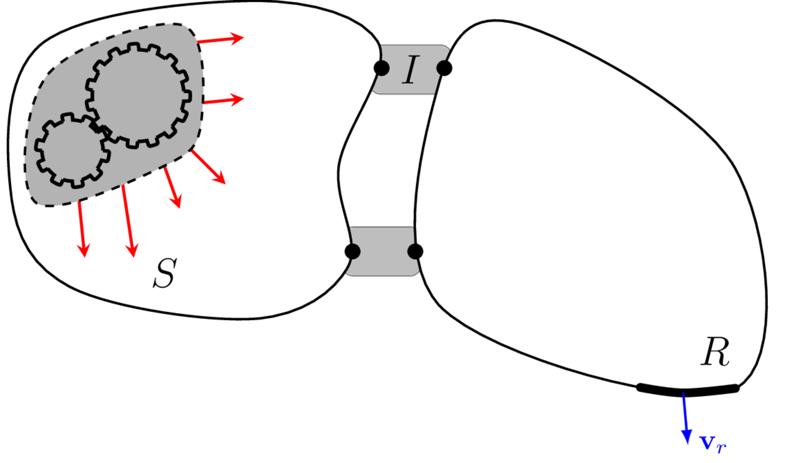

Okay, now that we have covered all the underlying VAVP theory, lets summerise the main practical steps involved in building a VAVP. 

{width=500 #fig-VPsum}

To build a VAVP of resiliently assembled $SIR$ assembly, as depicted in @fig-VPsum, we proceed as follows:

0. Before any experimental measurements are performed, the engineer must decide whether an uncertainty analysis is to be done. If so, it is important that all measurement data is recorded and retained. For example, to build an FRF covariance matrix it is necessary to record the FRFs due to *each* impact. This information is usually discarded, retaining only the mean FRF estimate and its coherence. 
1. Characterise the vibration source by first freely suspending it (e.g. hang from resilient bungees) and measure its free-interface FRF matrix $\mathbf{Y}_{Scc}$, as defined in [Components](../components/components.qmd). Note that the this requires the selection of an [interface model](../interfaces/interfaces.qmd) so to represent the interface DoFs $c$, e.g. Virtual Point. Next, install the source onto some test bench (this could be a 'real' assembly or a laboratory based rig) and characterise the [blocked force](../blockedForce/blockedForce.qmd) $\mathbf{\bar{f}}_c$ using the in situ method. Note that the blocked force should be defined over the same interface model as the free-interface FRF. With the passive and active source properties determined, the source characterisation is now complete.
2. Measure (or model) the free-interface FRF of the recevier structure to obtain $\mathbf{Y}_{Rcc}$ and $\mathbf{Y}_{Rrc}$ (also $\mathbf{H}_{Rcr}$ if acoustic responses are of interest), as defined in [Components](../components/components.qmd). Note that the interface DoFs $c$ should be defined using an interface model that is compatible with that of the source. In the case of rigid coupling these source and receiver DoFs must be defined in a co-located manner. For a resilient coupling they must be co-located with those of the coupling element.  
3. If the source and receiver are to be resiliently coupled, characterise the chosen isolator(s) by first installing it between two simple components (e.g. two masses) and then using in situ method with either force conservation or decoupling to acquire the element point and transfer impedance (see [Isolators](../isolators/isolators.qmd)). Repeat this process to obtain an isolator FRF matrix ($\mathbf{Z}_{I}$ or $\mathbf{Y}_I$) for each coupling element. Alternatively, obtain the element FRF matrix by numerical modelling. As before, the interface model chosen for the element should be compatible with both the source and recevier FRFs to allow for substructuring in the next step. 
4. Using the primal or dual formulation, [substructure](../substructuring/substructuring.qmd) the components together to build a model of the assembly $\mathbf{Y}_C$ (also $\mathbf{H}_C$ if an acoustic response is of interest). If the primal method is used, the coupling element impedance matrix $\mathbf{Z}_{I}$ can be used directly. If the dual method is used we have two options; a) the coupling element impedance is inverted to obtained $\mathbf{Y}_I$ which is then included in the block diagonal matrix of component FRFS, or b) we take the inverse of the coupling element transfer impedance and use this to define the 'joint flexibility' $\mathbf{\Gamma}$. Note that this second approach makes a number of assumptions regarding the coupling dynamics. 
5. Finally, apply the blocked force obtained from step 1 can be applied to the substructured FRF obtained from step 4. to make a response prediction for the VAVP.
$$
\mathbf{v}_r = \mathbf{Y}_{Crc} \mathbf{\bar{f}}_c
$$
- If an uncertainty analysis is required, each of the above steps should be accompanied by a quantification and propagation of uncertainty, as described in [Uncertainties](../uncertainty/uncertainty.qmd). Also note that each of the above steps should be subject to some form of validation before proceeding to the next. 

Thats it. We're done! we have now covered the fundementals of how to characterise components, build a VAVP, and assess its accuracy. Of course, there are plenty of technical details that we have had to omit for conciseness. These can largely be found in our book [Experimental Vibro-acoustics](../../../book/book.qmd), alongside some experimental examples, a coded tutorial, and industrial case studies.

Though the fundamentals of building a VAVP are now rather well established, there is still work to be done. You can find some of my own research, a fair bit of which is VAVP related, [here](../../../research/summary.qmd). You can also find some VAVP related tutorials [here](../../../tutorials/summary.qmd).

If you have any questions related to what we have covered over the last few pages, or would like to get involved/collaborate on VAVP-related research, please do get in touch! :)