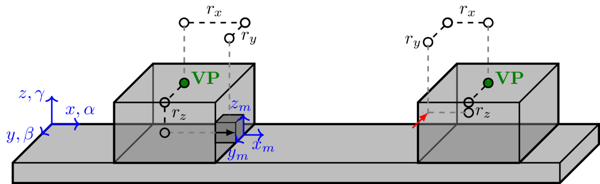
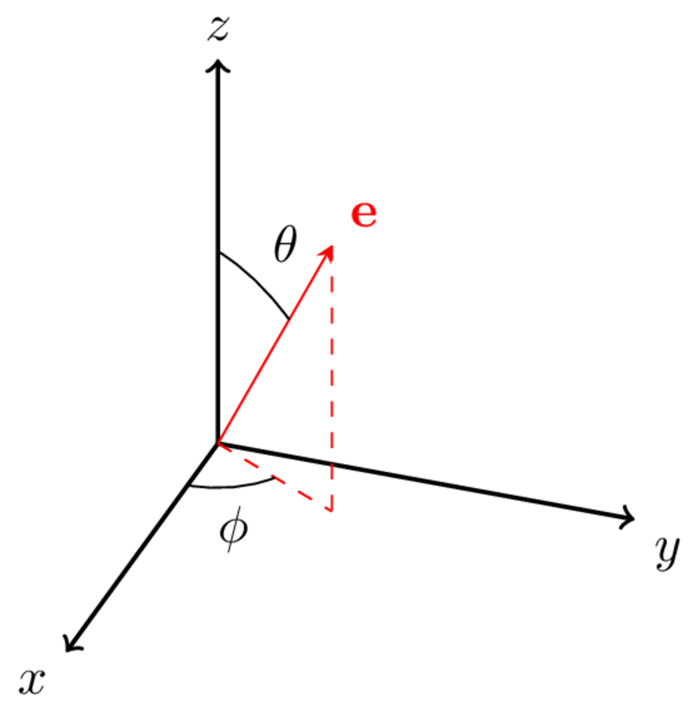
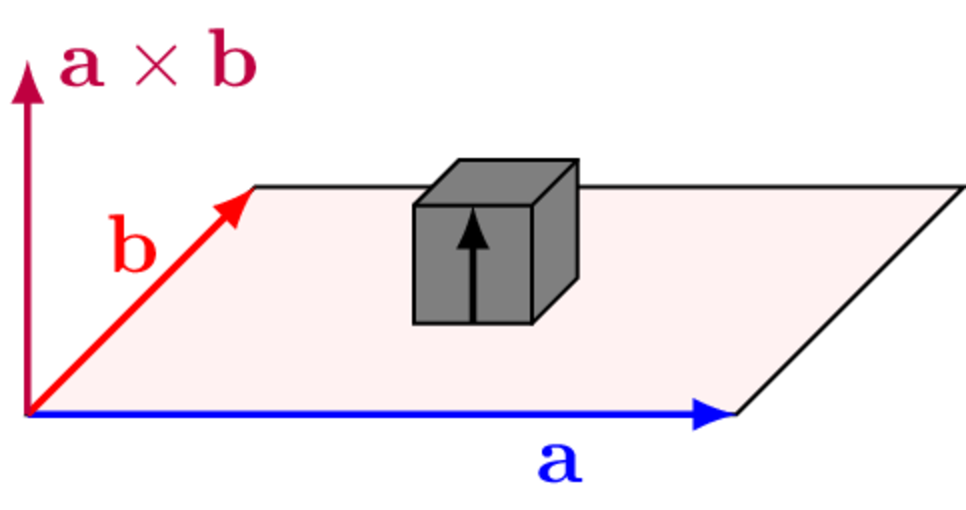

In the preceding discussion of components, it was described how both passive and active components are characterised almost exclusively at their *interfaces*. The need for an accurate description of the interface dynamics has been emphasised but, so far, we have not discussed how this might be achieved. The subject is in fact so important that we now devote an entire page to it: in component characterisation and substructuring it is said that *everything goes right or wrong at the interface*!

## Single point interfaces
In physical assemblies, a range of contact types occur, often comprising bolted connections, spot welds, among other fixings. When modeling connections, we encounter the problem that the real contact always occurs over a finite area; this 'continuous' form must be reduced to a 'discrete' form to be compatible with our FRF-based VAVP framework. When the contact is physically small compared with the structural wavelength we can treat the connection simply as a discreet *point*. The point-like* connection is the most commonly adopted model when building a VAVP (or at least the most common starting point). It is described entirely by the 6 rigid interface DoFs; translations in $x$, $y$ and $z$, and rotations about each of these axes; $\alpha$, $\beta$ and $\gamma$. For interfaces that extend over more than a fraction of a wavelength, this point-like model is no longer sufficient and some form of higher order model is required. 

Representing contact geometry is only part of the story however – the overarching aim of an interface model is to capture *all* important dynamics occuring at the interface. Whilst 6 DoFs might be sufficient for a point-like connection, it is often not known if the physical connection satisfies the point-like requirements aprior. Indeed, higher order 'flexible' DoFs might be required to sufficiently caputre the interface dynamics. This raises the important questions of a) how many DoFs are necessary to describe the interface and b) which ones they are. Later we will introduce the concept of interface completeness as a means of addressing these questions. 

Having chosen a suitable representation of the contact, we must somehow populate it with data obtained from measurement. The VAVP framework requires that the interface representations of connected components must be *compatible*; component FRFs (and blocked forces) at an interface must share a matching set of DoFs to be coupled successfully. Unfortunately, practical limitations such as lack of access, mean that the required DoFs cannot usually be measured directly. Therefore, the measured data must be *transformed* from measurement coordinates to those of the interface model. An important concept then is is that of interface *transformations*.

### Transformation of measured FRFs
The idea of an interface transformation is quite general and by no means limited to the point-like representation. In short, it is the process of populating an interface model (a chosen set of co-located DoFs that are thought to best describe the physical interface) with data obtained from a set of translational-only FRF measurements that surround the connection point. We will use the point-like interface as a means of introducing the concept; generalistion to more complex representations will become obvious later. 

A single point-like interface is characterised by 6 DoFs; the translational $x$, $y$ and $z$ DoFs, and their respective rotations $\alpha$, $\beta$, and $\gamma$.
The equation governing the 6 DoF motion of a single point interface (left of @fig-measMob) is then,
$$
	\left(\begin{array}{c}
		v_{x} \\ v_{y} \\ v_{z} \\ v_{\alpha}\\ v_{\beta}\\ v_{\gamma}
	\end{array}\right)=\left[\begin{array}{cccccc} Y_{{xx}} & Y_{{xy}} & Y_{{xz}} & Y_{{x\alpha}} & Y_{{x\beta}} & Y_{{x\gamma}} \\
		Y_{{yx}} & Y_{{yy}} & Y_{{yz}} & Y_{{y\alpha}} & Y_{{y\beta}} & Y_{{y\gamma}} \\
		Y_{{zx}} & Y_{{zy}} & Y_{{zz}} & Y_{{z\alpha}} & Y_{{z\beta}} & Y_{{z\gamma}} \\
		Y_{{\alpha x}} & Y_{{\alpha y}} & Y_{{\alpha z}} & Y_{{\alpha\alpha}} & Y_{{\alpha\beta}} & Y_{{\alpha\gamma}} \\
		Y_{{\beta x}} & Y_{{\beta y}} & Y_{{\beta z}} & Y_{{\beta\alpha}} & Y_{{\beta\beta}} & Y_{{\beta\gamma}}\\
		Y_{{\gamma x}} & Y_{{\gamma y}} & Y_{{\gamma z}} & Y_{{\gamma\alpha}} & Y_{{\gamma\beta}} & Y_{{\gamma\gamma}}
	\end{array}\right]\left(\begin{array}{c}
		f_{x} \\ f_{y} \\ f_{z} \\ f_{\alpha}\\ f_{\beta}\\ f_{\gamma}
	\end{array}\right)
$$
where for example $v_\alpha$ is the rotational response (say velocity) about the $x$ axis, $f_\gamma$ is the moment force about the $z$ axis, and $Y_{\alpha\gamma}$ is the transfer FRF relating the two. 

Rotational DoFs are generally not available by direct measurement (though rotational response sensors are available, their use is not very common). Even the direct measurement of a translational point FRF (e.g. $Y_{xx}$) is challenging; requiring an exact co-location of the applied force and measured response. In practice, to overcome these challenges it is typical to measure a series of translational FRFs surrounding the interface connection and through an appropriate transformation, use these to estimate the translational and rotational DoFs of interest.

The matrix of measured FRFs (right of @fig-measMob) satisfies the equation,
$$
	\left(\begin{array}{c}
		v_{1} \\ v_{2} \\ \vdots \\ v_{N_v}
	\end{array}\right) = \left[\begin{array}{c c c c}Y_{11} & Y_{12} & \cdots & Y_{1N_f}\\
		Y_{11} & Y_{22} & \cdots & Y_{2N_f}\\
		\vdots & \vdots & \ddots & \vdots\\
		Y_{N_v1} & Y_{N_v2} & \cdots & Y_{N_vN_f}\\
	\end{array}\right]	\left(\begin{array}{c}
		f_{1} \\ f_{2} \\ \vdots \\ f_{N_f}
	\end{array}\right)
$$
or
$$
\mathbf{\hat{v}} = \mathbf{\hat{Y}}\mathbf{\hat{f}}
$${#eq-measMobIntMatform}
where: $v_n$ and $f_n$ are, respectively, the response and applied force at the $n$th \textit{measurement DoF}; $N_v$ and $N_f$ denote the number of measured responses and applied forces, respectively; and the $\hat{\square}$ accent is used to denote a *measured* quantity, as opposed to a transformed one. 

{width=500 #fig-measMob}

Assuming an entirely rigid interface, such that only translational and rotational motions are permitted, the set of measured translational responses $\mathbf{\hat{v}}\in\mathbb{C}^{N_v}$ can be related to a set of mixed translational/rotational responses $\mathbf{v}\in\mathbb{C}^{6}$ (provided $N_v\geq 6$) defined at some other location according to the linear transformation,
$$
        \mathbf{{v}} = \mathbf{T}_v \mathbf{\hat{v}}
$${#eq-responseTransformation}
where $\mathbf{T}_v\in\mathbb{C}^{6 \times N_v}$ is the so-called response transformation matrix.

Similarly, the set of applied (translational) forces $\mathbf{\hat{f}}\in\mathbb{C}^{N_f}$ can be thought to generate a mixed set of translational and rotational forces $\mathbf{{f}}\in\mathbb{C}^{6}$ at some other location, again according to a linear transformation,
$$
        \mathbf{f} = \mathbf{R}_f^{\rm T} \mathbf{\hat{f}} \quad \mbox{or} \quad  \mathbf{\hat{f}} = \mathbf{T}_f^{\rm T} \mathbf{f}
$${#eq-forceTransformation}
with $\mathbf{T}_f^{} = \mathbf{R}_f^{\rm+} \in\mathbb{C}^{N_f \times 6}$ as the so-called force transformation matrix.

Substituting @eq-responseTransformation and @eq-forceTransformation into @eq-measMobIntMatform we obtain,
$$
        \mathbf{{v}} = \mathbf{T}_v \mathbf{\hat{Y}}\mathbf{\hat{f}} = \overbrace{\mathbf{T}_v \mathbf{\hat{Y}} \mathbf{T}_f^{\rm T} }^{\mathbf{Y}}\mathbf{f}
$${#eq-transformedEoM}
which is a relation between the transformed force and response vectors. The matrix product  $\mathbf{Y}=\mathbf{T}_v \mathbf{\hat{Y}} \mathbf{T}_f^{\rm T}\in\mathbb{C}^{6\times 6}$ thus describes the transformed FRF matrix or equivalently, the FRF matrix projected onto the chosen interface model.
$$
	\left[\begin{array}{cccccc} Y_{{x_ix_j}} & Y_{{x_iy_j}} & Y_{{x_iz_j}} & Y_{{x_i\alpha_j}} & Y_{{x_i\beta_j}} & Y_{{x_i\gamma_j}} \\
		Y_{{y_ix_j}} & Y_{{y_iy_j}} & Y_{{y_iz_j}} & Y_{{y_i\alpha_j}} & Y_{{y_i\beta_j}} & Y_{{y_i\gamma_j}} \\
		Y_{{z_ix_j}} & Y_{{z_iy_j}} & Y_{{z_iz_j}} & Y_{{z_i\alpha_j}} & Y_{{z_i\beta_j}} & Y_{{z_i\gamma_j}} \\
		Y_{{\alpha_i x_j}} & Y_{{\alpha_i y_j}} & Y_{{\alpha_i z_j}} & Y_{{\alpha_i\alpha_j}} & Y_{{\alpha_i\beta_j}} & Y_{{\alpha_i\gamma_j}} \\
		Y_{{\beta_i x_j}} & Y_{{\beta_i y_j}} & Y_{{\beta_i z_j}} & Y_{{\beta_i\alpha_j}} & Y_{{\beta_i\beta_j}} & Y_{{\beta_i\gamma_j}}\\
		Y_{{\gamma_i x_j}} & Y_{{\gamma_i y_j}} & Y_{{\gamma_i z_j}} & Y_{{\gamma_i\alpha_j}} & Y_{{\gamma_i\beta_j}} & Y_{{\gamma_i\gamma_j}}
	\end{array}\right]= \mathbf{T}_v\left[\begin{array}{c c c c}Y_{11} & Y_{12} & \cdots & Y_{1N}\\
		Y_{11} & Y_{22} & \cdots & Y_{2N}\\
		\vdots & \vdots & \ddots & \vdots\\
		Y_{M1} & Y_{M2} & \cdots & Y_{MN}\\
	\end{array}\right] \mathbf{T}_f^{\rm T}
$${#eq-rotMobmeasMobEq}

Construction of the transformation matrices $\mathbf{T}_{v,f}$ depends on the chosen interface representation. Examples include the finite different approxiamtion, discrete Fourier transform (for continuous interfaces), among others. In what follows we will consider the particular case of the Virtual Point transformation, which has become the most widely used representation in the contet of source characterisation, substrucutring and VAVP development. 

Regardless of the approach taken, the interpretation of @eq-rotMobmeasMobEq remains the same. Pre-multiplication by $\mathbf{T}_v$ is an operation that acts on the measured response DoFs (i.e. the rows of the FRF matrix), projecting them onto the DoFs of the interface model. Similarly, post-multiplication by $\mathbf{T}_f$ acts to project the applied force DoFs (i.e. columns of the FRF matrix) onto the DoFs of interface model. They take the general form shown in @fig-interfaceTransEq,

{width=500 #fig-interfaceTransEq}

where, for example, $T_{xn}$ describes the projection/contribution of the $n$th measurement DoF (representing an applied force or measured response) onto the $x$ DoF of the interface model.

## Virtual point transormation

The Virtual Point (VP) transformation is a rigid body kinematic projection that relates a set of arbitrarily positioned (translational) response sensors and excitation forces, to the translational and rotational dynamics of a user defined *Virtual Point* (VP). 

{width=500 #fig-VPexample}

If we assume that, locally, an interface connection behaves rigidly (i.e. behaves point-like), the translational response of an arbitrary sensor $\hat{v}_n\in\mathbb{C}$ can be expressed in terms of the combined translational and rotational motion of a virtual point $\mathbf{v}\in\mathbb{C}^{6}$ as,
$$
	\hat{v}_n = \overbrace{\left[\begin{array}{c c c} e_x & e_y & e_z \end{array} \right]}^{\mathbf{e}_m}
	\overbrace{\left[\begin{array}{c c c c c c} 1 & 0 & 0 & 0 & r_z & -r_y \\
	0 & 1 & 0 & -r_z & 0 & r_x\\
0 & 0 & 1 & r_y & -r_x & 0\end{array} \right]}^{\mathbf{r}_m}\left(\begin{array}{c} v_x \\ v_y \\ v_z \\ v_{\alpha} \\ v_{\beta} \\ v_{\gamma}  \end{array} \right) +\epsilon = \mathbf{R}_{v_m}\mathbf{v}+\epsilon 
$${#eq-VP1}

::: {style="float: right; margin: 10px;"}
{width=250 #fig-sphericalCoords}

{width=200 #fig-crossProduct}
:::

In the above, $\mathbf{R}_{v_n}$ represents a pair of linear transformations that account for the position and orientation of the sensor relative to the virtual point, or more precisely its coordinate system. The rightmost matrix $\mathbf{r}_n$ is the so-called Interface Deformation Mode (IDM) matrix that projects the motion of the VP onto the position of the sensor. The first three columns, which together form an identity matrix, simply state that an $x$, $y$, or $z$ translation of the VP will yield identical translation of the measurement position. The remaining three columns describe how a rotational about each axis of the VP will induce a translation in the $x$, $y$ and $z$ coordinates of the measurement position. The magnitude of the resulting translation clearly depend on the relative distance (in meters) between the VP and measurement position, described in the $x$, $y$ and $z$ directions as $r_x$, $r_y$ and $r_z$. The further away the VP and measurement position, the greater the translation will be from a given rotation.

The vector $\mathbf{e}_n$ then accounts for the orientation of the sensor, which may or may not be inline with the coordinate system used by the VP. Suppose for example the sensor is pointing vertically upwards in the $z$ direction of the VP. The orientation vector would then be, 
$$
    \mathbf{e}_z = \left[\begin{array}{ccc}
    0&0&1
    \end{array}\right].
$$
More generally, the orientation vector can be determined from the sensor's inclination and azimuthial angles as in @fig-sphericalCoords,
$$
    \left[\begin{array}{ccc} e_x & e_y & e_z \end{array} \right] = \left[\begin{array}{ccc
    } \sin\theta \cos \phi  & \sin \theta \sin \phi & \cos \theta \end{array} \right]
$$
or obtained from a CAD model using the normalised cross-product between two vectors $\mathbf{a}$ and $\mathbf{b}$ that define the orientation of the surface to which the sensor is attached, 
$$
    \mathbf{e} = \frac{\mathbf{a}\times \mathbf{b}}{||\mathbf{a}|| \cdot ||\mathbf{b}||}
$$
as in @fig-crossProduct.

The final term in @eq-VP1, $\epsilon$, represents the component of the response $\hat{v}_n$ that can not be reproduced by the virtual point with its underlying rigid assumption. This can be considered a *residual flexibility*. 

@eq-VP1 can be written for each sensor, leading to the system of equations,
$$
 \left(\begin{array}{c}
  \hat{v}_1 \\
  \hat{v}_2 \\
  \vdots \\
  \hat{v}_{N_v}
 \end{array}\right) = \left[\begin{array}{c c c c}
 \mathbf{e}_1 & & &\\ & \mathbf{e}_2 & &\\
 & & \ddots & \\
 & & & \mathbf{e}_{N_v}
 \end{array} \right] \left[\begin{array}{c} \mathbf{r}_1 \\ \mathbf{r}_2 \\ \vdots \\ \mathbf{r}_M \end{array}\right]\left(\begin{array}{c} v_x \\ v_y \\ v_z \\ v_{\alpha} \\ v_{\beta} \\ v_{\gamma}  \end{array} \right) +  \left(\begin{array}{c}
\epsilon_1 \\
 \epsilon_2 \\
 \vdots \\
\epsilon_{N_v}
\end{array}\right) 
$${#eq-VP2eq}
or simply
$$
	\mathbf{\hat{v}} = \mathbf{R}_v\mathbf{v}+ \mathbf{\epsilon}
$${#eq-VP2_2}
where $\mathbf{\hat{v}}$ is a vector of measured (translation) responses, and $\mathbf{v}$ is the vector of translational and rotational responses at the virtual point. 

When using the VP transformation, it is particularly convenient to use tri-axial accelerometers, as in this case, the accelerometer responses recorded in $x$, $y$ and $z$ are done so at (approx.) the same location, and so they share $r_x$, $r_y$ and $r_z$. For a single tri-axial sensor, @eq-VP1 then becomes,
$$
	\left(\begin{array}{c}\hat{v}_{x,n}\\
 \hat{v}_{y,n}\\
 \hat{v}_{z,n} 
 \end{array}\right) = \overbrace{\left[\begin{array}{c c c} e_{x,x} & e_{x,y} & e_{x,z} \\
 e_{y,x} & e_{y,y} & e_{y,z}\\
 e_{z,x} & e_{z,y} & e_{z,z}\end{array} \right]}^{\mathbf{E}_n}
	\left[\begin{array}{c c c c c c} 1 & 0 & 0 & 0 & r_z & -r_y \\
	0 & 1 & 0 & -r_z & 0 & r_x\\
0 & 0 & 1 & r_y & -r_x & 0\end{array} \right]\left(\begin{array}{c} v_x \\ v_y \\ v_z \\ v_{\alpha} \\ v_{\beta} \\ v_{\gamma}  \end{array} \right) +
\left(\begin{array}{c}\epsilon_{x,n}\\
 \epsilon_{y,n}\\
 \epsilon_{z,n} 
 \end{array}\right)
$${#eq-VP1_tri}
where $\mathbf{E}_n$ is now a matrix describing the orientation of the $n$th tri-axial sensor's coordinate axes relative to that of the VP.
For three tri-axial sensors (the minimum required to capture all 6 DoFs), @eq-VP2eq becomes, 
$$
 \left(\begin{array}{c}
  \mathbf{\hat{v}}_1 \\
  \mathbf{\hat{v}}_2 \\
  \mathbf{\hat{v}}_3
 \end{array}\right) = \left[\begin{array}{c c c}
 \mathbf{E}_1 & &\\ 
 & \mathbf{E}_2 &\\
 & & \mathbf{E}_3
 \end{array} \right] \left[\begin{array}{c} \mathbf{r}_1 \\ \mathbf{r}_2 \\ \mathbf{r}_3 \end{array}\right]\left(\begin{array}{c} v_x \\ v_y \\ v_z \\ v_{\alpha} \\ v_{\beta} \\ v_{\gamma}  \end{array} \right) +  \left(\begin{array}{c}
\mathbf{\epsilon}_1 \\
\mathbf{\epsilon}_2 \\
\mathbf{\epsilon}_3
\end{array}\right)
$$
where $\mathbf{\hat{v}}_n\in\mathbb{C}^3$ is the vector of tri-axial responses for sensor $n$.

We can now apply a similar idea to the external forces. Application of an arbitrary external force $f_n$ (at coordinates $r_x$, $r_y$, $r_z$ relative to the VP) generates a set of translational and rotational forces at the VP. These forces are related by the equation,
$$
	\left(\begin{array}{c} f_x \\ f_y \\ f_z \\ f_{\alpha} \\ f_{\beta} \\ f_{\gamma}  \end{array} \right) = 
	\overbrace{\left[\begin{array}{c c c c c c} 1 & 0 & 0 \\
		0 & 1 & 0 \\
		0 & 0& 1\\
		0 & -r_z & r_y\\
		r_z&0&-r_x\\
		-r_y& r_x& 0\end{array} \right]}^{\mathbf{r}_n^{\rm T}} \overbrace{\left[\begin{array}{c} e_x \\ e_y \\ e_z \end{array} \right]}^{\mathbf{e}_n^{\rm T}}  \hat{f}_n =\mathbf{R}^{\rm T}_{f_n} \hat{f}_n.
$$
where $\mathbf{R}^{\rm T}_{f_n}$ again represents a pair of linear transformations that account for the position and orientation of the applied force. 
An equation of this form can be written for each excitation, leading to,
$$
	\left(\begin{array}{c} f_x \\ f_y \\ f_z \\ f_{\alpha} \\ f_{\beta} \\ f_{\gamma}  \end{array} \right) = 
	\left[\begin{array}{c c c c c c} \mathbf{r}_1^{\rm T} & \mathbf{r}_2^{\rm T}  & \cdots & \mathbf{r}_{N_f}^{\rm T} \end{array} \right]\left[\begin{array}{cccc} \mathbf{e}_1^{\rm T} & & & \\ & \mathbf{e}_2^{\rm T}  & &\\
 & & \ddots & \\ & & & \mathbf{e}_{N_f}^{\rm T} \end{array} \right]   \left(\begin{array}{c}
  \hat{f}_1 \\
  \hat{f}_2 \\
  \vdots \\
  \hat{f}_{N_f}
 \end{array}\right)
$$
or simply
$$
	\mathbf{f} = \mathbf{R}^{\rm T}_f\mathbf{\hat{f}}
$$
where $\mathbf{\hat{f}}$ is a vector of applied/measured translation forces, and $\mathbf{f}$ is the vector of resulting translational and moment forces at the VP. Note that whilst tri-axial accelerometers can be used to simplify the VP response measurement, no equivalent is available for excitations. These must be applied individually.

Through a least squares pseudo-inverse, the above equations yield a pair of transformation matrices $\mathbf{T}_v$ and $\mathbf{T}_f$,
$$
    \mathbf{v} = \left(\mathbf{R}_v\right)^+\mathbf{\hat{v}} = \mathbf{T}_v\mathbf{\hat{v}}
$${#eq-VPTv}
$$
	\mathbf{\hat{f}} = \left(\mathbf{R}^{\rm T}_f\right)^+\mathbf{f} = \mathbf{T}_f^{\rm T}\mathbf{f}.	
$${#eq-VPTf}

To apply the VP transformation to a measured FRF matrix,
$$
    \mathbf{\hat{v}} = \mathbf{\hat{Y}} \mathbf{\hat{f}}
$$
we first substitute $\mathbf{\hat{f}}$ from @eq-VPTf,
$$
    \mathbf{\hat{v}} = \mathbf{\hat{Y}} \mathbf{T}_f^{\rm T}\mathbf{f}
$${#eq-VPeq2}
before pre-multiplying both sides of @eq-VPeq2 by $\mathbf{T}_v$ to obtain,
$$
    \mathbf{v} = \mathbf{T}_v\mathbf{\hat{Y}} \mathbf{T}_f^{\rm T}\mathbf{f}.
$${#eq-VPeq}
@eq-VPeq takes the same form as @eq-transformedEoM; it relates the VP transformed force $\mathbf{f}$ to the VP transformed response $\mathbf{v}$. As such, the matrix product must describe the VP transformed FRF matrix $\mathbf{Y}$,
$$
	\mathbf{Y} = \mathbf{T}_v\mathbf{\hat{Y}}\mathbf{T}_f^{\rm T}.
$$
As described earlier, pre and post-multiplying by $\mathbf{T}_{v}$ and $\mathbf{T}_f^{\rm T}$ acts to project the measured FRF matrix $\mathbf{\hat{Y}}$ onto the (VP) interface model. The projected FRF matrix $\mathbf{Y}$ can now be used as part of any substructuring or source characterisation calculations. 

The VP transformation has several advantages over the equivalent multi-point connection and finite difference approximation. Firstly, the translational and rotational DoFs of the VP are estimated based on the response of all sensors. This enables the over-determination of the problem, which can provide a more accurate estimate. A second advantage is that the resulting DoFs are exactly collocated at the VP. This is particularly useful when trying to combine measurements made on different components where all DoFs must be correctly aligned. This is also useful for combining measurements with models. The VP transformation has been extended further to include flexible interface modes (describe below), and rotational sensors. 

Whilst a powerful tool, the VP transformation has a notable disadvantage. It requires accurate information on both the position and orientation of each sensor and applied force (so to construct the transformation matrices $\mathbf{T}_v$ and $\mathbf{T}_f$). If a CAD model of the interface is available this information may be readily obtained; without, the VP transformation might be subject to large uncertainties or simply not applicable.

### Performance indicators
The VP transformations described above are based on the assumption that the interface can be described entirely by its rigid body dynamics. This is typically a valid assumption in the low/mid frequency range, where the structural wavelength is much larger than the size of the interface connection. However, as frequency increases so does the deformation of the interface and at higher frequencies there may be a need to assess the validity of the rigid body assumption.

Transforming from a set of measured DoFs involves projecting $N_{v,f}\geq 6$ dimensional space representing the measurement DoFs (applied forces and measured responses), on to an $N=6$ dimensional space representing the transformed rigid body DoFs (the interface model). In most cases, $N_{v,f}> 6$ and so this projection potentially involves the loss of information. 

If the interface does in fact behave rigidly, then the rank of its measured FRF matrix $\mathbf{\hat{Y}}_{cc}\in\mathbb{C}^{N_v\times N_f}$ must be limited to 6. In this case, the interface transformations can be applied in reverse to reconstruct the original measured FRF matrix from the transformed matrix,
$$
    \mathbf{\hat{Y}}' = \mathbf{T}_v^{+}\,\mathbf{{Y}}\,\mathbf{T}_f^{\rm +T} = \mathbf{T}_v^{+}\, \left(\mathbf{T}_v\mathbf{\hat{Y}}\mathbf{T}_f^{\rm T}\right)\,\mathbf{T}_f^{\rm +T} = \mathbf{\hat{Y}} \quad \quad \mbox{if} \quad \mbox{rank}\left(\mathbf{\hat{Y}}\right) \leq 6
$$
where we use the $\square'$ accent to denote a reconstruction of the original FRF matrix. 
    
If however, the interface possesses some flexibility, the rank of $\mathbf{\hat{Y}}_{cc}\in\mathbb{C}^{N_v\times N_f}$ has the potential to be greater than 6. In this case, the measured FRF matrix can only be reconstructed approximately,
$$
    \mathbf{\hat{Y}}' = \mathbf{T}_v^{+}\,\mathbf{{Y}}\,\mathbf{T}_f^{\rm +T} = \mathbf{T}_v^{+}\, \left(\mathbf{T}_v\mathbf{\hat{Y}}\mathbf{T}_f^{\rm T}\right)\,\mathbf{T}_f^{\rm +T} \approx \mathbf{\hat{Y}}  \quad \quad \mbox{if} \quad \mbox{rank}\left(\mathbf{\hat{Y}}\right) > 6
$$
Note that the reconstructed FRF matrix $\mathbf{\hat{Y}}'$ includes only the rigid body dynamics; flexible interface dynamics in $\mathbf{\hat{Y}}$ have been filtered out by applying the transformation followed by its inverse. 

It is important to note that this action of 'filtering out flexible dynamics' implicitly requires an over-determined transformation with $N_{v,f}>6$. In the determined case the transformation matrix becomes square ($N_{v,f}=6$), and assuming its inverse exists, it is exactly reversible. In other words, there are not enough measurement DoFs to *observe* flexibility; the interface is 'under sampled'.

In the over-determined case, the above notion can be used to establish sensor and force consistency criteria that indicate the validity of the rigid interface assumption, as well as the quality of the sensor arrangement and applied forces. 

#### Sensor consistency
To assess the consistency of the sensor arrangement we consider a unit force $f_h = 1$ applied to the component in question at the arbitrary position $h$. The directly measured velocity response satisfies the equation,
$$
    \mathbf{\hat{v}} = \mathbf{\hat{Y}}_h f_h = \mathbf{\hat{Y}}_h 
$$
where $\mathbf{\hat{Y}}_h$ is a column vector of measured mobilities between force position $h$ and the interface responses. Similarly,  the transformed velocity response satisfies,
$$
    \mathbf{v} = \mathbf{Y}_h f_h = \mathbf{Y}_h = \mathbf{T}_v \mathbf{\hat{Y}}_h. 
$$
Applying the inverse transformation to the transformed velocity projects the response back onto the measured DoFs,
$$
    \mathbf{\hat{Y}}_h' = \mathbf{T}_v^+ \mathbf{T}_v \mathbf{\hat{Y}}_h. 
$$
where $\square'$ is used to denote filtering of rigid body dynamics. 

The matrix product $\mathbf{T}_v^+ \mathbf{T}_v$ has the effect of filtering out flexible interface modes, retaining only the rigid body dynamics. 

The *sensor consistency* can be assessed by simply comparing the directly measured $\mathbf{\hat{v}}$ and reconstructed (rigid body only) $\mathbf{\hat{v}}'$ responses. This comparison can be done in a variety of ways. A popular approach is to use a correlation-based measure of similarity,
$$
    \rho_{v,h} = \mbox{Corr}\left(\mathbf{\hat{Y}}_h,\mathbf{\hat{Y}}_h'\right) \qquad \mbox{with} \qquad 
    \mbox{Corr}\left(\mathbf{a},\mathbf{b}\right) = \frac{ \left|\mathbf{a}^{\rm H}\mathbf{b} \right|^2 }{ \mathbf{a}^{\rm H} \mathbf{a} \cdot \mathbf{b}^{\rm H}\mathbf{b}}
$${#eq-correlation}
The sensor consistency $\rho_{v,h}$ is a frequency dependent scalar quantity that varies between 0 and 1. A value of 1 indicates rigid interface behaviour, i.e. the reconstructed (rigid body filtered) responses are identical to those measured directly. A value less than 1 indicates some degree of interface flexibility, which is lost through the applied transformation.

Note that $\rho_{v,h}$ is evaluated for the force excitation at position $h$, and that multiple force locations might be considered. In this case each force could be used to determine an independent $\rho_{v,h}$. Alternatively, the collection of measured and reconstructed responses can be vectorized (i.e. stacked into a single large column vector, denoted by $\mbox{Vec}({\square})$) and used to determine an overall sensor consistency,
$$
\rho_v = \mbox{Corr}\left(\mbox{Vec}({\mathbf{\hat{Y}}}),\mbox{Vec}({\mathbf{\hat{Y}}')}\right).
$$

Whilst the location of the applied forces is, in theory arbitrary, it is recommended to avoid using the interface so as to ensure that a global response is generated, as opposed to a local response that might be highly sensitive to the impact position.

#### Force consistency
Based on the above sensor criterion, it is straightforward to develop an equivalent *impact consistency* criterion so as to assess the quality of the applied forces.

In this case consider the response of a single interface sensor to all of the forces applied around the interface,
$$
    \hat{v}_i = \mathbf{\hat{Y}}_i  \mathbf{\hat{f}}
$$
where $ \mathbf{\hat{Y}}_i$ is a row vector of directly measured mobilities between the applied forces and sensor $i$. 

Similarly, the response at sensor $i$ due to the rigid body filtered forces is given by,
$$
    \hat{v}_i' = \mathbf{\hat{Y}}_i \mathbf{T}_f^{\rm T} \mathbf{f} = \mathbf{\hat{Y}}_i \mathbf{T}_f^{\rm T} \mathbf{T}_f^{\rm +T}\mathbf{\hat{f}} = \mathbf{\hat{Y}}_i' \mathbf{\hat{f}}
$$
where $\square'$ is now used to denote filtering of rigid body forces. The impact consistency is then defined as, 
$$
    \rho_{f,i} = \mbox{Corr}\left(\mathbf{\hat{Y}}_i ,\mathbf{\hat{Y}}_i'\right).
$$
Like the sensor consistency, $\rho_{f,i}$ is bound between 0 and 1, with a value of 1 indicating perfect transmission of force between the applied impacts and the defined forces. 

To obtain a single overall force consistency metric, we can again collect and vectorize the measured and reconstructed responses across all interface sensors,
$$
\rho_f = \mbox{Corr}\left(\mbox{Vec}({\mathbf{\hat{Y}}}),\mbox{Vec}({\mathbf{\hat{Y}}'})\right).
$$

#### Combined interface consistency
Having introduced the sensor and force consistency metrics above, it is perhaps obvious that one could formulate in the same manner a single overall consistency that combines the two. Indeed, applying both force and response transformations, alongside their respective inverses, one obtains the filtered FRF matrix, 
$$
 \mathbf{\hat{Y}}' = \mathbf{T}_v^{+}\, \left(\mathbf{T}_v\mathbf{\hat{Y}}\mathbf{T}_f^{\rm T}\right)\,\mathbf{T}_f^{\rm +T} 
$$
which, by comparison against the original FRF matrix, forms an overall interface consistency metric,
$$
\rho = \mbox{Corr}\left(\mbox{Vec}({\mathbf{\hat{Y}}}),\mbox{Vec}({\mathbf{\hat{Y}}'})\right).
$$

## Multi-point interfaces 
In the above we considered a single point interface, and introduced the Virtual Point transformation as an interface representation for point-like dynamics. In practice, it is rare that a structural component couples to another via a single connection point. Hence, it is necessary to extend this single-point treatment to the general multi-point case.  

For the single-point interface, the full 6 DoF FRF matrix (see @eq-rotMobmeasMobEq) is obtained by,
$$
\mathbf{Y}=\mathbf{T}_v\mathbf{\hat{Y}}\mathbf{T}_f^{\rm T}
$${#eq-MPtrans}
where $\mathbf{\hat{Y}}$ is a matrix of measured translational mobilities, and $\mathbf{T}_{v,f}$ are a pair of transformation matrices.
To extend this treatment to a multi-point case we simply note that a local interface model (i.e. a model pertaining to a single connection) depends only on the local measurement DoFs, i.e. those that surround the connection. Consequently, the transformed response and force DoFs of a multi-point interface are related to the measured response and force DoFs by,
$$
    \left(\begin{array}{c} \mathbf{{v}}_{c_1} \\ \vdots \\ \mathbf{{v}}_{c_N}\end{array}\right) = \left[\begin{array}{ccc}\mathbf{T}_{v,c_1} &  &   \\
         &  \ddots &  \\
        &   & \mathbf{T}_{v,c_N}  \\
        \end{array}\right]\left(\begin{array}{c} \hat{\mathbf{v}}_{c_1} \\ \vdots \\ \hat{\mathbf{v}}_{c_N}\end{array}\right)
$$
and
$$        \left(\begin{array}{c} \hat{\mathbf{f}}_{c_1} \\ \vdots \\ \hat{\mathbf{f}}_{c_N}\end{array}\right)
         = \left[\begin{array}{ccc}
        \mathbf{T}^{\rm T}_{f,c_1} &  &   \\
         &  \ddots &  \\
        &   & \mathbf{T}^{\rm T}_{f,c_N}  \\
        \end{array}\right]\left(\begin{array}{c} \mathbf{{f}}_{c_1} \\ \vdots \\ \mathbf{{f}}_{c_N}\end{array}\right)
$$where $\hat{\square}$ denotes the measured DoFs, and $\mathbf{T}_{v,c_n}$ and $\mathbf{T}_{f,c_n}$ are the response and force transformation matrices for the $n$th connection point. For the full multi-point interface mobility we then have,
$$
    \mathbf{Y}_{cc} =  
        \left[\begin{array}{ccc}
        \mathbf{T}_{v,c_1} &  &   \\
         &  \ddots &  \\
        &   & \mathbf{T}_{v,c_N}  \\
        \end{array}\right]
        \left[\begin{array}{ccc}
        \mathbf{\hat{Y}}_{c_1c_1} & \cdots & \mathbf{\hat{Y}}_{c_1c_N}  \\
        \vdots & \ddots & \vdots \\
        \mathbf{\hat{Y}}_{c_Nc_1} & \cdots & \mathbf{\hat{Y}}_{c_Nc_N}
        \end{array}\right]
        \left[\begin{array}{ccc}
        \mathbf{T}_{f,c_1} &   &   \\
         &  \ddots & \\
        &  &  \mathbf{T}_{f,c_N} 
        \end{array}\right]^{\rm T}
$${#eq-multipointInt}
where it is noted that each transformation matrix can be constructed using the most appropriate method for that connection point (not necessarily the VPT).

Finally, to include a set of additional remote DoFs $r$ where no interface transformations are required, #eq-multipointInt can be extended simply as, 
$$
    \left[\begin{array}{cc}
        \mathbf{Y}_{cc} & \mathbf{Y}_{cr}  \\
        \mathbf{Y}_{rc}  & \mathbf{Y}_{rr}
        \end{array}\right] =  
        \left[\begin{array}{cc}
        \mathbf{T}_{v,c} &    \\
        &  \mathbf{I} 
        \end{array}\right]
        \left[\begin{array}{cc}
        \mathbf{\hat{Y}}_{cc} &  \mathbf{\hat{Y}}_{cr}  \\
        \mathbf{\hat{Y}}_{rc} & \mathbf{\hat{Y}}_{rr}
        \end{array}\right]
        \left[\begin{array}{cc}
        \mathbf{T}_{f,c} &    \\
        & \mathbf{I} 
        \end{array}\right]^{\rm T}
$${#eq-multipointInt2}
where $c = \{c_1, c_2, \cdots, c_N\}$.

## Flexible interfaces
The notion of a point interface is typically valid in the low-mid frequency range. Fortunately, this is the range where most structural vibration problems are concerned, and so the point interface assumption has served the community well over the decades. However, new technologies (such as vehicle electrification) are ever extending the frequency of interest. With the corresponding wavelength decreasing, structural connections that might once have appeared `point-like' are becoming comparable in size to wavelength. As a consequence, the assumption of locally rigid dynamics breaks down as local deformations occur. To deal with this, more complex representations of interface dynamics are required. Below we briefly detail a flexible extension of the virtual point transformation.

The virtual point transformation, as described above, relies on the construction of the so-called Interface Deformation Mode (IDM) matrices, $\mathbf{R}_m$ that describe how the measured DoF would respond to the motion of a virtual point, assuming rigid body motion. The rows of $\mathbf{R}_m$ correspond to the $x, y$ and $z$ coordinates of the measurement DoF, whilst the columns relate to the permissible motions of the virtual point (the translations, and three rotations),
$$
 \mathbf{R}_m =  \left[\rule{0cm}{1.4cm}\right.\overbrace{\begin{array}{ccc} 0 & 0 & 0  \\
	0 & 1 & 0  \\
0 & 0 & 1 \end{array}}^{\mbox{Translation}}
 \left|\rule{0cm}{1.4cm}\right.\,\,\,
 \overbrace{\begin{array}{ccc  }  0 & r_z & -r_y \\
	-r_z & 0 & r_x \\
	r_y & -r_x & 0 \end{array}}^{\mbox{Rotation}}  \,\,\,\left.\rule{0cm}{1.4cm}\right].
$$
Importantly, any residual motion (i.e. flexibility) not captured by the 6 VP DoFs is discarded and not included in the interface representation. To accommodate for flexibility of the interface, additional modes must be added to the IDM matrix. A `bottom-up' definition of flexible interface behaviour is recommended, which avoids the need for a priori knowledge of the interface dynamics, and is therefore more generally applicable. 

The following example is given of an extended virtual point IDM that is capable of capturing an additional three extension (i.e. 'strain') and torsion deformations, alongside the standard rigid modes,
$$
        \mathbf{R}_m^{ext} = \left[\rule{0cm}{1.4cm}\right.\overbrace{\begin{array}{ccc} 0 & 0 & 0  \\
	0 & 1 & 0  \\
0 & 0 & 1 \end{array}}^{\mbox{Translation}}
 \left|\rule{0cm}{1.4cm}\right.
 \,\,\,
 \overbrace{\begin{array}{ccc  }  0 & r_z & -r_y \\
	-r_z & 0 & r_x \\
	r_y & -r_x & 0 \end{array}}^{\mbox{Rotation}} 
\left|\rule{0cm}{1.4cm}\right.
 \,\,\,
 \overbrace{\begin{array}{ccc  }  r_x & 0 & 0 \\
	0 & r_y & 0 \\
	0 & 0 & r_z \end{array}}^{\mbox{Extension}}  
\left|\rule{0cm}{1.4cm}\right.
 \,\,\,
 \overbrace{\begin{array}{ccc  }  0 & r_y r_z & -r_zr_y \\
	-r_xr_z & 0 & r_zr_x\\
	 r_x r_y & -r_y r_x & 0 \end{array}}^{\mbox{Torsion}} 
    \,\,\,\left.\rule{0cm}{1.4cm}\right]
$$
Based on this extended IDM matrix, a measured response is represented as, 
$$
    \hat{v}_n = \left[\begin{array}{c} e_x \\ e_y \\ e_z \end{array} \right]^{\rm T} \mathbf{R}_n^{ext} 
\left[\begin{array}{c} \mathbf{v}_{tr.} \\ \mathbf{v}_{rot.} \\ \mathbf{v}_{ext.} \\ \mathbf{v}_{tor.}\end{array} \right]
$${#eq-extVP}
where the flexible virtual point DoFs $\mathbf{v}_{ext.} = [v_{ext.,x}, v_{ext.,y}, v_{ext.,z}]^{\rm T}$ and $\mathbf{v}_{tor.} = [v_{tor.,x}, v_{tor.,y}, v_{tor.,z}]^{\rm T}$ have been added to the virtual point response vector $\mathbf{v}$. Note that a similar procedure can be applied to the excitation IDM matrix. 

Higher order flexible IDMs can be defined with similar ease, requiring only the product of measurement DoF coordinates. When including flexible IDMs, it is important to always ensure that the resultant matrix $\mathbf{R}$ is full-rank, i.e. to capture say 6 flexible modes, a minimum ov total of 12 independent measurement DoFs are required; 6 for the rigid IDMs, and 6 force the flexible IDMs.

In practice, it is necessary to ‘cherry-pick’ the correct set of IDM modes for the problem at hand, whilst avoiding any unnecessary IDMs in the interface representation.

## Equivalent multi-point connection
Often when conducting a diagnostic test, such as in-situ TPA, interest does not lie with the contribution of the translational and rotational DoFs themselves, but rather with the contribution of the different connection points as a whole. In this case, there is no need to explicitly calculate the rotational DoFs, though their contribution must still be captured. This leads to the so-called \textit{equivalent multi-point} (EMP) connection.

The equivalent multi-point connection is the most straightforward approach to capture rotational DoFs. The interface is instrumented/excited by 6 or more sensors/forces which, like the FD approximation, are attached/applied in spaced pairs. Each pair is orientated to point in a particular direction ($x$, $y$ or $z$). By measuring 6+ translational DoFs, all 6 DoFs (translations and rotations) are implicitly captured. Translational DoFs are encoded by the pair-wise average, whilst the rotational DoFs are encoded by the pair-wise difference, much like the FD approximation. Importantly however, the averaged translational and rotational components are not calculated explicitly; their influence is encoded within the 6+ individual translations. Hence we treat the connection as 6+ equivalent translational DoFs. Take for example the interface configuration in Figure \ref{FDexample2} (right). Seven translational sensors are positioned around the interface. These are accompanied by 7 translational force excitations. According to the equivalent multi-point connection the mobility matrix $\mathbf{Y}_{cc}$ for this contact point would be of dimensions $7\times 7$. Rotational information about the $x$, $y$ and $z$ axes are encoded by the sensors spaced about their respective axes.

More generally, the sensors/applied forces do not have to be included as spaced pairs. So long as no two sensors/forces are co-located, and those that are included sufficiently span $x$ $y$ and $z$, all translational and rotational interface motions will be captured. 

The main advantages of the equivalent multi-point connection approach are its straight forward implementation and ability to capture rotational DoFs. Furthermore, in the case that $>$6 measurement points are used, it has the ability to capture flexible interface dynamics. Its main disadvantage is that the true translational and rotational motions are not explicitly calculated. This can cause some issues when trying to combine data sets, for example measured blocked forces with transfer functions obtained from numerical models or other experimental set-ups.

Though straight forward to implement, it is important to note that if more than 6 translations are used in the EMP representation, some regularisation may be required to avoid a rank deficient mobility matrix; if there are more sensors/forces present than DoFs to capture (i.e. more parameters than can be justified by the data) and the connection point indeed behaves rigidly, the inversion of $\mathbf{Y}_{cc}$ can become ill-conditioned and large errors returned. A simple solution is to perform a Singular Value Decomposition to invert the matrix, and retain only the first 6 singular values. 

##  A short comment on interface completeness
The importance of accurately representing all the important interactions taking place at the interface has been emphasised in the above. For components with discrete point-like interfaces, these interactions are represented by the translational and rotational DoFs at each coupling point, all of which have the potential to contribute towards the dynamics of the assembled VAVP. At mid-to-high frequencies, where interface deformations become significant, higher order 'flexible' DoFs are required to provide an adequete description. An interface rpresentation description that is missing important DoFs can be said to be *incomplete*.

The incomplete representation of an interface is perhaps one of the main sources of error when building a VAVP. Not only does it effect the substructuring of components (if DoFs are not included in the interface model, then will not be coupled by the substructuring) but it can have a serve impact on the active characterisation of vibration sources (by neglecting DoFs large bias errors can be introduced onto the characterisation). It is therefore adventageous to develop tests for completeness, i.e. methods to identify whether the chosen interface representation has enough DoFs (also that these DoFs are the 'right ones'). This topic is closely related to that of [Uncertainty](uncertainty.qmd), and so it will be addressed in more detail there. 

## What next
Now that we have introduced the concept of an interface representation, and how to populate it with data from measurement, we can continue with our coverage of component characterisation. Having dealt with the passive characterisation of source and receiver-like components, next on our to-do list is [Vibration isolators](isolators.qmd), i.e. the squidgy bits of rubber that we use to reduce vibration transmission from active vibrations sources (which we will cover shortly afterward in  [Blocked forces](blockedForce.qmd)) to receiver structures.