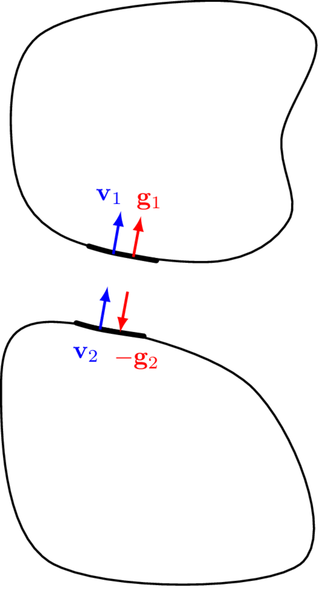
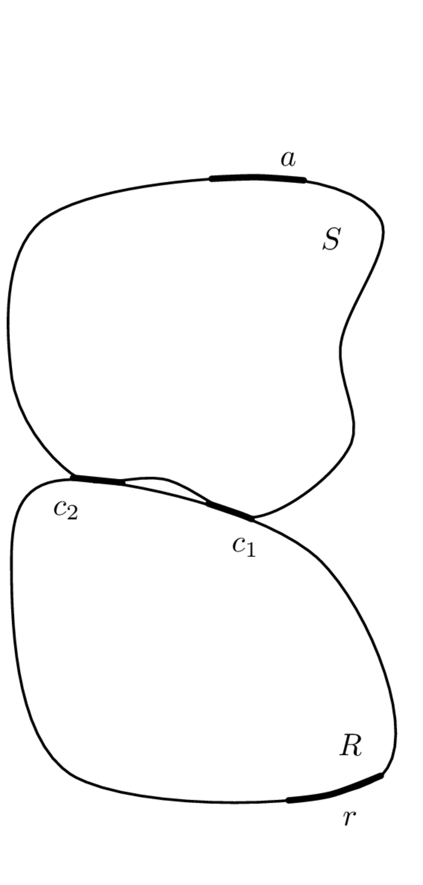

On this page we introduce substructuring; the process of mathematically coupling individual component models to build a model of an assembled system. Substructuring is a very broad subject, and can be performed in of the typical domains (physical, state space, modal, time and frequency). In [Components](../components/components.qmd) we justified our choice of the frequency domain for the VAVP framework, and so representation of components by multi-DoF FRF matrices. For this reason, we will focus exclusively on frequency-based substructuring. Even then, there are various ways one can formulate the substructuring equations. We will breifly introduce the direct method before focusing on the primal and dual formulations, the latter of which tends to be the most commonly adopted in the literature. 

## Coupling conditions

The rigid coupling of two components requires satisfying two conditions: equilibrium and continuity.  

::: {style="float: right; margin: 10px;"}
{width=300 #fig-AIB}
:::

The condition of equilibrium is simply a restatement of Newton's 3rd law - when two objects are in contact they exert equal and opposite forces on one another. For two sub-structures in rigid contact at a single point it may be expressed in the form,
$$
g_1 = -g_2
$$
where $g_1$ and $g_2$ represent the interface coupling forces at the connecting DoFs of the two sub-structures. 

The condition of continuity (also known as compatibility) states that the sub-structural DoFs in rigid contact must move in unison, i.e. with equal velocity (also displacement and acceleration), and may be expressed in the form,
$$
v_1 = v_2 = v_C
$$
where $v_1$ and $v_2$ represent the contact velocities of the two sub-structures, and $v_C$ the velocity of the coupled structure.

In the presence of several sub-structures and/or connecting DoFs, the above conditions can be expressed more generally in vector form as,
$$
\mathbf{g}_1 = -\mathbf{g}_2
$${#eq-equil}
and
$$
\mathbf{v}_1 = \mathbf{v}_2 = \mathbf{v}_C
$${#eq-contin}
where @eq-equil and @eq-contin are now generalised in the sense that they can also include moment forces and angular responses, respectively.

Dynamic substructuring,  the process of assembling substructural properties to form an assembly, amounts to the application of the above conditions to the connecting interfaces between each substructure (or equivalently, component). Depending on how these substructures are represented (i.e. in the physical domain, modal domain, frequency domain, or state-space) the sub-structuring formulation may differ, though the underlying physics remains the same. 

In this book we are principally focused on frequency domain methods, and so we will consider \textit{FRF-based} sub-structuring methods.
That said, the sub-structuring methods presented below are not limited to experimental FRFs. FRF matrices determined by analytical or numerical means can also be used to represent individual sub-structures. In-fact, the ability to combine experimental and numerical sub-structures to form `hybrid assemblies' is one of the principal advantages of the component-based approach to simulation.

## Direct method (impedance coupling)
The direct formulation considers the special case in which just two substructures are being coupled, typically a source $S$ and receiver $R$ as in @fig-sourceRecDoFs. Each substructure is characterised independently by their free interface mobility matrices, $\mathbf{Y}_{Scc}\in\mathbb{C}^{N_c\times N_c}$ and $\mathbf{Y}_{Rcc}\in\mathbb{C}^{N_c\times N_c}$. If remote DoFs are considered on the receiver structure the transfer mobility $\mathbf{Y}_{Rrc}\in\mathbb{C}^{N_r\times N_c}$ (or the vibro-acoustic FRF $\mathbf{H}_{Rrc}\in\mathbb{C}^{N_r\times N_c}$, if the sound pressure response is of interest) is also necessary. Our treatment of the direct method will be brief as the primal and dual methods provide far more flexible substructuring frameworks. Indeed, our focus here will simply be to prove the impedance coupling relation used in [Isolators](isolators.qmd) for the in situ characterisation of coupling element, i.e.
$$
\mathbf{Z}_{Ccc}  = \mathbf{Z}_{Acc} + \mathbf{Z}_{Icc} +   \mathbf{Z}_{Bcc}
$${#eq-directSS1}
which states that when two structures are in rigid contact, their impedance matrices sum together. 

{width=500 #fig-sourceRecDoFs}

To derive @eq-directSS1 we begin with the interface responses of the (uncoupled) substructures $S$ and $R$ due to an interface forcing,
$$
\mathbf{v}_{Sc} = \mathbf{Y}_{Scc} \left(\mathbf{f}_{Sc}+\mathbf{g}_{Sc}\right), \quad \mathbf{v}_{Rc} = \mathbf{Y}_{Rcc} \left(\mathbf{f}_{Rc}+\mathbf{g}_{Rc}\right)
$$
where $\mathbf{f}$ represents an externally applied force, and $\mathbf{g}$ a set of interface (coupling) forces.

We assume the inverse matrices $\mathbf{Y}_{Scc}^{-1}$ and $\mathbf{Y}_{Rcc}^{-1}$ exist, and rearrange the above equations to isolate the interface forces,
$$
\mathbf{Y}_{Scc}^{-1}\mathbf{v}_{Sc} - \mathbf{f}_{Sc} = \mathbf{g}_{Sc}, \quad \mathbf{Y}_{Rcc}^{-1}\mathbf{v}_{Rc} - \mathbf{f}_{Rc} = \mathbf{g}_{Rc}.
$$
Equilibrium and continuity are then enforced as per @eq-equil and @eq-eq-contin,
$$
\mathbf{Y}_{Scc}^{-1}\mathbf{v}_{c} - \mathbf{f}_{Sc} = -\mathbf{Y}_{Rcc}^{-1}\mathbf{v}_{c} + \mathbf{f}_{Rc}
$$
where it is noted that the coupled response $\mathbf{v}_{c}$ has been substituted for both the source and receiver velocities. 

Isolating the external force terms and introducing the coupled external force $\mathbf{f}_{c} = \mathbf{f}_{Rc} + \mathbf{f}_{Sc}$ as the sum of substructure external forces yields,
$$
\left(\mathbf{Y}_{Scc}^{-1}+\mathbf{Y}_{Rcc}^{-1}\right)\mathbf{v}_{c} = \mathbf{f}_{c}.
$$
Finally, pre-multiplying both sides by the inverse of the left bracketed term (assuming its exists), we obtain an expression for the coupled velocity,
$$
\mathbf{v}_{c} = \left(\mathbf{Y}_{Scc}^{-1}+\mathbf{Y}_{Rcc}^{-1}\right)^{-1} \mathbf{f}_{c}.
$${#eq-directPoint1}
@eq-directPoint1 relates an external force applied to the interface DoFs $c$ to the coupled velocity at said DoFs. Hence, the bracketed term must represent the point mobility matrix of the coupled assembly's interface,			
$$
\mathbf{Y}_{Ccc} = \left(\mathbf{Y}_{Scc}^{-1}+\mathbf{Y}_{Rcc}^{-1}\right)^{-1}.
$${#eq-directPoint}
Recalling that the inverse of mobility is impedance, from @eq-directPoint we see that the coupled impedance may be expressed simply as the sum of sub-structure impedances,
$$\label{}
\mathbf{Z}_{Ccc} = \mathbf{Z}_{Scc}+\mathbf{Z}_{Rcc}.
$$
This is a well known but important result; *when two structural components are in rigid contact, the impedance at their connection point is equal to the matrix sum of their respective impedances.* This result was used in [Isolators](isolators.qmd) to justify the in situ characterisation of resilient elements, but at the time was not proven. 

Although perfectly admissible, @eq-directPoint can be written in a more convenient (at least computationally) form using the mathematical relation,
\begin{align}\label{invSum}
\mathbf{Y}_{Scc}^{-1}+\mathbf{Y}_{Rcc}^{-1}  =  \mathbf{Y}_{Rcc}^{-1}\left[\mathbf{Y}_{Scc}+\mathbf{Y}_{Rcc}\right]\mathbf{Y}_{Scc}^{-1}.
\end{align}
Substitution into @eq-directPoint then yields, 
\begin{align}\label{directPointMob}
% \left(\mathbf{Y}_{Scc}^{-1}+\mathbf{Y}_{Rcc}^{-1}\right)^{-1}  &=  \left(\mathbf{Y}_{Scc}^{-1}\left[\mathbf{Y}_{Rcc}+\mathbf{Y}_{Scc}\right]\mathbf{Y}_{Rcc}^{-1}\right)^{-1} \\ 
\mathbf{Y}_{Ccc} =\mathbf{Y}_{Scc}\left[\mathbf{Y}_{Scc}+\mathbf{Y}_{Rcc}\right]^{{-1}}\mathbf{Y}_{Rcc}.
\end{align}
In this modified form, the double matrix inversion is avoided. Matrix inversions are not only computationally expensive, but are known to cause an 'amplification' of errors and thus increase overall levels of uncertainty

Similar *direct* relations can be derived for the transfer FRF $\mathbf{Y}_{Crc}$ for rigid and resiliently sources components. However, this direct approach quickly becomes inconvenient as soon as any more components are introduced. Hence, we move on to discus the so-called *three field formulation* and the resulting primal and dual formulations. 

## Three field formulation
We begin by considering the equations of motion of $P$ \textit{uncoupled} sub-structures in a block diagonal form, as given by,
$$
\mathbf{Z}\mathbf{v} = \mathbf{f} + \mathbf{g}
$${#eq-3F1}
where, $\mathbf{Z}$ is the block diagonal impedance matrix of the $P$ uncoupled sub-structures and $\mathbf{v}$, $\mathbf{f}$ and $\mathbf{g}$ are the corresponding partitioned column vectors of velocities, applied forces, and coupling interface forces, respectively.
$$
\mathbf{Z} = \left[\begin{array}{c c c c}
\mathbf{Z}^{(1)} & & &\\
&  \mathbf{Z}^{(2)} & &\\
& & \mathbf{\ddots} &\\ 
& & & \mathbf{Z}^{(P)}
\end{array}\right]
$$

$$
\mathbf{v} = \left(\begin{array}{c}
\mathbf{v}^{(1)} \\
\mathbf{v}^{(2)}  \\
\vdots  \\
\mathbf{v}^{(P)}  
\end{array}\right),\quad \mathbf{f} = \left(\begin{array}{c}
\mathbf{f}^{(1)} \\
\mathbf{f}^{(2)}  \\
\vdots  \\
\mathbf{f}^{(P)}  
\end{array}\right),
\quad \mathbf{g} = \left(\begin{array}{c}
\mathbf{g}^{(1)} \\
\mathbf{g}^{(2)}  \\
\vdots  \\
\mathbf{g}^{(P)}  
\end{array}\right).
$$
Note that the vibro-acoustic FRF matrix $\mathbf{H}$ may be included straightforwardly by augmenting the appropriate impedance matrix.

::: {#fig-SSexamp layout-ncol=2}

{width=60%}

{width=60%}

Substructuring example with remote source ($a$) and receiver ($r$) DoFs. Coupling occurs at the interface DoFs, labelled $1, \, 2, \, 3$ and $4$.
:::

As in the direct formulation, to assemble the individual substructures we must enforce the conditions of equilibrium and continuity. To do so we express @eq-equil and @eq-contin more generally in the form,
$$
\mathbf{B}\mathbf{v} = \mathbf{0},
$${#eq-3F2}
and 
$$
\mathbf{L}^{\rm T}\mathbf{g} = \mathbf{0},
$${#eq-3F3}
respectively, where $\mathbf{B}$ and $\mathbf{L}$ represent signed (contain only 0s, 1s and -1s) and unsigned (contain only (0s and 1s) Boolean matrices, respectively. 
Together, @eq-3F1 - @eq-3F3 are referred to as the three field formulation. They may be solved in a primal or dual manner, depending on whether @eq-3F2 or @eq-3F3 is satisfied *a priori*.

For the demonstrative example in @fig-SSexamp, $\mathbf{B}$ and $\mathbf{L}^{\rm T}$ are shown in @fig-SSexBL.

::: {#fig-SSexBL layout-ncol=2}

{width=50% style="padding-top: 30px"}

{width=50% }

Boolean coupling matrices for example problem in @fig-SSexamp.
:::

Note that for both $\mathbf{B}$ and $\mathbf{L}^{\rm T}$ the matrix columns correspond to the uncoupled DoFs of the assembly. For $\mathbf{B}$, the rows correspond to the interface DoFs where coupling occurs, and for $\mathbf{L}^{\rm T}$ the coupled DoFs of the assembly.
Their substitution into @eq-3F2 and @eq-3F3 yields, 
$$
\left[\begin{array}{c c c c c c}
0 & 1 & 0 & -1 & 0 & 0 \\
0 & 0 & 1 & 0 & -1 & 0 \\
\end{array}\right] \left(\begin{array}{c}
v_a\\v_{1}\\v_{2} \\ v_{3} \\v_{4} \\ v_b
\end{array}\right) = \left(\begin{array}{c}
0 \\ 0
\end{array}\right)
$$
and 
$$
 \left[\begin{array}{c c c c c c}
1 & 0 & 0 & 0 & 0 & 0 \\
0 & 1 & 0 & 1 & 0 & 0 \\
0 & 0 & 1 & 0 & 1 & 0 \\
0 & 0 & 0 & 0 & 0 & 1
\end{array}\right]\left(\begin{array}{c}
0\\ g_{1}\\g_{2} \\ g_{3} \\g_{4} \\ 0
\end{array}\right) = \left(\begin{array}{c}
0\\0 \\ 0 \\0 
\end{array}\right)
$$
which clearly satisfy the required constraints for rigid coupling. 

From the above example we can see that to construct a signed Boolean matrix $\mathbf{B}$, for each connection (i.e. row of $\mathbf{B}$), we assign a 1 and -1 to the columns corresponding to the DoFs to be coupled. The size of $\mathbf{B}$ is such that the number of rows is equal to the number of connection points, and the number of columns to the number of uncoupled DoFs. 

To construct the unsigned Boolean matrix $\mathbf{L}^{\rm T}$, for each coupled interface DoF, a pair of 1s are placed in the columns corresponding uncoupled DoF. If a DoF is to be left uncoupled, a 1 is placed in the corresponding column. The size of $\mathbf{L}^{\rm T}$ is such that the number of rows is equal to the number of coupled DoFs, and the number of columns to the number of uncoupled DoFs.

### Primal

The primal formulation begins by defining a unique set of DoFs $\mathbf{v}_C$ representing the *coupled* assembly. Note that number of coupled DoFs is always less than the number of uncoupled DoFs; for every pair of DoFs that we couple we reduced by one the total number of coupled DoFs, see for example @fig-SSexamp. As per the condition of continuity, the coupled velocity $\mathbf{v}_C$ can be related to the uncoupled velocity $\mathbf{v}$ by an appropriate unsigned Boolean matrix,
$$
\mathbf{v} = \mathbf{L}\mathbf{v}_C.
$${#eq-primal1}
The condition of continuity is then given by,
$$
\mathbf{B} \mathbf{L}\mathbf{v}_C = \mathbf{0}.
$$
Note that the above is satisfied irrespective of $\mathbf{v}_C$, hence $\mathbf{B}$ and $\mathbf{L}$ represent the null space of one another. This can provide a convenient way of obtaining one Boolean matrix from the other. 

Substituting @eq-primal1 into @eq-3F1 (representing the uncoupled equation of motion) enforces continuity and yields,
$$
\mathbf{Z}\mathbf{L}\mathbf{v}_C = \mathbf{f} + \mathbf{g}.
$${#eq-primal2}
Pre-multiplying both sides of @eq-primal2 by $\mathbf{L}^{\rm T}$ we obtain,
$$
\mathbf{L}^{\rm T}\mathbf{Z}\mathbf{L}\mathbf{v}_C = \mathbf{L}^{\rm T}\mathbf{f} + \mathbf{L}^{\rm T}\mathbf{g}.
$${#eq-primal3}
Noting @eq-3F3 it is clear that the condition of equilibrium has now also been satisfied. Pre-multiplying both sides of @eq-primal3 by the inverse of the left most bracketed term yields, 
$$
\mathbf{v}_C = \left(\mathbf{L}^{\rm T}\mathbf{Z}\mathbf{L}\right)^{-1}\mathbf{f}_C
$${#eq-primal4}
where $\mathbf{f}_C = \mathbf{L}^{T} \mathbf{f}$ represents the external force applied to the coupled assembly, i.e. the sum of external forces acting on each sub-structure. Finally, substituting the block diagonal impedance matrix for the inverse mobility matrix, 
$$
\mathbf{Z} = \mathbf{Y}^{-1}, \quad \quad \left[\begin{array}{c c c c}
\mathbf{Z}^{(1)} & & &\\
&  \mathbf{Z}^{(2)} & &\\
& & \mathbf{\ddots} &\\ 
& & & \mathbf{Z}^{(P)}
\end{array}\right] = \left[\begin{array}{c c c c}
\mathbf{Y}^{(1)} & & &\\
&  \mathbf{Y}^{(2)} & &\\
& & \mathbf{\ddots} &\\ 
& & & \mathbf{Y}^{(P)}
\end{array}\right]^{-1}
$$ 
where $\mathbf{Y}^{(P)}$ is the free mobility of the $P$th component, we arrive at,
$$
\mathbf{Y}_{C} = \left(\mathbf{L}^{\rm T}\mathbf{Y}^{-1}\mathbf{L}\right)^{-1}.
$${#eq-primal5}
where $\mathbf{Y}_{C}$ is the mobility of the coupled assembly. 

@eq-primal5 provides a general framework for determining the FRF matrix (in its entirety) of a coupled assembly. It can be interpreted as a generalisation of the impedance summation obtained by the direct method, as in equation @eq-directPoint.  In an experimental context @eq-primal5 has the downside of requiring several matrix inversions (each block matrix of $\mathbf{Y}$ must be inverted in full). These are not only computationally expensive, but prone to error amplification. For this reason, the primal formulation tends to be considered less reliable than its dual counterpart (discussed below). Nevertheless, for relatively small systems of equations, negligible differences are observed. 

### Dual
The dual formulation begins by satisfying the condition of equilibrium *a priori*. This is done by defining the coupling force $\mathbf{g}$ in the form,
$$
\mathbf{g} = -\mathbf{B}^{\rm T}\mathbf{\lambda}
$${#eq-dual1}
where $\mathbf{B}$ is the same signed Boolean matrix introduced earlier, and $\lambda$ a Lagrange multiplier representing physically the unknown coupling interface force intensities. $\lambda$ is termed a force intensity as it possess no directional information. This is allocated by the Boolean matrix $\mathbf{B}$.

The signed nature of $\mathbf{B}$ ensures collocated force intensities are equal and opposite in direction. The condition of equilibrium is then given by,
$$
\mathbf{L}^{\rm T}\mathbf{g} = -\mathbf{L}^{\rm T}\mathbf{B}^{\rm T}\mathbf{\lambda}  =  \mathbf{0}.
$$
Recalling that $\mathbf{L}^{\rm T}$, the Boolean matrix satisfying equilibrium as per @eq-3F3, is in the null space of $\mathbf{B}^{\rm T}$, the condition of equilibrium is always satisfied. 

Substituting @eq-dual1 into @eq-3F1 the equations of motion become,
$$
\mathbf{v} = \mathbf{Y}\left(\mathbf{f} -\mathbf{B}^{\rm T}\lambda \right)
$${#eq-dual2}
where $\mathbf{Y}$ again represents the block diagonal matrix of component free mobilties,
$$
\mathbf{Y} = \left[\begin{array}{c c c c}
\mathbf{Y}^{(1)} & & &\\
&  \mathbf{Y}^{(2)} & &\\
& & \mathbf{\ddots} &\\ 
& & & \mathbf{Y}^{(P)}
\end{array}\right].
$$

To determine the coupled assembly response, we must first find $\lambda$. To do so we begin by substituting @eq-dual2 into the continuity condition (see @eq-contin),
$$
\mathbf{B}\mathbf{Y}\left(\mathbf{f} -\mathbf{B}^{\rm T}\lambda \right) =\mathbf{B}\mathbf{Y}\mathbf{f} - \mathbf{B}\mathbf{Y}\mathbf{B}^{\rm T}\lambda = \mathbf{0}.
$$
In this sense, $\lambda$ can be interpreted as the force intensity required to ensure compatibility between connected DoFs. Rearranging the above to find $\lambda$,
$$
\lambda = \left(\mathbf{B}\mathbf{Y}\mathbf{B}^{\rm T}\right)^{-1}\mathbf{B}\mathbf{Y}\mathbf{f}
$$
and substituting this into @eq-dual2 yields the coupled response (since continuity has now be enforced),
$$
\mathbf{v}_C = \mathbf{Y}\left(\mathbf{f} -\mathbf{B}^{\rm T}\left(\mathbf{B}\mathbf{Y}\mathbf{B}^{\rm T}\right)^{-1}\mathbf{B}\mathbf{Y}\mathbf{f}    \right) =  \left(\mathbf{Y} -\mathbf{Y}\mathbf{B}^{\rm T}\left(\mathbf{B}\mathbf{Y}\mathbf{B}^{\rm T}\right)^{-1}\mathbf{B}\mathbf{Y}   \right)\mathbf{f}.
$$
From the above we can identify the coupled mobility $\mathbf{Y}_C$ as,
$$
\mathbf{Y}_C =   \mathbf{Y} -\mathbf{Y}\mathbf{B}^{\rm T}\left(\mathbf{B}\mathbf{Y}\mathbf{B}^{\rm T}\right)^{-1}\mathbf{B}\mathbf{Y}.  
$${#eq-dual3}

@eq-dual3 is a little less intuitive than @eq-primal5, so it is worth unpacking it a bit more. 
$$
\mathbf{v}_C =   \underbrace{\mathbf{Y}\mathbf{f}}_{\mathbf{v}}-\overbrace{\mathbf{Y}\underbrace{\mathbf{B}^{\rm T}\overbrace{\left(\mathbf{B}\mathbf{Y}\mathbf{B}^{\rm T}\right)^{-1}\underbrace{\mathbf{B}\mathbf{Y}\mathbf{f}}_{\Delta \mathbf{v}}}^{\lambda}}_{\mathbf{g}}}^{\mathbf{v}_g}
$${#eq-dual4}

As illustrated in @eq-dual4, the left most $\mathbf{Y}\mathbf{f}$ term describes the response of each component to the applied force whilst uncoupled; being uncoupled, forces only generate responses within the component to which they are applied. The secondary term, $\mathbf{Y}\mathbf{B}^{\rm T}\left(\mathbf{B}\mathbf{Y}\mathbf{B}^{\rm T}\right)^{-1}\mathbf{B}\mathbf{Y}\mathbf{f}$ describes the additional contribution $\mathbf{v}_g$ to this response that arises due to the coupling forces $\mathbf{g}$ generated by the connected components. It is through this term that forces applied to one component generate responses in others. Breaking down this second term in detail, starting from the right, $\mathbf{Y}\mathbf{f}$ is again the free response of the uncoupled components due to the applied force $\mathbf{f}$, and so pre-multiplication by $\mathbf{B}$ yields the \textit{relative} velocity between the coupling DoFs, $\Delta \mathbf{v}$. The product $\mathbf{B}\mathbf{Y}\mathbf{B}^{\rm T}$ when expanded simply yields the sum of the coupling interface FRFs, and so pre-multiplication by the inverse term $\left(\mathbf{B}\mathbf{Y}\mathbf{B}^{\rm T}\right)^{-1}$ yields the coupling force intensity (see equation \ref{contFfreeV}). This force is applied to the connecting components with equal magnitude but in opposite directions by $\mathbf{B}^{\rm T}$, before being propagated through each component by $\mathbf{Y}$, whereupon its contribution is combined with that of the force applied directly to the component.  

Like @eq-primal5, @eq-dual3 provides a general method for determining the mobility matrix of a coupled assembly. Note that in contrast to the primal formulation, the dual formulation requires only a single matrix inversion. Furthermore, after pre- and post-multiplication by $\mathbf{B}$ (and $\mathbf{B}^{\rm T}$) the size of the required inversion is reduced to those of the interface DoFs alone. Hence, the dual formulation is a) computationally more efficient, and b) less prone to error amplification. 

It is important to note that in deriving @eq-dual3  we did not define a unique set of assembly DoFs. And so in the dual formulation $\mathbf{Y}_C$ retains all uncoupled DoFs (interface DoFs are present twice). Care should be take to remove/avoid these duplicate rows and columns if necessary. 

### Including resilient coupling

The inclusion of resilient elements, such as vibration isolators, in a substructuring procedure is generally straight forward; the coupling element impedance matrix $\mathbf{Z}_I$ is simply included in the primal formulation as an individual substructure, or for the dual formulation its mobility matrix $\mathbf{Y}_I$. However, in the case of ideal springs, the coupling element's mobility matrix $\mathbf{Y}_I$ does not exist and so an alternative approach is required as described in the following.

Let us consider the simplest resilient coupling, that of an ideal spring-damper. The impedance matrix of such an element is given by,
$$
\mathbf{Z}_I = \left[\begin{array}{c c}
\frac{K}{i\omega}+C & -(\frac{K}{i\omega}+ C) \\-(\frac{K}{i\omega}+ C) & \frac{K}{i\omega}+ C
\end{array}\right]
$$
where $K$ is the stiffness of the spring, and $C$ is damping (assumed here to be of viscous type). An element of this form can be substituted directly in to the primal formulation as the equilibrium and continuity constraints are applied to the impedance matrices of each sub-structure (see @eq-primal4). In contrast, the dual formulation requires the mobility matrix of each element (see @eq-dual3), and so the coupling impedance must be inverted. Note however, that $\mathbf{Z}_I$ is singular. Its columns are linearly related by a factor of -1. Physically, this is because a force applied to an unconstrained, mass-less system causes an infinite response. Hence, an element impedance of this form is not compatible with the dual formulation as described above. 

There are number of way to get around this apparent issue, two of which we will discuss here. The simplest approach is to add a small 'virtual mass' $M$ to either end of the ideal spring. By doing so the element's impedance becomes,
$$
\mathbf{Z}_I = \left[\begin{array}{c c}
\frac{K}{i\omega}+C +i\omega M& -(\frac{K}{i\omega}+ C) \\-(\frac{K}{i\omega}+ C) & \frac{K}{i\omega}+C +i\omega M
\end{array}\right].
$$
Note that $\mathbf{Z}_I$ is no longer singular. It can be inverted to obtain the mobility $\mathbf{Y}_I$ and used within the dual formulation, though, care should be taken when adding this virtual mass. If it is made too large, noticeable effects will be introduced to the systems dynamics. The mass be chosen such that the local non-zero eigen frequencies of the coupling are at least 10 times greater than the frequency range of interest. Alternatively, the effect of the additional mass can be cancelled by coupling a second *negative virtual* mass to the assembly. This way the virtual mass can be chosen arbitrarily.  

The second approach is to consider the resilient coupling as a relaxation of the continuity condition. That is, the connecting DoFs are no longer constrained to have the same velocity; the presence of a resilient element allows for their relative movement. We can then redefine an appropriate continuity condition as, 
$$
\mathbf{B}\mathbf{v} =\mathbf{\delta} \neq \mathbf{0}
$$
where $\mathbf{\delta}$ represents the relative velocity of the two interface DoFs. In the presence of an ideal spring-like coupling, this relative velocity can be expressed in terms of the internal force generated by the spring-damper $\lambda$,
$$\label{}
\mathbf{B}\mathbf{v} =\mathbf{\delta} = \boldsymbol{\Gamma}\lambda
$${#eq-dualRes}
where $\boldsymbol{\Gamma} = \mbox{diag}\left[\frac{K_1}{i\omega}+C_1,\cdots, \frac{K_N}{i\omega}+C_N\right]^{-1}$ describes the inverse point impedance (i.e. mobility) of the $N$ coupling elements.
Note that the condition of equilibrium is unchanged. This is because of the massless assumption of the spring-damper coupling, meaning force is conserved across it, and so $\mathbf{g}_1 = \mathbf{g}_2$. Substituting @eq-dual2 into @eq-dualRes we can rearrange to get $\lambda$,
$$
\lambda = \left(\mathbf{B}\mathbf{Y}\mathbf{B}^{\rm T} + \boldsymbol{\Gamma}\right)^{-1}\mathbf{B}\mathbf{Y}\mathbf{f}.
$${#eq-dualRes2}
Finally, substituting @eq-dualRes2 back into @eq-dual2, we arrive at, 
$$
\mathbf{Y}_C =   \mathbf{Y} -\mathbf{Y}\mathbf{B}^{\rm T}\left(\mathbf{B}\mathbf{Y}\mathbf{B}^{\rm T} + \boldsymbol{\Gamma}\right)^{-1}\mathbf{B}\mathbf{Y}.  
$${#eq-dualRes3}
@eq-dualRes3 describes the mobility of a resiliently (spring-damper-like) coupled assembly, where $\boldsymbol{\Gamma}$ characterises the coupling element. 

Note that the now permitted relative motion between the two sides of the coupling means that the dual method no longer produces duplicate rows/columns.

## What next?
We now have everything we need to build a *passive* VAVP; a means of characterising passive components by their interface FRF matrices, and techniques to mathematically couple them to obtain *assembly* FRFs. Though, a passive VAVP isnt particularly useful... We want to be able to predict the response of an assembly whilst it is *active* (or operational. To do so, we need a method to characterise the active properties of vibration sources in such a way that is compatible with our FRF-based VAVP. To *turn on* a VAVP, we use the so-called blocked force. 