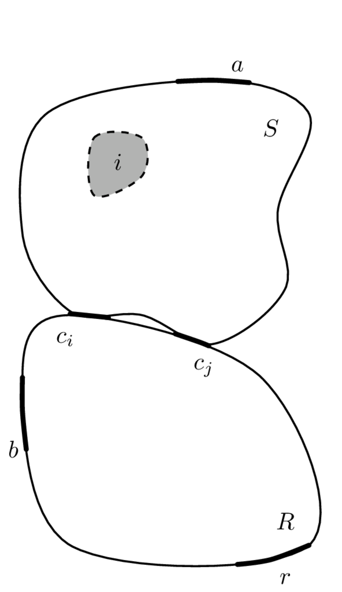
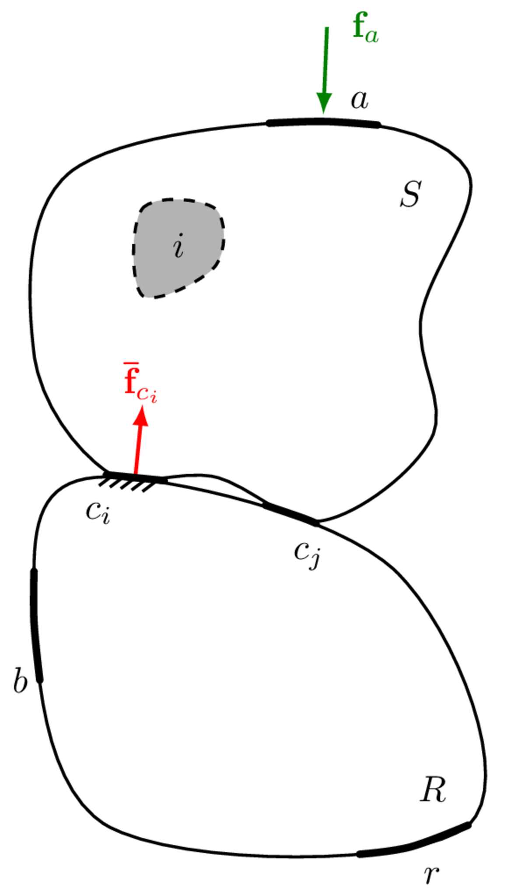
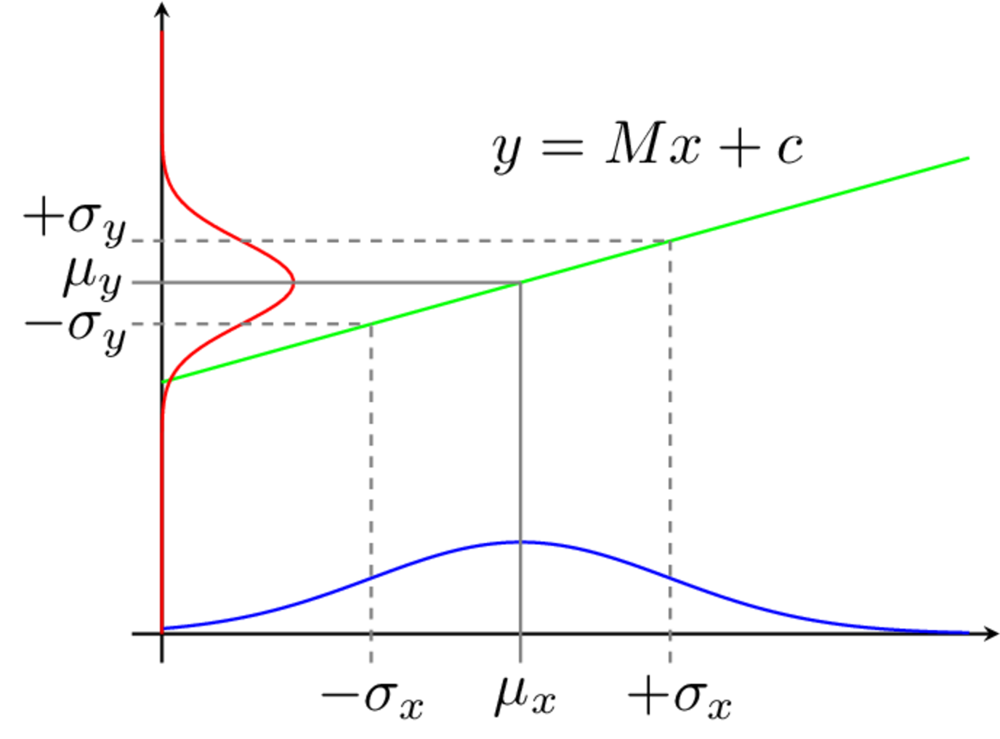
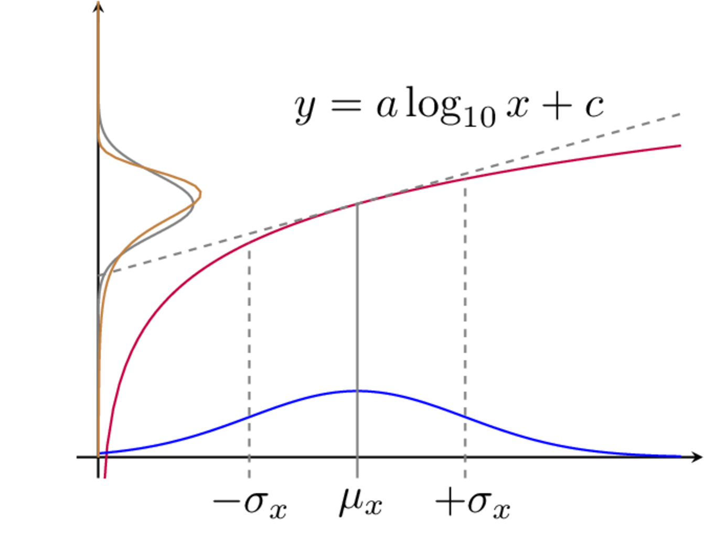

Over the previous pages we have covered pretty much everything we need to build a working VAVP. Of course some more advanced/specific topics have been omitted for brevity (for example, we havn't really discussed the particulars of how we go about solving the inverse problem for the blocked forces, including the use of regularisation). These topics are covered in much greater detail in the book [Experimental Vibro-acoustics](../../../book/book.qmd). 

The last thing to consider is an evaluation of the uncertainties of our VAVP. Though we have left our treatment of uncertainty to last, this is not to say that uncertainty should be treated as an after thought! The importance of appropriate uncertainty analysis cannot be understated; it is fair to argue that the output of any model is meaningless, unless it is accompanied by a measure of its reliability. And so on this page, we introduce the main tools required to furnish our VAVP output with a measure of confidence, specifically in the form of a response prediction confidence bound. 

## Categorisation of uncertainty in VAVP
In order to minimise the unwanted effects of uncertainty, it is necessary to understand their underlying cause. In development of a VAVP (or the application of blocked force and/or sub-structuring methods) the uncertainties encountered may be categorized as originating from the 'Model', the 'Source', or the 'Experiment'.

### Model uncertainty 
Model uncertainties arise when an approximate model is used to describe the physical problem. Obvious examples include the assumption of linearity and time invariance. Other important examples include the assumptions that: 

1) the interface of a structure can be treated as a series of point-like DoFs, 
2) that an interface description includes a sufficient number of DoFs,
3) the passive properties of an assembly do not change whilst under operation, among others. 

Strictly speaking, this form of 'model uncertainty' introduces a systematic/bias error as opposed to random uncertainty. In what follows we will introduce what we believe is the main source of model uncertainty, *interface completeness*.

| Type | Description | Category |
|:---|:---------|----|
| 1) Model | Uncertainty resulting from an approximate model being used to describe the physical problem. | Systematic |
| 2) Source | Uncertainty inherent to the operational behaviour of the source. | Random |
| 3) Experimental: | Uncertainty due to experimentation. | |
| *3a) Measurement* | *Due to the cumulative effect of noise sources in the measurement signal path and computation post processing.* | *Random* |
| *3b) Operator* |  *Due to human error in the measurement procedure.* | *Random* |
: Types of uncertainties encountered in VAVPs. {#tbl-uncertTypes}

### Source uncertainty
Source uncertainty arises due to the inherent variation in the activity of any vibration source. This variation may be considered the temporal variation (i.e. fluctuating activity) exhibited by a single vibration source, or the variation in activity between a series of nominally identical vibration sources. Source uncertainty is typically random in nature.

### Experimental uncertainty
Experimental uncertainty can be further subdivided into '*Measurement*' and '*Operator*' uncertainty. Measurement uncertainty describes the cumulative effect of noise sources within the measurement signal path and beyond. Typical examples include, external disturbances, thermo-electrical noise, sampling error, finite precision, etc. Measurement uncertainty is typically random in nature. Operator uncertainty describes the effect of human error in the measurement procedure. An important example is the inconsistent location and/ orientation of applied forces during the measurement of FRFs. Operator uncertainty is typically random in nature, although bias errors can be introduced if excitations are not be applied at the desired location. The presence of a bias error can often be absorbed by, or reinterpreted as, model uncertainty, e.g. a bias error in excitation position is often equivalent to redefining the position of a model DoF.

## Model uncertainty (interface completeness)
As described above, model uncertainty emanates from the use of an approximate model to describe a physical problem. Its effect is to introduce a systematic error. Whilst its underlying cause may vary from application to application, there exist two notable sources worth discussing here. These are related to the notions of *completeness* and *consistency*, the former of which we consider here. 

::: {.callout-note}
*Completeness* describes the degree to which the interface between two components has been correctly represented, for example, whether enough DoFs have been included. The completeness of an interface model is essential if independent blocked forces are to be obtained. The completeness of an interface description is also an essential requirement in the coupling and decoupling of substructures.
:::

Interface completeness is a general issue encountered whenever measurements are performed at the interface of one or more sub-structures. This includes not only the characterisation of blocked forces, but also the coupling and decoupling of substructures. To demonstrate the importance of completeness we will consider it from the perspective of a blocked force characterisation, though similar notions apply in other situations. 

::: {#fig-assemblies layout-ncol=2}

{width=60%}

{width=60%}

Unconstrained and partially constrained assemblies for use in deriving interface completeness criteria.
:::

Shown in @fig-assemblies (left) is a vibration source $S$ coupled via two sets of DoFs $c_i$ and $c_j$, to a receiver structure $R$. Completeness may be described as follows: suppose all of the interface DoFs ($c_i$ and $c_j$) are constrained such that their responses (displacement, velocity and acceleration) are zero, and an arbitrary internal or external force is applied to the source. If the interface has been described *completely* (i.e all DoFs are being constrained), then the resultant receiver response will be zero everywhere, since no vibration will be able to cross the blocked interface. We call this an *complete* interface representation (or interface model). Had only a portion of the interface been constrained, say the $c_i$ DoFs, then *some* vibration will find a way through the interface and into the receiver; its response will no longer be zero. We call this an *incomplete* interface representation. In what follows we will show that an incomplete interface representation is generally bad news... We will then introduce the *Interface Completeness Criterion* as a means of quantifying the degree of incompleteness as a tool to minimise it.

Considering first a *complete* interface representation, where all interface DoFs are contained within the set $c$. We have see in [Blocked forces](../blockedForce/blockedForce.qmd) that the blocked force can be obtained using the in situ relation, 
$$
 \mathbf{{\bar{f}}}_{{c}} = \mathbf{Y}_{C{bc}}^{+}\mathbf{{v}}_{{c}}
$$
where $C$ denotes the coupled assembly, and $b$ and $c$ are sets of remote (indicator) and interface DoFs, respectively. Once obtained, the blocked force can be used to identically reproduce the response in some new assembly $X$ at the target DoFs $r$ as, 
$$
 \mathbf{{{v}}}_{{r}} = \mathbf{Y}_{X{rc}} \mathbf{{\bar{f}}}_{{c}}.
$$
Let us now consider what happens if the interface model is *incomplete*. We do this by treating the interface $c$ as two sets of DoFs: those that are known and measurable, $c_i$; and those that are unknown, or known but unmeasurable, $c_j$. The in situ relation (in its forward form) can then be rewritten as the sum of their respective contributions,
$$
\mathbf{v}_{{b}}  = \mathbf{Y}_{C{bc_i}}\mathbf{\bar{f}}_{{c_i}} +\mathbf{Y}_{C{bc_j}}\mathbf{\bar{f}}_{_{c_j}}.
$${#eq-genProb}
As discussed in [Blocked forces](../blockedForce/blockedForce.qmd), the in situ characterisation of the blocked force requires the operational response to be pre-multiplied by the inverse of a measured FRF matrix. Recall that the $c_j$ DoFs are inaccessible for measurement, or perhaps unknown, and only the $\mathbf{Y}_{C{bc_i}}$ FRF is available. The blocked force is then given by,
$$
\mathbf{Y}_{C{bc_i}}^{-1}\mathbf{v}_{{b}}  = \mathbf{\tilde{\bar{f}}}_{{c_i}} = \mathbf{\bar{f}}_{{c_i}} +\mathbf{Y}_{C{bc_i}}^{-1}\mathbf{Y}_{C{bc_j}}\mathbf{\bar{f}}_{{c_j}}
$${#eq-acquiredBF}
where $\mathbf{\tilde{\bar{f}}}_{{c_i}}$ represents the acquired blocked force and $\mathbf{\bar{f}}_{{c_i}}$ its true value. Note that the true blocked force is accompanied by an additional term, $\mathbf{Y}_{C{bc_i}}^{-1}\mathbf{Y}_{C{bc_j}}\mathbf{\bar{f}}_{{c_j}}$. This has arisen due to the neglected DoFs $c_j$. This term constitutes a *bias error* on the true blocked force. Also notice that this additional term is dependent upon the dynamics of the coupled assembly. Consequently, the acquired blocked force is no longer an independent property of the source and is no longer transferable between assemblies! This is bad news for a VAVP... After all, one of the principle advantages of the blocked force over other source characterisation methods is that the acquired result may be transferred from one assembly, say a test bench, to another, say a virtual prototype. 

If we consider the transfer of this incomplete blocked force into a secondary assembly denote $X$ (say a VAVP), we obtain a response prediction of the form,
$$
\mathbf{\tilde{v}}_{X{r}}  =  \mathbf{Y}_{X{rc_i}}  \mathbf{{\bar{f}}}_{{c_i}} +\mathbf{Y}_{X{rc_i}} \mathbf{Y}_{C{bc_i}}^{-1}\mathbf{Y}_{C{bc_j}}\mathbf{\bar{f}}_{{c_j}}.
$$
whilst the true response (using the complete blocked force) takes the form,
$$
\mathbf{v}_{X{r}}  = \mathbf{Y}_{X{rc_i}}\mathbf{\bar{f}}_{{c_i}} +\mathbf{Y}_{X{rc_j}}\mathbf{\bar{f}}_{{c_j}}.
$$

It is clear from the above that the bias error we see on the blocked force carries through onto any response prediction. Obviously, we want to minimise the influence of this bias term, ideally removing it all together. The first step in doing so is coming up with a meaningful quantification of the severity of this error.

### Interface Completeness Criterion (ICC)
When characterising a component, it is of course beneficial to minimise the influence of bias errors due to incompleteness. Knowing this, it may be tempting to 'play safe' and ensure that the full 6 DoFs are included at every point. However, this may not be necessary, indeed if some DoFs do not contribute significantly then to include them would be undesirable a) because of the extra experimental effort involved and b) because the unnecessary measurements will add noise into the system without contributing to an accurate description of interface dynamics. For example, with resilient coupling it is often found that some DoFs are significantly softer than others and do not influence the interface dynamics to a great extent; rigid coupling at the interface on the other hand typically requires a greater number of DoFs to achieve a sufficient level of completeness. On the otherhand, in the mid-high frequency range, the point-like DoFs might not fully capture the interface dynamics, and a more robust interface model required (i.e. including some flexible interface dynamics). Clearly, there is great potential benefit in being able to *quantify* the completeness of an interface model prior to embarking on a full measurement campaign. 

To quantify completeness, we are interested in obtaining a measure of the bias error in @eq-acquiredBF relative to the true blocked force. However, this bias error, defined in terms of the unknown $c_j$ DoFs, cannot be measured directly. We need an indirect method to quantify it. 

Comparison of a predicted response (using an estimated blocked force) with the measured response should provide a measure of incompleteness. However, this is not a particularly robust approach for two reasons:

1. The operational forces within the source are not guaranteed to excite all of the interface DoFs, which is required for a true assessment of the interface completeness.
2. An operational blocked force might also be subject to inconsistency, i.e. discrepancies might not be due to incompleteness alone. 

A solution is to replace the operational blocked force with those obtained using *artificial excitations*, i.e. external forces applied to the housing of the source, usually by an instrumented force hammer. Artificial excitations can be applied in any number, and in such a way to ensure that all interface DoFs are excited, overcoming issue 1. Also, with the source remaining inactive, inconsistencies between active and passive quantities (issue 2) are also avoided.

So, the response produced by an artificial excitation at some remote location $a$ on the source, can be reproduced identically by the corresponding (artificial) blocked force according to, 
$$
        \mathbf{v}_{{c_i}}  = \mathbf{Y}_{C{c_ic_i}}\mathbf{\bar{f}}_{{c_i}} = \mathbf{Y}_{C{c_ia}}\mathbf{{f}}_{a}.
$${#eq-blockFComplete2}
From the above we obtain a transmissibility-based relation between the artificial excitation force and the resulting blocked force,
$$
    \mathbf{\bar{f}}_{{c_i}} = \mathbf{Y}_{C{c_ic_i}}^{-1}\mathbf{Y}_{C{c_ia}}\mathbf{\bar{f}}_{a}.
$$
Using the blocked force, we are able to predict the response at the remote receiver DoFs $b$,
$$
        \mathbf{v}_{{b}}  = \overbrace{\mathbf{Y}_{C{bc_i}}\mathbf{Y}_{C{c_ic_i}}^{-1}\mathbf{Y}_{C{c_ia}}}^{\mathbf{Y}_{C{ba}}^{(c_i)}}\mathbf{{f}}_{a}. 
$${#eq-ICC_eq}
Noting that @eq-ICC_eq simply relates the external force at $a$ to the response at $b$, its FRF product must be the transfer FRF from $a$ to $b$, $\mathbf{Y}_{C{ba}}^{(c_i)}$. Here we use the superscript $\square^{(c_i)}$ to denote that the FRF reconstruction is done only through the interface DoFs $c_i$. 

With a complete interface ($c=c_i$), the reconstructed FRF $\mathbf{Y}_{C{ba}}^{(c_i)} = \mathbf{Y}_{C{bc_i}}\mathbf{Y}_{C{c_ic_i}}^{-1}\mathbf{Y}_{C{c_ia}}$ is identically equal to the direct FRF $\mathbf{Y}_{C{ba}}$ (in practice small discrepancies due to experimental error will be present). However, with an *incomplete* interface, the contribution of the neglected $c_j$ DoFs will not be accounted for by $\mathbf{Y}_{C{ba}}^{(c_i)}$, though will be present in $\mathbf{Y}_{C{ba}}$. As a result an approximation is introduced. The level of agreement between the reconstructed and direct FRFs is proportional to the bias error in @eq-acquiredBF.
Therefore, to quantify completeness it is sufficient to assess the similarity of the direct and reconstructed FRFs, $\mathbf{Y}_{C{ba}}$ and $\mathbf{Y}_{C{ba}}^{(c_i)}$. To this end, a correlation-based measure of similarity yields the so-called *Interface Completeness Criterion* (ICC),
$$
\begin{align}
    &\mbox{ICC} = \mbox{Corr}\left(\mbox{Vec}\left({\mathbf{Y}}_{{C}{ba}}^{{(c)}}\right),\mbox{Vec}\left({\mathbf{Y}}_{{C}{ba}}^{{(c_i)}}\right)\right) \\
    & \mbox{Corr}\left(\mathbf{a},\mathbf{b}\right) = \frac{ \left|\mathbf{a}^{\rm H}\mathbf{b} \right|^2 }{ \mathbf{a}^{\rm H} \mathbf{a} \cdot \mathbf{b}^{\rm H}\mathbf{b}}
\end{align}
$${#eq-ICCeq}
where $\mbox{Vec}\left({\square}\right)$ denotes matrix column-wise vectorisation and $\square^{\rm H}$ represents a conjugate transpose. Note that to form the necessary vectors, multiple excitation and/or response DoFs ($b$ and $a$) should be considered when measuring the necessary FRFs. Ideally, the excitations $a$ should be sufficient in number, and varied in direction, such that they are able to control all interface motions in the frequency range of interest. This requires the number of $a$ points to be equal to or greater than the number of interface DoFs. Similarly, the responses positions $b$ should be such that they are sufficient in number and orientation to observe all interface motions. This requires the number of $b$ points to also be equal to or greater than the number of interface DoFs. 

If the chosen interface representation is complete, that is, $|c_i| = |c|$, the ICC will be equal to one. If the interface description is incomplete, $|c_i| < |c|$  the ICC will be less than 1. In practice, it is important to note that the FRFs used in @eq-ICCeq are obtained from measurement and are therefore subject to some degree of uncertainty. Consequently, even in the case of a complete interface representation, an ICC equal to 1 is unlikely to be achieved (though the authors have found it usually straightforward to distinguish noise-induced discrepancies, which tend to be localised in frequency, with those from neglected DoFs which tend to cover a wide frequency range).

The ICC provides a measure of interface completeness irrespective of the operating nature of the connected components. For example, suppose a vibration source generates forces exclusively in the vertical $z$ DoFs. Whilst a decent blocked force characterisation might be obtained using the $z$ DoFs alone, this would not constitute a complete interface representation according to the ICC if other DoFs are important for the coupling. The ICC considers completeness more generally, specifically with respect to the applied forces at $a$ and observed responses at $b$.

The ICC can be used also to assess the completeness of interface representations for structural coupling and decoupling problems. For decoupling, tests are required on the assembled structure (target component coupled to residual test bench), and so the ICC can be applied as standard. For coupling problems, one usually only measures the component in its free-interface configuration, from which the ICC can not be computed. The component must be installed onto some test bench such that ICC can be computed its interface representation be assessed. 

## Random uncertainty

In the above we considered role of *model uncertainty*, specifically *completeness* and its introduction of a systematic error onto the blocked force. Here, we turn our  attention towards the role of *random uncertainty*. 

Random uncertainties, or random errors, are those which, over a series of repeated measurements, *randomly* fluctuate about the true value of the measurand. Whilst all measurements are subject to some degree of random uncertainty, it is often not the measurements themselves that we are interested in. Rather, these measurements are used to infer or derive some other quantity. For example, we measure operational responses and FRFs, not for their own sake, but to calculate a blocked force or to perform substructuring. The question is then, how do the random errors in our measurements affect the estimates of derived quantities? That is, how does the uncertainty *propagate* through our VAVP equations? Answering this question will be the focus of the remainder of this page.

### Quick stats. recap

#### Mean
The mean is a measure of central tendency. Given a discrete set of values, for example the repeated measurement of a quantity $x$, it is calculated as,
$$
\mathbb{E}[{x}]= \frac{1}{N} \sum_n^N {x_n} = \mu_x
$$
where $x_n$ is the $n$th sample of the quantity $x$, and $N$ is the total number of measured samples. For vector or matrix quantities we can similarly calculate the mean value as,
$$
\mathbb{E}[\mathbf{x}] = \frac{1}{N} \sum_n^N \mathbf{x}_n = \mathbf{\mu_x}
$$
where $\mathbf{x}_n$ is the $n$th sample of the vector (or matrix) quantity $\mathbf{x}$.

If the mean value is calculated from a number of repeated measurements, then it is called the sample mean. This is not to be confused with the true mean. In an experimental context, the true mean corresponds to the value of the measureand, in the absence of any random/and or bias errors. According to the Law of Large Numbers, in the absence of any systematic bias errors the sample mean obtained from a large number of repeated experiments, should be close to the true mean, and tend towards it as the number of experiments increases.

The true mean, or the population mean, of a quantity is equal to the calculated mean only when every member of the `population' is included.
In an experimental setting the population of experiments is infinite, and so the true mean can only be approximated using the sample mean obtained from a sufficient number of repeated measurements. It is important to note that if an insufficient number of measurements are taken, the sample mean may differ considerably from the true mean. 

#### Variance and covariance
Variance is a measure of how far a set of values are spread out from the mean.  Given a discrete set of values, for example the repeated measurement of a quantity $x$, the variance is calculated as,
$$
\mbox{Var}(x) = \frac{1}{N-1}\sum_{n=1}^N (x_n-{\mu_x})^2=\sigma^2_x.
$${#eq-var2}
where $\sigma_x$ is termed the standard deviation. The variance and standard deviation are a strictly positive quantities, which get larger as the data becomes more widely spread. 

Strictly speaking, @eq-var2 is called the *sample* variance, as opposed to the population variance because it is based on the sample mean, which is not necessarily equal to the population mean. The sample *vs.* population mean can introduce a bias error on the estimate of $\sigma_x^2$. The use of $N-1$ as opposed to $N$ ensures that the sample variance gives an unbiased estimate of the population variance. Clearly, this only has a noticeable effect when $N$ is quite small.

Variance describes the variability of a measured quantity, say $x$. Covariance describes the *joint variability* between two measured quantities, say $x$ and $y$. The sample covariance is calculated as,
$$
\mbox{Cov}(x,y) = \frac{1}{N-1}\sum_{n=1}^N (x_n-\mu_x)(y_n-\mu_y) =\sigma_{xy}^2.
$${#eq-cov}
Unlike the variance, covariance can be positive or negative depending on how $x$ and $y$ vary relative to one another. For example, suppose we have a set of measurements for $x$ and $y$. If the larger values of $x$ correspond mostly with larger values of $y$, and the same holds for small values - $x$ and $y$ have similar behaviour - then their covariance is positive. Conversely, if the larger values of $x$ correspond mostly with smaller values of $y$, and visa versa - $x$ and $y$ have opposite behaviour - then their covariance is negative. The sign of the covariance shows the linear tendency between $x$ and $y$.

**The notion of covariance is particularly important when dealing with the uncertainty of FRF matrices, the elments of which are often highly correlated with each other.**

For vector quantities, the notion of covariance can be extended to a covariance matrix. Given a set of measurements for the vector quantity $\mathbf{x}$, its sample covariance matrix is calculated as, 
$$
\boldsymbol{\Sigma}_{\mathbf{x}} = \frac{1}{N-1}\left[\left(\mathbf{\hat{x}} - \mathbf{\mu_x}\mathbf{1}^{\rm T}\right)\left(\mathbf{\hat{x}} -  \mathbf{\mu_x}\mathbf{1}^{\rm T}\right)^{\rm T}\right]
$${#eq-covMateq}
where, to avoid summation notation, the repeated $N$ measurements of the vector $\mathbf{x}$ are arranged into the columns of a measurement matrix $\mathbf{\hat{x}}$,
$$
    \mathbf{\hat{x}} = \left[\begin{array}{cccc}
       \mathbf{x}^{(1)}  & \mathbf{x}^{(2)} & \cdots & \mathbf{x}^{(N)}
    \end{array}\right]
$$
from which the mean value can be subtracted by column stacking the mean vector $\mathbf{\mu_x}$ using,
$$
    \mathbf{\mu_x}\mathbf{1}^{\rm T} = \left[\begin{array}{ccc}
       \mathbf{\mu_x} & \cdots & \mathbf{\mu_x}
    \end{array}\right]
$$
where $\mathbf{1}$ is simply an $N$ dimensional vector of 1s.

Note that the diagonal entries of $\boldsymbol{\Sigma}_{\mathbf{x}}$ correspond to the variances of each element of $\mathbf{x}$, whilst the off-diagonal entries (covariances) satisfy $\left(\boldsymbol{\Sigma}_{\mathbf{x}}\right)_{ij} = \left(\boldsymbol{\Sigma}_{\mathbf{x}}\right)_{ji}$, i.e. the covariance matrix is symmetric. 

We can similarly calculate a covariance matrix between two vector quantities $\mathbf{x}$ and $\mathbf{y}$, 
$$
\boldsymbol{\Sigma}_{\mathbf{xy}} = \frac{1}{N-1}\left[\left(\mathbf{\hat{x}} - \mathbf{\mu_x}\mathbf{1}^{\rm T}\right)\left(\mathbf{\hat{y}} - \mathbf{\mu_y}\mathbf{1}^{\rm T}\right)^{T}\right].
$${#eq-covMateq2}
Note that the diagonal elements of $\boldsymbol{\Sigma}_{\mathbf{xy}}$ are not variances in this case, but covariances. 

For matrix quantities $\mathbf{X}$ and $\mathbf{Y}$ we can calculate a covariance matrix $\boldsymbol{\Sigma}_{\mathbf{XY}}$ in the same way as for the vectors $\mathbf{x}$ and $\mathbf{y}$. To do so we have to restructure each matrix into a (tall) vector. This is done by taking each column of the matrix $\mathbf{X}\in\mathbb{R}^{N\times M}$ (starting with the left most column) and stacking them vertically on top of one another such that $\mbox{Vec}(\mathbf{X}) = \mathbf{\vec{X}}\in\mathbb{R}^{NM}$. We call $\mbox{Vec}(\quad)$ the vectorisation operator. Here is an example,
$$
\mbox{Vec}\left(\left[\begin{array}{c c c}
A & B & C \\ D & E & F \\ H & I & J\end{array}\right]\right) = \left(\begin{array}{c } A \\ D \\H \\B \\E\\I\\C\\F\\J \end{array}\right).
$$
Utilising the vectorisation operator, the covariance matrix of $\mathbf{X}$ from $N$ measurements is given by, 
$$
\boldsymbol{\Sigma}_{\mathbf{X}} = \frac{1}{N-1}\left[\left(\mathbf{\hat{X}} - \mathbf{\mu}_{\vec{\mathbf{X}}}\mathbf{1}^{\rm T}\right)\left(\mathbf{\hat{X}} - {\mathbf{\mu}}_{\vec{\mathbf{X}}}\mathbf{1}^{\rm T}\right)^{\rm T}\right]
$${#eq-covMateq3}
where the measurement matrix $\mathbf{\hat{X}}$ is built from the vectorisation of each measured matrix,
$$
    \mathbf{\hat{X}} = \left[\begin{array}{cccc}
         \vec{\mathbf{X}}^{(1)} & \vec{\mathbf{X}}^{(2)} &\cdots &\vec{\mathbf{X}}^{(N)}
    \end{array}\right]
$${#eq-covMeasMat}
and $\mathbf{\mu}_{\vec{\mathbf{X}}}$ is the vectorisation of the matrix mean. 

For the covariance between two matrices, say $\mathbf{X}$ and $\mathbf{Y}$ we have similarly,
$$
\boldsymbol{\Sigma}_{\mathbf{XY}} = \frac{1}{N-1}\left[\left(\mathbf{\hat{X}} - \mathbf{\mu}_{\vec{\mathbf{X}}}\mathbf{1}^{\rm T}\right)\left(\mathbf{\hat{Y}} - {\mathbf{\mu}}_{\vec{\mathbf{Y}}}\mathbf{1}^{\rm T}\right)^{\rm T}\right]
$${#eq-covMateq4}

We will use the above formulae for vector and matrix covariance matrices later to characterise the uncertainty in measured operational velocities and FRFs.

::: {.callout-note} 
Recall that all of our VAVP equation are set in the frequency domain... Consequently, all of our variables are complex quantities, they have magnitude and phase (or a real and imaginary part)! We will have to adapt the above definitions of variance and covariance to deal with this. Its an easy fix, but we will save it for later. 

In addition to the above, there are some particulars related to obtaining robust covariance matrices which are beyond the scope of this introduction. 
:::

### Law of propagation of uncertainty (LPU)
Propagation of uncertainty (or error) is the procedure by which the uncertainties in one or more input variables (such as a set of measured quantities) are used to predict the uncertainty on the output of a function that depends on them. For example, in the context of a blocked force characterisation, we may wish to know the uncertainty in our estimate of the blocked force given the uncertainty in a measured FRF matrix. 

Here we will limit our discussion to probabilistic methods, in particular a local expansion-based method known as the Law of Propagation of Uncertainty (LPU). This method has advantages when being used with relatively small levels of uncertainty, or functions that do not express considerable non-linearity. In the presence of large uncertainty or very non-linear functions we will resort to sampling based method using Monte-Carlo simulations.

The LPU is based on a first order (linear) Taylor series expansion of the function through which uncertainty is propagated. In this sense, we can think of LPU as also meaning Linear Propagation of Uncertainty. As we will see shortly, after some manipulations an expression is obtained that relates the covariance matrix of the measured input variables to that of the output. These covariance matrices are related by a matrix of partial derivatives (termed a Jacobian matrix). An illustrative example of the LPU is shown in ??? for a simple single input single output function. Below we derive the general LPU for multiple inputs and multiple outputs. 

::: {#fig-assemblies layout-ncol=2}

{width=75%}

{width=75%}

Illustration of LPU propagation. LPU approximates function by its local derivative. Gives an exact propagation of uncertainty for linear problems (left), and an approximation for non-linear functions (right). For multi-input/output functions the same idea applies, just in a higher dimension (i.e. the function is approximated by a hyper-plane rather than a straight line).
:::

We begin by considering $y_i$ and $y_j$, generally, as the outputs of some multi-variable function,
$$
y_i = G_i(x_1,x_2,\cdots,x_M) = G_i(\mathbf{x})
$$
$$
y_j = G_j(x_1,x_2,\cdots,x_M)= G_j(\mathbf{x}),
$$
where $\mathbf{x}=\left(x_1,\,x_2,\,\cdots,\,x_M\right)$ is a vector of input variables. 

We follow the same steps as before.  Suppose that we repeatedly measure each element of the input variable vector $\mathbf{x}$. Due to experimental error the result is perturbed by $\Delta\mathbf{x}$. This small change in the value of $\mathbf{x}$ will lead to a small change in the value of the output variables $y_i$ and $y_j$. Assuming that the input error  $\Delta\mathbf{x}$ remains small, the change in output  $\Delta y_i$ and $\Delta y_j$ may be approximated by a first order Taylor series expansion,
$$
\Delta y_{i} \approx \frac{\partial G_i(\mathbf{x})}{\partial x_1}\Delta x_{1} + \frac{\partial G_i(\mathbf{x})}{\partial x_2} \Delta x_{2} + \cdots+\frac{\partial G_i(\mathbf{x})}{\partial x_M}\Delta x_{M}
$${#eq-lawEP1}
$$
\Delta y_{j} \approx \frac{\partial G_j(\mathbf{x})}{\partial x_1}\Delta x_{1} + \frac{\partial G_j(\mathbf{x})}{\partial x_2} \Delta x_{2} + \cdots+\frac{\partial G_j(\mathbf{x})}{\partial x_M}\Delta x_{M}
$${#eq-lawEP2}
where $\frac{\partial G_j(\mathbf{x})}{\partial x_M}$ is the partial derivative of the propagation function $G_j(\square)$ with respect to the $M$th input variable. Using subscript ${\square}_n$ to denote the $n$th measurement, Equation @eq-lawEP1 and @eq-lawEP2 may be written more conveniently using summation notation, 
$$
\Delta y_{i_n} \approx \sum_m^M \frac{\partial G_i(\mathbf{x})}{\partial x_m}\Delta x_{m_n}
$${#eq-lawEP3}
$$
\Delta y_{j_n} \approx  \sum_m^M \frac{\partial G_j(\mathbf{x})}{\partial x_m}\Delta x_{m_n}.
$${#eq-lawEP4}

Now that we have two output variables, $y_i$ and $y_j$, we are also interested in determining the covariance between them. To do so, we begin by multiplying together @eq-lawEP3 and @eq-lawEP4, 
$$
\Delta y_{i_n}\Delta y_{j_n} \approx \left(\sum_m^M \frac{\partial G_i(\mathbf{x})}{\partial x_m}\Delta x_{m_n}\right)\left( \sum_m^M \frac{\partial G_j(\mathbf{x})}{\partial x_m}\Delta x_{m_n}\right).
$$
Summing over $N$ measurements and dividing both sides by $N-1$ yields,
$$
 \frac{1}{N-1}\sum_n^N\Delta y_{i_n}\Delta y_{j_n} \approx  \frac{1}{N-1}\sum_n^N \left(\sum_m^M \frac{\partial G_i(\mathbf{x})}{\partial x_m}\Delta x_{m_n}\right)\left( \sum_m^M \frac{\partial G_j(\mathbf{x})}{\partial x_m}\Delta x_{m_n}\right).
$$
By expanding the brackets,
$$
\begin{align}
 \frac{1}{N-1}\sum_n^N\Delta y_{i_n}\Delta y_{j_n} \approx \frac{1}{N-1}\sum_n^N \Bigg[ \frac{\partial G_i(\mathbf{x})}{\partial x_1}\Delta x_{1_n}\left( \sum_m^M \frac{\partial G_j(\mathbf{x})}{\partial x_m}\Delta x_{m_n}\right) + \frac{\partial G_i(\mathbf{x})}{\partial x_2}\Delta x_{2_n} \\\left( \sum_m^M \frac{\partial G_j(\mathbf{x})}{\partial x_m}\Delta x_{m_n}\right)+\cdots+
\frac{\partial G_i(\mathbf{x})}{\partial x_M}\Delta x_{M_n}\left( \sum_m^M \frac{\partial G_j(\mathbf{x})}{\partial x_m}\Delta x_{m_n}\right)\Bigg]
\end{align}
$$
and regrouping terms we get,
$$
\begin{align}
 \frac{1}{N-1}\sum_n^N\Delta y_{i_n}\Delta y_{j_n} \approx \sum_m^M  \frac{\partial G_i(\mathbf{x})}{\partial x_m} \frac{\partial G_j(\mathbf{x})}{\partial x_m} \frac{1}{N-1}\sum_n^N\Delta x_{m_n}\Delta x_{m_n} +\\ \sum_{m\neq l}\frac{\partial G_i(\mathbf{x})}{\partial x_l} \frac{\partial G_j(\mathbf{x})}{\partial x_m}\frac{1}{N-1}\sum_n^N\Delta x_{l_n}\Delta x_{m_n}
\end{align}
$${#eq-LeP5}
Recalling the definitions of variance and covariance from @eq-var2 and @eq-cov, @eq-LeP5 can be rewritten as, 
$$
\sigma_{y_{i}y_j} \approx \sum_m^M  \frac{\partial G_i(\mathbf{x})}{\partial x_m} \frac{\partial G_j(\mathbf{x})}{\partial x_m}\sigma_{x_m}^2 + \sum_{m\neq l}\frac{\partial G_i(\mathbf{x})}{\partial x_l} \frac{\partial G_j(\mathbf{x})}{\partial x_m}\sigma_{x_lx_m}^2
$${#eq-LeP6}
where $\sigma_{y_{i}y_j}$ is the covariance between the output variables $y_i$ and $y_j$, $\sigma_{x_m}^2$ is the variance of the input variable $x_m$, and $\sigma_{x_lx_m}^2$ is the covariance between the input variables $x_l$ and $x_m$.
For the case that $i=j$ @eq-LeP6 reduces to,
$$
\sigma_{y_{i}}^2 \approx \sum_m^M  \left(\frac{\partial G_i(\mathbf{x})}{\partial x_m} \right)^2\sigma_{x_m}^2 + \sum_{m\neq l}\frac{\partial G_i(\mathbf{x})}{\partial x_l} \frac{\partial G_i(\mathbf{x})}{\partial x_m}\sigma_{x_lx_m}
$${#eq-LeP7}
where $\sigma_{y_{i}}^2$ is the variance of the output variable $y_i$.

The first summation in @eq-LeP6 and @eq-LeP7 describes the propagation of input variance onto the output uncertainty. The second summation describes the influence of input covariance (i.e. correlations between the input variables) on the output uncertainty. Often when dealing with uncertainty propagation the simplifying assumption of uncorrelated input variables is made, that is $\sigma_{x_lx_{m\neq l}}=0$. The output variance then reduces to,
$$
\sigma_{y_{i}}^2 \approx \sum_m^M  \left(\frac{\partial G_i(\mathbf{x})}{\partial x_m} \right)^2\sigma_{x_m}^2.
$${#eq-LeP8}

::: {.callout-note}
Unfortunately, the experimental measurements associated with blocked forces and dynamic substructuring often yield highly correlated input variables. This is especially so for impact-based FRF measurements. 

The impact-based measurement of an FRF matrix involves the operator exciting the component at each DoF of interest using an instrumented force hammer, whilst simultaneously measuring the response at all DoFs. Typically, to improve SNR and/or provide a measure of coherence, multiple impacts are applied at each DoF. Of course, there will always exist some variation in the position and orientation of these repeated impacts (nobody's perfect!). Naturally, the FRFs for each impact will differ. With all responses measured simultaneously, they clearly share the same underlying *operator uncertainty* (i.e. varying impact position/orientation) and so they are likely to possess some correlation. 

For this reason, our uncertainty propagation must be conducted using @eq-LeP6. It has been shown that neglecting this *inter-FRF* uncertainty can lead to large over estimations of uncertainty in VAVP predictions. 
:::

#### Matrix form of LPU
When dealing with large numbers of input and output variables it is far more convenient to express @eq-LeP6 in matrix form. This is done by using the equation,
$$
\sigma_{y_{i}y_j} \approx \mathbf{J}_{i} \boldsymbol{\Sigma}_{\mathbf{x}}\mathbf{J}_{j}^{\rm T}
$$
where,
$$
\mathbf{J}_i = \left[\begin{array}{c c c c}\frac{\partial G_i(\mathbf{x})}{\partial x_1} & \frac{\partial G_i(\mathbf{x})}{\partial x_2} & \cdots & \frac{\partial G_i(\mathbf{x})}{\partial x_M} \end{array}\right]\quad 
$$ and 
$$
\mathbf{J}_j= \left[\begin{array}{c c c c}\frac{\partial G_j(\mathbf{x})}{\partial x_1} & \frac{\partial G_j(\mathbf{x})}{\partial x_2} & \cdots & \frac{\partial G_j(\mathbf{x})}{\partial x_M} \end{array}\right]
$$
are the Jacobian matrices of the functions $y_i = G_i(\mathbf{x})$ and  $y_j = G_j(\mathbf{x})$, respectively, and $\boldsymbol{\Sigma}_{\mathbf{x}}$ is the covariance matrix of the input vector $\mathbf{x}$,
$$
\boldsymbol{\Sigma}_{\mathbf{x}} = \left[\begin{array}{c c c c} \sigma_{x_1}^2 & \sigma_{x_{1}x_{2}}^2 & \cdots & \sigma_{x_{1}x_{M}}^2 \\\sigma_{x_{2}x_{1}}^2 & \sigma_{x_2}^2 & \cdots & \sigma_{x_{2}x_{M}}^2 \\ \vdots & \vdots & \ddots & \vdots \\ \sigma_{x_{M}x_{1}}^2 & \sigma_{x_{M}x_{2}}^2 & \cdots & \sigma_{x_M}^2\end{array}\right].
$${#eq-MatLeP3}

Now that we have a concise expression for $\sigma_{y_{i}y_j}$, we can go one step further by combing the Jacobian matrices for multiple output variables,
$$
\mathbf{J} = \left[\begin{array}{c c c c}\frac{\partial G_1(\mathbf{x})}{\partial x_1} & \frac{\partial G_1(\mathbf{x})}{\partial x_2} & \cdots & \frac{\partial G_1(\mathbf{x})}{\partial x_M} \\[0.25cm] 
\frac{\partial G_2(\mathbf{x})}{\partial x_1} & \frac{\partial G_2(\mathbf{x})}{\partial x_2} & \cdots & \frac{\partial G_2(\mathbf{x})}{\partial x_M} \\[0.25cm] 
\vdots &\vdots & \ddots & \vdots\\[0.25cm] 
\frac{\partial G_L(\mathbf{x})}{\partial x_1} & \frac{\partial G_L(\mathbf{x})}{\partial x_2} & \cdots & \frac{\partial G_L(\mathbf{x})}{\partial x_M}\end{array}\right]\quad.
$${#eq-Jacob1}
The uncertainty propagation,
$$
\boldsymbol{\Sigma}_{\mathbf{y}} \approx \mathbf{J} \boldsymbol{\Sigma}_{\mathbf{x}}\mathbf{J}^{\rm T}
$${#eq-MatLeP4}
then yields a covariance matrix for the output variable vector $\mathbf{y} = \left(y_1,\,y_2,\,\cdots,\,y_L\right)$,
$$
\boldsymbol{\Sigma}_{\mathbf{y}} = \left[\begin{array}{c c c c} \sigma_{y_1}^2 & \sigma_{y_{1}y_{2}}^2 & \cdots & \sigma_{y_{1}y_{L}}^2 \\\sigma_{y_{2}y_{1}}^2 & \sigma_{y_2}^2 & \cdots & \sigma_{y_{2}y_{L}}^2 \\ \vdots & \vdots & \ddots & \vdots \\ \sigma_{y_{L}y_{1}}^2 & \sigma_{y_{L}y_{2}}^2 & \cdots & \sigma_{y_L}^2\end{array}\right].
$${#eq-MatLeP2}

@eq-MatLeP3 - @eq-MatLeP2 describe, generally, the linear propagation of uncertainty. It is important that the Jacobians are evaluated at the true value of $\mathbf{x}$, which we approximate by its mean value $\mathbf{\mu_x}$. These equations will form the basis of the VAVP uncertainty propagation described below.

### LPU for VAVP calculations
#### Dealing with complex variables
The LPU, as detailed above, has been formulated to deal with real-valued functions of a real input variables. However, the problems of interest, namely blocked force characterisation, dynamic substructuring and response predictions, are all formulated in the frequency domain. Consequently, all our variables are complex, having both a magnitude and phase. To apply the LPU to a complex-valued function of a complex input variable some minor modification must be made. There are two approaches to do this, differing based on how the complex values are split. One approach is to treat the complex value and its conjugate as independent variables. Alternatively, the real and imaginary parts of the complex number can be treated as separate real variables. The authors find this approach the most intuitive and so the uncertainty framework presented here is done in this way. 

Consider the complex variable $H=a+ib$. Separating its real and imaginary parts, we can rewrite $H$ instead as the $2\times 1$ column vector,
$$
H \rightarrow  \left(\begin{array}{c}
\mathrm{Re}(H)\\
\mathrm{Im}(H)\end{array}\right).
$$
Supposing $H$ is a measured quantity, its mean value is given by,
$$
\mu_H= \mu_{a+ib} = \mu_a+i\mu_b \rightarrow  \left(\begin{array}{c}
\mu_{\mathrm{Re}(H)}\\
\mu_{\mathrm{Im}(H)}\end{array}\right).
$$
Having separated the real and imaginary parts of $H$, we can no longer define a single variance term to describe its uncertainty. Rather, we use the covariance matrix,
$$
{\sigma}^2_H \rightarrow \boldsymbol{\Sigma}_H = \left[\begin{array}{c c}
\sigma_{\mathrm{Re}(H)}^2 & \sigma_{\mathrm{Re}(H)\mathrm{Im}(H)}^2\\
\sigma_{\mathrm{Im}(H)\mathrm{Re}(H)}^2 & \sigma_{\mathrm{Im}(H)}^2\end{array}\right]
$$
where $\sigma_{\mathrm{Re}(H)}^2$ is the variance of the real part of $H$, $\sigma_{\mathrm{Im}(H)}^2$ is the variance of the imaginary part of $H$, and $\sigma_{\mathrm{Re}(H)\mathrm{Im}(H)}^2$ is the covariance between the two. This *bivariate* covariance matrix describes the uncertainty in the complex variable $H$. The same idea can be used to express the covariance between two different complex variables $H_1$ and $H_2$,
$$
\boldsymbol{\Sigma}_{H_1H_2} = \left[\begin{array}{c c}
\sigma_{\mathrm{Re}(H_1)\mathrm{Re}{(H_2)}}^2 & \sigma_{\mathrm{Re}(H_1)\mathrm{Im}{(H_2)}}^2 \\ \sigma_{\mathrm{Im}(H_1)\mathrm{Re}{(H_2)}}^2 & \sigma_{\mathrm{Im}(H_1)\mathrm{Im}{(H_2)}}^2
\end{array}\right].
$$
Hereafter, we will use the term '*bivariate*' more generally to describe any covariance or Jacobian matrix that has had its complex values separated into real and imaginary parts.

Further extension to complex *vector and matrix* variables is straightforward. We can define the operator,
$$
M_v(H) = \left(\begin{array}{c}
\mathrm{Re}(H)\\
\mathrm{Im}(H)\end{array}\right)
$$
which separates and stacks vertically the real and imaginary parts of the complex variable $H$. By applying $M_v(\quad)$ to each element of $\mathbf{{x}}$, $\mu_\mathbf{x}$, $\mathbf{{y}}$, and $\mu_\mathbf{y}$ @eq-covMateq and @eq-covMateq2 will compute bivariate forms of the covariance matrices $\boldsymbol{\Sigma}_{\mathbf{x}}$ and $\boldsymbol{\Sigma}_{\mathbf{xy}}$. For a complex matrix variable, the vectorisation operator $\mbox{Vec}(\quad)$ is applied first, before $M_v(\quad)$ is applied element-wise. As an example, the bivariate form of @eq-MatLeP3 is given by,
$$
\boldsymbol{\Sigma}_{\mathbf{x}} = \left[\begin{array}{c c  c  c } 
\boldsymbol{\Sigma}_{x_1x_1} & \boldsymbol{\Sigma}_{x_1x_2} & \cdots  & \boldsymbol{\Sigma}_{x_1x_M} \\
\boldsymbol{\Sigma}_{x_2x_1} & \boldsymbol{\Sigma}_{x_2x_2} & \cdots  & \boldsymbol{\Sigma}_{x_2x_M} \\
\vdots & \vdots & \ddots & \vdots \\
\boldsymbol{\Sigma}_{x_Mx_1} & \boldsymbol{\Sigma}_{x_Mx_2} & \cdots  & \boldsymbol{\Sigma}_{x_Mx_M} \\
\end{array}\right]
$$
where each univaraite element has been replaced by a $2\times 2$ bivariate covariance matrix,
$$
\sigma_{x_ix_j}^2 \rightarrow \boldsymbol{\Sigma}_{x_ix_j} = \left[\begin{array}{c c}
\sigma_{\mathrm{Re}(x_i)\mathrm{Re}(x_j)}^2 & \sigma_{\mathrm{Re}(x_i)\mathrm{Im}(x_j)}^2\\
\sigma_{\mathrm{Im}(x_i)\mathrm{Re}(x_j)}^2 & \sigma_{\mathrm{Im}(x_i)\mathrm{Im}(x_j)}^2\end{array}\right].
$$

To propagate the bivariate complex uncertainty it is necessary to redefine the Jacobian matrices accordingly. The bivariate form of the Jacobian is given by
$$
\mathbf{J} = \left[\begin{array}{c c c c}\frac{\partial \mathbf{G}_1(\mathbf{x})}{\partial {x_1}} & \frac{\partial \mathbf{G}_1(\mathbf{x})}{\partial {x_2}} & \cdots & \frac{\partial \mathbf{G}_1(\mathbf{x})}{\partial {x_M}} \\[0.25cm] 
\frac{\partial \mathbf{G}_2(\mathbf{x})}{\partial{x_1}} & \frac{\partial \mathbf{G}_2(\mathbf{x})}{\partial {x_2}} & \cdots & \frac{\partial \mathbf{G}_2(\mathbf{x})}{\partial {x_M}} \\[0.25cm] 
\vdots &\vdots & \ddots & \vdots\\[0.25cm] 
\frac{\partial \mathbf{G}_L(\mathbf{x})}{\partial {x_1}} & \frac{\partial \mathbf{G}_L(\mathbf{x})}{\partial {x_2}} & \cdots & \frac{\partial \mathbf{G}_L(\mathbf{x})}{\partial {x_M}}\end{array}\right]
$${#eq-bivJacob}
where we have simply replaced each partial derivative in @eq-Jacob1, with a $2\times2$ matrix containing the partial derivatives of the real and imaginary parts of the output, with respect to the real and imaginary parts of the input,
$$
\frac{\partial {G_i}(\mathbf{x})}{\partial {x_j}}\rightarrow \frac{\partial \mathbf{G}_i(\mathbf{x})}{\partial {x_j}} = \left[\begin{array}{c c }\frac{\partial \mathrm{Re}(G_i(\mathbf{x}))}{\partial \mathrm{Re}(x_j)} & \frac{\partial \mathrm{Re}(G_i(\mathbf{x}))}{\partial \mathrm{Im}(x_j)}  \\[0.25cm]
\frac{\partial \mathrm{Im}(G_i(\mathbf{x}))}{\partial \mathrm{Re}(x_j)} & \frac{\partial \mathrm{Im}(G_i(\mathbf{x}))}{\partial \mathrm{Im}(x_j)}  \end{array}\right].
$${#eq-bivJacob2}

The bivariate covariance and Jacobian matrices described above are used in place of their univariate counter parts in @eq-MatLeP4 to propagate complex uncertainty. The resulting output uncertainty, characterised by the covariance matrix $\boldsymbol{\Sigma_\mathbf{y}}$, is also bivariate, with its elements describing the variance and covariance between the real and imaginary parts of its elements. 

The theory underlying VAVP construction has been described in detail over the previous pages. In short, there are three equations that govern majority of VAVP excersises. In the following sections we will briefly reintroduce these key equations, before summaring their LPU-based uncertainty propagation.

#### Inverse (blocked) force identification
The key equation for the inverse identification of blocked forces takes the form,
$$
    \mathbf{\bar{f}} = \mathbf{Y}_C^+\mathbf{v}
$${#eq-invForce}
where $\mathbf{Y}_C\in\mathbb{C}^{N_r\times N_f}$ is a complex $N_r\times N_f$ matrix of Frequency Response Functions (FRFs) that relate the measured operational responses $\mathbf{v}\in\mathbb{C}^{N_r}$ to the sought after blocked forces $\mathbf{\bar{f}}\in\mathbb{C}^{N_f}$ and $\square^+$ denotes a generalized matrix (pseudo-)inverse. 

Given the above, the input and output (bivariate) covariance required by the LPU are given by,
$$
	% \mu_{\mathbf{x}} = \left(\begin{array}{c}
	% 	M(\mu_{\mathbf{\vec{Y}}}) \\
	% 	M(\mu_\mathbf{{v}})
	% \end{array} \right)
	% \qquad  
    \Sigma_\mathbf{x} = \left[\begin{array}{ll} \Sigma_\mathbf{Y} & 	\mathbf{0} \\
		\mathbf{0}& \Sigma_\mathbf{v}
	\end{array}\right] \qquad \mbox{and}\qquad
	% \mu_{\mathbf{y}} = M(\mu_\mathbf{\bar{f}})
	\Sigma_\mathbf{y} = \Sigma_\mathbf{\bar{f}}
$$

The Jacobian of the underlying function (@eq-invForce) is given by,
$$
	\begin{align}
		\mathbf{J} &=  \left[ \begin{array}{c c}
			\mathbf{J}_{\mathbf{Y}} & \mathbf{J}_\mathbf{v}
		\end{array}\right]\\
		\mathbf{J}_{\mathbf{Y}} &=\mathcal{M}\left(-(\mathbf{Y^+}\mathbf{v})^{\rm T}\otimes\mathbf{Y^+}, \left[\left(((\mathbf{I}-\mathbf{Y}\mathbf{Y^+})\mathbf{v})^{\rm T}\otimes\mathbf{Y^+}  \mathbf{Y}^{\rm +H}\right)+ \left((\mathbf{Y}^{\rm +H}  \mathbf{Y^{+}}\mathbf{v})^{\rm T}\otimes(\mathbf{I}-\mathbf{Y^+}\mathbf{Y}) \right)\right]\mathbf{K}\right) \\
		\mathbf{J}_{\mathbf{v}} &= \mathcal{M} \left(\mathbf{Y}^+,\mathbf{0}\right)
	\end{align}
$$
where $\otimes$ denotes the Kroneker product, $\mathbf{K}$ is the so-called commutation matrix (the matrix relating the vectorisation of a matrix, to that of its transpose), and $\mathcal{M}(A,B)$ is an element-wise function defined as,
$$
		\mathcal{M}(A,B) = \left[\begin{array}{c c}
			\mathrm{Re}\left(A+B\right) & \phantom{-}\mathrm{Im}\left(-A+B\right) \\
			\mathrm{Im}\left(A+B\right)  & -\mathrm{Re}\left(-A+B\right) 
		\end{array}\right].
$$
The function $\mathcal{M}(A,B)$ plays an essential role; it converts the *complex derivatives* defined with, to the real-imagainary form as shown in @eq-bivJacob2.

Note that $\mathbf{J}_\mathbf{Y}$ is defined above for the general case of an over or underdetermined problem. In the case of a determined (i.e. same number of responses as forces to be identified) it reduces to the simpler form, 
$$
		\mathbf{J}_{\mathbf{Y}} =\mathcal{M}\left(-(\mathbf{Y}^{-1}\mathbf{v})^{\rm T}\otimes\mathbf{Y}^{-1}, \mathbf{0}\right) \\
$$
Substituting $\mathbf{J}$ and $\Sigma_\mathbf{x}$, as defined above, into @eq-MatLeP4 provides a linear esitmate of the blocked force covariance matrix $\Sigma_\mathbf{\bar{f}}$ based on the operational response and FRF uncertainty. 

#### Substructuring
The dual formulation of substructuring is govered by the following equation,
$$
			\mathbf{H}_C = \mathbf{Y} - \mathbf{Y}\mathbf{B}^{\rm T}\left(\mathbf{B} \mathbf{Y} \mathbf{B}^{
			\rm T} + \mathbf{Z}_J^{-1}\right)^{-1} \mathbf{B}\mathbf{Y}
$${#eq-dual}
where $\mathbf{H}_C\in\mathbb{C}^{N_C\times N_C}$ is the FRF matrix of the coupled assembly (note that we have used $\mathbf{H}_C$ rather than $\mathbf{Y}_C$ to avoid confusion with the FRF matrix used in @eq-invForce), $\mathbf{Y}\in\mathbb{C}^{(N_S+N_R)\times(N_S+N_R)}$ is a block diagonal matrix containing the uncoupled FRF matrices of the source $S$ and receiver $R$ components, $\mathbf{\Gamma}\in\mathbb{C}^{N_c\times N_c}$ is a matrix of joint flexibilities that describes the dynamics of the connecting DoFs, and $\mathbf{B}\in\mathbb{Z}^{N_c\times(N_S+N_R)}$ is a signed Boolean matrix that controls between which DoFs equilibrium is enforced. 

The input and output covariance are given by,
$$
\Sigma_\mathbf{x} =  \left[\begin{array}{ll} \Sigma_\mathbf{[{Y}]} & 	\mathbf{0} \\
\mathbf{0}& \Sigma_{{\mathbf{Z}}_j}
\end{array}\right] \qquad \mbox{and} \qquad \Sigma_{\mathbf{y}} = \Sigma_{{\mathbf{H}}_C}
$$
The Jacobian of the underlying function (@eq-dual) is given by,
$$
		\mathbf{J} =  \left[ \begin{array}{c c}
		\mathbf{J}_{[\mathbf{Y}]} & \mathbf{J}_{\mathbf{Z}_j}
	\end{array}\right]
$${#eq-ssJ}
$$
\begin{align}
	\mathbf{J}_{[\mathbf{Y}]}= \mathcal{M}\,\Bigg(\mathbf{I} - \left[\left(\mathbf{B}^{\rm T}\left(\mathbf{B} \mathbf{Y} \mathbf{B}^{\rm T}\right)^{-1} \mathbf{B}\mathbf{Y}\right)^{\rm T}\otimes \mathbf{I} \right] &+ \left[ \left(\mathbf{B}^{\rm T}\left(\mathbf{B} \mathbf{Y} \mathbf{B}^{\rm T}\right)^{-1} \mathbf{B}\mathbf{Y}\right)^{\rm T}	\otimes \mathbf{Y}\mathbf{B}^{\rm T}\left(\mathbf{B} \mathbf{Y} \mathbf{B}^{\rm T}\right)^{-1}\mathbf{B} \right] \cdots \\ &-
	\left[ \mathbf{I}	\otimes \mathbf{Y}\mathbf{B}^{\rm T}\left(\mathbf{B} \mathbf{Y} \mathbf{B}^{\rm T}\right)^{-1}\mathbf{B} \right],\, \mathbf{0}\Bigg) \nonumber
\end{align}
$$
$$
	\mathbf{J}_{\mathbf{Z}_j} = \mathcal{M}\,\Bigg(\left[\left(\left(\mathbf{B}\mathbf{Y}\mathbf{B}^{\rm T} + \mathbf{\Gamma}\right)^{-1}\mathbf{B}\mathbf{Y}\right)^{\rm T} \otimes \mathbf{Y}\mathbf{B}^{\rm T} \left(\mathbf{B}\mathbf{Y}\mathbf{B}^{\rm T} + \mathbf{\Gamma}\right)^{-1}\right]\bigg[-\mathbf{\Gamma}^{\rm T}\otimes \mathbf{\Gamma}\bigg],\, \mathbf{0}\Bigg)
$${#eq-ssJ2}

Substituting $\mathbf{J}$ and $\Sigma_\mathbf{x}$, as defined above, into @eq-MatLeP4 provides a linear esitmate of the coupled FRF covariance matrix $\Sigma_\mathbf{H}$ based on the uncertainty of each individual component, and that of the joint dynamics. Note that if the joint dynamics are not considered uncertain, then we can simply set $\Sigma_{{\mathbf{Z}}_J}=\mathbf{0}$.

A similar set of equations are available for the primal formulation of the substructuring equations, though are omitted here for berevity. 

#### Forward response prediction
Once the blocked force and coupled assembly FRF are known, an operational response prediction can be made using,
$$
	\mathbf{p} = \mathbf{H}_C\mathbf{\bar{f}}
$${#eq-forwardPred}
where $\mathbf{H}_C\in\mathbb{C}^{N_p\times N_f}$ is a matrix of (forward) FRFs that relate the acquired force $\mathbf{\bar{f}}\in\mathbb{C}^{N_f}$ to the target response variables $\mathbf{p}\in\mathbb{C}^{N_p}$. We have used the notation $\mathbf{p}$ and $\mathbf{H}_C$ for generality and to avoid confusion with $\mathbf{v}$ and $\mathbf{Y}_C$ used in @eq-invForce, though in general the response could be structural and/or acoustic. 
    
The input and output covariance are given by,
$$
	\Sigma_\mathbf{x} = \left[\begin{array}{ll} \Sigma_\mathbf{H} & 	\mathbf{0}\\
			\mathbf{0}& \Sigma_\mathbf{f}
		\end{array}\right] \qquad \mbox{and} \qquad \Sigma_{\mathbf{y}} = \Sigma_{{\mathbf{p}}}
$$
Note that the input covariance matrix is block diagonal. This is becasuse the blocked force and substructured FRF are uncorrelated, asd they are obtained from completely seperate expeirments. 

The Jacobian of the underlying function (@eq-forwardPred) is given by,
$$
	\begin{align}
		\mathbf{J} =   \left[ \begin{array}{c c}
			\mathbf{J}_{\mathbf{H}} & \mathbf{J}_{\mathbf{f}}
		\end{array}\right] \qquad \qquad \mathbf{J_H} = \, \mathcal{M}\left(\mathbf{\bar{f}^{\rm T}}\otimes \mathbf{I}, \, \mathbf{0}\right) \qquad \qquad 
		\mathbf{J_{f}} = \, \mathcal{M}\left(\mathbf{H}_C, \, \mathbf{0}\right)
	\end{align}
$$
Substituting $\mathbf{J}$ and $\Sigma_\mathbf{x}$, as defined above, into @eq-MatLeP4 provides a linear estimate of the operational VAVP response $\Sigma_\mathbf{p}$ based on the uncertainty of the blocked force and forward FRF.

#### Esimtating confidence bounds

### Monte-Carlo simulations (for large uncertainty)
The LPU described above is able to provide good esimtate of the output uncertainty of a VAVP, provided the input uncertainty is small. In the presence of mid-large levels of uncertainty the LPU can yield large errors, and so an alternative method is required. The simplest approach, capable of handling arbitary levels of uncertainry, is  Monte-Carlo simulation.

Using a Monte-Carlo approach, we estimate the probability density function (PDF) of the output of a function $\mathbf{y} = G(\mathbf{x})$, by randomly sampling the distribution of the input $\mathbf{x}$. Failing an analytical solution for the PDF of the output, which is rarely available for problems of realistic complexity, the Monte-Carlo approach is the most robust approach for the propagation of uncertainty; it is frequently used to provide *ground truth* estimates for the evaluation of alternative methods. By evaluating the function $G(\square)$ directly, we implicitly capture the effects of non-linearity and their influence on the output distribution. The main limitation of a MC simulation is simply the computational effort required, which can be great for high dimensional problems or expensive models. It is worth recalling that all TPA equations are represented in the frequency domain, so whilst $\mathbf{x}$ might not be considered very high dimensional, all calculations must be repeated potentially many thousands of times to cover the frequency range of interest.

A typical Monte-Carlo procedure is as follows:

1. A random sample $\mathbf{x}_i$ is drawn from the input distribution, for example the multi-dimensional Normal with mean $\mu_\mathbf{x}$ and covariance $\Sigma_{\mathbf{x}}$,
$$
	\mathbf{x}_i\sim \mathcal{N}(\mu_\mathbf{x},\Sigma_\mathbf{x}) 
$$
2. The drawn sample is used to evaluate the function $G(\square)$, resulting in the output sample $\mathbf{y}_i$. 
$$
	\mathbf{y}_i = G(\mathbf{x}_i)
$$
3. Steps 1 and 2 are repeated until $N_{MC}$ output samples have been obtained. Collectively, these samples approximate the PDF of the output $\mathbf{y}$. They can be used to infer any statistics of interest, for example the mean and covariance,
$$
	\mu_\mathbf{y} = \frac{1}{N_{MC}}\sum_{i=1}^{N_{MC}} \mathbf{y}_i\qquad \qquad 
		\Sigma_\mathbf{y} = \frac{1}{N_{MC}-1}\sum_{i=1}^{N_{MC}} (\mathbf{y}_i - \mu_\mathbf{y})(\mathbf{y}_i - \mu_\mathbf{y})^{\rm T}
$$

To avoid uneessecary function evaluations, stopping criteria can be incorporated into the above by using a recursive calculation of, for example, the mean and covairance.  

Note that the MC samples $\mathbf{y}_i$ can be used to infer more than just the covariance. Indeed, these samples approximate the actual output distibution and so can be used to infer any statistics of interest, e.g. magnitude confidence bound, etc.

## What next?
With our discussion of uncertainty now complete, the last thing to do is bring everything together and summarise the key steps of constructing a VAVP.