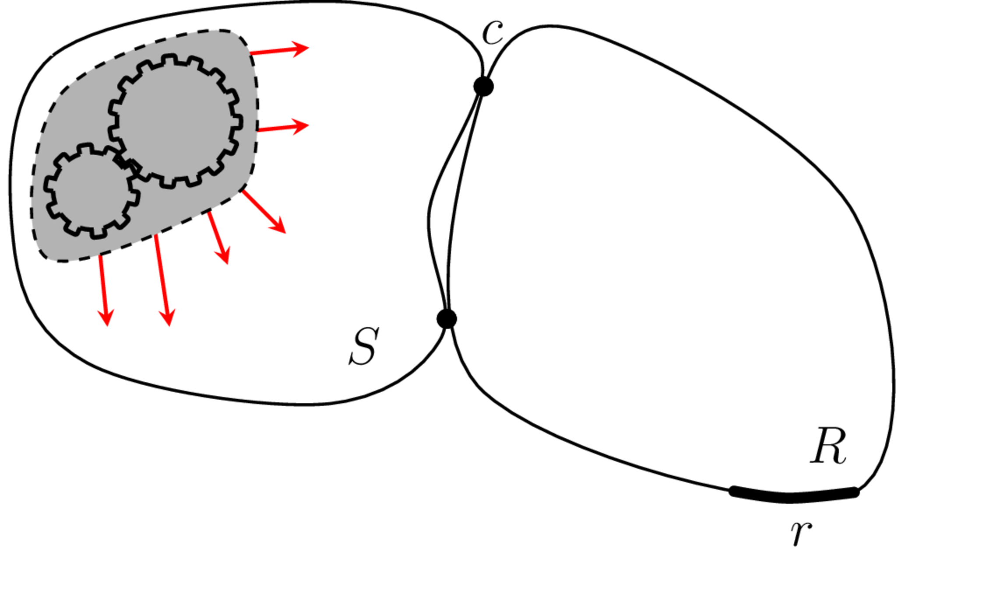
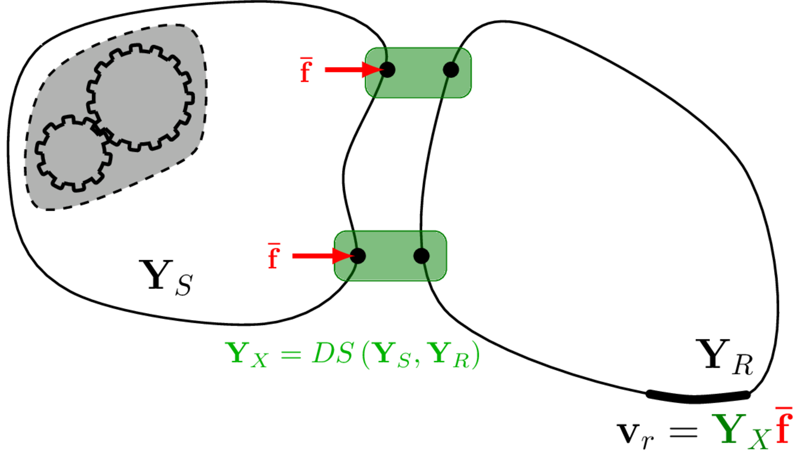

On this page we introduce the concept of a Vibro-Acoustic Virtual Prototype (VAVP), provide some context regarding their use and applications, and begin to formulise their construction. 

## What is a VAVP?
Virtual prototyping is obviously not a new idea. For visual design and general engineering well developed tools have been around for many decades (for example, see the plethor of CAD and FE packages) and their use is standard practice within industry, allowing engineers to inspect designs and even evaluate their funcational performance prior to manufacturing. 
Extending the virtual prototype concept to the realms of vibro-acoustics one arrives at the aptly named Vibro-Acoustic Virtual Prototype (VAVP). An early definition of a VAVP is given by Moorhouse as '*a computer representation of a machine, e.g. a washing machine, fridge, lawnmower etc., such that its sound can be heard without it necessarily having to exist as a physical machine*'. Outlined more a little more explicitly, a VAVP is a virtual assembly that is built from the properties of its constituent components in such a way that best represents the physical workings and/or vibro-acoustic 'appearance' of the real machine and, furthermore, can be used to produce operational response preidctions, including auralisations, of said machine.
Here, the term 'auralisation' may be defined as the creation and subsequent presentation of audible sound  files generated from numerical (simulated, measured, or
synthesized) data.

**In short, a Vibro-Acoustic Virtual Prototype is a digital representation of an assembly that is able reproduce its operational vibro-acoustic response with a sufficient degree of accuracy to be used as a design tool.**

## Why use a VAVP?
Before we describe the key components of Vibro-Acoustic Virtual Prototype, it is worth taking a brief aside to discus the importance of Vibro-Acoustic design and, in doing so, justify the not insignificant effort required to actually build a VAVP!

Vibro-acoustic design was once something of an afterthought. In recent decades it hss steadily been increasing in importance. Nowhere is this trend more evident than in the automotive industry where vehicle attributes relating to Noise Vibration and Harshness (NVH) are nowadays often given the highest priority. There are complex reasons for this growth in status but in general it all comes back to two major drivers: legislation and customer perception. 

Regarding *legislation*, manufacturers of many products, vehicles, industrial, domestic and outdoor products for example, are typically subject to mandatory limits on noise or vibration emission. In the European Union for example certain types of equipment may not be sold unless they meet limits for sound power.

*Customer perception*, on the other hand, is typically a more complex issue that may take several forms, the most important of which is 'brand image'. The iconic '*potato-potato-potato*' sound of the Harley Davidson engine and the satisfying '*clunk*' of the VW car door are classic examples where sounds have augmented brand value by making a product more desirable. Product sounds may also attract negative associations though which can be damaging to the brand, for example if a product sounds 'cheap' or 'nasty'. 

To satisfy legislation or customer preference, manufacturers have adopted a range of specific vibro-acoustic design targets. Those derived from legislation are for the most part single number limits designed for simplicity and clarity. Targets for customer perception on the other hand, are a far more nuanced and complex matter. What makes a product sound 'cool' or 'tinny' or 'wrong'? To understand how positive or negative associations are triggered by combinations of features in the sound it is necessary to dive into the field psycho-acoustics. Even with an understanding of what makes a product sound 'cool', engineers are set the daunting task of *designing* the product to acheive the *cool sound*. How engineering modifications map to specific features in the sound and then to perception is a complex question, making the `sound design' of engineered products far more difficult and advanced problem than traditional noise control typically used for meeting legislative requirements.  

It is clear that manufacturers cannot afford to get the vibro-acoustic design wrong and furthermore that getting it right may demand a sophisticated, possibly multidisciplinary approach. The task is made all the more difficult by constant pressure to reduce mass and cost. 

The need for '*vibro-acoustic virtual prototypes*' has emerged from the desire to evaluate and/or listen to designs or design modifications before the machines physically exist. Traditionally, this task would involve extensive phyiscal prototyping and testing, iterating towards a final design. Clearly, this is a slow and expensive process. With their ability to reduce cost, accelerate time to market, and optimize products to higher levels of performance and reliability, virtual prototyping methods
are considered the most suitable alternative, particularly with regards to the assessment of vibro-acoustic performance and the drive towards net-zero.

To provide the above benifits, a VAVP should be able to: a) predict the total vibro-acoustic response of an assembly (as a spectra or auralisation) with sufficient accuracy to be of practical use within a product development context, and b) evaluate the effect of modifying or replacing components for the purposes of design optimisation. This implies that our VAVP is built from *components*, and defined in such a way that they can be removed and replaced independently of the assembly and other connected components.

The above should seem like a pretty attractive and obvious approach to product design... Then why is Vibro-Acoustic Virtual Prototyping so far behind its visual and mechanical counterparts? The need for VAVP to produce realistic sounds raises immense scientific and technical challenges. In part, these are due to the complexity of the machines being represented and in part because, in striving for realism, we are up against a formidable opponent - the extraordinary sophistication of human hearing! 

Consider a comparatively simple vibro-acoustic assembly as an example - a music box attached to a sounding board. From the sound of the assembled unit the average person is able to discern fine detail in the active mechanism itself and also certain properties of the (passive) sounding board, whether it is wood or metal for example. To produce a VAVP of this relatively simple system then, we need not only to model the active mechanism in significant detail but also the passive support structure. Neither component can be omitted. When we scale up this example to a complex machine like a vehicle there may be multiple active components and hundereds of passive components involved in the transmission path to the ear of the listener, none of which can necessarily be neglected *a priori*. 

Human ability to discern fine detail in sound as mentioned above is related to the impressive frequency range over which our hearing system operates. Adults are normally able to hear up to at least 10 kHz and nowadays specifications for electric vehicles often extend to the very top of this range. At the other end of the scale, most people can hear down to 20 Hz and if we include tactile vibration in our VAVP then we may need to model down to 1 Hz. Thus, the full working range of a VAVP could span four whole orders of magnitude (a factor of 10000!).

The range of structural and acoustic wavelengths corresponding to this frequency range is also very wide, usually extending from larger than the whole machine to smaller than individual components. As a consequence, no one method of modelling is capable of spanning the whole frequency range. As such the VAVP should be able to mix-and-match different measurement and modelling schemes to best represent the assembled system (so-called hybrid modelling). 

Another major challenge is the modeling of *vibration-generating mechanisms* found inside every active component - fluctuating forces brought about by various mechanisms including aero- and fluid-dynamic forces, magnetic forces, impacts, friction forces, gear transmission error, forces at joints etc. These mechanisms tend to be highly complex, the inputs are often difficult to determine and the mechanisms themselves are often nonlinear, all of which makes modeling challenging. Perhaps for these reasons, while enormous effort has been devoted to vibro-acoustic modeling over the last few decades, only a tiny fraction of this effort has been directed towards source mechanisms. As a result the vast majority of models tell us how a structure responds to unit force input but do not attempt to 'switch on' the machine with realistic input. Today then, reliable models of vibro-acoustic sources must be considered beyond state-of-the-art.

**So then, the potential benifits of VAVPs are quite evident, as are the challenges we face in their construction. How then do we go about building one?**

## How to build a VAVP

When considering the role of VAVPs, it is worthwhile to consider the steps in the process of using *physical* prototypes for vibro-acoustic design. Broadly speaking: 1) the (physical) *components* are constructed, then 2) connected together to form the *assembly*. 3) any active elements or *sources* are then switched on and 4) the vibro-acoustic *outputs* are monitored and compared with targets (potentially including perceptual targets). If design optimisation is required then 5) components are *modified* or *replaced* and we then repeat steps 3) and 4).

The same basic elements will be required for a *virtual* prototype except that all physical aspects are replaced by digital representations. Thus, the VAVP is expected to include the following elements:

* passive and active components
* means of assembly
* prediction of output including by auralisation
* means of replacing components.

In what follows we will lay out the basic conceptual scheme together with the main assumptions to be used in the component-based approach for VAVPs. The general principles are illustrated in @fig-VAVP, though before we can discuss this in more detail it will be useful to describe more generally: the component-based approach to VAVPs, black box modelling, and the types of components encountered in most VAVPs.

::: {#fig-VAVP layout-ncol=2}

{width=95%}

{width=95%}

Illustration of the VAVP framework. The physical assembly is excited by internal mechanisms within the source; the resulting vibration propagates through the coupled assembly, passing through the interface DoFs $c$. The VAVP representation couples together the source and receiver components by substructuring, before representing the internal forcing by an equivalent blocked force applied to the coupling interface. 
:::

### Component-based approach

An important aspect of *physical* prototypes is the ability to remove, replace and transfer components from one assembly to another. Provided the fixing locations are compatible between the components and the rest of the assembly (i.e. the bolt holes line up) then we expect to be able to interchange (physical) components with complete freedom. 

Interchangeability is equally important in the *virtual* domain with a VAVP and the term 'component-based' has been coined to indicate just this: the component-based approach then can be defined as one in which all (virtual) components are *separable, interchangeable, transferable* or *independent* (of the assembly) - all these terms will be considered as equivalent in this context. We might also talk of component *properties* or *intrinsic* properties, meaning that they belong to the component alone and are free from any influence of the rest of the assembly. The terms *component-based* simulation and *VAVP* will similarly be assumed equivalent. 

When representing components with *measured* data however we cannot take for granted that this all-important interchangeability will be achieved, in fact, in general this will not be the case unless specific measures are adopted. In essence in the component-based approach, components must be characterised in a state with the interfaces either free or rigidly fixed. The precise form of characterisation will depend on the type of component considered, but will typically constitute a so-called *black box* representation.

### Black-box models 

In a typical VAVP, each individual component is represented by a *black box* model. The concept of a black box model is incredibly general, though its origins come from electric network analysis where it states that an electrical system is fully described by the behavior at its terminals; the particulars of what goes on inside the box are unknown and of no great importance. In other words in a black box, the inputs and outputs are related in a known and defined way but the workings in between are unknown. 

In the case of vibro-acoustics, the 'systems' to be described by black boxes are the components of the VAVP. But what constitutes the 'terminals' of these black boxes? Generally, we need to consider 'interfaces' and  'remote', specifically 'target', points. Clearly, we need to capture all inputs (normally forces) and outputs (normally vibration or acoustic responses) to and from the component. *Interfaces*, as the regions where a component connects to another component, are where this transmission takes place and so all interface points must be included in our black box description. Additionally, we may be interested in the response at *target* locations; for example, the acoustic response at a driver's ear position might be needed even if no external forces are applied there. 

Note that this is quite different to what we are used to when *modelling* components, for example using the Finite Element method. In this case,the structural dynamic properties at every point of the structure are determined, only limited by the resolution of the mesh employed. A description based on measurements on the other hand will typically only include the properties at the interfaces and target locations; no information is available regarding what goes on in between the inputs and outputs unless we specifically define a response location there.  

In electrical networks, black boxes are defined so that they can be *connected* to form larger networks by applying coupling rules. The same is true of the black box components defined for a VAVP which can be connected to form larger assemblies using *substructuring* techniques. 

### Components
Components are any parts of the assembly that one may need to separate from the whole, for example to allow components from different manufacturers to be modified or replaced. It should be clear from the above that a component is the fundamental unit of the VAVP that is not further divisible without taking further measurements (in which case the components would be redefined). 

Usually, a component of a VAVP coincides with a physically separable component, but this is not necessarily the case. In fact, in the virtual world there is considerable flexibility in defining the boundaries. 

The first step in constructing a VAVP then is to define the components. In effect, since a black box is fully defined by the way it responds with the outside world, this means defining their *boundaries*, and in particular their *interfaces*, i.e. the regions of the boundary where they connect to neighboring components in the VAVP. We also need to include any other points where the response needs to be known such as target locations. The component is therefore defined solely at the interfaces and target points. But what properties are needed to define the component at these points? This depends on whether the component is *active* or *passive*. 

**Passive components** are ones that transmit and/or radiate energy, but do not contain any vibration generating mechanisms. Passive components include vibration isolators, frames, body panels, cavities, etc. To characterise a passive component we require a measure of its ability to accept and transmit vibrational energy. This can be achieved in a variety of ways, though not all are appropriate for building a VAVP. The characterisation of passive components will be discussed in more detail in [Components](../components/components.qmd) and [Vibration Isolators](../isolators/isolators.qmd) but for now it is enough to say that they can be characterised by a set of frequency response functions (FRFs, frequency dependent filters) defined at and between all interface connections and target locations. These FRFs are stored as in matrix form. The choice of FRFs as our component representation will be justified later. As described above, the notion of independence and transferability is central to the VAVP approach. Hence, these [FRFs must be obtained with the component held under appropriate boundary conditions, specifically we require the components *free* or *fixed* interface FRFs matrices.]{.underline}

**Active components** are ones that contain vibration generating mechanisms. Obvious examples include motors, pumps, gear boxes, engines, etc. For some problems the source definition is perhaps not so obvious. For example, considering the problem of ground induced building vibration, the active component would be the earth..! Like passive components, active components are characterised by their ability to accept and transmit vibrational energy, i.e. their free or fixed interface FRFs. Though, these passive properties are not enough. A secondary quantity is required to describe the component's operational activity, i.e. the vibration generated by the internal mechanisms. [Like the required FRFs, an active descriptor should also be an independent and transferable property. It has become standard practice to use the so-called]{.underline} [Blocked force](../blockedForce/blockedForce.qmd).

### Interfaces
Before a component can be characterised (whether active or passive) it is necessary choose an *interface representation*. That is, means of describing the physical interface by a finite set of FRFs. In fact, this perhaps the most crucial step in the development of a VAVP; it is often said that *everything goes right or wrong at the interface!

Interfaces can be defined as those regions of the boundary where a component connects to other components. Determining where there is contact between two components is normally relatively straightforward, but defining the *interface representation* requires that all dynamic forces are properly accounted for. This a significantly more difficult task that it sounds for two main reasons.

First, dynamic forces do not only act perpendicular to the boundary but may occur simultaneously in different directions or degrees of freedom (DoF). In general, at a single point up to six DoF are required for a full description, three perpendicular forces and three moments (rotational forces) about perpendicular axes. Thus, even a single point interface may require up to six DoF and a 6x6 matrix of FRFs. Failure to include the important DoF can amount to a disastrous misrepresentation. However, successful characterisation is not simply a question of 'playing safe' and including all six DoF every time since not all DoFs are important on every occasion; including of inactive DoFs can can to increase experimental error and uncertainty. Defining an interface therefore requires a thorough understanding of the dynamics of the specific interface in question and often requires preliminary testing of some form. 

Secondly, there is the question of how to represent a contact patch by discreet points. Real connections are extended in the sense that contact is made over a surface area. However, the FRFs used to characterise components are point-to-point quantities... How then do we describe continuous contact? The conventional approach is to assume a point like connection; this is a valid assumption when the structural wavelength is much greater than the nominal dimensions of the interface connection. A point-like connection is described by 6 'rigid body' DoFs; 3 translations in $x$, $y$ and $z$, and a rotational about each axis $\alpha$, $\beta$ and $\gamma$. The challenge is then how to take a set of measured FRFs and transform these into the 6 rigid body DoFs... Moreover, when this point-like assumption breaks down (i.e. when the structural wavelength becomes comparable in size to the interface) some other form of discretisation is required that captures the 'flexible dynamics' over an extended interface.
In [Interfaces](../interfaces/interfaces.qmd) we will introduce some common methods used to represent point-like and flexible interfaces in the context of VAVPs.

### VAVP framework and key equations

To summarise so far, a VAVP is a digital representation of a machine whose components can be interchanged and modified and which sounds and feels just like the real thing. To achieve this we have seen we will need to include model representations of both active components, which generate the initial disturbance, and passive components which transmit vibration and/or radiate the sound. All components must be represented independently so that they can be built into an assembly and interchanged at will.

The VAVP scheme is a highly flexible and general framework that applies to a very broad range of assemblies including machines, vehicles, ships, buildings, any system effectively that is approximately linear and time-invariant. Moreover, provided the requirements for the component-based approach are met, both modelled and measured data can in theory be combined within the same framework. Given that modelling alone is not yet able to deliver the virtual prototypes that industry demands, the ability to *hybridise* data in this way within a single self-consistent framework is potentially highly significant.  

Shown on the left-hand side of @fig-VAVP is a simple arrangement with two components, an active source and a passive receiver. The *source* $S$ is excited by some internal dynamic forces which are assumed not to be accessible for direct measurement. The *receiver* $R$ contains no such forces but is excited through the interface $c$, causing a response at $r$. On the right-hand side of @fig-VAVP is the corresponding VAVP representation. In the VAVP representation the assembly is built by coupling together the source and receiver component FRFs using a technique termed substructuring. Once couples, the internal forces within the source are represented equivalently using the previously mentioned blocked forces applied to the coupling interface. In theory, this combination should give an identical response as obtained from the physical assembly. Of course, this is never quite the case in reality..!

To summarise the process of building a VAVP, we have the following key steps:

1. Characterise passive properties
2. Characterise active properties
3. Couple components
4. Make response prediction and auralise.

To provide some context for coming sections, we provide a brief description of each of the above steps. More detail will be provided though the comming sections. 

#### Step 1. Characterise passive properties
As discussed above, passive properties of each component are represented by FRF matrices, e.g. 
$$
    \mathbf{Y}_{S}(\omega), \quad \mathbf{Y}_{R}(\omega)
$$\end{equation}$$
where, $\mathbf{Y}$ indicates a matrix of structural (mobility) FRFs, the upper case subscript denoting the component to which the quantity belongs. We discuss what FRFs are required, and how to obtain them in [Components](../components/components.qmd) and [Isolators](../isolators/isolators.qmd).

#### Step 2. Characterise active components
For sources we require a measure of their *activity* in addition to their passive properties ($\mathbf{Y}_S$). Here we quantify activity in terms of *blocked forces*, which are obtained by solving a so-called inverse problem. The main equation for obtaining blocked forces is,
$$
    \mathbf{v}_c = \mathbf{Y}_{Ccc} \mathbf{\bar{f}}_{c}    
$${#eq-forwardBlkF}
where $\mathbf{\bar{f}}_{c}$ is a vector of blocked forces with one entry for every DoF on the interface: the subscript $c$ indicates that it applies on the interface labeled $c$.
$\mathbf{Y}_{Ccc}$ is the matrix of FRFs for the *coupled* ($C$) source and receiver assembly. The first lower case $c$ indicates the set of response (output) points and the second the set of excitation points which in this formulation are co-located on interface $c$. $\mathbf{v}_c$ represents the vector of operational responses, again with one entry for every point on interface $c$. 

Solving @eq-forwardBlkF requires separate tests, a passive system identification test to obtain the FRF matrix $\mathbf{Y}_{Ccc}$ and an operational test with the machine running to obtain $\mathbf{v}_c$. Having obtained the data for $\mathbf{Y}_{Ccc}$ and $\mathbf{v}_c$, one then solves @eq-forwardBlkF to obtain the unknown blocked forces. This step is known as solving the inverse problem. It is not intuitively obvious why these forces are termed 'blocked forces'; this will be addressed later in [Blocked forces](../blockedForce/blockedForce.qmd). Obtaining blocked forces, including solving the inverse problem, is one of the most critical stages in building a VAVP.

#### Step 3. Couple components
Having obtained FRF data describing each component in Step 1, they need to be coupled together to build a model of the virtual assembly. The rules for coupling are well known; one simply needs to satisfy continuity and equilibrium conditions across the connecting interfaces, a process which has become known as frequency-domain substructuring. There are numerous formulations of substructuring, some of which we describe in [Substructuring](../substructuring/substructuring.qmd). For now, without making a preference at this stage, we will simply indicate the coupling step as:
$$
    \left[ \begin{array}{c} \mathbf{Y}_{X} \\ \mathbf{H}_{X} \end{array} \right] = DS(\mathbf{Y}_{S},\mathbf{Y}_{R},\mathbf{H}_R),
$${#eq-DS1}
in which $DS(\square)$ indicates any formulation of dynamic substructuring, that is combining the properties of the sources $S$ and receivers $R$ on the right hand side to form the FRFs of the virtual assembly $X$. In the above $\mathbf{H}_R$ and $\mathbf{H}_X$ are vibro-acoustic FRF matrices fo the receiver and coupled assembly respectively. They enable the prediction of a acoustic responses (sound pressures) within the receiver component. 

#### Step 4. Forward prediction and auralisation
Having built the assembly ($\mathbf{Y}_X$) in Step 3, the machine must then be 'switched on' so that the resulting sound and vibration can be simulated. The switching on is done by applying the blocked forces ($\mathbf{\bar{f}}$) obtained in Step 2 to the assembly built in Step 3. The acoustic or vibration response at target locations is then given by,
$$
    \left(\begin{array}{cc}
        \mathbf{v}_{r} \\
        \mathbf{p}_{r}
    \end{array}\right) = \left[ \begin{array}{cc} \mathbf{Y}_{Xrc} \\ \mathbf{H}_{Xrc} \end{array} \right]  \mathbf{\bar{f}}_{c}
$${#eq-VAPeq}
where $\mathbf{v}_{r}$ and $\mathbf{p}_{r_2}$ are the structural and acoustic responses at the target DoFs $r$, $\mathbf{Y}_{Crc}$ is the structural FRF matrix for excitation at locations on interface $c$ and structural response at $r$ and $\mathbf{H}_{Cr_2c}$ is the vibro-acoustic FRF connecting acoustic responses at $r$ to force excitation at interface $c$. $\mathbf{\bar{f}}_{c}$ is the blocked force vector at interface $c$ as obtained in Step 2.

## What next? 
Having now introduced the general concept of a Vibro-Acoustic Virtual Prototyping, including its component requirements and main calculation steps, in what follows we will describe in greater detail the characterisation of active and passive components, the substructuring of components to form assemblies, and the representation of interfaces. Some supplementary material discussing uncertainty in VAVPs will also be provided at the end.