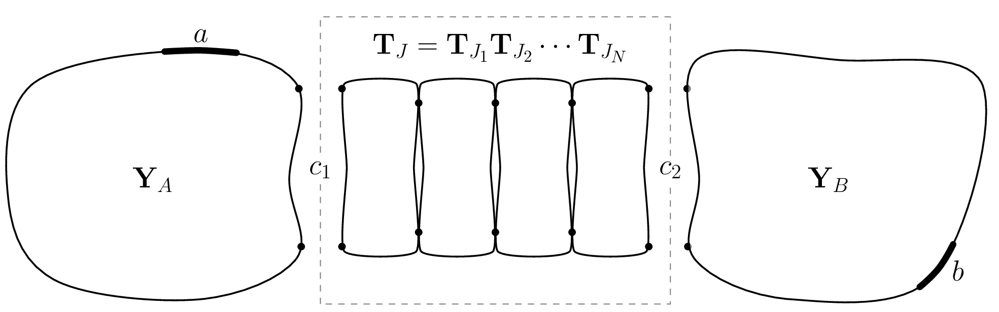
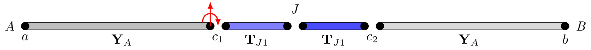

# Introduction
To analyse the vibro-acoustic performance of a complex built-up structure it is convenient to adopted a component-based approach  @meggitt2025experimental. The assembly is decomposed into a series of interconnecting components which are independently characterised, either by experiment or numerically. These component representations are then combined mathematically to yield a model of the assembled system, a process termed substructuring. 
The process of substructuring amounts to the enforcement of compatibility and equilibrium between the connecting degrees of freedom (DoFs) of each component. This can be achieved in a variety of ways, and in any of the domains typically used for structural dynamic analysis, including the physical, modal, state, time and frequency domains @de2008general. 
In recent years, frequency domain methods have gained popularity, given their ease in which they allow for  combining experimental and numerical component representations.

In the frequency domain, components are most often represented by their *free-interface admittance* matrices, which describe their kinematic response due to a set of applied forces. Based on component admittance, various substructuring schemes are available, including direct @meggitt2025experimental, primal/dual @de2008general and mixed @d2014inverse formulations. The advantage of an admittance-based  approach, is the relative ease in which the component admittance matrices can be measured. It is not however the only approach available. An alternative frequency domain representation is by the so-called *transfer matrix* @rubin1967mechanical, which relates the state vector (stacked force and response) between two sets of DoFs, usually considered the input and output of the component. The advantage of a transfer matrix approach is that structural coupling of two of more components is reduced to a simple multiplication of their respective transfer matrices. This is especially convenient for modeling systems where the components form a cascaded chain, such as when dealing with layered materials @yildirim1999free,@song2014reduction.

The transfer matrix method (TMM) has found greatest application in acoustics, where it is used extensively to model sound transmission through multi-layered structures @lauriks1992acoustic, @brouard1995general, @massaglia2017modelling, though applications also exist in structural dynamics and vibration.  For example, in @boiangiu2016transfer and @lee2016free the authors use the TMM to model the dynamics of beams with variable cross-sections. In @pearson1982transfer the TMM is used as an analytical tool to study the vibration of compressed helical springs. In @hsieh2006modified and @tsai2013transfer the TMM is applied to the study of rotor-bearing systems comprising coupled lateral and torsional vibration and local/global coupler offsets. In @sun2007vibrational TMs are used to analyses the vibrational power flow through a MIMO system. 


The TMM has also been incorporated within other modeling schemes to provide an efficient inclusion of layered materials/structures. In @dokainish1972new the hybridisation of Finite Element and TMM is proposed for the efficient analysis of plate and shell structures.  In @decraene2018fast the TMM is combined with hybrid FEA-SEA method for diffuse sound transmission through finite-sized thick and layered wall and floor systems. In @chevillotte2011coupling the coupling of TMM and Finite Element method is used for the efficient acoustic analysis of automotive hollow body networks. The TM representation also forms the basis of the so-called Wave-FE approach used for efficient modeling of periodic structures @duhamel2006finite. 

In this paper we present a mixed admittance/transfer matrix-based substructuring scheme. We consider the problem depicted in @fig-FRFTT (though the proposed scheme can readily be generalised to more complex systems), where two admittance-based components are coupled by a series of connecting elements which together form a *junction*. We wish to represent the dynamics of this layered junction by the more convenient transfer matrix, whilst keeping the end components in their admittance form. The result is a generalization of the dual formulation for admittance-based substructuring, where the conditions of equilibrium and compatibility between components are replaced by the junction transfer matrix equations, themselves built from an arbitrary number of sub-element transfer matrices.
The principle advantage of the proposed approach is the ease of which complex layered systems can be incorporated within an admittance substructuring scheme. Adding, removing, or reordering junction components is achieved by directly including, removing, or reordering their respective transfer matrices, thus avoiding the need to redefine the Boolean coupling matrices required by the conventional dual formulation.


Having outlined the context of this paper, its remainder will be structured as follows. In @sec-structCoup we introduce the admittance and transfer matrix methods for structural coupling. Following this in @sec-hybridCoup, we present the mixed admittance-transfer matrix substructuring scheme with a simple numerical example in @sec-numSim. Finally, @sec-conc draws some concluding remarks. 


# Frequency-based structural coupling {#sec-structCoup}
In this section we introduce the admittance and transfer matrix-based substructuring methods that we wish to combine into a common framework. The principle difference between these two methods is in how they represent the dynamics of their respective substructures (described below). Irrespective of this representation, the rigid coupling of two components is governed by the conditions of compatibility and equilibrium,
$$
	\mathbf{u}_1 = \mathbf{u}_2 \qquad
	\mathbf{g}_1 = -\mathbf{g}_2
$$
which state that when two components are in rigid contact their interface DoFs must a) have the same kinematic response (displacement, velocity and acceleration) and b) exert equal and opposite forces onto one another. Depending on the chosen domain and/or component representation, the methods for enforcing these constraints will differ.

## Admittance-based (FRF) coupling {#sec-dualSS}
With admittance-based substructuring, each component is represented by a complex admittance matrix $\mathbf{Y}^{(n)}$ that satisfies the equation of motion (per frequency),
$$
	\mathbf{u}^{(n)} = \mathbf{Y}^{(n)} (\mathbf{f}^{(n)} + \mathbf{g}^{(n)})
$$
where $\mathbf{f}$ and $\mathbf{g}$ are, respectively, the externally applied and interface coupling forces that act on the component, and $\mathbf{u}$ is its kinematic response (displacement, velocity or acceleration depending on the units of $\mathbf{Y}$).

To model an assembly of $P$ such components, we begin by writing their  equations of motion in a block diagonal form,
$$ 
	\mathbf{u} =	\mathbf{Y}\left( \mathbf{f} + \mathbf{g}\right)
$${#eq-3F1}
where, $\mathbf{Y}$ is the block diagonal admittance matrix of the $P$ uncoupled components, $\mathbf{u}$ is the corresponding block vector of responses, $\mathbf{f}$ is the block vector of applied forces, and $\mathbf{g}$ the block vector of interface coupling forces,
$$
\begin{align}
	\mathbf{Y} &= \left[\begin{array}{c c c c}
		\mathbf{Y}^{(1)} & & &\\
		&  \mathbf{Y}^{(2)} & &\\
		& & \mathbf{\ddots} &\\ 
		& & & \mathbf{Y}^{(P)}
	\end{array}\right], \quad
	\mathbf{u} = \left(\begin{array}{c}
		\mathbf{u}^{(1)} \\
		\mathbf{u}^{(2)}  \\
		\vdots  \\
		\mathbf{u}^{(P)}  
	\end{array}\right),\quad \mathbf{f} = \left(\begin{array}{c}
		\mathbf{f}^{(1)} \\
		\mathbf{f}^{(2)}  \\
		\vdots  \\
		\mathbf{f}^{(P)}  
	\end{array}\right),
	\quad \mathbf{g} = \left(\begin{array}{c}
		\mathbf{g}^{(1)} \\
		\mathbf{g}^{(2)}  \\
		\vdots  \\
		\mathbf{g}^{(P)}  
	\end{array}\right).
\end{align}
$$
To rigidly couple the connecting components, the conditions of compatibility and equilibrium must be satisfied across the set of co-located coupling DoFs. To aid flexible DoF selection, compatibility and equilibrium are expressed in the general matrix form,
$$
	\mathbf{B}\mathbf{u} = \mathbf{0},
$${#eq-3F2}
and 
$$
	\mathbf{L}^{\rm T}\mathbf{g} = \mathbf{0}
$${#eq-3F3}
where $\mathbf{B}$ and $\mathbf{L}^{\rm T}$ are signed and unsigned Boolean matrices that specify *which* DoFs are to be coupled @de2008general. Equations [-@eq-3F1], [-@eq-3F2] and [-@eq-3F3] are commonly referred to as the *three field formulation*.

The rigid coupling of two components implies the internal forces are of equal magnitude (or intensity) and opposite direction. Hence, we are able to define *a priori* the form of $\mathbf{g}$ as,
$$
	\mathbf{g} = -\mathbf{B}^{\rm T}\lambda 
$$
where $\mathbf{B}$ prescribes the equal and opposite signage, and $\lambda$ is a vector of interface force magnitudes.
Substituting $\mathbf{g}$ into the block equations of motion we have, 
$$
	\mathbf{u} = \mathbf{Y}\left(\mathbf{f} -\mathbf{B}^{\rm T}\lambda \right).
$${#eq-EoM2}
To determine the coupled assembly response, we first find the interface force required to bring the system into alignment (i.e. satisfy @eq-3F2). To do so we  substitute @eq-EoM2 into the compatibility equation,
$$
	\mathbf{B}\mathbf{u} = \mathbf{B}\mathbf{Y}\left(\mathbf{f} -\mathbf{B}^{\rm T}\lambda \right) =\mathbf{B}\mathbf{Y}\mathbf{f} - \mathbf{B}\mathbf{Y}\mathbf{B}^{\rm T}\lambda = \mathbf{0},
$$
before rearranging to solve for $\lambda$,
$$
	\lambda = \left(\mathbf{B}\mathbf{Y}\mathbf{B}^{\rm T}\right)^{-1}\mathbf{B}\mathbf{Y}\mathbf{f}.   
$$
We can now substitute $\lambda$ back into the equations of motion to yield the coupled response,
$$
	\mathbf{u} = \mathbf{Y}\left(\mathbf{f} -\mathbf{B}^{\rm T}\left(\mathbf{B}\mathbf{Y}\mathbf{B}^{\rm T}\right)^{-1}\mathbf{B}\mathbf{Y}\mathbf{f}    \right) =  \left(\mathbf{Y} -\mathbf{Y}\mathbf{B}^{\rm T}\left(\mathbf{B}\mathbf{Y}\mathbf{B}^{\rm T}\right)^{-1}\mathbf{B}\mathbf{Y}   \right)\mathbf{f}.
$$
From the above we can identify the coupled admittance as,
$$
	\mathbf{Y}_C =   \mathbf{Y} -\mathbf{Y}\mathbf{B}^{\rm T}\left(\mathbf{B}\mathbf{Y}\mathbf{B}^{\rm T}\right)^{-1}\mathbf{B}\mathbf{Y}.  
$${#eq-dual}
Equation @eq-dual provides a convenient framework for general substructuring; it allows an arbitrary number of components to be assembled in any configuration, and avoids large matrix inversions typical of other admittance-based formulations.

## Transfer matrix-based (TM) coupling
With transfer matrix-based coupling, each component is represented by a complex transfer matrix $\mathbf{T}$ that relates the force and response between two sets of DoFs (say $a$ and $b$),
$$
	\left(\begin{array}{c}\mathbf{u}_{b} \\ \mathbf{f}_b - \mathbf{g}_{b}\end{array}\right) = \overbrace{\left[\begin{array}{c c} \mathbf{T}^u& \mathbf{\Gamma} \\ \mathbf{\Omega} & \mathbf{T}^g\end{array}\right]}^{\mathbf{T}}\left( \begin{array}{c}\mathbf{u}_{a} \\ \mathbf{f}_a + \mathbf{g}_a \end{array} \right).
$$
Within the transfer matrix, the submatrices $\mathbf{T}^g$ and $\mathbf{T}^u$ represent a pair of force and response transmissibilities. Whilst transmissibilities have many interesting properties and applications, they do not themselves fully characterize a component @maia12011whys. The off-diagonal terms $\mathbf{\Gamma}$ and $\mathbf{\Omega}$ provide the necessary force-response cross-terms required for the transfer matrix representation of a component to be complete (see @nte-addTM).

To rigidly couple two components $A$ and $B$,
$$
	\left(\begin{array}{c}\mathbf{u}_{Aa} \\ -\mathbf{g}_{Aa}\end{array}\right) = \left[\begin{array}{c c} \mathbf{T}_{A}^u& \mathbf{\Gamma}_A \\ \mathbf{\Omega}_A & \mathbf{T}_{A}^g\end{array}\right] \left( \begin{array}{c}\mathbf{u}_{Ab} \\ \mathbf{g}_{Ab}\end{array} \right) \qquad 	\left(\begin{array}{c}\mathbf{u}_{Bb} \\ -\mathbf{g}_{Bb}\end{array}\right) = \left[\begin{array}{c c} \mathbf{T}_{B}^u& \mathbf{\Gamma}_B \\ \mathbf{\Omega}_B & \mathbf{T}_{B}^g\end{array}\right] \left( \begin{array}{c}\mathbf{u}_{Bc} \\ \mathbf{g}_{Bc}\end{array} \right).
$${#eq-TATB}
through the DoFs $b$ we simply recall the conditions of compatibility and equilibrium,
$$
	\left(\begin{array}{c}\mathbf{u}_{Ab} \\ \mathbf{g}_{Ab}\end{array}\right) =	\left(\begin{array}{c}\mathbf{u}_{Bb} \\ -\mathbf{g}_{Bb}\end{array}\right)
$$
and combine @eq-TATB as so,
$$ 
\begin{align}\label{}
	\left(\begin{array}{c}\mathbf{u}_{Aa} \\ -\mathbf{g}_{Aa}\end{array}\right) = \left[\begin{array}{c c} \mathbf{T}_{A}^u& \mathbf{\Gamma}_A \\ \mathbf{\Omega}_A & \mathbf{T}_{A}^g\end{array}\right]\left[\begin{array}{c c} \mathbf{T}_{B}^u& \mathbf{\Gamma}_B \\ \mathbf{\Omega}_B & \mathbf{T}_{B}^g\end{array}\right] \left( \begin{array}{c}\mathbf{u}_{Bc} \\ \mathbf{g}_{Bc}\end{array} \right).
\end{align}
$$
Clearly, this approach to coupling can be extended for an arbitrary number of components, 
$$
\begin{align}
	\left(\begin{array}{c}\mathbf{u}_{Aa} \\ -\mathbf{g}_{Aa}\end{array}\right) &= \left[\begin{array}{c c} \mathbf{T}_{A}^u& \mathbf{\Gamma}_A \\ \mathbf{\Omega}_A & \mathbf{T}_{A}^g\end{array}\right]\left[\begin{array}{c c} \mathbf{T}_{B}^u& \mathbf{\Gamma}_B \\ \mathbf{\Omega}_B & \mathbf{T}_{B}^g\end{array}\right]\cdots \left[\begin{array}{c c} \mathbf{T}_{V}^u& \mathbf{\Gamma}_V \\ \mathbf{\Omega}_V & \mathbf{T}_{V}^g\end{array}\right]
	\left[\begin{array}{c c} \mathbf{T}_{X}^u& \mathbf{\Gamma}_X \\ \mathbf{\Omega}_X & \mathbf{T}_{X}^g\end{array}\right]
	\left( \begin{array}{c}\mathbf{u}_{Xy} \\ \mathbf{g}_{Xy}\end{array} \right)\\
	&=
	\left[\begin{array}{c c} \mathbf{T}_{A\cdots X}^u& \mathbf{\Gamma}_{A\cdots X} \\ \mathbf{\Omega}_{A\cdots X} & \mathbf{T}_{A\cdots X}^g\end{array}\right]
	\left( \begin{array}{c}\mathbf{u}_{Xy} \\ \mathbf{g}_{Xy}\end{array} \right).
\end{align}
$${#eq-TMchain}
This is especially useful for complex layered structures, where each layer is simply represented by its own transfer matrix. In addition to providing convenient structural coupling, the transfer matrix $\mathbf{T}$ can be used to derive and inspect the free wave characteristics of a component (or collection thereof), as done by the WFE method \cite{duhamel2006finite}. 

::: {.callout-note #nte-addTM title="Relation between admittance and transfer matrix" collapse="true"}
The dynamics of a general linear time invariant mechanical system can be described by the following equation of motion,
$$
	\left(\begin{array}{c}\mathbf{f}_a +\mathbf{g}_a \\ \mathbf{f}_b + \mathbf{g}_b\end{array}\right) = \left[\begin{array}{c c}\mathbf{Z}_{aa} & \mathbf{Z}_{ab} \\ \mathbf{Z}_{ba} & \mathbf{Z}_{bb}\end{array}\right] \left( \begin{array}{c}\mathbf{u}_a \\ \mathbf{u}_b\end{array} \right)
$${#eq-jEoM}
where $\mathbf{Z}_{\square}$ denotes the mechanical impedance at/between the subscripted DoFs. 

We are interested in the transference of force and displacement across a component. Ignoring external force terms, @eq-jEoM can be rearranged to yield transfer-style matrix as follows. Using the top line of @eq-jEoM find $\mathbf{u}_b$,
$$
	\mathbf{g}_a = \mathbf{Z}_{aa}\mathbf{u}_a + \mathbf{Z}_{ab}\mathbf{u}_b\rightarrow \mathbf{u}_b =  \mathbf{Z}_{ab}^{-1}\left(\mathbf{g}_a - \mathbf{Z}_{aa} \mathbf{u}_a\right).
$$
Substitute $\mathbf{u}_b$ into $\mathbf{g}_b$ (second line of @eq-jEoM),
$$
	\mathbf{g}_b = \mathbf{Z}_{ba}\mathbf{u}_a + \mathbf{Z}_{bb}\mathbf{u}_b= \mathbf{Z}_{ba}\mathbf{u}_a + \mathbf{Z}_{bb} \left(\mathbf{Z}_{ab}^{-1}\left(\mathbf{g}_a - \mathbf{Z}_{aa} \mathbf{u}_a\right)\right) = 
	\mathbf{Z}_{ba}\mathbf{u}_a + \mathbf{Z}_{bb} \mathbf{Z}_{ab}^{-1}\mathbf{g}_a - \mathbf{Z}_{bb} \mathbf{Z}_{ab}^{-1}\mathbf{Z}_{aa} \mathbf{u}_a.
$$
After grouping terms we have the following pair of equations,
$$
	\mathbf{u}_b =  \mathbf{Z}_{ab}^{-1}\mathbf{g}_a - \mathbf{Z}_{ab}^{-1}\mathbf{Z}_{aa} \mathbf{u}_a
$$
$$
	\mathbf{g}_b =  
	\left(\mathbf{Z}_{ba}-\mathbf{Z}_{bb} \mathbf{Z}_{ab}^{-1}\mathbf{Z}_{aa}\right)\mathbf{u}_a + \mathbf{Z}_{bb} \mathbf{Z}_{ab}^{-1}\mathbf{g}_a 
$$
or in matrix form,
$$
	\left(\begin{array}{c}\mathbf{u}_b \\ \mathbf{g}_b\end{array}\right) = \left[\begin{array}{c c} - \mathbf{Z}_{ab}^{-1}\mathbf{Z}_{aa} &\mathbf{Z}_{ab}^{-1} \\ \mathbf{Z}_{ba}-\mathbf{Z}_{bb} \mathbf{Z}_{ab}^{-1}\mathbf{Z}_{aa} & \mathbf{Z}_{bb} \mathbf{Z}_{ab}^{-1}\end{array}\right] \left( \begin{array}{c}\mathbf{u}_a \\ \mathbf{g}_a\end{array} \right).
$${#eq-jTM1}
@eq-jTM1 describes the transmission of force and displacement across the component. Its terms can be calculated analytically for simple components (e.g. spring dash-pot joints, beam elements, etc.) or numerically for more complex cases. The transfer matrix is often written in a slightly modified form, with the force $\mathbf{g}_b$ negated,
$$
	\left(\begin{array}{c}\mathbf{u}_b \\ -\mathbf{g}_b\end{array}\right) = \left[\begin{array}{c c} - \mathbf{Z}_{ab}^{-1}\mathbf{Z}_{aa} &\mathbf{Z}_{ab}^{-1} \\ -\mathbf{Z}_{ba}+\mathbf{Z}_{bb} \mathbf{Z}_{ab}^{-1}\mathbf{Z}_{aa} & -\mathbf{Z}_{bb} \mathbf{Z}_{ab}^{-1}\end{array}\right] \left( \begin{array}{c}\mathbf{u}_a \\ \mathbf{g}_a\end{array} \right) = \left[\begin{array}{c c} \mathbf{T}^{u}& \mathbf{\Gamma} \\ \mathbf{\Omega} & \mathbf{T}^{g}\end{array}\right] \left( \begin{array}{c}\mathbf{u}_a \\ \mathbf{g}_a\end{array} \right),
$${#eq-jTM2}
where we introduce the force and response transmissibilities, respectively, as $\mathbf{T}_{u}$ and  $\mathbf{T}_{g}$, and the cross-terms as $\mathbf{\Gamma}$ and $\mathbf{\Omega}$. This negation reduces the coupling of components to a simple matrix multiplication.

It is worth noting that the transfer matrix can similarly be described in-terms of a component's admittance, rather than impedance, by following a similar procedure as above, though starting from the equation of motion, 
$$
	\left( \begin{array}{c}\mathbf{u}_a \\ \mathbf{u}_b\end{array} \right) = \left[\begin{array}{c c}\mathbf{Y}_{aa} & \mathbf{Y}_{ab} \\ \mathbf{Y}_{ba} & \mathbf{Y}_{bb}\end{array}\right] 	\left(\begin{array}{c}\mathbf{f}_a + \mathbf{g}_a \\ \mathbf{f}_b + \mathbf{g}_b\end{array}\right).
$$
The result is,
$$
	\left(\begin{array}{c}\mathbf{u}_b \\ -\mathbf{g}_b\end{array}\right)  = \left[\begin{array}{c c} \mathbf{T}^{u}& \mathbf{\Gamma} \\ \mathbf{\Omega} & \mathbf{T}^{g}\end{array}\right] \left( \begin{array}{c}\mathbf{u}_a \\ \mathbf{g}_a\end{array} \right) =  \left[\begin{array}{c c} \mathbf{Y}_{bb}\mathbf{Y}_{ab}^{-1} & \mathbf{Y}_{ba} - \mathbf{Y}_{bb}\mathbf{Y}_{ab}^{-1}\mathbf{Y}_{aa} \\ -\mathbf{Y}_{ab}^{-1} & \mathbf{Y}_{ab}^{-1}\mathbf{Y}_{aa} \end{array}\right] \left( \begin{array}{c}\mathbf{u}_a \\ \mathbf{g}_a\end{array} \right).
$$
:::


# Hybrid Admittance-TM coupling {#sec-hybridCoup}
We wish to combine the admittance and transfer matrix coupling schemes describe above, to model systems of the form shown in @fig-FRFTT, where the junction between two admittance components is represented by a general transfer matrix. 

In the proposed hybrid substructuring scheme, the coupling conditions (i.e. equilibrium and compatibility) between two admittance-based components ($A$ and $B$) are replaced by the transfer matrix of a coupling junction $J$, 
$$
	\left(\begin{array}{c}\mathbf{u}_{c_2} \\ -\mathbf{g}_{c_2}\end{array}\right)  = \left[\begin{array}{c c} \mathbf{T}^u_{J} & \mathbf{\Gamma}_J \\ \mathbf{\Omega}_J & \mathbf{T}^{g}_J\end{array}\right] \left( \begin{array}{c}\mathbf{u}_{c_1} \\ \mathbf{g}_{c_1}\end{array} \right).
$${#eq-jTM2}
This junction might represent something as simple as a spring-like connection, or instead a more complex chain of components (assembled from their individual transfer matrices as per @eq-TMchain).

::: {#fig-FRFTT}



Hybrid substructuring model; components $A$ and $B$ are represented by their admittance matrices $\mathbf{Y}_A$ and $\mathbf{Y}_B$, junction is characterised by the transfer matrix $\mathbf{T}_J$
:::


From @eq-jTM2 we have,
$$
	\mathbf{u}_{c_2} = \mathbf{T}_{u}\mathbf{u}_{c_1} + \mathbf{\Gamma} \mathbf{g}_{c_1}
$${#eq-TG1}
and
$$
	-\mathbf{g}_{c_2} = \mathbf{\Omega} \mathbf{u}_{c_1} + \mathbf{T}_g \mathbf{g}_{c_1}
$${#eq-TG2}
where for clarity the subscript $J$ has been omitted and $u$ and $g$ made into subscripts. We extend @eq-TG1 and [-@eq-TG2] to include the internal $A$ and $B$ DoFs (denoted $a$ and $b$), and rewrite them in a form reminiscent of @eq-3F2 and [-@eq-3F3],
$$
	\mathbf{0} = \left[\begin{array}{c  c c c}
		\mathbf{0} &	\mathbf{T}_u  & \mathbf{0}&  \mathbf{-I}
	\end{array}\right]  \left(\begin{array}{c }
		\mathbf{u}_{a} \\	\mathbf{u}_{c_1} \\  	\mathbf{u}_{b} \\ \mathbf{u}_{c_2}
	\end{array}\right) + \left[\begin{array}{c c c c}
		\mathbf{I} & \mathbf{\Gamma} &\mathbf{I} &  \mathbf{0}
	\end{array}\right] \left[\begin{array}{c }
		\mathbf{0} \\	\mathbf{g}_{c_1} \\  \mathbf{0} \\  \mathbf{g}_{c_2}
	\end{array}\right] =\mathbf{B}_u\mathbf{u} + \mathbf{\bar{\Gamma}}\mathbf{g} = \mathbf{0}
$$
and
$$
	\mathbf{0} = \left[\begin{array}{c c c c}
		\mathbf{I} & \mathbf{0} & \mathbf{0} & \mathbf{0} \\
		\mathbf{0} &  	\mathbf{T}_g &  \mathbf{0} &  \mathbf{I} \\
		\mathbf{0} & \mathbf{0} & \mathbf{I} & \mathbf{0}  \\
	\end{array}\right] \left[\begin{array}{c }
		\mathbf{0} \\ \mathbf{g}_{c_1}\\ \mathbf{0} \\ \mathbf{g}_{c_2}
	\end{array}\right]+ \left[\begin{array}{c c c c}
		\mathbf{0} &	\mathbf{0} &  \mathbf{0} & \mathbf{0}\\
		\mathbf{0} &	\mathbf{\Omega} &  \mathbf{0} & \mathbf{0}\\
		\mathbf{0} &	\mathbf{0} &  \mathbf{0} & \mathbf{0}
	\end{array}\right]  \left[\begin{array}{c }
		\mathbf{u}_a \\	\mathbf{u}_{c_1} \\ \mathbf{u}_b\\ \mathbf{u}_{c_2}
	\end{array}\right] =\mathbf{L}^{\rm T}_g \mathbf{g} +{\mathbf{\bar{\Omega}} \mathbf{u}} = \mathbf{0},
$${#eq-mod3F3}
where we introduce $\mathbf{B}_u$ and $\mathbf{L}_g^{\rm T}$ to represent the response-to-response and force-to-force relations across the junction. Note that in contrast to standard admittance-based substructuring scheme $\mathbf{B}_u$ and $\mathbf{L}_g^{\rm T}$ are no longer signed/unsigned Boolean matrices that simply equate the force and response; they now include transmissibility functions that partition the force and response according to the dynamics of the connecting junction. To provide a complete description of the junction, the force-to-response ($\mathbf{\bar{\Gamma}}$) and response-to-force ($\mathbf{\bar{\Omega}}$) contributions are also be included. 

From the above we can establish a *modified three field formulation* for a hybrid assembly that includes a coupling junction represented by a general transfer matrix:
$$
	\mathbf{u} = \mathbf{Y}\left(\mathbf{f}+\mathbf{g}\right)
$${#eq-3field1}
$$
	\mathbf{0}=	\mathbf{B}_u \mathbf{u} + \mathbf{\bar{\Gamma}}\mathbf{g}
$${#eq-3field2}
$$
	\mathbf{0}=	\mathbf{L}^{\rm T}_g \mathbf{g} + \mathbf{\bar{\Omega}}\mathbf{u}
$${#eq-3field3}
with,
$$
	\mathbf{Y} =\left[ \begin{array}{cc}\mathbf{Y}_A & \\ & \mathbf{Y}_B
	\end{array}\right], \quad  \mathbf{u} = \left(\begin{array}{c} \mathbf{u}_A \\ \mathbf{u}_B
	\end{array}\right)= \left(\begin{array}{c} \mathbf{u}_{a} \\ \mathbf{u}_{c_1} \\\mathbf{u}_{b} \\ \mathbf{u}_{c_2}
	\end{array}\right),  \quad \mathbf{g} = \left(\begin{array}{c} \mathbf{g}_A \\ \mathbf{g}_B
	\end{array}\right)=\left(\begin{array}{c} \mathbf{0} \\ \mathbf{g}_{c_1} \\\mathbf{0} \\ \mathbf{g}_{c_2}
	\end{array}\right),  \quad \mathbf{f} = \left(\begin{array}{c} \mathbf{f}_A \\ \mathbf{f}_B
	\end{array}\right)=\left(\begin{array}{c} \mathbf{f}_{a} \\ \mathbf{f}_{c_1} \\\mathbf{f}_{b} \\ \mathbf{f}_{c_2}
	\end{array}\right).
$$
In effect, we have introduced a pair of *dynamic* compatibility and equilibrium conditions which describe the dynamics of the coupling junction. At this point, we proceed in a manner similar to the admittance-based derivation. 

Note that in contrast to the standard formulation, our force and response constraints are now coupled. 
We can no longer assume the form of $\mathbf{g} = -\mathbf{B}^{\rm T}\lambda$, since force conversation is not guaranteed across an arbitrary junction. Hence, we must determine a form of $\mathbf{g}$ that satisfies @eq-3field3. An appropriate form is given by,
$$
	\mathbf{g} = -\left( \left[\begin{array}{c}
		\mathbf{0} \\ -\mathbf{I} \\  \mathbf{0} \\\mathbf{T}_g 
	\end{array}\right] \lambda + \left[\begin{array}{c cc c }
		\mathbf{0} &  \mathbf{0}& \mathbf{0}& \mathbf{0} \\ 
		\mathbf{0} &  \mathbf{0}& \mathbf{0}& \mathbf{0} \\ 
		\mathbf{0} &  \mathbf{0}& \mathbf{0}& \mathbf{0} \\ 
		\mathbf{0} & \mathbf{\Omega} & \mathbf{0} &  \mathbf{0}
	\end{array}\right] \mathbf{u} \right) =  - \left[\begin{array}{c}
		\mathbf{0} \\ -\mathbf{I} \\  \mathbf{0} \\\mathbf{T}_g 
	\end{array}\right] \lambda + \left[\begin{array}{c cc c }
		\mathbf{0} &  \mathbf{0}& \mathbf{0}& \mathbf{0} \\ 
		\mathbf{0} &  \mathbf{0}& \mathbf{0}& \mathbf{0} \\ 
		\mathbf{0} &  \mathbf{0}& \mathbf{0}& \mathbf{0} \\ 
		\mathbf{0} & -\mathbf{\Omega} & \mathbf{0} &  \mathbf{0}
	\end{array}\right] \mathbf{u} =-\mathbf{B}_g^{\rm T} {\lambda} + \mathbf{\tilde{\Omega}}\mathbf{u}
$${#eq-newG}
where as in the standard dual formulation $\lambda$ are a set of Lagrange multipliers representing interface force intensities. @eq-newG can be verified by substituting it into @eq-3field3. Note that this form differs from the standard formulation in two ways: 1) a force transmissibility replaces what was an identity matrix; this facilitates a change in force across the junction, and 2) the introduction of a response dependent contribution to the interface force. 

Substituting $\mathbf{g}$ into the equation of motion as represented by @eq-3field1 and isolating $\mathbf{u}$, the coupling problem is reduced to,
$$
	\mathbf{u} = \mathbf{Y}\left(\mathbf{f}-\mathbf{B}_g^{\rm T} {\lambda} + \mathbf{\tilde{\Omega}}\mathbf{u}\right)= \left(\mathbf{I}-\mathbf{Y}\mathbf{\tilde{\Omega}}\right)^{-1}\mathbf{Y}\left(\mathbf{f}-\mathbf{B}_g^{\rm T} {\lambda}\right)
$${#eq-redDual2}
$$
	\mathbf{0}=	\mathbf{B}_u \mathbf{u} + \mathbf{\bar{\Gamma}}\mathbf{g}
$${#eq-EoM}
As before, to determine the coupled admittance we must find $\lambda$. We begin by substituting $\mathbf{g}$ into @eq-redDual2,
$$
	\mathbf{B}_u \mathbf{u} + \mathbf{\bar{\Gamma}}\mathbf{g} = \mathbf{B}_u \mathbf{u} + \mathbf{\bar{\Gamma}}\left(-\mathbf{B}_g^{\rm T} {\lambda} + \mathbf{\tilde{\Omega}}\mathbf{u}\right) =\mathbf{0}.
$$
Factoring out $\mathbf{u}$,
$$
	\mathbf{B}_u \mathbf{u} - \mathbf{\bar{\Gamma}}\mathbf{B}_g^{\rm T} {\lambda} + \mathbf{\bar{\Gamma}}\mathbf{\tilde{\Omega}}\mathbf{u} = \left(\mathbf{B}_u +\mathbf{\bar{\Gamma}}\mathbf{\tilde{\Omega}}\right)\mathbf{u} - \mathbf{\bar{\Gamma}}\mathbf{B}_g^{\rm T} {\lambda} =\mathbf{0}
$$
and substituting in @eq-EoM yields,
$$
	\left(\mathbf{B}_u +\mathbf{\bar{\Gamma}}\mathbf{\tilde{\Omega}}\right)\left(\mathbf{I}-\mathbf{Y}\mathbf{\tilde{\Omega}}\right)^{-1}\mathbf{Y}\left(\mathbf{f}-\mathbf{B}_g^{\rm T} {\lambda}\right) - \mathbf{\bar{\Gamma}}\mathbf{B}_g^{\rm T} {\lambda} =\mathbf{0}.
$$
Factoring out $\lambda$,
$$
	\left(\mathbf{B}_u +\mathbf{\bar{\Gamma}}\mathbf{\tilde{\Omega}}\right)\left(\mathbf{I}-\mathbf{Y}\mathbf{\tilde{\Omega}}\right)^{-1}\mathbf{Y}\mathbf{f}-\left[\left(\mathbf{B}_u +\mathbf{\bar{\Gamma}}\mathbf{\tilde{\Omega}}\right)\left(\mathbf{I}-\mathbf{Y}\mathbf{\tilde{\Omega}}\right)^{-1}\mathbf{Y}\mathbf{B}_g ^{\rm T} + \mathbf{\bar{\Gamma}}\mathbf{B}_g^{\rm T}\right] {\lambda} =\mathbf{0}
$$
moving the first term to the RHS, and pre-multiplying by the inverse of the square bracket, we obtain,
$$
	{\lambda} = \left[\left(\mathbf{B}_u +\mathbf{\bar{\Gamma}}\mathbf{\tilde{\Omega}}\right)\left(\mathbf{I}-\mathbf{Y}\mathbf{\tilde{\Omega}}\right)^{-1}\mathbf{Y}\mathbf{B}_g^{\rm T}  + \mathbf{\bar{\Gamma}}\mathbf{B}_g^{\rm T}\right]^{-1}\left(\mathbf{B}_u +\mathbf{\bar{\Gamma}}\mathbf{\tilde{\Omega}}\right)\left(\mathbf{I}-\mathbf{Y}\mathbf{\bar{\Omega}}\right)^{-1}\mathbf{Y}\mathbf{f}.
$$
We can now substitute $\lambda$ back into @eq-EoM to yield the coupled assembly response,
$$
	\mathbf{u} = \left(\mathbf{I}-\mathbf{Y}\mathbf{\tilde{\Omega}}\right)^{-1}\mathbf{Y}\left(\mathbf{I}-\mathbf{B}_g^{\rm T} \left[\left(\mathbf{B}_u +\mathbf{\bar{\Gamma}}\mathbf{\tilde{\Omega}}\right)\left(\mathbf{I}-\mathbf{Y}\mathbf{\tilde{\Omega}}\right)^{-1}\mathbf{Y}\mathbf{B}_g^{\rm T}  + \mathbf{\bar{\Gamma}}\mathbf{B}_g^{\rm T}\right]^{-1}\left(\mathbf{B}_u +\mathbf{\bar{\Gamma}}\mathbf{\tilde{\Omega}}\right)\left(\mathbf{I}-\mathbf{Y}\mathbf{\tilde{\Omega}}\right)^{-1}\mathbf{Y}\right)\mathbf{f}.
$${#eq-coupV}
From inspection we can see that $\mathbf{\bar{\Gamma}}\mathbf{\tilde{\Omega}}=\mathbf{0}$ and $\mathbf{\bar{\Gamma}}\mathbf{B}_g^{\rm T}= -\mathbf{\Gamma}$.  Finally, from the above we have the coupled assembly admittance,
$$
	\mathbf{Y}_C = \left(\mathbf{I}-\mathbf{Y}\mathbf{\tilde{\Omega}}\right)^{-1}\mathbf{Y}-\left(\mathbf{I}-\mathbf{Y}\mathbf{\tilde{\Omega}}\right)^{-1}\mathbf{Y}\mathbf{B}_g^{\rm T} \left[\mathbf{B}_u \left(\mathbf{I}-\mathbf{Y}\mathbf{\tilde{\Omega}}\right)^{-1}\mathbf{Y}\mathbf{B}_g^{\rm T}  - \mathbf{\Gamma}\right]^{-1}\mathbf{B}_u \left(\mathbf{I}-\mathbf{Y}\mathbf{\tilde{\Omega}}\right)^{-1}\mathbf{Y}
$${#eq-coupY}
with,
$$
	\mathbf{B}_g^{\rm T} =   \left[\begin{array}{c}
		\mathbf{0} \\ -\mathbf{I} \\  \mathbf{0} \\\mathbf{T}_g 
	\end{array}\right] , \quad \mathbf{B}_u = \left[\begin{array}{c  c c c}
		\mathbf{0} &	\mathbf{T}_u  & \mathbf{0}&  \mathbf{-I}
	\end{array}\right] ,  \quad\mbox{and} \quad \mathbf{\tilde{\Omega}} =\left[\begin{array}{c cc c }
		\mathbf{0} &  \mathbf{0}& \mathbf{0}& \mathbf{0} \\ 
		\mathbf{0} &  \mathbf{0}& \mathbf{0}& \mathbf{0} \\ 
		\mathbf{0} &  \mathbf{0}& \mathbf{0}& \mathbf{0} \\ 
		\mathbf{0} & -\mathbf{\Omega} & \mathbf{0} &  \mathbf{0}
	\end{array}\right]
$${#eq-coupY2}
@eq-coupY - [-@eq-coupY2] describe the admittance of the coupled $AJB$ assembly, with the components $A$ and $B$ being represented by their respective admittance matrices, and the junction $J$ by its transfer matrix,
$$
	\mathbf{Y} =\left[ \begin{array}{cc}\mathbf{Y}_A & \\ & \mathbf{Y}_B
	\end{array}\right],  \quad \quad 	\mathbf{T}_J = \left[\begin{array}{c c} \mathbf{T}_u & \mathbf{\Gamma} \\ \mathbf{\Omega} & \mathbf{T}_{g}\end{array}\right].
$$
Note that in @eq-coupY only the interface DoFs of  $A$ and $B$ are included, i.e. not those of at the ends of the layered junction. Instead, the effect of the junction is treated similarly to a static joint, through the *dynamic* compatibility/equilibrium conditions in @eq-3field2 - [-@eq-3field3].

To verify @eq-coupY and [-@eq-coupY2] we can consider two basic junction types: a rigid connection and a massless spring-damper. 

#### Rigid junction
The transfer matrix of a rigid junction is given by,
$$
	\left(\begin{array}{c}\mathbf{u}_{c_2} \\ -\mathbf{g}_{c_2}\end{array}\right) = \left[\begin{array}{c c}  \mathbf{I} &\mathbf{0} \\ \mathbf{0} & \mathbf{I}\end{array}\right] \left( \begin{array}{c}\mathbf{u}_{c_1} \\ \mathbf{g}_{c_1}\end{array} \right)
$$
from which we have,
$$
	\mathbf{B}_g^{\rm T} =  \left[\begin{array}{c}
		\mathbf{0} \\ -\mathbf{I} \\  \mathbf{0} \\\mathbf{I} 
	\end{array}\right], \quad \mathbf{B}_u =  \left[\begin{array}{c  c c c}
		\mathbf{0} &	\mathbf{I}  & \mathbf{0}&  \mathbf{-I}
	\end{array}\right], \quad \mathbf{{\Gamma}} = \left[\begin{array}{c c c c}
		\mathbf{0} & \mathbf{0} &\mathbf{0} &  \mathbf{0}
	\end{array}\right], \quad \mathbf{\tilde{\Omega}} =\left[\begin{array}{c cc c }
		\mathbf{0} &  \mathbf{0}& \mathbf{0}& \mathbf{0} \\ 
		\mathbf{0} &  \mathbf{0}& \mathbf{0}& \mathbf{0} \\ 
		\mathbf{0} &  \mathbf{0}& \mathbf{0}& \mathbf{0} \\ 
		\mathbf{0} & \mathbf{0} & \mathbf{0} &  \mathbf{0}
	\end{array}\right].
$$
Based on the above, we see that @eq-coupY reduces to,
$$
	\mathbf{Y}_C =  \mathbf{Y}-\mathbf{Y}\mathbf{B}^{\rm T}\left[\mathbf{B} \mathbf{Y}\mathbf{B}^{\rm T}\right]^{-1}\mathbf{B}\mathbf{Y}
$$
which is standard admittance-based coupling.

#### Spring damper junction
The transfer matrix of an idealised spring-damper junction with stiffness $K$ and damping $C$ is given by,
$$
	\left(\begin{array}{c}\mathbf{u}_{c_2} \\ -\mathbf{g}_{c_2}\end{array}\right)= \left[\begin{array}{c c} - \mathbf{Z}_{ab}^{-1}\mathbf{Z}_{aa} &\mathbf{Z}_{ab}^{-1} \\ -\mathbf{Z}_{ba}+\mathbf{Z}_{bb} \mathbf{Z}_{ab}^{-1}\mathbf{Z}_{aa} & -\mathbf{Z}_{bb} \mathbf{Z}_{ab}^{-1}\end{array}\right] 	\left(\begin{array}{c}\mathbf{u}_{c_1} \\ \mathbf{g}_{c_1}\end{array}\right)= \left[\begin{array}{c c} \mathbf{I} & -\mbox{diag}\left(\frac{K}{j\omega}+C\right)^{-1} \\ \mathbf{0}  & \mathbf{I}\end{array}\right] 	\left(\begin{array}{c}\mathbf{u}_{c_1} \\ \mathbf{g}_{c_1}\end{array}\right)
$$
from which we have,
$$
	\mathbf{B}_g^{\rm T} =  \left[\begin{array}{c}
		\mathbf{0} \\ -\mathbf{I} \\  \mathbf{0} \\\mathbf{I} 
	\end{array}\right], \quad \mathbf{B}_u =  \left[\begin{array}{c  c c c}
		\mathbf{0} &	\mathbf{I}  & \mathbf{0}&  \mathbf{-I}
	\end{array}\right], \quad \mathbf{\bar{\Gamma}} = \left[\begin{array}{c c c c}
		\mathbf{0} &	-\mbox{diag}\left(\frac{K}{j\omega}+C\right)^{-1} &\mathbf{0} &  \mathbf{0}
	\end{array}\right], \quad \mathbf{\tilde{\Omega}} =\left[\begin{array}{c cc c }
		\mathbf{0} &  \mathbf{0}& \mathbf{0}& \mathbf{0} \\ 
		\mathbf{0} &  \mathbf{0}& \mathbf{0}& \mathbf{0} \\ 
		\mathbf{0} &  \mathbf{0}& \mathbf{0}& \mathbf{0} \\ 
		\mathbf{0} & \mathbf{0} & \mathbf{0} &  \mathbf{0}
	\end{array}\right].
$$
Based on the above, we see that @eq-coupY reduces to,
$$
	\mathbf{Y}_C = \mathbf{Y}-\mathbf{Y}\mathbf{B}^{\rm T}\left[\mathbf{B}\mathbf{Y}\mathbf{B}^{\rm T}  + \mbox{diag}\left(\frac{K}{j\omega}+C\right)^{-1}\right]^{-1}\mathbf{B}\mathbf{Y}
$$
which is the same as the well known result obtained when considering the dual formulation with interface weakening (i.e. a relaxation of compatibility), see for example @mahmoudi2020comparison. 


# Numerical example {#sec-numSim}
To verify the hybrid substructuring scheme described through @sec-hybridCoup, and illustrate some of its potential benefits, we present a simple numerical example consisting of end-to-end coupled beams considering translational and rotational DoFs. 
An illustration of the example is shown in @fig-numSim. Two free-free beams ($A$ and $B$) are coupled end-to-end through a junction $J$. This junction is itself composed two identical beams coupled end-to-end. The individual junction beams are described by their transfer matrix $\mathbf{T}_{J1}$, and the entire junction by the coupled transfer matrix $\mathbf{T}_{J11} = \mathbf{T}_{J1}\mathbf{T}_{J1}$. We will also consider a second example, not shown in @fig-numSim, where a third beam is installed in the junction such that $\mathbf{T}_{J121} = \mathbf{T}_{J1}\mathbf{T}_{J2}\mathbf{T}_{J1}$, where *J2* differs in material properties and geometry to *A, B* and *J1*.

::: {#fig-numSim}



Illustration of numerical example. Four free-free beams coupled end-to-end (including translational and rotational DoFs at each connection). The central two beams (in blue) represent the $AB$ junction $J$, and are characterised by the transfer matrix $\mathbf{T}_{J1}$.
:::

| Component | $E$ (Nm$^{-2}$) |  $\rho$ (kgm$^{-1}$) |  $\eta$ (-) | $L\times W\times H$ (m) |
| --------- | --------------- | -------------------- | ----------- | ----------------------- |
| *A*       |$2\times10^{9}$|  7000 | 0.05 | $0.4 \times 0.03 \times 0.01$ |
| *B* | $2\times10^{9}$ |  7000 | 0.05 | $0.4 \times 0.03 \times 0.01$ |
| *J1*     |$2\times 10^{9}$ | 7000 | 0.05 | $0.2 \times 0.03 \times 0.01$ |
| *J2*| $2\times 10^{7}$ | 1000 | 0.5 | $0.02 \times 0.03 \times 0.001$ ||
: Material properties (Young's modulus $E$, density $\rho$ and structural damping $\eta$) and beam geometries (length $L$, width $W$ and height $H$) used for numerical example. {#tbl-NumSim}

```{python}
#| code-summary: "Code: Set up some function definitions"
#| code-fold: true

# %% Load packages
import numpy as np
import matplotlib.pyplot as plt
from scipy.linalg import block_diag

def beamFE(dim, matProp, freq, numE=100, Method='Direct', pos='', BC=['f', 'f']):
    """
    beamFE computes the mobility matrix of a free-free beam.

    Parameters
    ----------
    dim : 3x1 numpy array
        Dimensions of plate: length x, length y, thickness - [lx, ly, h].
    matProp : 3x1 numpy array
        Material properties: density, Young's modulus, loss factor -
        [rho, E, nu].
    freq : Mx1 numpy array
        Frequency vector - [f1, f2, ... fM].
    numE : Int,
        Number of finite elements used in model. The default is 100.
    Method : Str,
        Method used to calculate mobility matrix: 'Direct' matrix inversion or
        'Modal' summation
    pos : Nx1 numpy array
        Positions of interest when using 'Modal' summation method (by default
        all nodal positions are retained)
    BC  : 2x1 list
        Define boundary conditions for two ends (free, simply supported,
        or clamped), e.g. ['f', 'f'] ['s', 's'] ['c', 'c'] ['s','c'] etc.
    Returns
    -------
    Y : NxNxM numpy array
        Complex mobility matrix for finite element beam model.

    """

    if Method == 'Direct' and type(pos) is np.ndarray:
        print(" Warning: to use optional argument 'pos' the 'Method' option \
              has been changed to 'Modal'. ")
        Method = 'Modal'
    # Complex Young's modulus (structural damping)
    E = matProp[1] * (1+1j*matProp[2])
    # a = dim[0]/(2*numE)
    L = dim[0]/(numE)
    A = dim[2]*dim[1]  # Cross-sectional area
    I_ = dim[1] * dim[2]**3/12  # Moment of inertia

    # Allocate space
    M = np.zeros((2*numE+2, 2*numE+2))
    K = np.zeros((2*numE+2, 2*numE+2), dtype=complex)
    D = np.zeros((2*numE+2, 2*numE+2, freq.shape[0]), dtype=complex)
    Y = np.zeros((2*numE+2, 2*numE+2, freq.shape[0]), dtype=complex)
    # Element mass matrix
    m_e = matProp[0]*A*L/420 * np.array([[156, 22*L, 54, -13*L],
                                         [22*L, 4*L**2, 13*L, -3*L**2],
                                         [54, 13*L, 156, -22*L],
                                         [-13*L, -3*L**2, -22*L, 4*L**2]])
    # Element stiffness matrix
    k_e = E*I_/(L**3) * np.array([[12, 6*L, -12, 6*L],
                                  [6*L, 4*L**2, -6*L, 2*L**2],
                                  [-12, -6*L, 12, -6*L],
                                  [6*L, 2*L**2, -6*L, 4*L**2]])

    # print(k_e)
    for elm in range(0, numE*2-1, 2):
        M[elm:elm+4, elm:elm+4] = M[elm:elm+4, elm:elm+4] + m_e
        K[elm:elm+4, elm:elm+4] = K[elm:elm+4, elm:elm+4] + k_e

    if BC[1] == 's':  # Simply supported BC on right - delete translational DoF
        M = np.delete(M, -2, 0)
        M = np.delete(M, -2, 1)
        K = np.delete(K, -2, 0)
        K = np.delete(K, -2, 1)
        Y = np.delete(Y, -2, 0)
        Y = np.delete(Y, -2, 1)
        D = np.delete(D, -2, 0)
        D = np.delete(D, -2, 1)
    # Clamped BC on right - delete translational and rotational DoF
    if BC[1] == 'c':
        M = np.delete(M, (-2, -1), 0)
        M = np.delete(M, (-2, -1), 1)
        K = np.delete(K, (-2, -1), 0)
        K = np.delete(K, (-2, -1), 1)
        Y = np.delete(Y, (-2, -1), 0)
        Y = np.delete(Y, (-2, -1), 1)
        D = np.delete(D, (-2, -1), 0)
        D = np.delete(D, (-2, -1), 1)
    # Simply supported BC on left - delete translational DoF
    if BC[0] == 's':
        M = np.delete(M, 0, 0)
        M = np.delete(M, 0, 1)
        K = np.delete(K, 0, 0)
        K = np.delete(K, 0, 1)
        Y = np.delete(Y, 0, 0)
        Y = np.delete(Y, 0, 1)
        D = np.delete(D, 0, 0)
        D = np.delete(D, 0, 1)
    # Clamped supported BC on left - delete translational and rotational DoF
    if BC[0] == 'c':
        M = np.delete(M, (1, 0), 0)
        M = np.delete(M, (1, 0), 1)
        K = np.delete(K, (1, 0), 0)
        K = np.delete(K, (1, 0), 1)
        Y = np.delete(Y, (1, 0), 0)
        Y = np.delete(Y, (1, 0), 1)
        D = np.delete(D, (1, 0), 0)
        D = np.delete(D, (1, 0), 1)

    if Method == 'Direct':
        for fi in range(freq.shape[0]):
            # Dynamic stiffness matrix
            D[:, :, fi] = K - (2*np.pi*freq[fi])**2*M
            # Mobility matrix by direct inversion
            Y[:, :, fi] = 1j*(2*np.pi*freq[fi])*np.linalg.pinv(D[:, :, fi])
        return Y, M, K

    elif Method == 'Modal':
        # Get natural freqs (squared) and mode shapes
        W2, V = sci.linalg.eigh(np.real(K), M)
        # Mass normalise mode shapes
        V = V @ np.diag(1/np.sqrt(np.diag(V.T @ (M) @ V)))
        # Use linear interpolation to get mode shape at arbitary positions
        if type(pos) is np.ndarray:
            # Interpolation for translation
            ft = sci.interpolate.interp1d(np.linspace(0, dim[0], numE+1),
                                          V[0:-1:2], kind='linear', axis=0)
            # Interpolation for rotation
            fr = sci.interpolate.interp1d(np.linspace(0, dim[0], numE+1),
                                          V[1::2], kind='linear', axis=0)
            Vt = ft(pos)  # Translational mode shape and defined position
            Vr = fr(pos)  # Rotational mode shape and defined position
            V = np.empty((Vt.shape[0] + Vr.shape[0], Vt.shape[1]),
                         dtype=Vt.dtype)  # Combined mode shape matrix
            V[0::2, :] = Vt
            V[1::2, :] = Vr
            Y = np.zeros((2*pos.shape[0], 2*pos.shape[0], freq.shape[0]),
                         dtype=complex)  # Reallocate space

        for fi in range(freq.shape[0]):
            wi = 2*np.pi*freq[fi]  # Radian frequency
            # Modal summation with structural damping
            Y[:, :, fi] = 1j*wi * V[:, :] @ np.diag(1/(W2[:]*(1+1j*matProp[2])
                                                       - wi**2)) @ V[:, :].T
        return Y, M, K

def subStruct(intFlex=np.zeros(1,), **inputs):
    """
    Compute coupled admittance using primal or dual substructuring formulation

    Primal : Yc = (L^T Y^-1 L)^-1

    Dual : Yc = Y - Y B^T (B Y B^T + G)^-1 B Y

    Parameters
    ----------
    freq : frequency vector
    Y : block diagonal admittance matrix
    BL : primal or dual Boolean coupling matrix.
    Type : primal or dual specificiation
    intFlex : interface flexibility matrix (undefined = rigid coupling)

    Returns
    -------
    Yc : coupled admittance.

    """
    f = inputs["freq"]
    Y = inputs["Y"]
    BL = inputs["BL"]
    Type = inputs["Type"]
    G = intFlex

    if type(f) is np.ndarray:  # If frequency array
        numF = f.shape[0]
        if Type == 'Primal':  # Allocate space
            Yc = np.zeros((BL.shape[1], BL.shape[1], numF), dtype=complex)
        elif Type == 'Dual':
            Yc = np.zeros((Y.shape[0], Y.shape[1], numF), dtype=complex)
        for fi in range(numF):  # Cycle through frequency array
            if Type == 'Primal':
                # Primal SS:
                Yc[:, :, fi] = np.linalg.inv(BL.T @
                                             np.linalg.inv(Y[:, :, fi])@BL)
            elif Type == 'Dual':
                if G.shape[0] == 1:  # If G undefined (rigid)
                    Yc[:, :, fi] = Y[:, :, fi]-Y[:, :, fi]@BL.T @\
                        np.linalg.pinv(BL@Y[:, :, fi]@BL.T)@BL@Y[:, :, fi]
                else: # If G defined (resilient)
                    Yc[:,:,fi] =  Y[:,:,fi]-Y[:,:,fi]@BL.T@np.linalg.pinv(BL@Y[:,:,fi]@BL.T+G[:,:,fi])@BL@Y[:,:,fi]

    else: # If scalar frequency value
        if Type =='Primal': # Allocate space 
            Yc = np.zeros((BL.shape[1],BL.shape[1]),dtype=complex)
            Yc = np.linalg.inv(BL.T@np.linalg.inv(Y)@BL) # Primal SS 
        elif Type == 'Dual':
            Yc = np.zeros((Y.shape[0],Y.shape[1]),dtype=complex)
            if G.shape[0] == 1: # If G undefined (rigid)
                Yc =  Y-Y@BL.T@np.linalg.pinv(BL@Y@BL.T)@BL@Y
            else: # If G defined (resilient)
                Yc =  Y-Y@BL.T@np.linalg.pinv(BL@Y@BL.T+G)@BL@Y

    return Yc
```

```{python}
#| code-summary: "Code: Compute substructure admittance matrices"
#| code-fold: true

# %% Compute FRFs
f = np.logspace(np.log10(1), np.log10(500), 500)  # Frequency array

# Admittance of A and B (retaining only the end DoFs)
YA = beamFE([0.4, 0.03, 0.01], [7000, 2e9, 0.01], f, numE=40,
                Method='Direct', pos='', BC=['f', 'f'])[0]
YA__ = np.delete(YA, slice(2, 80), 0)
YA_ = np.delete(YA__, slice(2, 80), 1)
YB_ = YA_ + 0

# Admittance of J1 and J2 (retaining only the end DoFs)
YJ1__ = beamFE([0.2, 0.03, 0.01], [7000, 2e9, 0.01], f, numE=20,
                Method='Direct', pos='', BC=['f', 'f'])[0]
YJ1_ = np.delete(YJ1__, slice(2, 40), 0)
YJ1 = np.delete(YJ1_, slice(2, 40), 1)

YJ2__ = beamFE([0.02, 0.03, 0.001], [1000, 2e7, 0.5], f, numE=5,
                Method='Direct', pos='', BC=['f', 'f'])[0]
YJ2_ = np.delete(YJ2__, slice(2, 10), 0)
YJ2 = np.delete(YJ2_, slice(2, 10), 1)

```

A conventional dual substructuring formulation of this problem would require the admittance matrix of each component to be added to the block diagonal matrix $\mathbf{Y}$, and an appropriate Boolean matrix $\mathbf{B}$ defined that correctly co-locates all coupling DoFs (including $c_1$ and $c_2$, but also any internal DoFs within the junction itself). A reconfiguration of the junction, for example adding or remove a component, would thus require we redefining both $\mathbf{Y}$ and  $\mathbf{B}$. 

For the two and three component junctions (*J11* and *J121*), $\mathbf{Y}$ and $\mathbf{B}$ take the form,
$$
	\mathbf{Y} = \left[\begin{array}{cccc}
		\mathbf{Y}_A & & & \\
		& \mathbf{Y}_{J1} & & \\
		& & \mathbf{Y}_{J1} & \\
		& & & \mathbf{Y}_B
	\end{array}\right]\quad \mbox{with} \quad \mathbf{B} = \left[\begin{array}{cccccccccccccccccccc}
		\mathbf{0} & \mathbf{I} & \mathbf{-I} & 	\mathbf{0} & 	\mathbf{0} & 	\mathbf{0} & 	\mathbf{0} & 	\mathbf{0} \\
		\mathbf{0} & \mathbf{0} & \mathbf{0} & 	\mathbf{I} & 	\mathbf{-I} & 	\mathbf{0} & 	\mathbf{0} & 	\mathbf{0} \\
		\mathbf{0} & \mathbf{0} & \mathbf{0} & 	\mathbf{0} & 	\mathbf{0} & 	\mathbf{I} & 	\mathbf{-I} & 	\mathbf{0} 
	\end{array}\right]
$$
and
$$
	\mathbf{Y} = \left[\begin{array}{ccccc}
		\mathbf{Y}_A & & & &\\
		& \mathbf{Y}_{J1} & & & \\
		& & \mathbf{Y}_{J2} & &\\
		& & & \mathbf{Y}_{J1} & \\
		& & & & \mathbf{Y}_B
	\end{array}\right]\quad \mbox{with} \quad\mathbf{B} = \left[\begin{array}{cccccccccccccccccccc}
		\mathbf{0} & \mathbf{I} & \mathbf{-I} & 	\mathbf{0} & 	\mathbf{0} & 	\mathbf{0} & 	\mathbf{0} & 	\mathbf{0} & 	\mathbf{0} & 	\mathbf{0} \\
		\mathbf{0} & \mathbf{0} & \mathbf{0} & 	\mathbf{I} & 	\mathbf{-I} & 	\mathbf{0} & 	\mathbf{0} & 	\mathbf{0}& 	\mathbf{0} & 	\mathbf{0}  \\
		\mathbf{0} & \mathbf{0} & \mathbf{0} & 	\mathbf{0} & 	\mathbf{0} & 	\mathbf{I} & 	\mathbf{-I} & 	\mathbf{0} & 	\mathbf{0} & 	\mathbf{0} \\
		\mathbf{0} & \mathbf{0} & \mathbf{0} & 	\mathbf{0} & 	\mathbf{0} & 	\mathbf{0} & 	\mathbf{0} & 	\mathbf{I} & 	\mathbf{-I} & 	\mathbf{0} 
	\end{array}\right],
$$
respectively. 

With the hybrid admittance-TM coupling, only the end components $A$ and $B$ are included in the block diagonal $\mathbf{Y}$; the junction components are accounted for by the generalized coupling constraints. Thus the inputs to the hybrid substructuring scheme are,
$$
	\mathbf{Y} = \left[\begin{array}{cc}
		\mathbf{Y}_A &\\
		& \mathbf{Y}_B
	\end{array}\right] \quad \mbox{with} \quad \mathbf{T}_{J11} = \mathbf{T}_{J1} \mathbf{T}_{J1} \quad \mbox{or} \quad \mathbf{T}_{J121} = \mathbf{T}_{J1}\mathbf{T}_{J2}\mathbf{T}_{J1}.
$$
```{python}
#| code-summary: "Code: Perform substructuring"
#| code-fold: true

# Pre-allocate arrays
TJ1_plot = np.zeros((f.shape[0], 4, 4), dtype='complex')
TJ11_plot = np.zeros((f.shape[0], 4, 4), dtype='complex')
TJ121_plot = np.zeros((f.shape[0], 4, 4), dtype='complex')
YA121B = np.zeros((20, 20,f.shape[0]), dtype='complex')
YA11B = np.zeros((16, 16,f.shape[0]), dtype='complex')
YC11 = np.zeros((8, 8, f.shape[0]), dtype='complex')
YC121 = np.zeros((8, 8, f.shape[0]), dtype='complex')

# Define Boolean matrices for dual coupling
b = np.array([[1,  0, -1, 0],
              [0, 1, 0, -1]])
B121 = block_diag(np.zeros(2), b, b, b, b, np.zeros(2))
B11 = block_diag(np.zeros(2), b, b, b, np.zeros(2))

for fi in range(f.shape[0]):
    # Transfer matrices for J1 and J2 based on free interface admittance
    TJ1 = np.block([[YJ1[-2:, -2:, fi]@np.linalg.inv(YJ1[0:2, -2:, fi]),
                    YJ1[-2:, 0:2, fi] - YJ1[-2:, -2:, fi] @
                    np.linalg.inv(YJ1[0:2, -2:, fi]) @
                    YJ1[0:2, 0:2, fi]],
                   [-np.linalg.inv(YJ1[0:2, -2:, fi]),
                    np.linalg.inv(YJ1[0:2, -2:, fi]) @ YJ1[0:2, 0:2, fi]]])
    TJ2 = np.block([[YJ2[-2:, -2:, fi]@np.linalg.inv(YJ2[0:2, -2:, fi]),
                    YJ2[-2:, 0:2, fi] - YJ2[-2:, -2:, fi] @
                    np.linalg.inv(YJ2[0:2, -2:, fi]) @
                    YJ2[0:2, 0:2, fi]],
                   [-np.linalg.inv(YJ2[0:2, -2:, fi]),
                    np.linalg.inv(YJ2[0:2, -2:, fi]) @ YJ2[0:2, 0:2, fi]]])
    # Transfer matrices of J11 and J121 based on TM coupling
    TJ11 = TJ1@TJ1
    TJ121 = TJ1@TJ2@TJ1

    TJ1_plot[fi,:,:] = TJ1
    TJ121_plot[fi,:,:] = TJ121
    TJ11_plot[fi,:,:] = TJ11

    # Hybrid coupling for A-J1-J1-B assembly
    Bu = np.block([np.zeros((2, 2), dtype='complex'),
                   TJ11[0:2, 0:2],
                   -np.eye(2, dtype='complex'),
                   np.zeros((2, 2), dtype='complex')])
    Bg = np.block([[np.zeros((2, 2), dtype='complex')],
                   [-np.eye(2, dtype='complex')],
                   [TJ11[2:, 2:]],
                   [np.zeros((2, 2), dtype='complex')],])
    G_ = TJ11[0:2, 2:]
    G = np.block([np.eye(2, dtype='complex'),
                  -TJ11[0:2, 2:],
                  np.zeros((2, 2), dtype='complex'),
                  np.eye(2, dtype='complex')])
    Om = np.zeros((8, 8), dtype='complex')
    Om[4:6, 2:4] = TJ11[2:, 0:2]
    Y = block_diag(YA_[:, :, fi], YB_[:, :, fi])
    IOmInv = np.linalg.inv(np.eye(8, dtype='complex') - Y@Om)
    BGO = (Bu)
    YC11[:, :, fi] = IOmInv@Y@(np.eye(8, dtype='complex') -
                             Bg@np.linalg.inv(BGO@IOmInv@Y@Bg +
                                              G@Bg)@BGO@IOmInv@Y)
    
    # Hybrid coupling for A-J1-J2-J1-B assembly
    Bu = np.block([np.zeros((2, 2), dtype='complex'),
                   TJ121[0:2, 0:2],
                   -np.eye(2, dtype='complex'),
                   np.zeros((2, 2), dtype='complex')])
    Bg = np.block([[np.zeros((2, 2), dtype='complex')],
                   [-np.eye(2, dtype='complex')],
                   [TJ121[2:, 2:]],
                   [np.zeros((2, 2), dtype='complex')],])
    G_ = TJ121[0:2, 2:]
    G = np.block([np.eye(2, dtype='complex'),
                  -TJ121[0:2, 2:],
                  np.zeros((2, 2), dtype='complex'),
                  np.eye(2, dtype='complex')])
    Om = np.zeros((8, 8), dtype='complex')
    Om[4:6, 2:4] = TJ121[2:, 0:2]
    Y = block_diag(YA_[:, :, fi], YB_[:, :, fi])
    IOmInv = np.linalg.inv(np.eye(8, dtype='complex') - Y@Om)
    BGO = (Bu)
    YC121[:, :, fi] = IOmInv@Y@(np.eye(8, dtype='complex') -
                             Bg@np.linalg.inv(BGO@IOmInv@Y@Bg +
                                              G@Bg)@BGO@IOmInv@Y)
    
    # Dual formulation for A-J1-J1-B assembly
    Y = block_diag(YA_[:, :, fi], YJ1[:, :, fi], YJ1[:, :, fi], YB_[:, :, fi])
    YA11B[:, :, fi] = subStruct(freq=f[fi], BL=B11, Type='Dual', Y=Y)
    # Dual formulation for A-J1-J2-J1-B assembly
    Y = block_diag(YA_[:, :, fi], YJ1[:, :, fi], YJ2[:, :, fi], YJ1[:, :, fi], YB_[:, :, fi])
    YA121B[:, :, fi] = subStruct(freq=f[fi], BL=B121, Type='Dual', Y=Y)

```
Based on the material properties and beam geometries given in @tbl-NumSim, @fig-numsimt shows the individual elements (magnitudes only) of the transfer matrices for: the single junction element *J1* (blue), the two element junction *J11* (orange), and the three element junction *J121*. 
Shown in @fig-numsimyc are the coupled admittances between the translational DoFs at the ends of components *A* and *B* for the two and three element junctions, computed using standard dual formulation and the hybrid admittance-transfer matrix based approach. As expected, the results are in exact agreement. 


```{python}
#| code-summary: "Code: Plot transfer matrices"
#| code-fold: true
#| label: fig-numsimt
#| fig-cap: "Transfer matrix for coupled beam junctions: $J1$ (blue), $J11$ (orange), and *J121* (green)."

fig, axs = plt.subplots(4, 4, figsize=(10, 8))
axs[0,0].loglog(f, np.abs(TJ1_plot[:, 0, 0]),label='$T_{J1}$')
axs[0,0].loglog(f, np.abs(TJ11_plot[:, 0, 0]),label='$T_{J1}T_{J1}$')
axs[0,0].loglog(f, np.abs(TJ121_plot[:, 0, 0]),label='$T_{J1}T_{J2}T_{J1}$')
axs[0,0].set_xlim([1,500])
axs[0,0].set_ylabel('$T_{u,zz}$ / $(-)$')
axs[0,0].legend(ncol=3, loc='upper left', fontsize=10, bbox_to_anchor=(-0.03, 1.02, 2.3, .402), mode="expand",)
axs[0,1].loglog(f, np.abs(TJ1_plot[:, 0, 1]))
axs[0,1].loglog(f, np.abs(TJ11_plot[:, 0, 1]))
axs[0,1].loglog(f, np.abs(TJ121_plot[:, 0, 1]))
axs[0,1].set_xlim([1,500])
axs[0,1].set_ylabel('$T_{u,zφ}$ / $s^{-1}$')
axs[1,0].loglog(f, np.abs(TJ1_plot[:, 1, 0]))
axs[1,0].loglog(f, np.abs(TJ11_plot[:, 1, 0]))
axs[1,0].loglog(f, np.abs(TJ121_plot[:, 1, 0]))
axs[1,0].set_xlim([1,500])
axs[1,0].set_xlabel('Frequency / Hz')
axs[1,0].set_ylabel('$T_{u,φz}$ / $s$')
axs[1,1].loglog(f, np.abs(TJ1_plot[:, 1, 1]))
axs[1,1].loglog(f, np.abs(TJ11_plot[:, 1, 1]))
axs[1,1].loglog(f, np.abs(TJ121_plot[:, 1, 1]))
axs[1,1].set_xlim([1,500])
axs[1,1].set_xlabel('Frequency / Hz')
axs[1,1].set_ylabel('$T_{u,φφ}$ / $(-)$')

axs[0,2].loglog(f, np.abs(TJ1_plot[:, 0, 2]))
axs[0,2].loglog(f, np.abs(TJ11_plot[:, 0, 2]))
axs[0,2].loglog(f, np.abs(TJ121_plot[:, 0, 2]))
axs[0,2].set_xlim([1,500])
axs[0,2].set_ylabel('$Γ_{zz}$ / $(mN^{-1}s^{-1})$')
axs[0,3].loglog(f, np.abs(TJ1_plot[:, 0, 3]))
axs[0,3].loglog(f, np.abs(TJ11_plot[:, 0, 3]))
axs[0,3].loglog(f, np.abs(TJ121_plot[:, 0, 3]))
axs[0,3].set_xlim([1,500])
axs[0,3].set_ylabel('$Γ_{zφ}$ / $(N^{-1}s^{-1})$')
axs[1,2].loglog(f, np.abs(TJ1_plot[:, 1, 2]))
axs[1,2].loglog(f, np.abs(TJ11_plot[:, 1, 2]))
axs[1,2].loglog(f, np.abs(TJ121_plot[:, 1, 2]))
axs[1,2].set_xlim([1,500])
axs[1,2].set_ylabel('$Γ_{φz}$ / $(N^{-1}s^{-1})$')
axs[1,2].set_xlabel('Frequency / Hz')
axs[1,3].loglog(f, np.abs(TJ1_plot[:, 1, 3]))
axs[1,3].loglog(f, np.abs(TJ11_plot[:, 1, 3]))
axs[1,3].loglog(f, np.abs(TJ121_plot[:, 1, 3]))
axs[1,3].set_xlim([1,500])
axs[1,3].set_xlabel('Frequency / Hz')
axs[1,3].set_ylabel('$Γ_{φφ}$ / $(m^{-1}N^{-1}s^{-1})$')

axs[2,0].loglog(f, np.abs(TJ1_plot[:, 2, 0]))
axs[2,0].loglog(f, np.abs(TJ11_plot[:, 2, 0]))
axs[2,0].loglog(f, np.abs(TJ121_plot[:, 2, 0]))
axs[2,0].set_xlim([1,500])
axs[2,0].set_ylabel('$Ω_{zz}$ / $Nsm^{-1}$')
axs[2,1].loglog(f, np.abs(TJ1_plot[:, 2, 1]))
axs[2,1].loglog(f, np.abs(TJ11_plot[:, 2, 1]))
axs[2,1].loglog(f, np.abs(TJ121_plot[:, 2, 1]))
axs[2,1].set_xlim([1,500])
axs[2,1].set_ylabel('$Ω_{zφ}$ / $Ns$')
axs[3,0].loglog(f, np.abs(TJ1_plot[:, 3, 0]))
axs[3,0].loglog(f, np.abs(TJ11_plot[:, 3, 0]))
axs[3,0].loglog(f, np.abs(TJ121_plot[:, 3, 0]))
axs[3,0].set_xlim([1,500])
axs[3,0].set_xlabel('Frequency / Hz')
axs[3,0].set_ylabel('$Ω_{φz}$ / $Ns$')
axs[3,1].loglog(f, np.abs(TJ1_plot[:, 3, 1]))
axs[3,1].loglog(f, np.abs(TJ11_plot[:, 3, 1]))
axs[3,1].loglog(f, np.abs(TJ121_plot[:, 3, 1]))
axs[3,1].set_xlim([1,500])
axs[3,1].set_xlabel('Frequency / Hz')
axs[3,1].set_ylabel('$Ω_{φφ}$ / $Nms^{-1}$')
plt.tight_layout()

axs[2,2].loglog(f, np.abs(TJ1_plot[:, 2, 2]))
axs[2,2].loglog(f, np.abs(TJ11_plot[:, 2, 2]))
axs[2,2].loglog(f, np.abs(TJ121_plot[:, 2, 2]))
axs[2,2].set_xlim([1,500])
axs[2,2].set_ylabel('$T_{g,zz}$ / $(-)$')
axs[2,3].loglog(f, np.abs(TJ1_plot[:, 2, 3]))
axs[2,3].loglog(f, np.abs(TJ11_plot[:, 2, 3]))
axs[2,3].loglog(f, np.abs(TJ121_plot[:, 2, 3]))
axs[2,3].set_xlim([1,500])
axs[2,3].set_ylabel('$T_{g,zφ}$ / $m^{-1}$')
axs[3,2].loglog(f, np.abs(TJ1_plot[:, 3, 2]))
axs[3,2].loglog(f, np.abs(TJ11_plot[:, 3, 2]))
axs[3,2].loglog(f, np.abs(TJ121_plot[:, 3, 2]))
axs[3,2].set_xlim([1,500])
axs[3,2].set_xlabel('Frequency / Hz')
axs[3,2].set_ylabel('$T_{g,φz}$ / $m$')
axs[3,3].loglog(f, np.abs(TJ1_plot[:, 3, 3]))
axs[3,3].loglog(f, np.abs(TJ11_plot[:, 3, 3]))
axs[3,3].loglog(f, np.abs(TJ121_plot[:, 3, 3]))
axs[3,3].set_xlim([1,500])
axs[3,3].set_ylabel('$T_{g,φφ}$ / $(-)$')
axs[3,3].set_xlabel('Frequency / Hz')
plt.tight_layout()
```

```{python}
#| code-summary: "Code: Plot coupled admittance"
#| label: fig-numsimyc
#| fig-cap: "Coupled mobility of *A-J1-J1-B* (orange) and  *A-J1-J2-J1-B*  (green) assemblies compared against standard dual formulation."

fig, ax = plt.subplots(figsize=(10, 4))
ax.loglog(f, np.abs(YA11B[0, -2, :]), label='Dual A-J1-J1-B', color='black')
ax.loglog(f, np.abs(YC11[0, -2, :]), '--', label='Hybrid A-J1-J1-B', color='tab:orange')
ax.loglog(f, np.abs(YC121[0, -2, :]), color='gray',label='Dual A-J1-J2-J1-B')
ax.loglog(f, np.abs(YA121B[0, -2, :]), '--', label='Hybrid A-J1-J2-J1-B', color='tab:green')
ax.set_xlabel("Frequency / Hz")
ax.set_ylabel("Mobility / $mN^{-1}s^{-1}$")
ax.legend(ncol=2, loc='lower left')
ax.set_xlim([1,500])
plt.show()
```
The convenience of the hybrid scheme becomes evident when investigating more complex junctions. One can readily compute the transfer matrix of an arbitrarily complex junction $\mathbf{T}_{J} = \mathbf{T}_{J1}\mathbf{T}_{J2}\cdots\mathbf{T}_{JN}$ with no need to redefine the substructuring equations.  This might be useful for problems involving the optimisation of layered structures, such as multi-stage isolation platforms.


# Conclusions {#sec-conc}
Substructuring is an important step in the analysis of complex built-up structures, with formulations existing in the physical, modal, state, time and frequency domains. In the frequency domain, admittance-based substructuring has become the preferred approach, especially when dealing with components that are characterised experimentally. An alternative approach  is the transfer matrix method (TMM). With the TMM, structural components are represented by their *transfer matrices* (TMs) and coupling is achieved simply by multiplying the TMs of the respective components together; there is no need to define any Boolean matrices to co-locate coupling DoFs. This makes the TMM especially convenient when dealing with periodic or complex layered structures, where TMs can be easily combined into arbitrary configurations. 

In the present paper we formulate a hybrid substructuring scheme that enables the coupling of admittance-based components by an arbitrarily complex 'junction', whose dynamics are represented a transfer matrix. This approach allows for the convenient manipulation of the coupling junction (e.g. adding, removing or reordering components) by directly manipulating the product of their transfer matrices. The result is a generalization of the dual substructuring formulation; the standard Boolean coupling matrices are replaced with force and response transmissibilties and additional force-response coupling terms are introduced. 

The method is verified by simple numerical model consisting of end-to-end coupled beams, showing exact agreement with standard dual formulation.

### References

::: {#refs}
:::