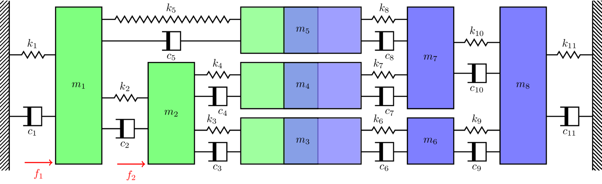

In this tutorial we will apply the in situ method for blocked force estimation to the numerical mass-spring system depicted in @fig-massSpring_coupled. Note that this is the same coupled assembly considered in the [substructuring example](../substructuring/substructuring_1.qmd). As before, the system is comprised of two components; a vibration source $S$ in green, and a passive receiver structure $R$ in blue. These components are characterised by their free-interface FRFs $\mathbf{Y}_S\in\mathbb{C}^{5\times 5}$ and $\mathbf{Y}_R\in\mathbb{C}^{6\times 6}$, respectively. The coupled assembly $C$ is similarly characterised by its FRF matrix, $\mathbf{Y}_C\in\mathbb{C}^{8\times 8}$. the source and reciever components are connected along the interface $c$, composed of the coupled DoFs 3, 4 and 5. 

{width=800 #fig-massSpring_coupled}

To simulate a vibration source, two 'internal' forces are applied within the source component, to DoFs 1 and 2. These forces induce an 'operational response', which is used in conjunction with the interface FRF matrix $\mathbf{Y}_{Ccc}\in\mathbb{C}^{3\times 3}$ to infer the blocked force. To illustrate the key property of the blocked force - independence and transferability - we obtain the blocked force form two different assemblies; these assemblies comprise the same source component, but different receivers. We also consider on-board and modified receiver validations. 

## Build model of coupled assembly
Right, the first thing we need to do before we can start looking at the in situ method is to build a model of the coupled assembly depicted in @fig-massSpring_coupled. For reasons that will become clear shortly, we will do this using a substructuring approach. That is, we will build the source and reciever FRFs $\mathbf{Y}_S$ and $\mathbf{Y}_R$ separately, and then use substructuring to couple them together. These steps are covered in more detail in the [substructuring example](../substructuring/substructuring_1.qmd). This approach will allow us to build quite easily a second assembly with a modified recevier; we just modify the mass matrix of $B$, and redo the substructuring step. 

In the code below we define the mass and stiffness matrices for the source, and two receivers. We compute their respective FRF matrices, before substructuring together two assemblies, denoted $C1$ and $C2$ here. The figure below shows the point FRFs at each of the interface DoFs (3,4 and 5) for the two assemblies. We can clearly see that their dynamics are quite different (as expected given the modified receiver mass values in $C2$.)
```{python}
# | label: fig-coupFRF
# | fig-cap: " Coupled point FRFs at the interface DoFs 3, 4 and 5 (left to right) in C1 and C2. We see that the two assemblies have significantly different dynamics (owing to the changes made in the receiver of C2). "

import numpy as np
np.set_printoptions(linewidth=100)
import matplotlib.pyplot as plt
import scipy as sp
import sys as sys

# Define component masses and build matrices
m1, m2, m3, m4, m5 = 1, 2, 2, 1, 0.5
m6, m7, m8, m9, m10, m11 = 0.5, 2, 1, 3, 5,0.5
M_A = np.diag(np.array([m1,m2,m3,m4,m5])) # Comp A
M_B1 = np.diag(np.array([m6,m7,m8,m9,m10,m11])) # Comp B
M_B2 = np.diag(np.array([m6*2,m7*4,m8/3,m9,m10*2,m11/2])) # Comp B

# Define component stiffnesses and build matrices (complex stiffness -> structural damping)
η = 0.05 # Structural loss factor
k1, k2, k3, k4, k5 = 1e5*(1+1j*η), 1.5e5*(1+1j*η), 0.7e5*(1+1j*η), 1e5*(1+1j*η), 0.5e5*(1+1j*η)
k6, k7, k8, k9, k10, k11 = 0.5e5*(1+1j*η), 2e5*(1+1j*η), 1e5*(1+1j*η), 0.2e5*(1+1j*η), 1e5*(1+1j*η),0.5e5*(1+1j*η)
K_A = np.array([[k1+k2+k5, -k2,        0,   0, -k5],
                [-k2,       k2+k3+k4, -k3, -k4, 0],
                [0,        -k3,        k3,  0,  0],
                [0,        -k4,        0,   k4, 0],
                [-k5,       0,         0,   0,  k5]])
K_B =  np.array([[k6,  0,   0,  -k6,     0,          0],
                 [0,   k7,  0,   0,     -k7,         0],
                 [0,   0,   k8,  0,     -k8,         0],
                 [-k6, 0,   0,   k6+k9,  0,         -k9],
                 [0,  -k7, -k8,  0,      k7+k8+k10, -k10],
                 [0,   0,   0,  -k9,    -k10,        k9+k10+k11]])

f = np.linspace(0,100,1000) # Generate frequency array
ω = 2*np.pi*f # Convert to radians
# Compute FRF matrices over frequency range (have used einsum( ) to show an alternative loop-free approach)
Y_A = np.linalg.inv(K_A - np.einsum('i,jk->ijk',ω**2, M_A))
Y_B1 = np.linalg.inv(K_B - np.einsum('i,jk->ijk',ω**2, M_B1))
Y_B2 = np.linalg.inv(K_B - np.einsum('i,jk->ijk',ω**2, M_B2))

Y1 = np.zeros((f.shape[0],11,11), dtype='complex') # Allocate space for uncoupled assembly 1
Y2 = np.zeros((f.shape[0],11,11), dtype='complex') # Allocate space for uncoupled assembly 2
for fi in range(f.shape[0]): # Build block diagonal (uncoupled) FRF matrix
    Y1[fi,:,:] = sp.linalg.block_diag(Y_A[fi,:,:],Y_B1[fi,:,:])
    Y2[fi,:,:] = sp.linalg.block_diag(Y_A[fi,:,:],Y_B2[fi,:,:])
# Boolean equilibrium matrix:
L = np.array([[1,0,0,0,0,0,0,0,0,0,0],
              [0,1,0,0,0,0,0,0,0,0,0],
              [0,0,1,0,0,1,0,0,0,0,0],
              [0,0,0,1,0,0,1,0,0,0,0],
              [0,0,0,0,1,0,0,1,0,0,0],
              [0,0,0,0,0,0,0,0,1,0,0],
              [0,0,0,0,0,0,0,0,0,1,0],
              [0,0,0,0,0,0,0,0,0,0,1]]).T

# Allocate space for coupled FRF matrices
Y_C1 = np.zeros((f.shape[0],8,8), dtype='complex') # Allocate space for coupled assembly 1
Y_C2 = np.zeros((f.shape[0],8,8), dtype='complex') # Allocate space for coupled assembly 2
for fi in range(f.shape[0]): # Loop over frequency and compute coupled FRF using primal and dual formulations
    Y_C1[fi,:,:] = np.linalg.inv(L.T@np.linalg.inv(Y1[fi,:,:])@L)
    Y_C2[fi,:,:] = np.linalg.inv(L.T@np.linalg.inv(Y2[fi,:,:])@L)


fig, ax = plt.subplots(1,3)
ax[0].semilogy(f, np.abs(Y_C1[:,2,2]),label='C1',linewidth=2)
ax[1].semilogy(f, np.abs(Y_C1[:,3,3]),linewidth=2)
ax[2].semilogy(f, np.abs(Y_C1[:,4,4]),linewidth=2)
ax[0].semilogy(f, np.abs(Y_C2[:,2,2]),label='C2',linewidth=2,linestyle='dashed')
ax[1].semilogy(f, np.abs(Y_C2[:,3,3]),linewidth=2,linestyle='dashed')
ax[2].semilogy(f, np.abs(Y_C2[:,4,4]),linewidth=2,linestyle='dashed')
ax[0].set_ylim([1e-7,1e-3])
ax[1].set_ylim([1e-7,1e-3])
ax[2].set_ylim([1e-7,1e-3])
ax[1].set_yticks([])
ax[2].set_yticks([])
ax[0].set_xlabel('Frequency (Hz)')
ax[1].set_xlabel('Frequency (Hz)')
ax[2].set_xlabel('Frequency (Hz)')
ax[0].set_ylabel('Admittance (m/N)')
ax[0].legend()
plt.show() 

```
The FRF matrices $\mathbf{Y}_{C1cc}$ and $\mathbf{Y}_{C2cc}$ though crucial for the in situ blocked force method, and not enough by themselves. We also need an operational response $\mathbf{v}_c$ (obtained over the same set of interface DoFs; 3,4 and 5) for each assembly. We can easily synthesis such a response by applying some arbitrary internal forces within the source component. Importantly, we must apply the same internal forces for both assemblies, otherwise we will have effectively different sources.

In the code below we define the arbitary internal forces, build a force vector, and apply it to both the assembly's coupled FRFs. The result is two operational response vectors, from which we plot those obtained at the interface DoFs. As expected given their different receivers, the two sets of operational responses display quite different dynamics. 


```{python}
# | label: fig-oppV
# | fig-cap: " Operational response at the interface DoFs 3, 4 and 5 (left to right) in C1 and C2, due to the internal forces applied to DoFs 1 and 2.  "

# Define internal forces:
f1 = 0.5+1j*0.2
f2 = 1.2-1j*0.7
fi = np.array([f1,f2,0,0,0,0,0,0])
# Compute operational response in both assemblies due to internal forces
v1 = np.einsum('ijk,k->ij', Y_C1, fi)
v2 = np.einsum('ijk,k->ij', Y_C2, fi)

fig, ax = plt.subplots(1,3)
ax[0].semilogy(f, np.abs(v1[:,2]),label='C1',linewidth=2)
ax[1].semilogy(f, np.abs(v1[:,3]),linewidth=2)
ax[2].semilogy(f, np.abs(v1[:,4]),linewidth=2)
ax[0].semilogy(f, np.abs(v2[:,2]),label='C2',linewidth=2,linestyle='dashed')
ax[1].semilogy(f, np.abs(v2[:,3]),linewidth=2,linestyle='dashed')
ax[2].semilogy(f, np.abs(v2[:,4]),linewidth=2,linestyle='dashed')
ax[0].set_ylim([1e-7,1e-3])
ax[1].set_ylim([1e-7,1e-3])
ax[2].set_ylim([1e-7,1e-3])
ax[1].set_yticks([])
ax[2].set_yticks([])
ax[0].set_xlabel('Frequency (Hz)')
ax[1].set_xlabel('Frequency (Hz)')
ax[2].set_xlabel('Frequency (Hz)')
ax[0].set_ylabel('Displacement (m)')
ax[0].legend()
plt.show() 

```

## Blocked force identification
Now that we have the coupled interface FRF and operational response, we are ready to apply the in situ blocked force method. As a reminder, the in situ equation takes the form, 
$$
\mathbf{\bar{f}}_c = \mathbf{Y}_{Ccc}^{-1} \mathbf{v}_c
$$
Now according to the blocked force theory, if we implement this equation on our two different assemblies, we should return *exactly* the same blocked force, as it is an independent property of the vibration source. 

In the code below we implement the in situ method (note that we have to be carefull to select the correct DoFs fro our FRF matrix and operational response vector) for both assemblies, and plot the results together. As expected we get the same set of forces! 

Note that we see only two resonant frequencies in the blocked force. This makes sense right? We have *blocked* the interface DoFs 3, 4 and 5, leaving only DoFs 1 and 2 free to move. Hence, only two resonant frequencies.

```{python}
# | label: fig-blkInvariance
# | fig-cap: " Comparison of blocked forces obtained from C1 and C2. From left to right we have the blocked force at DoFs 3, 4 and 5. The same blocked force is obtained from C1 and C2, illustrating invariance of blocked force to receiver dynamics. "

# Apply in situ relation to obtain blocked force from both assemblies
blkF1 = np.einsum('ijk,ik->ij', np.linalg.inv(Y_C1[:,2:5,2:5]), v1[:,2:5])
blkF2 = np.einsum('ijk,ik->ij', np.linalg.inv(Y_C2[:,2:5,2:5]), v2[:,2:5])

fig, ax = plt.subplots(1,3)
ax[0].semilogy(f, np.abs(blkF1[:,0]),label='C1',linewidth=2)
ax[1].semilogy(f, np.abs(blkF1[:,1]),linewidth=2)
ax[2].semilogy(f, np.abs(blkF1[:,2]),linewidth=2)
ax[0].semilogy(f, np.abs(blkF2[:,0]),label='C2',linewidth=2,linestyle='dashed')
ax[1].semilogy(f, np.abs(blkF2[:,1]),linewidth=2,linestyle='dashed')
ax[2].semilogy(f, np.abs(blkF2[:,2]),linewidth=2,linestyle='dashed')
ax[0].set_ylim([0.1e0,1e2])
ax[1].set_ylim([0.1e0,1e2])
ax[2].set_ylim([0.1e0,1e2])
ax[1].set_yticks([])
ax[2].set_yticks([])
ax[0].set_xlabel('Frequency (Hz)')
ax[1].set_xlabel('Frequency (Hz)')
ax[2].set_xlabel('Frequency (Hz)')
ax[0].set_ylabel('Force (N)')
ax[0].legend()
plt.show() 

```

Though applied to a relatively simple mass-spring system, this is quite a remarkable result; we have extracted an independent property of the vibration source (its blocked force) using solely quantities obtained from the coupled assembly. Whats even more remarkable is that this also works when applied to real physical assemblies! Though as you might expect, there are some additional challenges related to obtaining good quality measurement data... As this is intended to be a simple introduction tutorial, we wont dwell on the practicalities of implementing the in situ method experimentally; perhaps we will in another tutorial sometime.

## Validation
Now since this is a numerical example, there isnt really much benifit in further validating the blocked forces, especially since we have already compared them from two assemblies. Though in practice, we rarely have access to two sets of blocked forces, or the true blocked force, though we want some confirmation that our blocked forces are correct, or at least able to reproduce an assembly response. To verify this capability we can use an *on-board validation*; we take the blocked force obtained from assembly $C1$, and use it to predict the response at some other DoF in the recevier (DoF 8 in our case). If the response prediction agrees witht he direct response, we can be confident that we have the correct blocked force. A similar verification can be acheived using a *modified receiver validation*; we take the blocked force obtained from assembly $C1$, and use it to predict the response in an assembly with a modified receiver ($C2$ in our case).

In the code below we compute the on-board and modified receiver validation for both sets of forces. For berevity, we only plot those related to the forces obtained from assembly $C1$. As expected, we get perfect agreement from both validations. These results further verify that not only is the blocked force an independent source property, but it is also transferable and can be used to reproduce the response field within a different receiver structure. 

```{python}
# | label: fig-blkValid
# | fig-cap: "On-board (left) and modified receiver (right) validation. For on-board validation, blocked force from C1 is used to predict $v_8$ in C1. For modified receiver blocked force from C1 is used to predict $v_8$ in C2."

# On-board validation: use blocked force to predict response in same assembly
obVal1 = np.einsum('ik,ik->i', Y_C1[:,-1,2:5], blkF1)
obVal2 = np.einsum('ik,ik->i', Y_C2[:,-1,2:5], blkF2)
# Mod. receiver validation: use blocked force to predict response in modified assembly
modVal12 = np.einsum('ik,ik->i', Y_C1[:,-1,2:5], blkF2)
modVal21 = np.einsum('ik,ik->i', Y_C2[:,-1,2:5], blkF1)


fig, ax = plt.subplots(1,2)
ax[0].semilogy(f, np.abs(v1[:,-1]),color='black',label='Direct',linewidth=4)
ax[0].semilogy(f, np.abs(obVal1),label='Pred.')
ax[0].set_xlabel('Frequency (Hz)')
ax[0].set_ylabel('Displacement (m)')
ax[0].legend()
ax[0].set_ylim([1e-8,1e-3])
ax[1].semilogy(f, np.abs(v2[:,-1]),color='black',label='Direct',linewidth=4)
ax[1].semilogy(f, np.abs(modVal21),label='Pred.')
ax[1].set_xlabel('Frequency (Hz)')
ax[1].set_ylim([1e-8,1e-3])
plt.show() 
```

## Summary
In this tutorial we have implmented the in situ method for blocked force estimation on a pair of numerical mass-spring assemblies with different recevier structures. We have verfied that the blocked froce obtained from the two assemblies are identical, even though the dynamics of the assemblies themselves are quite different (recall that they have the same source, but different receivers). We further verify the correctness of the blocked force by performing on-board and modified receiver validations, which involved using the blocked force to predict the operational response at some new location in the same assembly and one with a modified recevier, respectively.