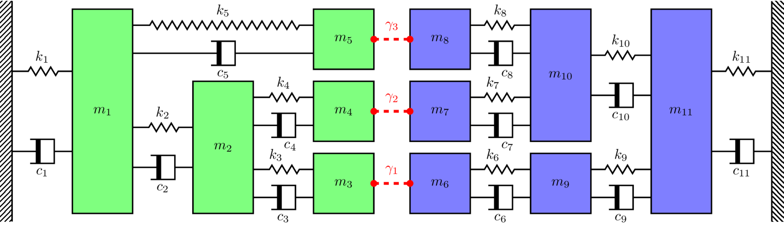

In this tutorial we will apply the primal and dual substructuring methods to the numerical mass-spring system depicted in @fig-massSpring. The system is comprised of two components; $A$ in green, and $B$ in blue. These components are characterised by their free-interface FRFs $\mathbf{Y}_A\in\mathbb{C}^{5\times 5}$ and $\mathbf{Y}_B\in\mathbb{C}^{6\times 6}$, respectively.

{width=800 #fig-massSpring}

In this tutorial we will consider both a rigid and resilient coupling of $A$ and $B$. In the rigid case, we consider the interface flexibilities $\gamma_n=0$, i.e. the connections are rigid. The rigidly coupled FRFs are then computed by primal and dual methods. For the resilient case we consider a massless (force conserving) spring-like joint, defined by its stiffness $k_j$ and loss factor $\eta_j$ as $Z_j = k_j(1+i\eta)$. The resiliently coupled FRFs are then computed by primal (treating each joint as a individual component) and dual (treating each joint as a relaxation of continuity) methods. 

## Define component matrices
The first thing we need to do is build the mass and stiffness matrices that represent components $A$ and $B$. Whilst we are doing this, we will also build the mass and stiffness matrices for the rigidly coupled assembly (see @fig-massSpring_coupled). We will use these later to provide some comparisons for substructured results. The mass and stiffness matrices of component $A$ are printed below as an example.

Once we have built the mass and stiffness matrices, we quickly compute the natural frequencies for each system; this is just to give us an idea over what frequency range we should compute our FRFs; 1-100 Hz looks to cover everything.
```{python}

import numpy as np
np.set_printoptions(linewidth=100)
import matplotlib.pyplot as plt
import scipy as sp
import sys as sys

# Define component masses and build matrices
m1, m2, m3, m4, m5 = 1, 2, 2, 1, 0.5
m6, m7, m8, m9, m10, m11 = 0.5, 2, 1, 3, 5,0.5
M_A = np.diag(np.array([m1,m2,m3,m4,m5])) # Comp A
M_B = np.diag(np.array([m6,m7,m8,m9,m10,m11])) # Comp B
M_C = np.diag(np.array([m1,m2,m3+m6,m4+m7,m5+m8,m9,m10,m11])) # Coupled AB

# Define component stiffnesses and build matrices (complex stiffness -> structural damping)
η = 0.05 # Structural loss factor
k1, k2, k3, k4, k5 = 1e5*(1+1j*η), 1.5e5*(1+1j*η), 0.7e5*(1+1j*η), 1e5*(1+1j*η), 0.5e5*(1+1j*η)
k6, k7, k8, k9, k10, k11 = 0.5e5*(1+1j*η), 2e5*(1+1j*η), 1e5*(1+1j*η), 0.2e5*(1+1j*η), 1e5*(1+1j*η),0.5e5*(1+1j*η)
K_A = np.array([[k1+k2+k5, -k2,        0,   0, -k5],
                [-k2,       k2+k3+k4, -k3, -k4, 0],
                [0,        -k3,        k3,  0,  0],
                [0,        -k4,        0,   k4, 0],
                [-k5,       0,         0,   0,  k5]])
K_B =  np.array([[k6,  0,   0,  -k6,     0,          0],
                 [0,   k7,  0,   0,     -k7,         0],
                 [0,   0,   k8,  0,     -k8,         0],
                 [-k6, 0,   0,   k6+k9,  0,         -k9],
                 [0,  -k7, -k8,  0,      k7+k8+k10, -k10],
                 [0,   0,   0,  -k9,    -k10,        k9+k10+k11]])
K_C = np.array([[k1+k2+k5, -k2,        0,     0,    -k5,     0,     0,          0],
                [-k2,       k2+k3+k4, -k3,   -k4,    0,      0,     0,          0],
                [0,        -k3,        k3+k6, 0,     0,     -k6,    0,          0],
                [0,        -k4,        0,     k4+k7, 0,      0,    -k7,         0],
                [-k5,       0,         0,     0,     k5+k8,  0,    -k8,         0],
                [0,         0,        -k6,    0,     0,      k6+k9, 0,         -k9],
                [0,         0,         0,    -k7,   -k8,     0,     k7+k8+k10, -k10],
                [0,         0,         0,     0,     0,     -k9,   -k10,        k9+k10+k11]])


print('Mass matrix of component A (kg):\n' + str(M_A))
print('')
print('Stiffness matrix of component A (m/N):\n' + str(K_A))
print('')

print('Natural frequencies of component A (Hz):')
for natF in np.sort(np.sqrt(np.real(sp.linalg.eigvals(K_A, M_A)))/(2*np.pi)):
    sys.stdout.write('{:10.1f}'.format(natF))
print('')
print('\nNatural frequencies of component B (Hz):')
for natF in np.sort(np.sqrt(np.real(sp.linalg.eigvals(K_B, M_B)))/(2*np.pi)):
    sys.stdout.write('{:10.1f}'.format(natF))
print('')
print('\nNatural frequencies of assembly C (Hz):')
for natF in np.sort(np.sqrt(np.real(sp.linalg.eigvals(K_C, M_C)))/(2*np.pi)):
    sys.stdout.write('{:10.1f}'.format(natF))
```

## Synthesise component FRFs
Using the mass and stiffness matrices of each component, we can compute their respective FRF matrices. Becasue we are dealing with small sytems (max of 11 DoFs), we can use the direct matrix inversion approach. In the presence of viscous damping, the dynamic stiffness matrix (denoted $\mathbf{Y}$ here) takes the form,
$$
\mathbf{Y} = \left(\mathbf{K} + i\omega \mathbf{C} -\omega^2\mathbf{M}\right)^{-1}
$$
where $\mathbf{C}$ is the damping matrix. In the present example, rather than using viscous damping, we implement structural damping.  The dynamic stiffness matrix takes the form,
$$
\mathbf{Y} = \left(\mathbf{K}(1+j\eta) -\omega^2\mathbf{M}\right)^{-1}
$$
where $\eta$ is the structural loss factor. 

Recall that FRFs are frequency dependent. So we must compute each components FRF matrix over a range of $\omega=2\pi f$ frequencies (1-100 Hz in this example).

To get a sense of whats going on, we plot a point FRFs for each component. We see that the two components $A$ and $B$ display very different dynamics, and that their respective natural frequencies line up with those presented above.
```{python}
# | label: fig-compFRFs
# | fig-cap: "Example point FRFs for component A, B and the coupled assembly C. "

f = np.linspace(0,100,1000) # Generate frequency array
ω = 2*np.pi*f # Convert to radians
# Compute FRF matrices over frequency range (have used einsum( ) to show an alternative loop-free approach)
Y_A = np.linalg.inv(K_A - np.einsum('i,jk->ijk',ω**2, M_A))
Y_B = np.linalg.inv(K_B - np.einsum('i,jk->ijk',ω**2, M_B))
Y_C = np.linalg.inv(K_C - np.einsum('i,jk->ijk',ω**2, M_C))

fig, ax = plt.subplots()
ax.semilogy(f, np.abs(Y_A[:,2,2]),label='$Y_A$')
ax.semilogy(f, np.abs(Y_B[:,5,5]),label='$Y_B$')
ax.semilogy(f, np.abs(Y_C[:,2,2]),label='$Y_C$')
ax.grid(True)
ax.set_xlabel('Frequency (Hz)')
ax.set_ylabel('Admittance (m/N)')
plt.legend()
plt.show() 
```

## Rigid coupling by primal and dual formulations
Right, now that we have our FRF matrices, lets get substructuring. The first this we need to is remind ourselves of the key substructuring equations. For the primal method we have,
$$
\mathbf{Y}_{C} = \left(\mathbf{L}^{\rm T}\mathbf{Y}^{-1}\mathbf{L}\right)^{-1}.
$${#eq-primal}
where $\mathbf{Y}$ is a block diagonal matrix of uncoupled (free-interface) component FRF matrices, $\mathbf{L}$ is a Boolean matrix that enforced equilibrium between connecting DoFs, and $\mathbf{Y}_{C}$ is the matrix of coupled FRFs.

For the dual method we have, 
$$
\mathbf{Y}_C =   \mathbf{Y} -\mathbf{Y}\mathbf{B}^{\rm T}\left(\mathbf{B}\mathbf{Y}\mathbf{B}^{\rm T} + \boldsymbol{\Gamma}\right)^{-1}\mathbf{B}\mathbf{Y}.  
$${#eq-dual}
where $\mathbf{Y}$ is the same diagonal matrix as above, $\mathbf{B}$ is a $signed$ Boolean matrix that enforces continuity between connected DoFs, and $\boldsymbol{\Gamma}$ is matrix describing the interface flexibility. As we are considering rigid coupling here, we simply set $\boldsymbol{\Gamma}=\mathbf{0}$.

Often, the hardest part of substructuring, is just building the correct $\mathbf{L}$ and/or $\mathbf{B}$ matrices, especially for large complex systems. To help us, @fig-massSpring_coupled shows us the DoF numbering for the coupled system. 

Recall that for the $\mathbf{L}$ matrix, the rows correspond to the uncoupled DoFs, and the columns to the coupled DoFs. To connect two DoFs, we place a 1 in each of their respective rows. For the example considered here we have, 
$$
\mathbf{L} = \left[\begin{array}{cccccccc}
1 & 0 & 0&0&0&0&0&0 \\
0 & 1 & 0&0&0&0&0&0 \\
0 & 0 & 1&0&0&0&0&0 \\
0 & 0 & 0&1&0&0&0&0 \\
0 & 0 & 0&0&1&0&0&0 \\
0 & 0 & 1&0&0&0&0&0 \\
0 & 0 & 0&1&0&0&0&0 \\
0 & 0 & 0&0&1&0&0&0 \\
0 & 0 & 0&0&0&1&0&0 \\
0 & 0 & 0&0&0&0&1&0 \\
0 & 0 & 0&0&0&0&0&1 \\
\end{array}\right]
$$
where, for example, coupled DoF 3 (i.e. column 3) is formed by the co-location of uncoupled DoFs 3 and 5 (i.e. rows 3 and 5). Note that the singular ones in columns 1, 2, 9, 10, and 11 simply mean that no coupling occurs at these DoFs. 

{width=800 #fig-massSpring_coupled}

Construction of the $\mathbf{B}$ is similar, but a little different. The rows now correspond to the *coupling DoFs* and the columns the uncoupled DoFs. To connect two DoFs, we place a 1 and -1 in their respective columns. For the example considered here we have, 
$$
\mathbf{B} = \left[\begin{array}{ccccccccccc}
0 & 0 & 0&1&0&0&-1&0 &0 &0 &0 &0 \\
0 & 0 & 0&0&1&0&0&-1 &0 &0 &0 &0 \\
0 & 0 & 0&0&0&1&0&0 &-1 &0 &0 &0 \\
\end{array}\right]
$$
where we see that the first coupling (i.e. row 1) is formed by the co-location of uncoupled DoFs 3 and 5 (i.e. rows 3 and 5). Note that the dimensions of $\mathbf{B}$ means that the matrix inverse required by the dual method $\left(\mathbf{B}\mathbf{Y}\mathbf{B}^{\rm T}\right)^{-1}$ is equal in size to the number of connections. This is much smaller than those required by the primal method. For small systems, the reduction in computational effort is not a big deal. The main benifit comes with larger systems, where matrix inversions are well known to amplify uncertainty and error; the smaller the matrix the better!

Substituting $\mathbf{Y}$ and $\mathbf{L}$/$\mathbf{B}$ into the substructuring equations above, and looping over frequency, we compute the coupled assembly FRFs. We plot the transfer FRF between coupled DoFs 1 and 8 ($Y_{1,8}$) below alongside the FRF obtained directly from the coupled assembly mass and stiffness matrices. As expected, we get the exact same result for both methods. Don't forget, the dual method retains all DoFs of the uncoupled system; the coupling DoFs appear twice in the coupled FRF matrix, such that rows/columns 3 and 6 are identical (same goes for rows/columns 4 and 7, and 5 and 8).

```{python}
# | label: fig-compPrimalDual
# | fig-cap: "Primal and dual substructured FRFs $Y_{1,8}$ of rigidly coupled assembly compared against directly obtained FRF.  "

Y = np.zeros((f.shape[0],11,11), dtype='complex') # Allocate space
for fi in range(f.shape[0]): # Build block diagonal (uncoupled) FRF matrix
    Y[fi,:,:] = sp.linalg.block_diag(Y_A[fi,:,:],Y_B[fi,:,:])
# Boolean equilibrium matrix:
L = np.array([[1,0,0,0,0,0,0,0,0,0,0],
              [0,1,0,0,0,0,0,0,0,0,0],
              [0,0,1,0,0,1,0,0,0,0,0],
              [0,0,0,1,0,0,1,0,0,0,0],
              [0,0,0,0,1,0,0,1,0,0,0],
              [0,0,0,0,0,0,0,0,1,0,0],
              [0,0,0,0,0,0,0,0,0,1,0],
              [0,0,0,0,0,0,0,0,0,0,1]]).T
# Boolean continuity matrix:
B = np.array([[0,0,1,0,0,-1,0,0,0,0,0],
              [0,0,0,1,0,0,-1,0,0,0,0],
              [0,0,0,0,1,0,0,-1,0,0,0]])
# Verify that null space relation between L^T and B (normalise by max to get +\- 1):
B_null = sp.linalg.null_space(L.T)/np.max(sp.linalg.null_space(L.T))

print("The Boolean coupling matrix L.T:")
print(L.T)
print("\nThe Boolean coupling matrix B:")
print(B)
print("\nNull space of Boolean coupling matrix L.T:")
print(B_null.T)

# Allocate space for coupled FRF matrices
Y_C_primal = np.zeros((f.shape[0],8,8), dtype='complex')
Y_C_dual = np.zeros_like(Y)
for fi in range(f.shape[0]): # Loop over frequency and compute coupled FRF using primal and dual formulations
    Y_C_primal[fi,:,:] = np.linalg.inv(L.T@np.linalg.inv(Y[fi,:,:])@L)
    Y_C_dual[fi,:,:] = Y[fi,:,:] - Y[fi,:,:]@B.T@np.linalg.inv(B@Y[fi,:,:]@B.T)@B@Y[fi,:,:]


fig, ax = plt.subplots()
ax.semilogy(f, np.abs(Y_C[:,0,-1]),color='black',label='Direct',linewidth=4)
ax.semilogy(f, np.abs(Y_C_primal[:,0,-1]),label='Primal')
ax.semilogy(f, np.abs(Y_C_dual[:,0,-1]),label='Dual',linestyle='dashed')
ax.grid(True)
ax.set_xlabel('Frequency (Hz)')
ax.set_ylabel('Admittance (m/N)')
plt.legend()
plt.show() 

```

## Resilient coupling
In the previous section we considered the rigid coupling of $A$ and $B$. Often when modelling coupled assemblies, components are connected by resilient elements, such as isolators or rubber bushings. Lets look at how our substructuring differs in this case.

For the primal method (@eq-primal) there is no great change, we simply treat the coupling element as if it were a component. Hence, the block diagonal FRF matrix becomes, 
$$
\mathbf{Y} = \left[\begin{array}{ccccc}
\mathbf{Y}_A & & & & \\
& \mathbf{Y}_j & & & \\
& & \mathbf{Y}_j & & \\
& & & \mathbf{Y}_j & \\
& & & & & \mathbf{Y}_B\\
\end{array}\right]
$$
where $\mathbf{Y}_j$ is free-interface FRF matrix of the coupling element. Now, in this example we are considering a simple massless spring-like joint whose dynamic stiffness matrix takes the form,
$$
\mathbf{Z}_j = \left[\begin{array}{cc} k_j(1+i\eta) & -k_j(1+i\eta)\\
-k_j(1+i\eta) & k_j(1+i\eta)
\end{array}\right]
$$
Note that the first column of $\mathbf{Z}_j$ is just the negative of the second column... This linear dependence means that we cannot invert $\mathbf{Z}_j$ to obtain $\mathbf{Y}_j$! This is no big deal for the primal method, we can just invert $\mathbf{Y}_A$ and $\mathbf{Y}_B$, and instead build the block diagonal impedance matrix directly, 
$$
\mathbf{Z} = \left[\begin{array}{ccccc}
\mathbf{Y}_A^{-1} & & & & \\
& \mathbf{Z}_j & & & \\
& & \mathbf{Z}_j & & \\
& & & \mathbf{Z}_j & \\
& & & & & \mathbf{Y}_B^{-1}\\
\end{array}\right]
$$
After all, the coupling matrices $\mathbf{L}$ and $\mathbf{L}^{\rm T}$ are applied to the impedance matrix, not the mobility. We then just continue with the primal method as before, 
$$
\mathbf{Y}_{C} = \left(\mathbf{L}^{\rm T}\mathbf{Z}\mathbf{L}\right)^{-1}.
$$
Note however, the coupling matrix $\mathbf{L}$ is not the same one we used before for rigid coupling; DoF 3 is no longer coupled to what was DoF 6, it is coupled to one side of the resilient element, with DoF 6 coupled to the other side. By including the coupling elements as components we have effectively increased the number of uncoupled DoFs by 6 (2 per element). The $\mathbf{L}$ matrix should thus be redefined accordingly (see the code printouts below for our example). 

Now what about the dual method? Notice that with the dual method (@eq-dual), the coupling matrix $\mathbf{B}$ is applied directly to the uncoupled FRF matrix $\mathbf{Y}$, meaning we have to work with the FRFs directly. We have already seen above that we can't compute the FRF $\mathbf{Y}_j$, so what do we do? Well, this is the role of the $\boldsymbol{\Gamma}$ term in our dual equation. If instead of treating the coupling element as a *component*, we consider it as a relaxation of continuity (e.g. DoFs 3 and 6 can now move independently), this $\boldsymbol{\Gamma}$ term appears in our substructuring equation, describing the flexibility the connection. This flexibility is just the inverse of the point impedance of the connection. For our example we have,
$$
\boldsymbol{\Gamma} = \left[\begin{array}{ccc}
\gamma_1 & &\\ & \gamma_2 & \\ & & \gamma_3
\end{array}\right]
$$
with $\gamma_n = 1/(k_j(1+i\eta))$ for each connection.

Note that because the coupling elements are dealt with by relaxing continuity, not as components, the same $\mathbf{B}$ matrix can be used as for the rigid case. Whilst the rigid case has repeated rows and columns, the resilient case does not, as the what were duplicated DoFs are now independent DoFs.

Below we implement both primal and dual approaches to the resilient coupling of $A$ and $B$, and again compare the transfer FRF $Y_{1,8}$ with that obtained directly from the coupled mass and stiffness matrices (note that these have had to be redefined for the resilient case). As expected, both methods yield the same FRFS. We have also left the rigidly coupled FRF on the plot (now in gray) to illustrate how adding a resilient connection has on average reduced the magnitude of the coupled FRF (again, an expected result!).
```{python}
# | label: fig-primalDualRes
# | fig-cap: "Primal and dual substructured FRFs $Y_{1,8}$ of resiliently coupled assembly compared against directly obtained FRF.  "

ηj = 0.5 # Loss factor of coupling element
kj = 10000*(1+1j*ηj) # Stiffness of coupling element
# Redefine mass and stiffness matrices for resiliently coupled assembly
M_C_res = sp.linalg.block_diag(M_A,M_B)
K_C_res = np.array([[k1+k2+k5, -k2,        0,     0,    -k5,    0,      0,      0,     0,      0,          0],
                    [-k2,       k2+k3+k4, -k3,    -k4,   0,     0,      0,      0,     0,      0,          0],
                    [0,        -k3,        k3+kj, 0,     0,    -kj,     0,      0,     0,      0,          0],
                    [0,        -k4,        0,     k4+kj, 0,     0,     -kj,     0,     0,      0,          0],
                    [-k5,       0,         0,     0,     k5+kj, 0,      0,     -kj,    0,      0,          0],
                    [0,         0,        -kj,    0,     0,     k6+kj,  0,      0,    -k6,     0,          0],
                    [0,         0,         0,    -kj,    0,     0,      k7+kj,  0,     0,     -k7,         0],
                    [0,         0,         0,     0,    -kj,    0,      0,      k8+kj, 0,     -k8,         0],
                    [0,         0,         0,     0,     0,    -k6,     0,      0,     k6+k9,  0,         -k9],
                    [0,         0,         0,     0,     0,     0,     -k7,    -k8,    0,      k7+k8+k10, -k10],
                    [0,         0,         0,     0,     0,     0,      0,      0,    -k9,    -k10,        k9+k10+k11]])
Y_C_res = np.linalg.inv(K_C_res - np.einsum('i,jk->ijk',ω**2,M_C_res)) # Compute coupled FRF directly

# For primal formulation:
Z_j = np.array([[kj, -kj],[-kj, kj]]) # Dynamic stiffness matrix of flexible connection
# New Boolean equilibrium matrix:
L = np.array([[1,0,0,0,0,0,0,0,0,0,0,0,0,0,0,0,0],
              [0,1,0,0,0,0,0,0,0,0,0,0,0,0,0,0,0],
              [0,0,1,0,0,1,0,0,0,0,0,0,0,0,0,0,0],
              [0,0,0,1,0,0,0,1,0,0,0,0,0,0,0,0,0],
              [0,0,0,0,1,0,0,0,0,1,0,0,0,0,0,0,0],
              [0,0,0,0,0,0,1,0,0,0,0,1,0,0,0,0,0],
              [0,0,0,0,0,0,0,0,1,0,0,0,1,0,0,0,0],
              [0,0,0,0,0,0,0,0,0,0,1,0,0,1,0,0,0],
              [0,0,0,0,0,0,0,0,0,0,0,0,0,0,1,0,0],
              [0,0,0,0,0,0,0,0,0,0,0,0,0,0,0,1,0],
              [0,0,0,0,0,0,0,0,0,0,0,0,0,0,0,0,1]]).T

print("The Boolean coupling matrix L.T:")
print(L.T)

print("\nThe Boolean coupling matrix B:")
print(B)

# For dual formulation:
γ = 1/kj # Joint flexibility (inverse of joint point stiffness)
Γ = np.diag([γ, γ, γ]) # Flexibility matrix for all joints (diagonal because no cross-coupling)

# Allocate some space
Y_C_primal_res = np.zeros_like(Y)
Y_C_dual_res = np.zeros_like(Y)
for fi in range(f.shape[0]): # Loop over frequency and compute coupled FRFs
    Z = sp.linalg.block_diag(np.linalg.inv(Y_A[fi,:,:]), Z_j, Z_j, Z_j,np.linalg.inv(Y_B[fi,:,:])) # Block diagonal impedance matrix for primal method
    Y_C_primal_res[fi,:,:] = np.linalg.inv(L.T@Z@L)
    Y_C_dual_res[fi,:,:] = Y[fi,:,:] - Y[fi,:,:]@B.T@np.linalg.inv(B@Y[fi,:,:]@B.T + Γ)@B@Y[fi,:,:]


fig, ax = plt.subplots()
ax.semilogy(f, np.abs(Y_C[:,0,-1]),color='gray',label='Direct (rigid)',linewidth=4)
ax.semilogy(f, np.abs(Y_C_res[:,0,-1]),color='black',label='Direct (res)',linewidth=4)
ax.semilogy(f, np.abs(Y_C_primal_res[:,0,-1]),label='Primal')
ax.semilogy(f, np.abs(Y_C_dual_res[:,0,-1]),label='Dual',linestyle='dashed')
ax.grid(True)
ax.set_xlabel('Frequency (Hz)')
ax.set_ylabel('Admittance (m/N)')
plt.legend()
plt.show() 
```

## Summary
Thats it for this tutorial; lets quickly recap. We have implemented the primal and dual substructuring methods for a numerical mass-spring assembly, considering both rigid and resilient coupling between components. To do this we first defined the mass and stiffness matrices for each component, before synthesising their respective FRF matrices. Next we built the Boolean coupling matrices for each method, before implementing the substructuring equations themselves. For the resilient case, we had the additional step of building the coupling element impedance matrix for the primal method, and flexibility matrix for the dual method.

We have seen that for both cases the substructuring results are identical and in agreement with the directly computed FRFs from the coupled mass and stiffness matrices. 
