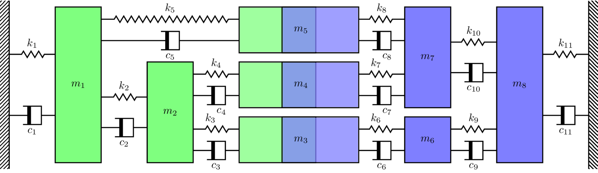
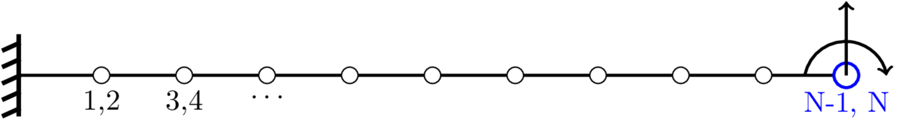

In this tutorial we introduce the key equations for synthesising FRFs from pre-existing numerical models, specifically physical domain representations where mass and stiffness matrices are known (e.g. by the Finite Element method). The reader is referred to the many text books in the field for further detail on the modelling itself, see for example @petyt2010introduction.

## A little bit of theory
In the physical domain, a component is characterised by its mass, stiffness and damping characteristics, which together form the following equation of motion,
$$
	\mathbf{M}\mathbf{\ddot{x}}(t) + \mathbf{C}\mathbf{\dot{x}}(t) + \mathbf{K}\mathbf{x}(t) = \mathbf{f}(t).
$${#eq-EoM1}
To obtain a component FRF matrix from @eq-EoM1, two approaches will be discussed; the direct (matrix inversion) method and modal synthesis. 

In either case, we begin by assuming a harmonic forcing such that $\mathbf{f}(t) = \mathbf{f} e^{i\omega t}$. Owing to linearity, the displacement, velocity and acceleration response will also be periodic with the same frequency. @eq-EoM1 can thus be transformed into the frequency domain, and expressed in terms of displacement $\mathbf{x}(\omega)$ as,
$$
	\left[-\omega^2\mathbf{M} + i\omega\mathbf{C} + \mathbf{K}\right]\mathbf{x}(\omega) = \mathbf{D}(\omega)  \mathbf{x}(\omega) =  \mathbf{f}(\omega).
$${#eq-EoMfreq}
where $\mathbf{D}(\omega)$ represents the dynamic stiffness of the component. 

### Direct method
The direct determination of the mobility involves computing the matrix inverse of $\mathbf{D}$ and pre-multiplying both sides of @eq-EoMfreq by it, giving,
$$
	\mathbf{x}(\omega) = \mathbf{R}(\omega)\mathbf{f}(\omega)
$$
where,
$$
	\mathbf{R}(\omega) =\mathbf{D}^{-1}(\omega) = \left[-\omega^2\mathbf{M} + i\omega\mathbf{C} + \mathbf{K}\right]^{-1}
$${#eq-directfrf0}
is the dynamic compliance of the component. The mobility is then obtained by differentiation, i.e. scaling by $i\omega$,
$$
	\mathbf{Y}(\omega) = i\omega\mathbf{R}(\omega).
$${#eq-directfrf}

This direct method is appropriate when working with small models containing not too many DoFs. However, as the matrix inversion has to be performed at each frequency, for large systems this becomes computationally expensive and is not recommended. Furthermore, this direct approach provides the full mobility matrix that includes every DoF within the component model. For virtual prototyping applications, this is usually not necessary since the black box models adopted for components only require interface DoFs to be described in full.

A reduced mobility matrix can be obtained by considering @eq-EoMfreq in a partitioned form (omitting frequency dependence for clarity), 
$$
    \left(\begin{array}{c}
    \mathbf{f}_r \\ \mathbf{f}_d
    \end{array}\right) = \left[\begin{array}{cc}
         \mathbf{D}_{rr} & \mathbf{D}_{rd}  \\
         \mathbf{D}_{dr} & \mathbf{D}_{dd}  
    \end{array}\right] \left(\begin{array}{c}
    \mathbf{x}_r \\ \mathbf{x}_d
    \end{array}\right) 
$${#eq-EoMpart}
where $r$ denotes the set of DoFs we wish to retain, and $d$ those that are required for computation but are not needed in the dynamic description of the component. Assuming no external forces are applied to the any of the $d$ DoFs, $\mathbf{f}_d = \mathbf{0}$, @eq-EoMpart can be rearranged to yield, 
$$
    \mathbf{f}_r = \left(\mathbf{D}_{rr} - \mathbf{D}_{rd}\mathbf{D}_{dd}^{-1} \mathbf{D}_{dr}\right)\mathbf{x}_r = \mathbf{\hat{D}}_{rr} \mathbf{x}_r
$${#eq-EoMred}
where $\mathbf{\hat{D}}_{rr}$ is the reduced dynamic stiffness matrix, from which the reduced mobility matrix is obtained by inversion and scaling,
$$
\mathbf{\hat{Y}}_{rr} = i\omega \mathbf{\hat{D}}_{rr}^{-1}.
$$
Note that although reduced in size to include only the retained DoFs $r$, @eq-EoMred still involves the inversion of the stiffness sub-matrix $\mathbf{D}_{dd}^{-1}$, which for large systems is still computationally demanding. More efficient reduction schemes are available at the cost of introducing some approximation in the estimation of the component dynamics. 

### Modal synthesis
The modal synthesis approach involves determining the mode shapes and natural frequencies of a component, and expressing its FRF as a truncated summation of modes. 

To formulate the modal synthesis of a mobility matrix, we begin by considering the case of an undamped and unforced system, whose equation of motion reads,
$$ 
	\mathbf{K}\mathbf{x}(\omega) = \omega^2\mathbf{M}\mathbf{x}(\omega).
$${#eq-EoMfreq_2}
Physically, we are interested in a special type of solution to @eq-EoMfreq_2, where all coordinates execute synchronous motion, i.e. they have the same time dependence so that the ratio between the motion of any two points remains constant. For an $N$ dimensional system, there exist $N$ such solutions to @EoMfreq_2 in the form,
$$
	\mathbf{K}\mathbf{\tilde{\phi}}_i = \lambda_i\mathbf{M}\mathbf{\tilde{\phi}}_i.
$${#eq-EoMfreq_3}
where $\lambda_i = \omega_i^2$ are the so-called system eigenvalues (representing the squared natural frequencies of the component), and $\mathbf{\tilde{\phi}}_i$ are the corresponding eigenvectors (representing the relative deformations of the component at frequency $\omega_i$ that satisfy @EoMfreq_2). The eigenvectors $\mathbf{\phi}_i$ are unique only in the sense that the ratio between the motion at any two points is constant. In other words, it is only the shape of the component's deflection that is well defined, not its amplitude. To render the eigenvectors unique a normalisation process is required. The most common normalisation scheme is that of mass normalisation, whereby the normalised eigenvectors are obtained as $\phi_i = {\tilde{\phi}_i}\left(\tilde{\phi}_i^{\rm T}\sqrt{\mathbf{M}}\tilde{\phi}_i\right)^{-1}$, or in matrix form $\boldsymbol{\Phi} = \boldsymbol{\tilde{\Phi}}\left(\boldsymbol{\tilde{\Phi}}^{\rm T}\sqrt{\mathbf{M}}\boldsymbol{\tilde{\Phi}}\right)^{-1}$. With this mass normalisation we have that,
$$
	\mathbf{\phi}_i^{\rm T}\mathbf{M}\mathbf{\phi}_i=1
$${#eq-massNorm}
and
$$
	\mathbf{\phi}_i^{\rm T}\mathbf{K}\mathbf{\phi}_i=\omega_i^2.
$$
This latter relation can be easily proven by pre-multiplying both sides of @eq-EoMfreq_3 by $\mathbf{\phi}_i^{\rm T}$. Similarly, from @eq-EoMfreq_3 and the uniqueness of eigenvalues, it is straightforward to show that the component eigenvectors/mode shapes are orthogonal, such that,
$$
    \mathbf{\phi}^{\rm T}_r\mathbf{M}\mathbf{\phi}_s = 0
$$
and
$$
    \mathbf{\phi}^{\rm T}_r\mathbf{K}\mathbf{\phi}_s = 0,   r\neq s.
$${#eq-orthog2}
The normalised eigenvectors described above are referred to as the component's normal modes, or simply its modes. 

Noting that any $N$ dimensional vector can be represented as a linear combination of $N$ linearly independent vectors, and that normal modes are themselves orthogonal and linearly independent, the displacement $\mathbf{x}$ can be expressed in the form,
$$
    \mathbf{x} = \Sigma_i^N \mathbf{\phi}_i q_i = \boldsymbol{\Phi}\mathbf{q}
$${#eq-modalSum}
where $\boldsymbol{\Phi} = \left[ \mathbf{\phi}_1, \mathbf{\phi}_2, \cdots, \mathbf{\phi}_N\right]$ is a modal matrix whose columns represent the normal modes and $\mathbf{q}=\mathbf{q}_0e^{i\omega t}$ is a vector of modal amplitudes describing the contribution of the each mode to the response $\mathbf{x}$. With the modal matrix $\boldsymbol{\Phi}$ being constant, we have also that $\mathbf{\dot{x}} = \boldsymbol{\Phi}\mathbf{\dot{q}}$ and $\mathbf{\ddot{x}} = \boldsymbol{\Phi}\mathbf{\ddot{q}}$.

Returning now to the damped and forced equation of motion,
$$
	\mathbf{M}\mathbf{\ddot{x}}(t) + \mathbf{C}\mathbf{\dot{x}}(t) + \mathbf{K}\mathbf{x}(t) = \mathbf{f}(t)
$${#eq-EoMfreq_4}
substituting the displacement, velocity and acceleration by their modal representations from @eq-modalSum and its time derivatives, whilst pre-multiplying @eq-EoMfreq_4 by the transposed mode shape matrix $\boldsymbol{\Phi}^{\rm T}$ yields, 
$$
	\mathbf{\bar{M}}\mathbf{\ddot{q}}(t) + \mathbf{\bar{C}}\mathbf{\dot{q}}(t) + \mathbf{\bar{K}}\mathbf{q}(t) = \mathbf{Q}(t)
$${#eq-EoMmodal}
with,
$$
	\mathbf{\bar{M}} = 	\boldsymbol{\Phi}^{\rm T}\mathbf{{M}}\boldsymbol{\Phi}, \quad \mathbf{\bar{C}} = 	\boldsymbol{\Phi}^{\rm T}\mathbf{{C}}\boldsymbol{\Phi}, \quad \mathbf{\bar{K}} = 	\boldsymbol{\Phi}^{\rm T}\mathbf{{K}}\boldsymbol{\Phi}, \quad\mathbf{Q} = \boldsymbol{\Phi}^{\rm T}\mathbf{{f}}.
$$
$\mathbf{\bar{M}}$, $\mathbf{\bar{K}}$ and $\mathbf{\bar{C}}$ are called the modal mass, stiffness and damping matrices, and $\mathbf{{Q}}$ the modal force vector. 
Recalling the mass normalised and orthogonality conditions in @eq-massNorm and @eq-orthog2, 
$$
	\mathbf{\bar{M}} = \mathbf{I}, \quad \mathbf{\bar{K}}=\mbox{diag}\left[\omega^2_1, \omega^2_2, \cdots, \omega^2_N\right]=\boldsymbol{\Lambda}
$$
@eq-EoMmodal becomes, 
$$
	\left[-\omega^2\mathbf{I} + i\omega\mathbf{\bar{C}} + \boldsymbol{\Lambda}\right]\mathbf{q} = \mathbf{Q}(t).
$$
Inversion and pre-multiplication of both sides by the bracketed term yields a solution for the modal amplitudes, 
$$
	\mathbf{q} = 	\left[-\omega^2\mathbf{I} + i\omega\mathbf{\bar{C}} + \boldsymbol{\Lambda}\right]^{-1}\mathbf{Q}(t).
$$
Substituting the modal amplitudes into @eq-modalSum,  whilst recalling $\mathbf{Q} = \boldsymbol{\Phi}^{\rm T}\mathbf{{f}}$, 
$$
	\mathbf{x} = \boldsymbol{\Phi}	\left[-\omega^2\mathbf{I} + i\omega\mathbf{\bar{C}} + \boldsymbol{\Lambda}\right]^{-1}\boldsymbol{\Phi}^{\rm T}\mathbf{{f}}
$$
from which we can identify the displacement FRF as,
$$
	\mathbf{Y}(\omega) = \boldsymbol{\Phi}\left[\boldsymbol{\Lambda}-\omega^2\mathbf{I} + i\omega \mathbf{\bar{C}}\right]^{-1}\boldsymbol{\Phi}^{\rm T}.
$${#eq-mobModal}
@eq-mobModal provides a means of synthesising the FRF matrix of a component based on its natural frequencies, mode shapes and modal damping characteristics. To provide an efficient synthesis, there are two important considerations. 

First, the number of modes used. Whilst an $N$ DoF system will have $N$ natural frequencies and associated mode shapes, often only a reduced subset of these are required to provide a good estimate of the mobility matrix. This is achieved by truncating the modal matrix $\boldsymbol{\Phi}$ to include only the first $n$ columns $\boldsymbol{\Phi} = \left[ \mathbf{\phi}_1, \mathbf{\phi}_2, \cdots, \mathbf{\phi}_n\right]$ (i.e. the mode shapes of the first $n$ natural frequencies). The matrix $\boldsymbol{\Lambda}$ should similarly be truncated. It is generally suggested to include modes up to twice the highest frequency ($f_{max}$) of interest, however this general guidance may not be sufficient for VAVP applications. Going back to the modal matrix, the rows of $\boldsymbol{\Phi}$ correspond to the component's DoFs and unwanted rows can readily be discarded to obtain a reduced mobility matrix including only the DoFs of interest.

Second, we require the square bracketed term to be diagonal, such that its matrix inversion becomes computationally trivial. Whilst the $-\omega^2\mathbf{I}$ and $\boldsymbol{\Lambda}$ terms satisfy this requirement, $\mathbf{\bar{C}}$ is generally fully populated. Hence, we are interested in simplified models of damping that yield diagonal modal damping matrices. Here we will discus two popular representations of damping that yield a diagonal system of equations; proportional damping, and structural damping. 

#### Proportional damping

*Proportional damping* is based on the notion that if the mass and stiffness matrices are both diagonalised by the modal matrix, then too so must their linear combination. Hence, a proportional damping matrix is defined as, 
$$
\mathbf{C}_p = \alpha\mathbf{K}+\beta\mathbf{M}
$${#eq-propDamping}
where $\alpha$ and $\beta$ are a pair of constants which can be determined based on experimental measurement. Based on @eq-propDamping, the modal damping matrix becomes,
$$
\mathbf{\bar{C}} = \mathbf{\Phi}^{\rm T}\mathbf{C}_p\mathbf{\Phi} = \left[\begin{array}{ccc}\bar{C}_{11} & & \\
& \ddots & \\
& & \bar{C}_{NN}
\end{array}\right]
$$
where $C_nn$ is the modal damping of the $n$th mode. 

#### Structural damping

Another appropriate (i.e. diagonalisable) model of damping is *structural damping* (also known as hysteric damping) which is represented in the component equation of motion as, 
$$
	\left[-\omega^2\mathbf{M} + \left(\mathbf{K}+i\mathbf{H}\right)\right]\mathbf{x}(\omega) = \mathbf{f}(\omega).
$${#eq-mobModalStrucD}
The complex stiffness matrix $\left(\mathbf{K}+i\mathbf{H}\right)$ is most easily obtained by replacing Young's modulus $E$ by a complex one of the form $E(1+i\eta)$ when deriving the component's stiffness matrix, where $\eta$ is the loss factor. Equivalently, @eq-mobModal can be written as,
$$
	\mathbf{Y}(\omega) = \boldsymbol{\Phi}\left[\boldsymbol{\Lambda}(1+i\eta)-\omega^2\mathbf{I}\right]^{-1}\boldsymbol{\Phi}^{\rm T}.
$$
The loss factor $\eta$ takes into account all losses, including material and coupling losses. Typical values are between 1\% and 5\% and tend to be higher where there are connections which allow sliding such as bolted rather than welded joints. In the absence of a physical component to determine damping characteristics, structural damping with an estimated loss factor is the simplest option.

## Mass-spring system
In this section we apply both the direct inversion and modal summation approaches to synthesis the FRFs of the mass-spring system depicted in @fig-massSpring_coupled. Given the discrete nature of the mass-spring system, as will only consider the case whereby all modes are included in the modal summation. In the next example we consider a simple FE model of a continuous beam; here we will address the notion of modal truncation.

{width=800 #fig-massSpring_coupled}

We begin by defining the mass and stiffness matrices $\mathbf{M}$ and $\mathbf{K}$ for the system in @fig-massSpring_coupled.
```{python}
import numpy as np
np.set_printoptions(linewidth=250)
import warnings
warnings.filterwarnings('ignore')
import matplotlib.pyplot as plt
import scipy as sp
import sys as sys

f = np.linspace(0,100,1000) # Generate frequency array
ω = 2*np.pi*f # Convert to radians

# Define component masses and build matrices
m1, m2, m3, m4, m5 = 1, 2, 2, 1, 0.5
m6, m7, m8, m9, m10, m11 = 0.5, 2, 1, 3, 5,0.5
M_C = np.diag(np.array([m1,m2,m3+m6,m4+m7,m5+m8,m9,m10,m11])) # Coupled AB

# Define component stiffnesses and build matrices (complex stiffness -> structural damping)
η = 0.05 # Structural loss factor
k1, k2, k3, k4, k5 = 1, 1.5, 0.7, 1, 0.5
k6, k7, k8, k9, k10, k11 = 0.5, 2, 1, 0.2, 1, 0.5
K_C = np.array([[k1+k2+k5, -k2,        0,     0,    -k5,     0,     0,          0],
                [-k2,       k2+k3+k4, -k3,   -k4,    0,      0,     0,          0],
                [0,        -k3,        k3+k6, 0,     0,     -k6,    0,          0],
                [0,        -k4,        0,     k4+k7, 0,      0,    -k7,         0],
                [-k5,       0,         0,     0,     k5+k8,  0,    -k8,         0],
                [0,         0,        -k6,    0,     0,      k6+k9, 0,         -k9],
                [0,         0,         0,    -k7,   -k8,     0,     k7+k8+k10, -k10],
                [0,         0,         0,     0,     0,     -k9,   -k10,        k9+k10+k11]])*1e5


print('Mass matrix of assembly (kg):\n' + str(M_C))
print('')
print('Stiffness matrix of assembly (m/N):\n' + str(K_C))
print('')

```
Next, we define the system's damping matrix $\mathbf{C}$. We will consider three cases in this example; proportional damping, non-proportional damping and structural damping. We start with proportional damping.

### Proportional damping

With proportional damping, the damping matrix is defined as a linear combination of the stiffness and mass matrices,
$$
\mathbf{C}_p = \alpha\mathbf{K}+\beta\mathbf{M}
$$
The damping matrix $\mathbf{C}_p$ can be used directly in @eq-directfrf0 to compute the FRF by matrix inversion. Alternatively, since the mode shape matrix $\mathbf{\Phi}$ diagonalise both the stiffness and mass matrices, we have that,
$$
\mathbf{\bar{C}}_p = \mathbf{\Phi}^{\rm T}\mathbf{C}_p\mathbf{\Phi} = \left[\begin{array}{ccc}\bar{C}_{11} & & \\
& \ddots & \\
& & \bar{C}_{NN}
\end{array}\right]
$$
is also a diagonal matrix. This allows us to use the more efficient modal summation to compute the FRF. In the code below we implement both these approaches. 

Note that to implement the modal solution we first solve the eigenproblem to obtain mode shapes and natural frequencies. We then mass normalise the mode shapes. To check everything this is as it should be, plot the modal mass, stiffness and damping matrices to make sure they are diagonal - we see from @fig-checkdiag1 they are. 
```{python}
#| label: fig-checkdiag1
#| fig-cap: "Plots of modal mass, stiffness and prop. damping matrices. Off-diagonals are of the order of machine precision. "

# Proportional damping
C_C_prop = 0.0001*K_C + 1*M_C # Proportional damping matrix
print('Damping matrix (proportional αK+βM) of assembly (m/Ns):\n' + str(C_C_prop))

# Modal solution:
λ, Φ_ = sp.linalg.eig(K_C, M_C) # Get mode shapes Φ_ and natural frequencies λ=ω_n**2
Φ = Φ_@np.diag(1/np.sqrt(np.diag((Φ_.T@M_C@Φ_)))) # Mass normalise mode shapes
ΦCΦ = Φ.T @ C_C_prop @ Φ # Check modal damping matrix is diagonal

figs, axs = plt.subplots(1,3,figsize=(10, 30))
axs[0].matshow(np.log(np.abs(Φ.T @ M_C @ Φ)))
axs[0].set_xlabel('Mass matrix')
axs[1].matshow(np.log(np.abs(Φ.T @ K_C @ Φ)))
axs[1].set_xlabel('Stiffness matrix')
axs[2].matshow(np.log(np.abs(ΦCΦ)))
axs[2].set_xlabel('Prop. damping matrix')
plt.show()
```
Having confirmed we have diagonal modal matrices, we compute the FRF matrix using @eq-mobModal. Note that the modal summation avoids having to compute a matrix inverse. The inverse of a diagonal matrix is just the inverse of its diagonal elements. We also compute the FRF directly, which does require a matrix inversion. @fig-propdampfrf below compares the two FRFs. As expected, they're identical.
```{python}
#| label: fig-propdampfrf
#| fig-cap: "Displacement FRF obtained by modal summation with proportional damping and directly by matrix inversion. "

# Modal solution cont.:
Y_C_modal_prop = np.zeros((f.shape[0], 8, 8), dtype=complex) # Allocate space
for fi in range(f.shape[0]): # Loop over frequency and compute FRF using modal summation
    Y_C_modal_prop[fi, :, :] = Φ @ np.linalg.inv((np.diag(λ) - ω[fi]**2*np.eye(M_C.shape[0]) + 1j*ω[fi]*ΦCΦ)) @ Φ.T
    # Matrix inverse term is diagonal (up to machine precision), can be replaced with scalar inversion of the diagonal:
    Y_C_modal_prop[fi, :, :] = Φ @ np.diag(1/(λ - ω[fi]**2 + 1j*ω[fi]*np.diag(ΦCΦ))) @ Φ.T

# Direct solution:
Y_C_dir_prop = np.linalg.inv(K_C +1j* np.einsum('i,jk->ijk',ω, C_C_prop) - np.einsum('i,jk->ijk',ω**2, M_C))

fig, ax = plt.subplots()
ax.semilogy(f, np.abs(Y_C_dir_prop[:,0,-1]),label='Direct')
ax.semilogy(f, np.abs(Y_C_modal_prop[:,0,-1]),linestyle='dashed',label='Modal')
ax.grid(True)
ax.set_xlabel('Frequency (Hz)')
ax.set_ylabel('Admittance (m/N)')
plt.legend()
plt.show() 
```
As well as being more computationally efficient, another advantage of the modal summation approach is that we can choose to inspect the mode shapes directly to visuallise the deformation of the structure at each of the resonant frequencies. This can be quite useful, for example when choosing where to place a structural connection or modification. In @fig-propdampmodeshapes below we plot each mode shape of the mass spring system as a row of quivers. From this we can see for example, that at the first mode at 11 Hz, ass the masses are moving in same direction. Whereas for the second mode at 20 Hz, DoFs 3 and 6 are moving out of phase with the remaining masses. We can also see that mode 7 at 94 Hz is localised to DoF 8. 
```{python}
#| label: fig-propdampmodeshapes
#| fig-cap: "Mode shape visualisation for mass spring system in @fig-massSpring_coupled. The x-axis denotes the DoF index, whist y-axis indicates the mode number. The arrows show the relative motion of the masses."

# Visualise mode shapes
sort_index = np.argsort(λ) # Get ordered index
λ_sort = λ[sort_index] # Sort natural freqs
Φ_sort = Φ[:,sort_index] # Sort mode shapes

X,Y = np.meshgrid(range(8),range(1,9))
fig = plt.figure()
plt.quiver(Y,X,np.zeros_like(Φ_sort[:,:]), Φ_sort[:,:], Φ_sort[:,:]/np.abs(Φ_sort[:,:]) ,scale=10, width=0.003)
plt.xlabel('DoF index')
plt.ylabel('Mode frequency')
plt.yticks(range(8),np.round(np.sqrt(np.real(λ_sort))/(2*np.pi),2))
plt.ylim([-0.5, 8])
plt.show()
```
### Non-proportional damping
Now lets move onto non-proportional damping. For this case we simply define an arbitary damping matrix, though with the same connectivity as the stiffness matrix. The corresponding FRF matrix can be obtained directly by matrix inversion as before. The modal summation approach, however, falters. We see in the modal damping plot in @fig-checkdiag2, that the result is non-diagonal; there is coupling between the modes due to the non-proportional damping. 
```{python}
#| label: fig-checkdiag2
#| fig-cap: "Plots of modal mass, stiffness and non-prop. damping matrices. Off-diagonal mass and stiffness terms the same as before. The off-diagonal damping terms are no longer close to zero. "

# Non-proportional damping
c1, c2, c3, c4, c5 = 2, 3.1, 1.7, 0.5, 1.5
c6, c7, c8, c9, c10, c11 = 3.5, 5.2, 2, 2.2, 2, 1.5
C_C = np.array([[c1+c2+c5, -c2,        0,     0,    -c5,     0,     0,          0],
                [-c2,       c2+c3+c4, -c3,   -c4,    0,      0,     0,          0],
                [0,        -c3,        c3+c6, 0,     0,     -c6,    0,          0],
                [0,        -c4,        0,     c4+c7, 0,      0,    -c7,         0],
                [-c5,       0,         0,     0,     c5+c8,  0,    -c8,         0],
                [0,         0,        -c6,    0,     0,      c6+c9, 0,         -c9],
                [0,         0,         0,    -c7,   -c8,     0,     c7+c8+c10, -c10],
                [0,         0,         0,     0,     0,     -c9,   -c10,        c9+c10+c11]])*1e1
# Modal solution:
λ, Φ_ = sp.linalg.eig(K_C, M_C) # Get mode shapes Φ_ and natural frequencies λ=ω_n**2
Φ = Φ_@np.diag(1/np.sqrt(np.diag((Φ_.T@M_C@Φ_)))) # Mass normalise mode shapes
ΦCΦ = Φ.T @ C_C @ Φ # Check modal damping matrix is diagonal

figs, axs = plt.subplots(1,3,figsize=(10, 30))
axs[0].matshow(np.log(np.abs(Φ.T @ M_C @ Φ)))
axs[0].set_xlabel('Mass matrix')
axs[1].matshow(np.log(np.abs(Φ.T @ K_C @ Φ)))
axs[1].set_xlabel('Stiffness matrix')
axs[2].matshow(np.log(np.abs(ΦCΦ)))
axs[2].set_xlabel('Prop. damping matrix')
plt.show()
```
If we consdier the diagonal elements of the damping matrix alone, and compute the FRF by modal summation as before, we see in @fig-nonpropdampfrf a noticeable deviation from that of the direct FRF. 
```{python}
#| label: fig-nonpropdampfrf
#| fig-cap: "Displacement FRF obtained by modal summation with non-proportional damping and directly by matrix inversion. "

# Modal solution cont.:
Y_C_modal_nonprop = np.zeros_like(Y_C_modal_prop) # Allocate space
for fi in range(f.shape[0]): # Loop over frequency and compute FRF using modal summation
    Y_C_modal_nonprop[fi, :, :] = Φ @ np.diag(1/(λ - ω[fi]**2 + 1j*ω[fi]*np.diag(ΦCΦ))) @ Φ.T
    # The above solution give an incorrect FRF - ΦCΦ is not diagonal and so off-diagonals are missing. 
    # The following solution gives the exact solution, 
    # Y_C_modal_prop[fi, :, :] = Φ @ np.linalg.inv((np.diag(λ) - ω[fi]**2*np.eye(M_C.shape[0]) + 1j*ω[fi]*ΦCΦ)) @ Φ.T
    # but requires matrix inverse, so no benifit over direct solution.

# Direct solution:
Y_C_dir_prop = np.linalg.inv(K_C +1j* np.einsum('i,jk->ijk',ω, C_C) - np.einsum('i,jk->ijk',ω**2, M_C))

fig, ax = plt.subplots()
ax.semilogy(f, np.abs(Y_C_dir_prop[:,0,-1]),label='Direct')
ax.semilogy(f, np.abs(Y_C_modal_nonprop[:,0,-1]),linestyle='dashed',label='Modal')
ax.grid(True)
ax.set_xlabel('Frequency (Hz)')
ax.set_ylabel('Admittance (m/N)')
plt.legend()
plt.show() 
```
Note that if we replaced the diagonal inverse with a full matrix inverse and retain the full damping matrix, we obtain the exact same result as the direct method, as we have included the cross coupling in the modal damping matrix. Though of course we loose the efficiency we get by avoiding a full matrix inverse.

### Structural damping
Lets now consider structural damping. For structural damping we define the so-called *structural loss factor$ $\eta$ (typically $0.01\leq \eta \leq 0.1$). For the direct method, we use the structural loss factor to compute a complex stiffness matrix, before proceeding as normal. Note that we no longer have a damping matrix to deal with, just mass and (complex) stiffness. For the modal approach we compute the mode shapes and natural frequencies using the mass and initial stiffness matrices. Then, in the modal summation we apply the structural damping directly to the squared natural frequencies, $\mathbf{\Lambda} \rightarrow \mathbf{\Lambda} (1+ i\eta)$. Alternatively, we could compute the natural frequencies and mode shapes using the complex stiffness matrix. In this case the resulting natural frequencies will be complex, already having the loss factor term included.

```{python}
#| label: fig-structdampfrf
#| fig-cap: "Displacement FRF obtained by modal summation with structural damping and directly by matrix inversion."

# Structural damping
K_Cη= K_C*(1+1j*η) # Complex stiffness matrix including structural damping

# Modal solution using real stiffness (i.e. undamped):
λ, Φ_ = sp.linalg.eig(K_C, M_C) # Get mode shapes Φ_ and natural frequencies λ=ω_n**2
Φ = Φ_@np.diag(1/np.sqrt(np.diag((Φ_.T@M_C@Φ_)))) # Mass normalise mode shapes

Y_C_modal_struct = np.zeros_like(Y_C_modal_prop) # Allocate space
for fi in range(f.shape[0]): # Loop over frequency and compute FRF using modal summation
    Y_C_modal_struct[fi, :, :] = Φ @ np.diag(1/(λ*(1+1j*η) - ω[fi]**2)) @ Φ.T
    # We would get the same result if the complex stiffness K_Cη was used to solve for complex eigenvalues, λη:
    # Y_C_modal_struct[fi, :, :] = Φ @ np.diag(1/(λη - ω[fi]**2)) @ Φ.T

# Direct solution:
Y_C_dir_struct = np.linalg.inv(K_Cη - np.einsum('i,jk->ijk',ω**2, M_C))

fig, ax = plt.subplots()
ax.semilogy(f, np.abs(Y_C_dir_prop[:,0,-1]),color='gray',label='Prop. damping')
ax.semilogy(f, np.abs(Y_C_dir_struct[:,0,-1]),label='Direct')
ax.semilogy(f, np.abs(Y_C_modal_struct[:,0,-1]),linestyle='dashed',label='Modal')
ax.grid(True)
ax.set_xlabel('Frequency (Hz)')
ax.set_ylabel('Admittance (m/N)')
plt.legend()
plt.show()
```

As seen in @fig-structdampfrf below, the direct and modal solutions yield identical FRFs. Also shown in the figure, is the FRF obtained using the proportional damping, as in @fig-propdampfrf. The difference observed between the structural and proportional damping is due to the factor of $i\omega$ that accompanies the proportional damping, leading to great levels of damping as frequency increases. Structural damping, beging proportional to stiffness, is constant with frequency.

## Finite element beam
In this section we consider the FRFs of a 'continuous' system, in particular a beam. We again compare the FRFs obtained direct matrix inversion, and those by modal summation. We do this for both proportional and structural damping. In addition to this, we investigate the effect of *modal truncation*, i.e. discarding the contribution of modes occuring above the maximum frequency of interest (here taken to be 1 kHz).

{width=600 #fig-beamFE}


### FE mass and stiffness matrices
To model our continuous beam, we use the Finite Element method. A beam of length $L$ is discretised into $N_e$ short sections (termed *finite elements*), each of which is characterised by four DoFs, a translation and rotation at each end. These individual finite elements are described by a pair of matrices that describe, respectively, their discretised inertial and elastic properties,
$$
m_e = \frac{\rho A L}{420}\left[\begin{array}{cccc}
156 & 22L & 54 & -13L\\
22L & 4L^2 & 13L & -3L^2\\
54 & 13L&156 & -22L \\
-13L & -3L^2 & -22L & 4L^2
\end{array}\right] \quad \quad
k_e = \frac{EI}{L^3}\left[\begin{array}{cccc}
12 & 6L & -12 & 6L \\
6L & 4L^2 & -6L & 2L^2 \\
-12 & -6L & 12 & -6L \\
6L & 2L^2 & -6L & 4L^2
\end{array}\right]
$$
To model the complete beam (of length $L$), $N_e$ element matrices are assembled by summing together the overlapping DoFs of neighbouring elements (e.g. the translational stiffness on the right hand side to element $n$ is added to the translational stiffness on the left hand side of element $n+1$, etc.). For berevity, we ommit further technical details here; the interested reader is referred to the excellent introductory book by @petyt2010introduction, from which I have based the FE code below.
```{python}
#| label: fig-beammk
#| fig-cap: "Structure of the global mass and stiffness matrices for a beam. Both matrices are sparse since only neighbouring elements are coupled to one another."

def beamMK(dim, matProp, numE=100):
    # This function takes as input the dimensions and materials properties of the beam, 
    # and outputs the global mass and stiffness matrices. 

    E = matProp[1] # Young's modulus
    ρ = matProp[0] # Density
    L = dim[0]/(numE) # Beam length
    A = dim[2]*dim[1]  # Cross-sectional area
    I_ = dim[1] * dim[2]**3/12  # Moment of inertia
    # Allocate space:
    M = np.zeros((2*numE+2, 2*numE+2))
    K = np.zeros((2*numE+2, 2*numE+2))
    # Element mass matrix:
    m_e = ρ*A*L/420 * np.array([[156,    22*L,    54,   -13*L],
                                         [22*L,   4*L**2,  13*L, -3*L**2],
                                         [54,     13*L,    156,  -22*L],
                                         [-13*L, -3*L**2, -22*L,  4*L**2]])
    # Element stiffness matrix:
    k_e = E*I_/(L**3) * np.array([[12,   6*L,     -12,  6*L],
                                  [6*L,  4*L**2,  -6*L, 2*L**2],
                                  [-12, -6*L,      12, -6*L],
                                  [6*L,  2*L**2,  -6*L, 4*L**2]])
    # Assemble global mass and stiffness matrices
    for elm in range(0, numE*2-1, 2):
        M[elm:elm+4, elm:elm+4] = M[elm:elm+4, elm:elm+4] + m_e
        K[elm:elm+4, elm:elm+4] = K[elm:elm+4, elm:elm+4] + k_e
    # Define clamped left boundary by removing left most translational and rotational DoFs:
    M = np.delete(M, (1, 0), 0)
    M = np.delete(M, (1, 0), 1)
    K = np.delete(K, (1, 0), 0)
    K = np.delete(K, (1, 0), 1)
    return M, K

# Define beam properties
L = 1 # Length
W = 0.05 # Width
H = 0.01 # Height
E = 200e9 # Young's modulus
ρ = 7000 # Density

# Get mass and stiffness matrices for beam with 50 elements:
M, K = beamMK([L, W, H], [ρ, E], numE=50)

# Plot structure of global mass and stiffness matrices
figs, axs = plt.subplots(1,2,figsize=(10, 20))
axs[0].matshow(np.log(np.abs(M)))
axs[0].set_xlabel('Mass matrix')
axs[1].matshow(np.log(np.abs(K)))
axs[1].set_xlabel('Stiffness matrix')
plt.show()
```
In @fig-beammk we plot the structure of the global mass and stiffness matrices. We see that these matrices are largely sparse. This is typical of a finite element mass/stiffness matrix, as only neightbouring elements are coupled to one another.

### FRF functions
Now that we have a means of building its mass and stiffness matrices, we are able to compute the beams FRF matrix. In the code below we define two FRF functions; one using the direct matrix inversion method, and the other a modal summation.
```{python}
def directFRF(M,K,C,f):
    # This function computes the FRF matrix directly by matrix inversion over the frequency range of f.
    ω = 2*np.pi*f # Radian frequency
    return np.linalg.inv(K + 1j* np.einsum('i,jk->ijk', ω, C) - np.einsum('i,jk->ijk',ω**2, M))

def modalFRF(M,K,C,f, nm=-1):
    # This function computes the FRF by modal summation (with nm modes) over the frequency range of f.
    ω = 2*np.pi*f # Radian frequency
    λ, Φ_ = sp.linalg.eig(K, M) # Get mode shapes Φ_ and natural frequencies λ=ω_n**2
    sort_index = np.argsort(np.real(λ)) # Get ordered index
    λ = λ[sort_index] # Sort natural freqs
    Φ_ = Φ_[:,sort_index] # Sort mode shapes
    Φ = Φ_@np.diag(1/np.sqrt(np.diag((Φ_.T @ M @ Φ_)))) # Mass normalise mode shapes
    ΦCΦ = Φ.T @ C @ Φ # Check modal damping matrix is diagonal
    Y = np.zeros((f.shape[0],M.shape[0],M.shape[0]),dtype=complex) # Allocate space
    for fi in range(f.shape[0]): # Loop over frequency and compute FRF using modal summation
        Y[fi, :, :] = Φ[:,0:nm] @ np.diag(1/(λ[0:nm] - ω[fi]**2 + 1j*ω[fi]*np.diag(ΦCΦ[0:nm,0:nm]))) @ Φ[:,0:nm].T
    return Y, λ, Φ 
```
### Proportional damping
We first consider the case of proportional damping. The FRFs are computed using both direct and modal approaches over the frequdncy range 1-1000 Hz. For the modal summation, we include *all* 98 modes (based on the 98 DoFs that define the clamped beam), 91 of which are above our max frequency of interest (1 kHz); the maximum modal frequency included is 36.7 kHz. Shown in @fig-modalcount is the relation between the modal number and corresponding frequency.
```{python}
#| label: fig-modalcount
#| fig-cap: "Relation betwee the modal number and corresponding frequency for the finite element beam."

C = 0.00001*K + 1*M # Proportional damping matrix
f = np.linspace(1,1000,1000) # Frequency vector
Y_direct = directFRF(M,K,C,f) # FRF by direct method
Y_modal, λ, Φ = modalFRF(M,K,C,f) # FRF by modal summation

print('Number of DoFs: ' + str(M.shape[0]))
print('Max resonant frequency: ' + str(round(np.sqrt(np.real(λ[-1]))/(2*np.pi))))

fig, axs = plt.subplots()
axs.semilogy(range(0,λ.shape[0]), np.sqrt(np.real(λ))/(2*np.pi),label='Direct')
axs.set_xlabel('Mode number')
axs.set_ylabel('Modal frequency (Hz)')
plt.show()
```
Shown in @fig-propfrf are the translational and rotational point FRFs for the tip of the clamped beam (DoFs $N-1$ and $N$) obtained by direct and modal methods. 
```{python}
#| label: fig-propfrf
#| fig-cap: "Translational (left) and rotational (right) point FRFs at the end of the clamped beam obtained using direct and modal summation approaches with proportional damping."

fig, axs = plt.subplots(1,2)
axs[0].semilogy(f, np.abs(Y_direct[:,-2,-2]),label='Direct')
axs[0].semilogy(f, np.abs(Y_modal[:,-2,-2]),label='Modal',linestyle='dashed')
axs[0].set_xlabel('Frequency (Hz)')
axs[0].set_ylabel('Admittance (m/N)')
axs[1].semilogy(f, np.abs(Y_direct[:,-1,-1]))
axs[1].semilogy(f, np.abs(Y_modal[:,-1,-1]),linestyle='dashed')
axs[1].set_xlabel('Frequency (Hz)')
axs[1].set_ylabel('Admittance (1/Nm)')
axs[0].legend()
plt.tight_layout()
plt.show()
```
We see from @fig-propfrf that the direct and modal methods give near identical FRFs. 

### Structural damping
We now consider structural damping. We adopt the same configuration as above, execpt the the proportional damping matrix is now set to zero, and a complex stiffness matrix defined using the structural loss factor $\eta$.
```{python}
#| label: fig-structfrf
#| fig-cap: "Translational (left) and rotational (right) point FRFs at the end of the clamped beam obtained using direct and modal summation approaches with structural damping."

η = 0.02 # Structural loss factor
C = np.zeros_like(K) # Proportional damping matrix
Kη = K*(1+1j*η) # Complex stiffness matrix
Y_direct = directFRF(M,Kη,C,f) # FRF by direct method
Y_modal, λ, Φ = modalFRF(M,Kη,C,f) # FRF by modal summation

fig, axs = plt.subplots(1,2)
axs[0].semilogy(f, np.abs(Y_direct[:,-2,-2]),label='Direct')
axs[0].semilogy(f, np.abs(Y_modal[:,-2,-2]),label='Modal',linestyle='dashed')
axs[0].set_xlabel('Frequency (Hz)')
axs[0].set_ylabel('Admittance (m/N)')
axs[1].semilogy(f, np.abs(Y_direct[:,-1,-1]))
axs[1].semilogy(f, np.abs(Y_modal[:,-1,-1]),linestyle='dashed')
axs[1].set_xlabel('Frequency (Hz)')
axs[1].set_ylabel('Admittance (1/Nm)')
axs[0].legend()
plt.tight_layout()
plt.show()
```
Again, we see from @fig-structfrf that the direct and modal approaches yield the same FRFs. 

### Truncation error
We have seen from the above sections, that the modal summation approach is able to provide an FRF in excellent agreement with the direct matrix inversion. So far, our modal summation has been 'complete', i.e. we have included *all* modes in our summation. It is often convenient (for computaitonal efficiency) to reduce the number of mode required to be esimtated when solving the eigenproblem, i.e. truncating the modal summation to some reduced order $N_t < N$. The argument is that the modes occuring outside of the bandwidth of interest likely contribute a negiigable amount to the FRF within the bandwidth. A typical rule of thumb is to include modes up to twice the highest frequency of interest (for our example this would correspond to around 2 kHz). 

Shown in @fig-truncfrf are the translational and rotational FRFs obtained by modal summation with a truncation of 7, 14 and 28 modes, compared against the direct FRF. These modal truncations correspond to maximum modal frequencies of 1 kHz, 4.4 kHz, and 18.4 kHz, respectively. We see that with only 7 modes, both translational and rotational FRFs provide poor FRF esimtates, particularly around anti-resonances (where out of band modes contribute the most). With 14 modes, the translatonal FRFs fall into agreement, whilst the rotational FRF esitmates remain poor even with 28 modes included. 
```{python}
#| label: fig-truncfrf
#| fig-cap: "Effect of modal truncation (7, 14 and 28 modes) on the estimation of translational (left) and rotational (right) FRFs."

Y_modal_7 = modalFRF(M,Kη,C,f,7)[0]
Y_modal_14 = modalFRF(M,Kη,C,f,14)[0]
Y_modal_28 = modalFRF(M,Kη,C,f,28)[0]

fig, axs = plt.subplots(1,2)
axs[0].semilogy(f, np.abs(Y_direct[:,-2,-2]),label='Direct')
axs[0].semilogy(f, np.abs(Y_modal_7[:,-2,-2]),label='N=7: f_max=' + str(round(np.sqrt(np.real(λ[6]))/(2*np.pi),1)),linestyle='dashed')
axs[0].semilogy(f, np.abs(Y_modal_14[:,-2,-2]),label='N=14: f_max=' + str(round(np.sqrt(np.real(λ[13]))/(2*np.pi),1)),linestyle='dashed')
axs[0].semilogy(f, np.abs(Y_modal_28[:,-2,-2]),label='N=28: f_max=' + str(round(np.sqrt(np.real(λ[27]))/(2*np.pi),1)),linestyle='dashed')
axs[0].set_xlabel('Frequency (Hz)')
axs[0].set_ylabel('Admittance (m/N)')
axs[1].semilogy(f, np.abs(Y_direct[:,-1,-1]))
axs[1].semilogy(f, np.abs(Y_modal_7[:,-1,-1]),linestyle='dashed')
axs[1].semilogy(f, np.abs(Y_modal_14[:,-1,-1]),linestyle='dashed')
axs[1].semilogy(f, np.abs(Y_modal_28[:,-1,-1]),linestyle='dashed')
axs[1].set_xlabel('Frequency (Hz)')
axs[1].set_ylabel('Admittance (1/Nm)')
axs[0].legend()
plt.tight_layout()
plt.show()

```
To more clearly illustrate the error/convergence of the modal FRF, we compute an error for each level of truncation. For simplicity we compute the error considering the tip FRFs only. The total error is obtained considering both translational and rotational FRFs, i.e. using the FRF matrix, 
$$
\mathbf{Y} = \left[\begin{array}{cc} Y_{zz} & Y_{z\alpha} \\ Y_{\alpha z} & Y_{\alpha \alpha}
\end{array}\right]
$$
We also compute the errors based on translational $Y_{zz}$ and rotational $Y_{\alpha \alpha}$ FRFs indivudally. The results are presented in left of @fig-truncfrf2. We se that the translational FRF converges quickly, and the total error is dominated by the rotational components. 
```{python}
#| label: fig-truncfrf2
#| fig-cap: "Effect of modal truncation (7, 14 and 28 modes) on the estimation of translational (left) and rotational (right) FRFs."

errorY = []
errorY_z = []
errorY_α = []
errorZ = []
errorZ_z = []
errorZ_α = []

truncRange = range(7,100,1)
Y_modal, λ, Φ = modalFRF(M,Kη,C,f)
ω = 2*np.pi*f

Z_direct = np.linalg.inv(Y_direct[:,-2:,-2:])

for nm in truncRange:
    Y_modal_tunc = np.zeros((f.shape[0],M.shape[0],M.shape[0]),dtype=complex) # Allocate space
    Z_modal_tunc = np.zeros((f.shape[0],2,2),dtype=complex) # Allocate space
    for fi in range(f.shape[0]): # Loop over frequency and compute FRF using modal summation
        Y_modal_tunc[fi, :, :] = Φ[:,0:nm] @ np.diag(1/(λ[0:nm] - ω[fi]**2)) @ Φ[:,0:nm].T
        Z_modal_tunc[fi,:,:] = np.linalg.inv(Y_modal_tunc[fi, -2:, -2:])
    errorY.append((np.sum((np.abs(Y_modal_tunc[:,-2:,-2:]-Y_direct[:,-2:,-2:])/np.abs(Y_direct[:,-2:,-2:])))))
    errorY_z.append((np.sum((np.abs(Y_modal_tunc[:,-2,-2]-Y_direct[:,-2,-2]))/np.abs(Y_direct[:,-2,-2]))))
    errorY_α.append((np.sum((np.abs(Y_modal_tunc[:,-1,-1]-Y_direct[:,-1,-1]))/np.abs(Y_direct[:,-1,-1]))))
    errorZ.append((np.sum((np.abs(Z_modal_tunc-Z_direct)/np.abs(Z_direct)))))
    errorZ_z.append((np.sum((np.abs(Z_modal_tunc[:,0,0]-Z_direct[:,0,0]))/np.abs(Z_direct[:,0,0]))))
    errorZ_α.append((np.sum((np.abs(Z_modal_tunc[:,1,1]-Z_direct[:,1,1]))/np.abs(Z_direct[:,1,1]))))


fig, axs = plt.subplots(1,2)
axs[0].semilogx(np.sqrt(λ[truncRange])/(2*np.pi), errorY, label='Total error')
axs[0].semilogx(np.sqrt(λ[truncRange])/(2*np.pi), errorY_z, label='Trans. error')
axs[0].semilogx(np.sqrt(λ[truncRange])/(2*np.pi), errorY_α, label = 'Rot. error')
axs[0].set_xlabel('Max f_N in modal summation (Hz)')
axs[0].set_ylabel('Total error in Y')
axs[0].legend()
axs[1].semilogx(np.sqrt(λ[truncRange])/(2*np.pi), errorZ, label='Total error')
axs[1].semilogx(np.sqrt(λ[truncRange])/(2*np.pi), errorZ_z, label='Trans. error')
axs[1].semilogx(np.sqrt(λ[truncRange])/(2*np.pi), errorZ_α, label = 'Rot. error')
axs[1].set_ylabel('Total error in Z')
axs[1].set_xlabel('Max f_N in modal summation (Hz)')
# axs[1].legend()
plt.tight_layout()
plt.show()
```
Recall that we are often interested in the inverse of the FRF matrix, for example when substructuring two or more components together. On the right of @fig-truncfrf2 we show the total, translational and rotational errors for the inverse of the tip FRF matrix $\mathbf{Z}=\mathbf{Y}^{-1}$. We see that the truncation error has increased by around an order of magnitude, and that now the translational and rotational components have a relatively similar levels of error. This result is to be expected, as the each element of the impedance matrix depends on *all* elements of the FRF matrix, i.e. the truncation error on the rotational FRFs contributes to the translational errors of the impedance. This result highlights the importance of checking the convergence of any modal-based FRF matrices, especially if their inverse is to be computed, e.g. for substructuring.

### Mode shapes
Finally, in @fig-beammodes we plot the first 5 mode shapes of our clamped beam. No particular reason why, its just nice to see some mode shapes! 
```{python}
#| label: fig-beammodes
#| fig-cap: "Illustration of the first 5 modes for the clamped FE beam."

fig, ax = plt.subplots()
ax.plot(range(0,49*2,2), 1+Φ[0:-2:2,0]*0.5 ,label='1')
ax.plot(range(0,49*2,2), 2+Φ[0:-2:2,1]*0.5 ,label='2')
ax.plot(range(0,49*2,2), 3+Φ[0:-2:2,2]*0.5 ,label='3')
ax.plot(range(0,49*2,2), 4+Φ[0:-2:2,3]*0.5 ,label='4')
ax.plot(range(0,49*2,2), 5+Φ[0:-2:2,4]*0.5 ,label='5')
# ax.grid(True)
ax.set_xlabel('DoF number')
ax.set_ylabel('Mode number')
plt.show()
```
## Summary
In this tutorial we introduced the direct (matrix inverse) and modal summation approaches for computing the FRFs of a system that is described by its mass and stiffness matrices. 

The modal summation approach has the advantage of reduced computation cost; it avoids the need to explicity compute a matrix inverse and can be truncated to capture the modes within a particular bandwidth. Furthermore, it can provide additonal physical insight into the system behvaviour, for example by inspecting the system's modes shapes. 

Key to the modal approach is the notion that the natural modes of a system diagonalise its equations of motion. Whilst this is generally the case for the mass and stiffness matrices, it is not so for the damping matrices. Therefore to adopt the modal approach, an appropriate (diagonalisable) form of damping must be adopted. We considered two common representations, proportional and structural. 

We presented two numerical examples. The first, a discrete mass-spring system, and the second a continuous beam discretised by the Finite Element method. In both cases we compared the FRFs obtained by direct and modal approaches, showing that they yield identical FRFs. For the beam case, we further investigated the effect of modal truncation on the error in an FRF estimate. 